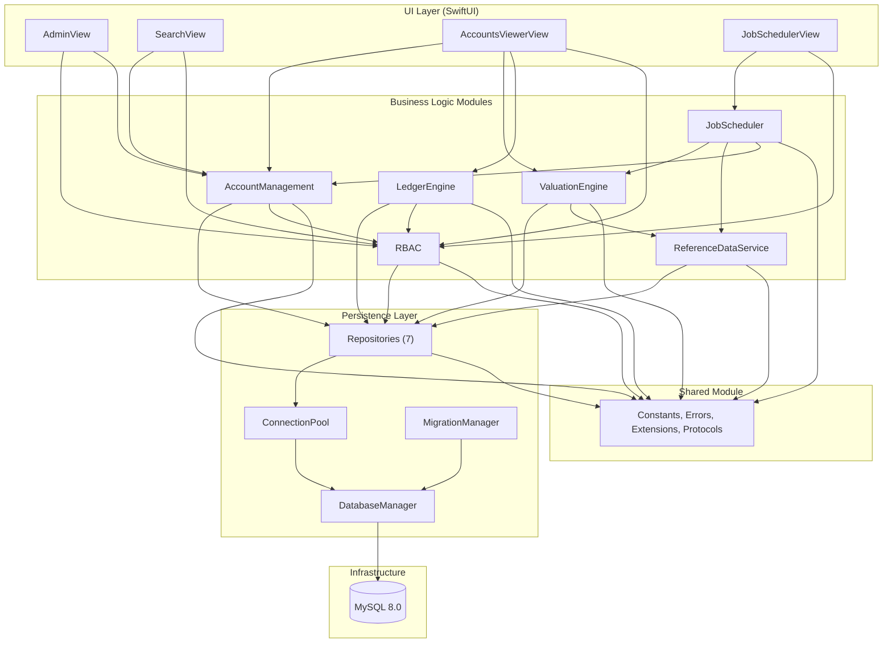

# WealthLedger Architecture

## Overview

WealthLedger is a standalone macOS desktop application purpose-built for institutional and wealth management accounting. It delivers a double-entry general ledger engine, per-account closed-book NAV valuation with timezone-aware value dates, role-based access control (RBAC) with entitlement enforcement, and a manually triggered job scheduler for report generation and CSV data ingestion. The application manages up to 100,000 accounts spanning institutional fund types (open/closed mutual funds, ETFs, hedge funds) and wealth account types (separately managed accounts, unified managed accounts).

The architecture follows a modular layered design comprising 11 Swift modules connected through a central Persistence layer. Each module encapsulates a distinct domain responsibility and communicates with other modules exclusively through well-defined service interfaces registered in a `DependencyContainer`. All database interactions use MySQLKit — SwiftData is explicitly excluded from the entire project (Rule 8). The application runs entirely offline with a local MySQL 8.0 database; zero network calls are made at runtime (Rule 9).

WealthLedger is designed for a single concurrent user at launch with support for up to 300 registered users. The target hardware is Apple Silicon M5 with 16 GB RAM running macOS Tahoe. The system enforces strict referential integrity through MySQL foreign key constraints (Rule 10), immutable transaction logs (Rule 2), and balanced double-entry enforcement (Rule 1) at the application layer.

---

## Technology Stack

| Technology | Version | Purpose |
|-----------|---------|---------|
| **Swift** | 6.3 | Primary language with strict concurrency checking (zero warnings required) |
| **SwiftUI** | macOS 26 SDK | Native macOS user interface framework for all four screens |
| **Xcode** | 26.4 | Build toolchain and IDE |
| **macOS** | Tahoe (26) | Target operating system |
| **MySQLKit** | 4.9.0 | SQLKit-based MySQL driver for all database access (via SPM) |
| **MySQLNIO** | 1.7.2 | Low-level async MySQL protocol implementation (transitive dependency) |
| **SQLKit** | 3.33.0 | SQL query builder abstraction (transitive dependency) |
| **AsyncKit** | 1.20.0 | Connection pool management (`EventLoopGroupConnectionPool`) |
| **SwiftNIO** | 2.82.0 | Non-blocking event-driven networking foundation |
| **swift-nio-ssl** | 2.30.0 | TLS support for MySQL connections |
| **swift-crypto** | 3.4.0 | Cryptographic primitives for MySQL authentication |
| **swift-log** | 1.6.0 | Structured logging API |
| **BCryptSwift** | 2.0.1 | Pure Swift bcrypt implementation for password hashing |
| **MySQL** | 8.0 | Local relational database (installed via Homebrew) |
| **Swift Testing** | Built-in (6.3) | Test framework included with Swift 6.3 toolchain |
| **Swift Package Manager** | Built-in | Dependency management and build system |

### SPM Direct Dependencies

Only two packages are declared directly in `Package.swift`; all other packages above are resolved as transitive dependencies:

```swift
.package(url: "https://github.com/vapor/mysql-kit.git", from: "4.9.0"),
.package(url: "https://github.com/wisetail/BCryptSwift.git", from: "2.0.1"),
```

### Platform Requirement

```swift
platforms: [.macOS(.v15)]
```

---

## Module Dependency Diagram

The following diagram illustrates the dependency relationships between all 11 modules in the WealthLedger application. Arrows indicate a "depends on" relationship flowing from consumer to provider.



### Layer Summary

| Layer | Modules | Responsibility |
|-------|---------|---------------|
| **UI Layer** | UILayer (8 SwiftUI views) | User interaction, data presentation, navigation |
| **Business Logic** | AccountManagement, LedgerEngine, ValuationEngine, ReferenceDataService, JobScheduler, RBAC | Domain logic, business rules, entitlement enforcement |
| **Persistence** | DatabaseManager, ConnectionPool, MigrationManager, 7 Repositories | Data access, connection management, schema migrations |
| **Shared** | Constants, Errors, Extensions, Protocols | Cross-cutting utilities used by all modules |
| **Infrastructure** | MySQL 8.0 (local) | Relational data storage |
| **Entry Point** | WealthLedgerApp | Application bootstrap, dependency wiring, root scene |
| **CLI Tool** | SeedTool | Synthetic data generation and database seeding |

---

## Module Descriptions

### 1. WealthLedgerApp (Entry Point)

The `@main` application entry point conforming to the SwiftUI `App` protocol. It bootstraps the entire system by initializing the `DatabaseManager` with MySQLKit configuration, creating a `DependencyContainer` that registers all module services, and presenting `MainNavigationView` as the root SwiftUI scene. Every module in the application is reachable from `@main` through the dependency container (Gate 9 requirement).

**Source Files:**

| File | Purpose |
|------|---------|
| `Sources/WealthLedgerApp/WealthLedgerApp.swift` | `@main` struct; initializes database, dependency container, and root scene |
| `Sources/WealthLedgerApp/AppState.swift` | `@Observable` application state: current user session, selected accounts, navigation path |
| `Sources/WealthLedgerApp/DependencyContainer.swift` | Service locator registering all module services for dependency injection |

**Key Responsibilities:**
- Initialize `DatabaseManager` with MySQLKit `MySQLConfiguration(hostname: "localhost", port: 3306, ...)`
- Register all services into `DependencyContainer` (see Integration Points section)
- Inject `DependencyContainer` and `AppState` into the SwiftUI environment
- Gate authentication before exposing navigation to the four screens

### 2. AccountManagement

Manages the complete lifecycle of up to 100,000 accounts spanning two categories: **Institutional** (open/closed mutual funds, ETFs, hedge funds) and **Wealth** (separately managed accounts, unified managed accounts). Provides search with partial name matching, exact ID lookup, type filtering, and group filtering. All operations enforce entitlement checks via the RBAC module — users without READ access to an account group receive an empty result set (Rule 4).

**Source Files:**

| File | Purpose |
|------|---------|
| `Sources/AccountManagement/Models/Account.swift` | Account data model with ID, name, fund type, timezone (IANA), cached valuation, status |
| `Sources/AccountManagement/Models/AccountGroup.swift` | Account group data model with group ID, name, metadata |
| `Sources/AccountManagement/Models/AccountStatus.swift` | Enum: `.active`, `.inactive`, `.pending`, `.suspended` |
| `Sources/AccountManagement/Models/FundType.swift` | Enum: `.openMutualFund`, `.closedMutualFund`, `.etf`, `.hedgeFund`, `.sma`, `.uma` |
| `Sources/AccountManagement/Services/AccountService.swift` | CRUD, search with pagination, batch status update (up to 1,000) |
| `Sources/AccountManagement/Services/AccountGroupService.swift` | Account group CRUD operations |

**Key Behaviors:**
- Search uses `LIKE 'prefix%'` with B-tree index for partial name matching
- Results are capped at 1,000 records with server-side pagination (Rule 7)
- Batch status updates process up to 1,000 accounts simultaneously
- All queries pass through `EntitlementService.filterAccessibleGroups()` before returning data

**Dependencies:** Persistence, RBAC, Shared

### 3. LedgerEngine

Implements the double-entry credit/debit accounting system with an immutable transaction log. Every ledger write must produce balanced debit/credit pairs summing to zero (Rule 1). The `transactions` table is never targeted by UPDATE or DELETE operations (Rule 2) — corrections are performed exclusively through offsetting entries that reference the original transaction via a foreign key. An asset class guard rejects any non-equity instrument at the application layer before any database write (Rule 5).

**Source Files:**

| File | Purpose |
|------|---------|
| `Sources/LedgerEngine/Models/Transaction.swift` | Immutable transaction struct: ID, account FK, instrument, quantity, debit/credit amounts, restatement reference FK |
| `Sources/LedgerEngine/Models/Position.swift` | Position struct: ID, account FK, instrument FK, quantity, asset type |
| `Sources/LedgerEngine/Services/LedgerService.swift` | Transaction posting with double-entry validation, offsetting entry creation for restatements |
| `Sources/LedgerEngine/Services/DoubleEntryValidator.swift` | Validates that every transaction set sums to zero before database write |

**Key Behaviors:**
- `DoubleEntryValidator.validate()` rejects unbalanced entries at the application layer before any SQL INSERT
- `LedgerService.postTransaction()` validates balance, checks asset class, then appends to `transactions`
- `LedgerService.createRestatement()` creates offsetting entries referencing the original transaction ID
- Position records are created or updated when new holdings are established
- Verification: `grep -r "UPDATE transactions\|DELETE.*transactions"` returns zero results

**Dependencies:** Persistence, RBAC, Shared

### 4. ValuationEngine

Calculates per-account closed-book Net Asset Value (NAV) using the formula: `Σ(quantity × EOD midpoint) + cash_balance`, where EOD midpoint equals `(EOD_bid + EOD_ask) / 2` and cash position price is fixed at `1.00`. Each account stores its own IANA timezone string and valuation schedule; the ValuationEngine uses exclusively the account's stored timezone for value date computation — never the system clock timezone (Rule 3). Cached valuation amounts and value dates are written atomically back to the `accounts` table within the same database transaction as the valuation completion (Rule 11).

**Source Files:**

| File | Purpose |
|------|---------|
| `Sources/ValuationEngine/Models/Valuation.swift` | Valuation result struct: account ID, value amount, value date, timezone, positions valued |
| `Sources/ValuationEngine/Services/NAVCalculator.swift` | Pure calculation: iterates positions, computes midpoints, sums quantities × midpoints, adds cash balance |
| `Sources/ValuationEngine/Services/ValuationService.swift` | Orchestrates batch valuation with pagination, timezone-aware dates, atomic cache writes |

**Key Behaviors:**
- Batch valuation processes accounts in pages of 1,000 (Rule 7)
- `NAVCalculator` is a pure function with no side effects — accepts positions and prices, returns computed NAV
- `ValuationService` reads the account's `valuation_timezone` field and constructs a `TimeZone` from the IANA string
- Atomic update of `accounts.cached_valuation_amount` and `accounts.cached_value_date` occurs within the same MySQL transaction as the valuation write
- Verification: two accounts configured for `America/New_York` and `Europe/London` produce distinct value dates for the same calendar day

**Dependencies:** Persistence, ReferenceDataService, AccountManagement, Shared

### 5. ReferenceDataService

Manages simulated NYSE equity reference data comprising a minimum of 500 synthetic securities (Rule 6). Each security record includes ticker, name, SOD bid, SOD ask, EOD bid, and EOD ask — all fields must be non-null and non-zero. No real or externally sourced market data is required or permitted. The module provides CSV parsing for data ingestion and CSV export for report generation.

**Source Files:**

| File | Purpose |
|------|---------|
| `Sources/ReferenceDataService/Models/ReferenceData.swift` | Reference data struct: ticker, name, six price fields, market date |
| `Sources/ReferenceDataService/Services/ReferenceDataService.swift` | Query by ticker and market date; manage reference data lifecycle |
| `Sources/ReferenceDataService/Services/CSVParser.swift` | Parse CSV files; validate column structure; paginated ingestion (up to 100 MB) |
| `Sources/ReferenceDataService/Services/CSVExporter.swift` | Export data to CSV with configurable field selection |
| `Sources/ReferenceDataService/Generators/SyntheticDataGenerator.swift` | Generate 500+ synthetic NYSE equity records with realistic tickers and prices |

**Key Behaviors:**
- `SyntheticDataGenerator` produces at least 500 rows with 3–5 uppercase letter tickers, company names, and six non-zero price fields
- `CSVParser` validates column headers before ingestion and processes rows in pages of 1,000 to handle files up to 100 MB without crash
- `CSVExporter` supports configurable field selection for report output
- All reference data is equities-only (Rule 5)

**Dependencies:** Persistence, Shared

### 6. JobScheduler

Supports manually triggered report generation and CSV ingestion jobs. There is no automated cron scheduling — all jobs are created by users and triggered via explicit manual action. Report jobs export CSV files with configurable field selection, account filtering, and target date. Ingestion jobs parse uploaded CSV files and insert records into the database.

**Source Files:**

| File | Purpose |
|------|---------|
| `Sources/JobScheduler/Models/Job.swift` | Job struct: ID, type (report/ingestion), status (pending/running/completed/failed), parameters, timestamps |
| `Sources/JobScheduler/Services/JobSchedulerService.swift` | Job lifecycle management: create, execute, track status |
| `Sources/JobScheduler/Services/ReportGenerator.swift` | Build CSV reports with field selection, account filtering, target date |

**Key Behaviors:**
- Job lifecycle: pending → running → completed/failed
- Report generation queries `AccountService` and `ValuationService` for data, then exports via `CSVExporter`
- Ingestion jobs invoke `CSVParser` to parse CSV files and `ReferenceDataService` to insert records
- Jobs paginate at 1,000 records per page during processing (Rule 7)

**Dependencies:** Persistence, ReferenceDataService, ValuationEngine, AccountManagement, Shared

### 7. RBAC (Role-Based Access Control)

Implements local authentication with bcrypt-hashed passwords and per-user, per-account-group entitlement enforcement. Permission flags are READ, CREATE, MODIFY, and DELETE. RBAC is a cross-cutting concern invoked by `AccountManagement`, `LedgerEngine`, and all UI screens. Unauthorized access attempts return empty result sets — not errors — ensuring no information leakage about the existence of restricted data (Rule 4).

**Source Files:**

| File | Purpose |
|------|---------|
| `Sources/RBAC/Models/User.swift` | User struct: ID, username, bcrypt-hashed password; `Sendable` conformance |
| `Sources/RBAC/Models/Entitlement.swift` | Entitlement struct: user ID, account group ID, permission flags; `Sendable` conformance |
| `Sources/RBAC/Services/AuthenticationService.swift` | Login (username/password verification against bcrypt hash), user creation |
| `Sources/RBAC/Services/EntitlementService.swift` | Permission checks per user-group pair, filter accessible groups per user |
| `Sources/RBAC/Services/PasswordHasher.swift` | bcrypt hashing wrapper using BCryptSwift library |

**Key Behaviors:**
- `PasswordHasher.hash()` generates bcrypt hashes; `PasswordHasher.verify()` compares passwords against stored hashes
- `AuthenticationService.login()` validates credentials and sets `AppState.currentUser` on success
- `EntitlementService.checkPermission(userId:accountGroupId:permission:)` returns `Bool`
- `EntitlementService.filterAccessibleGroups(userId:)` returns only groups with READ access
- Unauthenticated or unauthorized queries yield empty result sets — never errors or partial data

**Dependencies:** Persistence, Shared, BCryptSwift

### 8. UILayer

The presentation layer implementing four SwiftUI screens plus navigation and reusable components. All views consume backend services through the `DependencyContainer` injected via the SwiftUI environment. Views use `async/await` for non-blocking database operations and `LazyVStack` for performant scrolling. No direct MySQLKit imports appear in any view file — views interact with services exclusively.

**Source Files:**

| File | Purpose |
|------|---------|
| `Sources/UILayer/Navigation/MainNavigationView.swift` | Root navigation: tab or sidebar layout routing to all four screens; gated behind authentication |
| `Sources/UILayer/AdminScreen/AdminView.swift` | User creation, account group creation, entitlement assignment (RCMD per user-group pair) |
| `Sources/UILayer/SearchScreen/SearchView.swift` | Search by name/ID/type/group; results capped at 1,000; multi-select; navigate to Accounts Viewer |
| `Sources/UILayer/AccountsViewer/AccountsViewerView.swift` | `LazyVStack` scrollable list: account name, ID, value, positions, value date |
| `Sources/UILayer/JobSchedulerScreen/JobSchedulerView.swift` | Create report/ingestion jobs; manual trigger; job status tracking |
| `Sources/UILayer/Components/AccountRowView.swift` | Reusable row: account name, ID, formatted value, status badge |
| `Sources/UILayer/Components/PositionDetailView.swift` | Expandable position detail: instrument ticker, quantity, midpoint value |
| `Sources/UILayer/Components/EntitlementFormView.swift` | Permission toggle form: READ/CREATE/MODIFY/DELETE checkboxes |

**Key Behaviors:**
- `AccountsViewerView` targets initial render of 1,000 accounts in under 1 second and scrolling at 30 fps or above
- `SearchView` enforces maximum 1,000 selected accounts (Rule 7)
- All displayed data respects entitlement enforcement — zero data shown for groups without READ permission (Rule 4)
- No direct database imports in any view file

**Dependencies:** AccountManagement, LedgerEngine, ValuationEngine, ReferenceDataService, JobScheduler, RBAC, Shared

### 9. Persistence

The data access layer providing MySQLKit configuration, connection pooling, schema migration, and typed repository classes for all seven database tables. All modules access the database exclusively through repositories in this layer — no module bypasses Persistence to execute raw SQL directly.

**Source Files:**

| File | Purpose |
|------|---------|
| `Sources/Persistence/DatabaseManager.swift` | MySQLKit configuration (localhost:3306), `EventLoopGroup` lifecycle, schema initialization |
| `Sources/Persistence/ConnectionPool.swift` | AsyncKit `EventLoopGroupConnectionPool`; exposes `withConnection` for transactional operations |
| `Sources/Persistence/MigrationManager.swift` | Reads SQL files from `Resources/Migrations/`, executes in numerical order, tracks applied migrations |
| `Sources/Persistence/Repositories/AccountRepository.swift` | Account CRUD, search queries with indexes, batch status update, cached valuation atomic update |
| `Sources/Persistence/Repositories/TransactionRepository.swift` | Append-only inserts, offsetting entry creation; no UPDATE or DELETE methods (Rule 2) |
| `Sources/Persistence/Repositories/PositionRepository.swift` | Position CRUD with FK enforcement to accounts and reference data |
| `Sources/Persistence/Repositories/UserRepository.swift` | User creation with password hash storage, lookup by username |
| `Sources/Persistence/Repositories/EntitlementRepository.swift` | Entitlement CRUD, permission flag queries by user ID and account group ID |
| `Sources/Persistence/Repositories/AccountGroupRepository.swift` | Account group CRUD |
| `Sources/Persistence/Repositories/ReferenceDataRepository.swift` | Bulk insert for CSV ingestion, EOD price lookups by ticker and market date |

**Key Behaviors:**
- `DatabaseManager` initializes `MySQLConfiguration` for localhost connections with the `wealth_ledger` database
- `ConnectionPool` manages a bounded pool of MySQL connections via AsyncKit
- `MigrationManager` processes 8 SQL migration files (001–008) in strict numerical order
- `TransactionRepository` deliberately omits `update()` and `delete()` methods to enforce immutability (Rule 2)
- `AccountRepository.updateCachedValuation()` writes valuation amount and value date atomically (Rule 11)

**Dependencies:** Shared, MySQLKit, AsyncKit, SwiftNIO

### 10. Shared

Cross-cutting utilities used by all modules. This module has no external dependencies beyond Apple's Foundation framework. It provides application constants, a typed error hierarchy, date/timezone extensions, decimal precision utilities, and a generic repository protocol.

**Source Files:**

| File | Purpose |
|------|---------|
| `Sources/Shared/Constants.swift` | `BATCH_SIZE = 1000`, `MAX_SEARCH_RESULTS = 1000`, `CASH_PRICE = Decimal(1.0)`, `DEFAULT_PAGINATION = 1000` |
| `Sources/Shared/Errors/AppError.swift` | Typed error hierarchy: `unbalancedEntry`, `unauthorizedAccess`, `invalidAssetClass`, `accountNotFound`, `duplicateUser`, `invalidTimezone`, `migrationFailed` |
| `Sources/Shared/Extensions/Date+Timezone.swift` | `valueDateForTimezone(_ iana: String) -> Date` — computes value date using account's stored timezone exclusively |
| `Sources/Shared/Extensions/Decimal+Currency.swift` | `midpoint(bid: Decimal, ask: Decimal) -> Decimal` — returns `(bid + ask) / 2` |
| `Sources/Shared/Protocols/RepositoryProtocol.swift` | Generic `Repository` protocol: `findById`, `findAll`, `create`, `delete` |

**Dependencies:** Foundation only

### 11. SeedTool

A separate executable target providing a `@main` CLI entry point for generating synthetic NYSE equity data and seeding the database. The SeedTool connects directly to MySQL, invokes `SyntheticDataGenerator` to produce 500+ equity records, inserts them into `reference_data`, and optionally seeds sample accounts and users for development and testing.

**Source Files:**

| File | Purpose |
|------|---------|
| `Sources/SeedTool/SeedToolMain.swift` | `@main` CLI: connect to MySQL, generate synthetic CSV, seed reference data (500+ rows), optionally seed accounts and users |

**Dependencies:** Persistence, ReferenceDataService, AccountManagement, Shared

---

## Data Flow Descriptions

### Authentication Flow

```
User → Login Screen → AuthenticationService → UserRepository → MySQL
                           ↓
                     PasswordHasher (BCryptSwift)
                           ↓
                     AppState.currentUser ← set on success
                           ↓
                     MainNavigationView ← unlocked
```

1. User enters username and password on the login screen.
2. `AuthenticationService` retrieves the stored bcrypt hash from `UserRepository` by username.
3. `PasswordHasher` verifies the plaintext password against the bcrypt hash using BCryptSwift.
4. On successful verification, `AppState.currentUser` is set with the authenticated user, unlocking navigation to all four screens.
5. On failure, the login screen displays an authentication error; no navigation occurs.

### Account Search Flow

```
SearchView → AccountService.search() → EntitlementService.filterAccessibleGroups()
                                              ↓
                                       AccountRepository (SQL with indexes)
                                              ↓
                                       Results ≤ 1,000 → SearchView
```

1. User enters search criteria in `SearchView`: account name (partial match), account ID (exact match), account type (dropdown), account group (dropdown filtered by entitlement).
2. `AccountService.search()` is invoked with the filter parameters.
3. `EntitlementService.filterAccessibleGroups(userId:)` restricts the query scope to account groups where the current user has READ permission (Rule 4).
4. `AccountRepository` executes an optimized SQL query using B-tree indexes for `LIKE 'prefix%'` name matching, exact ID matching, and foreign key filters for type and group.
5. Results are capped at 1,000 records via server-side `LIMIT` and returned to the UI (Rule 7).
6. Users without READ access to any group receive zero results — not an error.

### Valuation Flow

```
ValuationService.runValuation(accountIds)
    ↓
PositionRepository.findByAccountId() (paginated at 1,000)
    ↓
ReferenceDataRepository.findEODPrices(tickers, marketDate)
    ↓
NAVCalculator.compute(positions, prices, cashBalance)
    → Σ(quantity × (EOD_bid + EOD_ask) / 2) + cash_balance
    ↓
Account timezone → value date computation (Rule 3)
    ↓
AccountRepository.updateCachedValuation() ← atomic write (Rule 11)
```

1. `ValuationService.runValuation()` receives a list of account IDs to value.
2. For each account (paginated at 1,000 per batch), positions are loaded via `PositionRepository` (Rule 7).
3. EOD prices are retrieved from `ReferenceDataRepository` for each distinct instrument in the position set.
4. `NAVCalculator` computes the NAV as `Σ(quantity × (EOD_bid + EOD_ask) / 2) + cash_balance`, where cash position price is fixed at `1.00`.
5. The value date is computed using the account's stored IANA timezone (e.g., `America/New_York`) — the system clock timezone is never used (Rule 3).
6. `AccountRepository.updateCachedValuation()` atomically writes `cached_valuation_amount` and `cached_value_date` back to the `accounts` row within the same MySQL transaction as the valuation result write (Rule 11).

### Transaction Posting Flow

```
LedgerService.postTransaction(entries)
    ↓
DoubleEntryValidator.validate(debits, credits)
    → Sum must equal zero (Rule 1)
    ↓
Asset class guard → reject non-equity (Rule 5)
    ↓
TransactionRepository.insert() → append-only (Rule 2)
    ↓
PositionRepository.createOrUpdate() → update holdings
```

1. A user or service submits a transaction entry containing debit/credit pairs.
2. `DoubleEntryValidator.validate()` verifies that the sum of all debits equals the sum of all credits (net zero). Unbalanced entries are rejected with an `AppError.unbalancedEntry` error at the application layer before any database write (Rule 1).
3. The asset class guard checks that the instrument is an equity. Non-equity instruments are rejected with `AppError.invalidAssetClass` (Rule 5).
4. `TransactionRepository` appends an immutable row to the `transactions` table. No UPDATE or DELETE is ever issued (Rule 2).
5. `PositionRepository` creates new position records or updates existing quantities for the affected account-instrument pairs.

### Restatement Flow

```
LedgerService.createRestatement(originalTransactionId)
    ↓
Load original transaction (read-only)
    ↓
Create offsetting entries (reversed debits/credits)
    → restatement_ref_id = originalTransactionId
    ↓
TransactionRepository.insert() → append offsetting entries
    ↓
Original transaction remains unmodified (immutable, Rule 2)
```

1. A correction is needed for an existing transaction.
2. `LedgerService.createRestatement()` loads the original transaction by ID (read-only).
3. Offsetting entries are created with reversed debit/credit amounts, and `restatement_ref_id` is set to the original transaction ID (foreign key reference).
4. The offsetting entries are appended to the `transactions` table via `TransactionRepository.insert()`.
5. The original transaction remains completely unmodified — immutability is preserved (Rule 2).

### Job Execution Flow

```
JobSchedulerView → JobSchedulerService.createJob(type, params)
    ↓
JobSchedulerService.executeJob(jobId) ← manual trigger
    ↓
┌─── Report Job ───────────────────────────────────────────┐
│ ReportGenerator → AccountService + ValuationService      │
│     ↓                                                     │
│ CSVExporter → local CSV file                              │
└──────────────────────────────────────────────────────────┘
┌─── Ingestion Job ────────────────────────────────────────┐
│ CSVParser → parse file (paginated at 1,000 rows)         │
│     ↓                                                     │
│ ReferenceDataService → ReferenceDataRepository.bulkInsert│
└──────────────────────────────────────────────────────────┘
    ↓
Job status: pending → running → completed/failed
```

1. User creates a job in `JobSchedulerView`, specifying the type (report or ingestion) and parameters.
2. Manual trigger invokes `JobSchedulerService.executeJob()` — there is no automated cron scheduling.
3. **Report jobs**: `ReportGenerator` queries `AccountService` and `ValuationService` for the specified accounts and target date, then exports results via `CSVExporter` to a local CSV file.
4. **Ingestion jobs**: `CSVParser` reads the selected CSV file with paginated processing at 1,000 rows per page (supporting files up to 100 MB). `ReferenceDataService` inserts validated rows into the database.
5. Job status is tracked through the lifecycle: pending → running → completed (on success) or failed (on error).

---

## Integration Points

### DependencyContainer Wiring

The `DependencyContainer` (registered in `WealthLedgerApp.swift`) provides dependency injection for all module services. The table below documents the complete wiring:

| Service | Dependencies Injected |
|---------|----------------------|
| `AccountService` | `AccountRepository`, `EntitlementService` |
| `AccountGroupService` | `AccountGroupRepository` |
| `LedgerService` | `TransactionRepository`, `PositionRepository`, `DoubleEntryValidator`, `EntitlementService` |
| `ValuationService` | `AccountRepository`, `PositionRepository`, `ReferenceDataRepository`, `NAVCalculator` |
| `ReferenceDataService` | `ReferenceDataRepository`, `CSVParser` |
| `JobSchedulerService` | `ReportGenerator`, `CSVParser`, `ReferenceDataService`, `AccountService`, `ValuationService` |
| `AuthenticationService` | `UserRepository`, `PasswordHasher` |
| `EntitlementService` | `EntitlementRepository` |
| All Repositories | `ConnectionPool` (via `DatabaseManager`) |

### UI-to-Module Bindings

Each SwiftUI screen depends on specific backend modules:

| Screen | Module Dependencies |
|--------|-------------------|
| `AdminView` | RBAC (`AuthenticationService`, `EntitlementService`), AccountManagement (`AccountGroupService`) |
| `SearchView` | AccountManagement (`AccountService`), RBAC (`EntitlementService`) |
| `AccountsViewerView` | AccountManagement (`AccountService`), ValuationEngine (`ValuationService`), LedgerEngine (`LedgerService`), RBAC (`EntitlementService`) |
| `JobSchedulerView` | JobScheduler (`JobSchedulerService`), RBAC (`EntitlementService`) |

### Cross-Module Communication Patterns

- **RBAC as cross-cutting concern**: `EntitlementService` is injected into `AccountService`, `LedgerService`, and all four UI screens. Every data query passes through entitlement verification before results are returned.
- **ValuationEngine → ReferenceDataService**: `ValuationService` depends on `ReferenceDataRepository` for EOD price retrieval during NAV computation.
- **JobScheduler → multiple modules**: `JobSchedulerService` orchestrates `ReportGenerator` (which uses `AccountService` and `ValuationService`) and `CSVParser` (which uses `ReferenceDataService`), making it the most connected business logic module.
- **All modules → Persistence**: Every business logic module accesses the database exclusively through repository classes in the Persistence layer. No module executes raw SQL directly.

---

## Database Schema Overview

The MySQL 8.0 database (`wealth_ledger`) comprises 7 tables with full foreign key constraint enforcement (Rule 10). Schema is initialized via 8 ordered SQL migration scripts in `Resources/Migrations/`, executed by `MigrationManager`.

### Table Summary

| Table | Primary Key | Key Relationships | Migration File |
|-------|-------------|-------------------|----------------|
| `users` | `id` BIGINT UNSIGNED | → entitlements | `001_create_users.sql` |
| `account_groups` | `id` BIGINT UNSIGNED | → entitlements, → accounts | `002_create_account_groups.sql` |
| `entitlements` | `id` BIGINT UNSIGNED | FK: user_id → users, account_group_id → account_groups | `003_create_entitlements.sql` |
| `accounts` | `id` BIGINT UNSIGNED | FK: account_group_id → account_groups | `004_create_accounts.sql` |
| `reference_data` | `id` BIGINT UNSIGNED | → positions, → transactions | `005_create_reference_data.sql` |
| `positions` | `id` BIGINT UNSIGNED | FK: account_id → accounts, reference_data_id → reference_data | `006_create_positions.sql` |
| `transactions` | `id` BIGINT UNSIGNED | FK: account_id → accounts, instrument_id → reference_data, restatement_ref_id → transactions (self) | `007_create_transactions.sql` |

Index optimization is defined in `008_create_indexes.sql`. See `Docs/database_schema.md` for complete DDL, ERD, foreign key map, and index strategy documentation.

---

## Performance Architecture

The architecture is designed to meet six performance thresholds on the target hardware (Apple Silicon M5, 16 GB RAM, macOS Tahoe) with a single concurrent user (Rule 13):

### Full-Universe Account Search: Under 2 Seconds

**Target:** Search across 100,000 accounts returns results in under 2 seconds.

**Design Decisions:**
- MySQL B-tree indexes on `account_name`, `fund_type`, `account_group_id`, and `account_status` enable indexed lookups without full table scans
- Partial name matching uses `LIKE 'prefix%'` which leverages the leftmost prefix of the B-tree index
- Server-side `LIMIT 1000` prevents unbounded result set transfer
- `AccountRepository` uses parameterized queries compiled by SQLKit for optimal MySQL query plan caching

### Batch Valuation: Under 30 Seconds for 1,000 Accounts

**Target:** Complete NAV valuation for 1,000 accounts in under 30 seconds.

**Design Decisions:**
- `ValuationService` processes accounts in paginated batches of 1,000 (Rule 7)
- `ConnectionPool` (AsyncKit `EventLoopGroupConnectionPool`) provides pooled MySQL connections, eliminating per-query connection overhead
- `NAVCalculator` is a pure in-memory computation with no database calls — positions and prices are pre-loaded
- Cached valuation denormalization avoids recomputing NAV for display operations

### Accounts Viewer Initial Render: Under 1 Second for 1,000 Accounts

**Target:** Render 1,000 accounts in the Accounts Viewer within 1 second of navigation.

**Design Decisions:**
- SwiftUI `LazyVStack` defers view creation until rows scroll into the visible viewport
- Cached valuation amounts (`accounts.cached_valuation_amount`) are read directly from the accounts table — no on-demand NAV recomputation during render
- Lightweight `AccountRowView` components minimize per-row rendering cost
- No more than 1,000 account records are loaded into memory simultaneously (Rule 7)

### Scrolling Performance: 30 fps or Above

**Target:** Maintain 30 fps or above during scrolling in the Accounts Viewer.

**Design Decisions:**
- `LazyVStack` with fixed-height `AccountRowView` components ensures constant-time row recycling
- Position detail expansion uses on-demand loading — positions are fetched only when a row is expanded
- All database calls use `async/await` on background threads to avoid main thread blocking

### CSV Ingestion: Up to 100 MB Without Crash

**Target:** Ingest CSV files up to 100 MB without application crash.

**Design Decisions:**
- `CSVParser` reads files line-by-line with streaming I/O rather than loading the entire file into memory
- Database inserts are batched at 1,000 rows per page to bound memory usage
- Job status tracking allows users to monitor progress during large ingestion operations

### MySQL RAM Footprint: Under 4 GB

**Target:** MySQL process RAM consumption remains under 4 GB during all operations.

**Design Decisions:**
- Connection pool size is bounded in `ConnectionPool` configuration
- Result set pagination at 1,000 records prevents large query results from consuming excessive buffer pool memory
- No unbounded `SELECT *` queries — all repository methods use explicit column lists and `LIMIT` clauses

---

## Architecture Rules Reference

The following rules from the project specification have direct architectural implications. Each rule is enforced at the layer indicated:

| Rule | Description | Enforcement Layer |
|------|-------------|------------------|
| **Rule 1** | Double-entry enforcement: debits must equal credits | `DoubleEntryValidator` in LedgerEngine |
| **Rule 2** | Transaction immutability: no UPDATE/DELETE on `transactions` table | `TransactionRepository` in Persistence (no update/delete methods); `LedgerService` uses offsetting entries only |
| **Rule 3** | Per-account valuation timezone: use account's IANA timezone, never system clock | `ValuationService` in ValuationEngine; `Date+Timezone` extension in Shared |
| **Rule 4** | Entitlement enforcement: unauthorized access returns empty results, not errors | `EntitlementService` in RBAC; invoked by `AccountService`, `LedgerService`, and all UI screens |
| **Rule 5** | Asset class guard: reject non-equity instruments | `LedgerService` in LedgerEngine; `PositionRepository` in Persistence |
| **Rule 6** | Reference data simulation: minimum 500 synthetic NYSE equities | `SyntheticDataGenerator` in ReferenceDataService |
| **Rule 7** | Batch memory cap: maximum 1,000 account records in memory | Pagination in `AccountService`, `ValuationService`, `CSVParser`, and UI views |
| **Rule 8** | MySQLKit-only persistence: no SwiftData anywhere | All Persistence layer files use MySQLKit; verified by `grep -r "import SwiftData"` returning zero |
| **Rule 9** | Offline runtime: zero network dependencies | All data sources local (MySQL, CSV files); no HTTP/HTTPS calls |
| **Rule 10** | Schema referential integrity: MySQL FK constraints on all relationships | All 7 tables in `Resources/Migrations/` DDL files |
| **Rule 11** | Cached valuation denormalization: atomic update in same DB transaction | `ValuationService` + `AccountRepository.updateCachedValuation()` |
| **Rule 12** | Validation gates: Gate 1 (E2E), Gate 2 (zero warnings), Gate 8 (integration), Gate 9 (wiring), Gate 10 (test schema) | Build configuration, integration tests, `DependencyContainer` wiring |
| **Rule 13** | Performance thresholds: search < 2s, valuation < 30s, render < 1s, scroll ≥ 30fps, CSV ≤ 100 MB, RAM < 4 GB | Indexes, pagination, `LazyVStack`, connection pooling, streaming I/O |

---

## Project Directory Structure

```
WealthLedger/
├── Package.swift                          # SPM manifest
├── .gitignore
├── .swiftlint.yml
├── README.md
├── Sources/
│   ├── WealthLedgerApp/                   # @main entry point (3 files)
│   │   ├── WealthLedgerApp.swift
│   │   ├── AppState.swift
│   │   └── DependencyContainer.swift
│   ├── AccountManagement/                 # Account lifecycle (6 files)
│   │   ├── Models/
│   │   │   ├── Account.swift
│   │   │   ├── AccountGroup.swift
│   │   │   ├── AccountStatus.swift
│   │   │   └── FundType.swift
│   │   └── Services/
│   │       ├── AccountService.swift
│   │       └── AccountGroupService.swift
│   ├── LedgerEngine/                      # Double-entry ledger (4 files)
│   │   ├── Models/
│   │   │   ├── Transaction.swift
│   │   │   └── Position.swift
│   │   └── Services/
│   │       ├── LedgerService.swift
│   │       └── DoubleEntryValidator.swift
│   ├── ValuationEngine/                   # NAV valuation (3 files)
│   │   ├── Models/
│   │   │   └── Valuation.swift
│   │   └── Services/
│   │       ├── NAVCalculator.swift
│   │       └── ValuationService.swift
│   ├── ReferenceDataService/              # Market data (5 files)
│   │   ├── Models/
│   │   │   └── ReferenceData.swift
│   │   ├── Services/
│   │   │   ├── ReferenceDataService.swift
│   │   │   ├── CSVParser.swift
│   │   │   └── CSVExporter.swift
│   │   └── Generators/
│   │       └── SyntheticDataGenerator.swift
│   ├── JobScheduler/                      # Job management (3 files)
│   │   ├── Models/
│   │   │   └── Job.swift
│   │   └── Services/
│   │       ├── JobSchedulerService.swift
│   │       └── ReportGenerator.swift
│   ├── RBAC/                              # Access control (5 files)
│   │   ├── Models/
│   │   │   ├── User.swift
│   │   │   └── Entitlement.swift
│   │   └── Services/
│   │       ├── AuthenticationService.swift
│   │       ├── EntitlementService.swift
│   │       └── PasswordHasher.swift
│   ├── UILayer/                           # SwiftUI views (8 files)
│   │   ├── Navigation/
│   │   │   └── MainNavigationView.swift
│   │   ├── AdminScreen/
│   │   │   └── AdminView.swift
│   │   ├── SearchScreen/
│   │   │   └── SearchView.swift
│   │   ├── AccountsViewer/
│   │   │   └── AccountsViewerView.swift
│   │   ├── JobSchedulerScreen/
│   │   │   └── JobSchedulerView.swift
│   │   └── Components/
│   │       ├── AccountRowView.swift
│   │       ├── PositionDetailView.swift
│   │       └── EntitlementFormView.swift
│   ├── Persistence/                       # Data access (10 files)
│   │   ├── DatabaseManager.swift
│   │   ├── ConnectionPool.swift
│   │   ├── MigrationManager.swift
│   │   └── Repositories/
│   │       ├── AccountRepository.swift
│   │       ├── TransactionRepository.swift
│   │       ├── PositionRepository.swift
│   │       ├── UserRepository.swift
│   │       ├── EntitlementRepository.swift
│   │       ├── AccountGroupRepository.swift
│   │       └── ReferenceDataRepository.swift
│   ├── Shared/                            # Cross-cutting utilities (5 files)
│   │   ├── Constants.swift
│   │   ├── Errors/
│   │   │   └── AppError.swift
│   │   ├── Extensions/
│   │   │   ├── Date+Timezone.swift
│   │   │   └── Decimal+Currency.swift
│   │   └── Protocols/
│   │       └── RepositoryProtocol.swift
│   └── SeedTool/                          # CLI seed tool (1 file)
│       └── SeedToolMain.swift
├── Resources/
│   └── Migrations/                        # SQL DDL scripts (8 files)
│       ├── 001_create_users.sql
│       ├── 002_create_account_groups.sql
│       ├── 003_create_entitlements.sql
│       ├── 004_create_accounts.sql
│       ├── 005_create_reference_data.sql
│       ├── 006_create_positions.sql
│       ├── 007_create_transactions.sql
│       └── 008_create_indexes.sql
├── Tests/
│   ├── UnitTests/                         # Unit tests (8 files)
│   │   ├── LedgerEngineTests/
│   │   ├── ValuationEngineTests/
│   │   ├── RBACTests/
│   │   ├── AccountManagementTests/
│   │   └── ReferenceDataTests/
│   └── IntegrationTests/                  # Integration tests (8 files)
│       ├── TestDatabaseSetup.swift
│       ├── EndToEndWorkflowTests.swift
│       └── ... (6 module integration test files)
├── Scripts/
│   └── setup_database.sh                  # MySQL initialization script
└── Docs/
    ├── architecture.md                    # This document
    ├── database_schema.md                 # ERD, DDL, FK map, index strategy
    └── user_guide.md                      # Screen-by-screen user guide
```

**Total: approximately 87 files** composing the complete application.

---

## Concurrency Model

WealthLedger uses Swift 6.3 strict concurrency with zero warnings required (Gate 2). All model structs conform to `Sendable`. The concurrency strategy is:

- **All model types**: `Sendable` structs with value-type properties (no classes with mutable state)
- **Service classes**: Actor-isolated or designed with `Sendable` conformance using structured concurrency
- **Database operations**: `async/await` via SwiftNIO `EventLoopFuture` bridging in MySQLKit
- **UI updates**: `@Observable` macro on `AppState` ensures reactive SwiftUI updates on the main actor
- **No `@unchecked Sendable`**: Zero suppressions of concurrency warnings permitted
- **Target**: Single concurrent user — no multi-user concurrency patterns required (no optimistic locking, no row-level conflict resolution)

---

## Validation Gates

The architecture must pass the following validation gates before the deliverable is accepted (Rule 12):

| Gate | Description | Verification Method |
|------|-------------|-------------------|
| **Gate 1** | End-to-end boundary verification against live MySQL | Integration test: create account → post transaction → run valuation → verify in Accounts Viewer |
| **Gate 2** | Zero-warning Xcode build with Swift 6 strict concurrency | `xcodebuild` with no `@unchecked Sendable` or warning suppressions |
| **Gate 8** | Integration sign-off checklist | Live smoke test, entitlement contract, valuation correctness with timezone verification, batch performance thresholds |
| **Gate 9** | Integration wiring verification for all six modules | Every module reachable from `@main`; exercised via integration tests against live MySQL |
| **Gate 10** | Test execution via single build command | `xcodebuild test` (or `swift test`) with dedicated `accounting_test` schema created/dropped by test suite |
