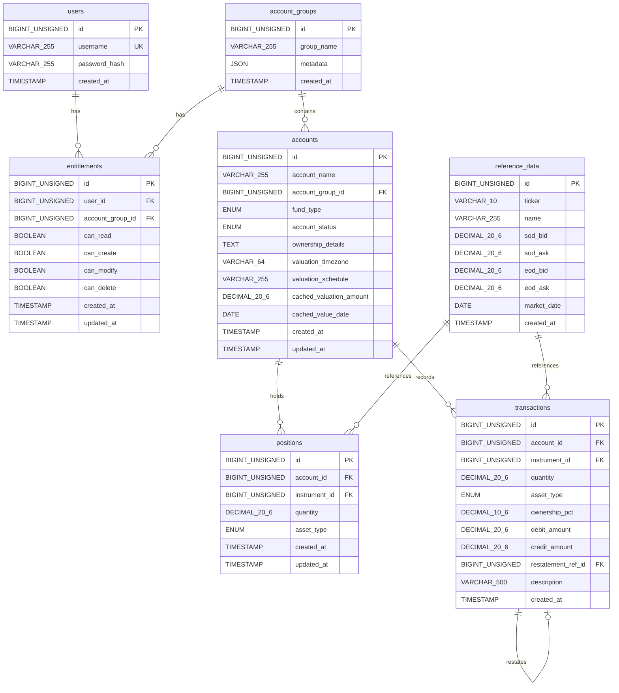

# WealthLedger Database Schema

## Overview

WealthLedger uses a **MySQL 8.0** relational database consisting of **7 tables** with full foreign key constraint enforcement. The schema implements a general ledger accounting engine purpose-built for institutional and wealth management accounts, supporting 100,000 accounts, an immutable double-entry transaction log, per-account NAV valuation with timezone awareness, and role-based access control (RBAC).

**Key characteristics:**

- All inter-table relationships are enforced via MySQL foreign key constraints (Rule 10).
- Each primary entity occupies a distinct table with a `BIGINT UNSIGNED AUTO_INCREMENT` primary key.
- All tables use `ENGINE=InnoDB` for transactional integrity and FK support.
- Character set is `utf8mb4` with `utf8mb4_unicode_ci` collation throughout.
- Financial decimal columns use `DECIMAL(20,6)` precision.

**Schema management:**

- Schema is initialized via 8 ordered SQL migration scripts in `Resources/Migrations/`.
- The `MigrationManager` in the Persistence module (`Sources/Persistence/MigrationManager.swift`) reads and executes migration files in numerical order (001 through 008).
- The main application database is named `wealth_ledger`.
- Integration tests use a dedicated `accounting_test` schema, created and dropped automatically by `TestDatabaseSetup.swift` (Gate 10).

---

## Entity-Relationship Diagram



---

## Table Definitions

### Table 1: `users`

**Migration:** `Resources/Migrations/001_create_users.sql`

```sql
CREATE TABLE IF NOT EXISTS users (
    id              BIGINT UNSIGNED AUTO_INCREMENT PRIMARY KEY,
    username        VARCHAR(255)    NOT NULL,
    password_hash   VARCHAR(255)    NOT NULL,
    created_at      TIMESTAMP       NOT NULL DEFAULT CURRENT_TIMESTAMP,

    UNIQUE KEY uk_users_username (username)
) ENGINE=InnoDB DEFAULT CHARSET=utf8mb4 COLLATE=utf8mb4_unicode_ci;
```

| Column | Type | Nullable | Default | Description |
|--------|------|----------|---------|-------------|
| `id` | `BIGINT UNSIGNED` | NO | Auto-increment | Primary key |
| `username` | `VARCHAR(255)` | NO | — | Unique login identifier |
| `password_hash` | `VARCHAR(255)` | NO | — | bcrypt-hashed password via BCryptSwift 2.0.1 |
| `created_at` | `TIMESTAMP` | NO | `CURRENT_TIMESTAMP` | Record creation timestamp |

**Purpose:** Stores user accounts for local authentication. Designed for 300 registered users with 1 concurrent user at launch.

**Constraints:**
- `uk_users_username` — UNIQUE constraint on `username` prevents duplicate registrations.

**Relationships:**
- One-to-many with `entitlements` (parent side).

---

### Table 2: `account_groups`

**Migration:** `Resources/Migrations/002_create_account_groups.sql`

```sql
CREATE TABLE IF NOT EXISTS account_groups (
    id         BIGINT UNSIGNED AUTO_INCREMENT PRIMARY KEY,
    group_name VARCHAR(255) NOT NULL,
    metadata   JSON DEFAULT NULL,
    created_at TIMESTAMP NOT NULL DEFAULT CURRENT_TIMESTAMP
) ENGINE=InnoDB DEFAULT CHARSET=utf8mb4 COLLATE=utf8mb4_unicode_ci;
```

| Column | Type | Nullable | Default | Description |
|--------|------|----------|---------|-------------|
| `id` | `BIGINT UNSIGNED` | NO | Auto-increment | Primary key |
| `group_name` | `VARCHAR(255)` | NO | — | Name of the account group |
| `metadata` | `JSON` | YES | `NULL` | Flexible JSON for additional group properties |
| `created_at` | `TIMESTAMP` | NO | `CURRENT_TIMESTAMP` | Record creation timestamp |

**Purpose:** Organizes accounts into logical groups for RBAC entitlement scoping. Account groups are the unit of entitlement assignment — users are granted READ/CREATE/MODIFY/DELETE permissions per account group.

**Constraints:**
- No unique constraint on `group_name` — duplicate group names are permitted.

**Relationships:**
- One-to-many with `entitlements` (parent side).
- One-to-many with `accounts` (parent side).

---

### Table 3: `entitlements`

**Migration:** `Resources/Migrations/003_create_entitlements.sql`

```sql
CREATE TABLE IF NOT EXISTS entitlements (
    id               BIGINT UNSIGNED AUTO_INCREMENT PRIMARY KEY,
    user_id          BIGINT UNSIGNED NOT NULL,
    account_group_id BIGINT UNSIGNED NOT NULL,
    can_read         BOOLEAN         NOT NULL DEFAULT FALSE,
    can_create       BOOLEAN         NOT NULL DEFAULT FALSE,
    can_modify       BOOLEAN         NOT NULL DEFAULT FALSE,
    can_delete       BOOLEAN         NOT NULL DEFAULT FALSE,
    created_at       TIMESTAMP       NOT NULL DEFAULT CURRENT_TIMESTAMP,
    updated_at       TIMESTAMP       NOT NULL DEFAULT CURRENT_TIMESTAMP ON UPDATE CURRENT_TIMESTAMP,

    UNIQUE KEY uk_entitlements_user_group (user_id, account_group_id),

    CONSTRAINT fk_entitlements_user
        FOREIGN KEY (user_id) REFERENCES users(id),

    CONSTRAINT fk_entitlements_account_group
        FOREIGN KEY (account_group_id) REFERENCES account_groups(id)
) ENGINE=InnoDB DEFAULT CHARSET=utf8mb4 COLLATE=utf8mb4_unicode_ci;
```

| Column | Type | Nullable | Default | Description |
|--------|------|----------|---------|-------------|
| `id` | `BIGINT UNSIGNED` | NO | Auto-increment | Primary key |
| `user_id` | `BIGINT UNSIGNED` | NO | — | FK to `users(id)` |
| `account_group_id` | `BIGINT UNSIGNED` | NO | — | FK to `account_groups(id)` |
| `can_read` | `BOOLEAN` | NO | `FALSE` | READ permission flag |
| `can_create` | `BOOLEAN` | NO | `FALSE` | CREATE permission flag |
| `can_modify` | `BOOLEAN` | NO | `FALSE` | MODIFY permission flag |
| `can_delete` | `BOOLEAN` | NO | `FALSE` | DELETE permission flag |
| `created_at` | `TIMESTAMP` | NO | `CURRENT_TIMESTAMP` | Record creation timestamp |
| `updated_at` | `TIMESTAMP` | NO | `CURRENT_TIMESTAMP ON UPDATE` | Last modification timestamp |

**Purpose:** Stores per-user, per-account-group permissions (RCMD: Read, Create, Modify, Delete). This is the cornerstone of Rule 4 (Entitlement Enforcement) — all data reads verify `can_read` before returning records. Users without READ access receive an empty result set, not an error.

**Constraints:**
- `uk_entitlements_user_group` — UNIQUE on `(user_id, account_group_id)` ensures one entitlement record per user-group pair.
- `fk_entitlements_user` — FK to `users(id)` with default ON DELETE RESTRICT.
- `fk_entitlements_account_group` — FK to `account_groups(id)` with default ON DELETE RESTRICT.

**Relationships:**
- Many-to-one with `users` (child side via `user_id`).
- Many-to-one with `account_groups` (child side via `account_group_id`).

---

### Table 4: `accounts`

**Migration:** `Resources/Migrations/004_create_accounts.sql`

```sql
CREATE TABLE IF NOT EXISTS accounts (
    id                       BIGINT UNSIGNED AUTO_INCREMENT PRIMARY KEY,
    account_name             VARCHAR(255)    NOT NULL CHECK (CHAR_LENGTH(account_name) > 0),
    account_group_id         BIGINT UNSIGNED NOT NULL,
    fund_type                ENUM('open_mutual_fund', 'closed_mutual_fund', 'etf', 'hedge_fund', 'sma', 'uma') NOT NULL,
    account_status           ENUM('active', 'inactive', 'pending', 'suspended') NOT NULL DEFAULT 'pending',
    ownership_details        TEXT,
    valuation_timezone       VARCHAR(64)     NOT NULL DEFAULT 'America/New_York',
    valuation_schedule       VARCHAR(255),
    cached_valuation_amount  DECIMAL(20,6)   DEFAULT NULL,
    cached_value_date        DATE            DEFAULT NULL,
    created_at               TIMESTAMP       NOT NULL DEFAULT CURRENT_TIMESTAMP,
    updated_at               TIMESTAMP       NOT NULL DEFAULT CURRENT_TIMESTAMP ON UPDATE CURRENT_TIMESTAMP,

    CONSTRAINT fk_accounts_account_group FOREIGN KEY (account_group_id) REFERENCES account_groups(id)
) ENGINE=InnoDB DEFAULT CHARSET=utf8mb4 COLLATE=utf8mb4_unicode_ci;
```

| Column | Type | Nullable | Default | Description |
|--------|------|----------|---------|-------------|
| `id` | `BIGINT UNSIGNED` | NO | Auto-increment | Primary key |
| `account_name` | `VARCHAR(255)` | NO | — | Account display name; searchable by partial prefix match |
| `account_group_id` | `BIGINT UNSIGNED` | NO | — | FK to `account_groups(id)` |
| `fund_type` | `ENUM(...)` | NO | — | Account category (see Fund Types below) |
| `account_status` | `ENUM(...)` | NO | `'pending'` | Lifecycle status (see Account Statuses below) |
| `ownership_details` | `TEXT` | YES | — | Freeform ownership information |
| `valuation_timezone` | `VARCHAR(64)` | NO | `'America/New_York'` | IANA timezone string for valuation (Rule 3) |
| `valuation_schedule` | `VARCHAR(255)` | YES | — | Valuation frequency description |
| `cached_valuation_amount` | `DECIMAL(20,6)` | YES | `NULL` | Denormalized latest NAV (Rule 11) |
| `cached_value_date` | `DATE` | YES | `NULL` | Denormalized latest value date (Rule 11) |
| `created_at` | `TIMESTAMP` | NO | `CURRENT_TIMESTAMP` | Record creation timestamp |
| `updated_at` | `TIMESTAMP` | NO | `CURRENT_TIMESTAMP ON UPDATE` | Last modification timestamp |

**Purpose:** Central entity table supporting 100,000 institutional and wealth management accounts. This table is the primary subject of account search, valuation, and the Accounts Viewer UI.

**Fund Types** (`fund_type` ENUM values):

| Value | Category | Description |
|-------|----------|-------------|
| `open_mutual_fund` | Institutional | Pooled fund accepting new subscriptions |
| `closed_mutual_fund` | Institutional | Fixed-capital fund with set shares |
| `etf` | Institutional | Exchange-traded fund |
| `hedge_fund` | Institutional | Alternative investment fund |
| `sma` | Wealth | Separately managed account |
| `uma` | Wealth | Unified managed account |

**Account Statuses** (`account_status` ENUM values):

| Value | Description |
|-------|-------------|
| `active` | Operational, participating in valuations |
| `inactive` | Dormant, no new transactions |
| `pending` | Created but not yet activated (default) |
| `suspended` | Temporarily frozen, no operations permitted |

**Key design decisions:**

- **`valuation_timezone`** stores an IANA timezone string (e.g., `"America/New_York"`, `"Europe/London"`). The `ValuationEngine` reads this value and uses it exclusively for value date computation — the system clock timezone is never used (Rule 3).
- **`cached_valuation_amount`** and **`cached_value_date`** are denormalized fields updated atomically within the same MySQL transaction as each valuation run completion (Rule 11). They are `NULL` until the first valuation is performed, enabling fast display in the Accounts Viewer without recomputing NAV on every render.
- **Batch status updates** for up to 1,000 accounts simultaneously are supported via `UPDATE accounts SET account_status = ? WHERE id IN (...)`.

**Constraints:**
- `fk_accounts_account_group` — FK to `account_groups(id)` with default ON DELETE RESTRICT (prevents deleting groups that still have accounts).

**Relationships:**
- Many-to-one with `account_groups` (child side via `account_group_id`).
- One-to-many with `positions` (parent side).
- One-to-many with `transactions` (parent side).

---

### Table 5: `reference_data`

**Migration:** `Resources/Migrations/005_create_reference_data.sql`

```sql
CREATE TABLE IF NOT EXISTS reference_data (
    id          BIGINT UNSIGNED AUTO_INCREMENT PRIMARY KEY,
    ticker      VARCHAR(10)     NOT NULL,
    name        VARCHAR(255)    NOT NULL,
    sod_bid     DECIMAL(20,6)   NOT NULL,
    sod_ask     DECIMAL(20,6)   NOT NULL,
    eod_bid     DECIMAL(20,6)   NOT NULL,
    eod_ask     DECIMAL(20,6)   NOT NULL,
    market_date DATE            NOT NULL,
    created_at  TIMESTAMP       NOT NULL DEFAULT CURRENT_TIMESTAMP,

    UNIQUE KEY uk_reference_data_ticker_date (ticker, market_date)
) ENGINE=InnoDB DEFAULT CHARSET=utf8mb4 COLLATE=utf8mb4_unicode_ci;
```

| Column | Type | Nullable | Default | Description |
|--------|------|----------|---------|-------------|
| `id` | `BIGINT UNSIGNED` | NO | Auto-increment | Primary key |
| `ticker` | `VARCHAR(10)` | NO | — | NYSE equity ticker symbol (3–5 uppercase letters) |
| `name` | `VARCHAR(255)` | NO | — | Full security name |
| `sod_bid` | `DECIMAL(20,6)` | NO | — | Start-of-day bid price |
| `sod_ask` | `DECIMAL(20,6)` | NO | — | Start-of-day ask price |
| `eod_bid` | `DECIMAL(20,6)` | NO | — | End-of-day bid price |
| `eod_ask` | `DECIMAL(20,6)` | NO | — | End-of-day ask price |
| `market_date` | `DATE` | NO | — | Trading date for these prices |
| `created_at` | `TIMESTAMP` | NO | `CURRENT_TIMESTAMP` | Record creation timestamp |

**Purpose:** Stores simulated NYSE equity reference data. A minimum of 500 synthetic securities are generated by the `SyntheticDataGenerator` CLI tool, each with all six price fields non-null and non-zero (Rule 6). Only equity instruments are stored (Rule 5).

**NAV calculation note:** The EOD midpoint used in valuation is computed at the application layer as `(eod_bid + eod_ask) / 2` by the `NAVCalculator` — it is not stored in the table. The cash position price is always fixed at `1.00`.

**Constraints:**
- `uk_reference_data_ticker_date` — UNIQUE on `(ticker, market_date)` ensures at most one price record per ticker per trading day.

**Relationships:**
- One-to-many with `positions` (parent side via `reference_data.id` → `positions.instrument_id`).
- One-to-many with `transactions` (parent side via `reference_data.id` → `transactions.instrument_id`).

---

### Table 6: `positions`

**Migration:** `Resources/Migrations/006_create_positions.sql`

```sql
CREATE TABLE IF NOT EXISTS positions (
    id              BIGINT UNSIGNED AUTO_INCREMENT PRIMARY KEY,
    account_id      BIGINT UNSIGNED     NOT NULL,
    instrument_id   BIGINT UNSIGNED     NOT NULL,
    quantity        DECIMAL(20,6)       NOT NULL DEFAULT 0.000000,
    asset_type      ENUM('equity')      NOT NULL DEFAULT 'equity',
    created_at      TIMESTAMP           NOT NULL DEFAULT CURRENT_TIMESTAMP,
    updated_at      TIMESTAMP           NOT NULL DEFAULT CURRENT_TIMESTAMP ON UPDATE CURRENT_TIMESTAMP,

    CONSTRAINT fk_positions_account    FOREIGN KEY (account_id)    REFERENCES accounts(id),
    CONSTRAINT fk_positions_instrument FOREIGN KEY (instrument_id) REFERENCES reference_data(id),

    UNIQUE KEY uk_positions_account_instrument (account_id, instrument_id)
) ENGINE=InnoDB DEFAULT CHARSET=utf8mb4 COLLATE=utf8mb4_unicode_ci;
```

| Column | Type | Nullable | Default | Description |
|--------|------|----------|---------|-------------|
| `id` | `BIGINT UNSIGNED` | NO | Auto-increment | Primary key |
| `account_id` | `BIGINT UNSIGNED` | NO | — | FK to `accounts(id)` |
| `instrument_id` | `BIGINT UNSIGNED` | NO | — | FK to `reference_data(id)` |
| `quantity` | `DECIMAL(20,6)` | NO | `0.000000` | Number of units/shares held |
| `asset_type` | `ENUM('equity')` | NO | `'equity'` | Restricted to equities only (Rule 5) |
| `created_at` | `TIMESTAMP` | NO | `CURRENT_TIMESTAMP` | Record creation timestamp |
| `updated_at` | `TIMESTAMP` | NO | `CURRENT_TIMESTAMP ON UPDATE` | Last modification timestamp |

**Purpose:** Tracks per-account instrument holdings. Each position links an account to a specific reference data instrument with a quantity. The `asset_type` column is restricted to `'equity'` via ENUM — the application layer rejects any attempt to create a position for a non-equity instrument (Rule 5).

**Constraints:**
- `fk_positions_account` — FK to `accounts(id)` with default ON DELETE RESTRICT.
- `fk_positions_instrument` — FK to `reference_data(id)` with default ON DELETE RESTRICT (prevents deleting instruments with existing positions).
- `uk_positions_account_instrument` — UNIQUE on `(account_id, instrument_id)` ensures one position record per instrument per account; quantities are aggregated.

**Relationships:**
- Many-to-one with `accounts` (child side via `account_id`).
- Many-to-one with `reference_data` (child side via `instrument_id`).

---

### Table 7: `transactions`

**Migration:** `Resources/Migrations/007_create_transactions.sql`

```sql
CREATE TABLE IF NOT EXISTS transactions (
    id                  BIGINT UNSIGNED     AUTO_INCREMENT PRIMARY KEY,
    account_id          BIGINT UNSIGNED     NOT NULL,
    instrument_id       BIGINT UNSIGNED     DEFAULT NULL,
    quantity            DECIMAL(20,6)       NOT NULL,
    asset_type          ENUM('equity')      NOT NULL DEFAULT 'equity',
    ownership_pct       DECIMAL(10,6)       DEFAULT NULL,
    debit_amount        DECIMAL(20,6)       NOT NULL DEFAULT 0.000000,
    credit_amount       DECIMAL(20,6)       NOT NULL DEFAULT 0.000000,
    restatement_ref_id  BIGINT UNSIGNED     DEFAULT NULL,
    description         VARCHAR(500)        DEFAULT NULL,
    created_at          TIMESTAMP           NOT NULL DEFAULT CURRENT_TIMESTAMP,

    CONSTRAINT fk_transactions_account     FOREIGN KEY (account_id)         REFERENCES accounts(id),
    CONSTRAINT fk_transactions_instrument  FOREIGN KEY (instrument_id)      REFERENCES reference_data(id),
    CONSTRAINT fk_transactions_restatement FOREIGN KEY (restatement_ref_id) REFERENCES transactions(id)
) ENGINE=InnoDB DEFAULT CHARSET=utf8mb4 COLLATE=utf8mb4_unicode_ci;
```

| Column | Type | Nullable | Default | Description |
|--------|------|----------|---------|-------------|
| `id` | `BIGINT UNSIGNED` | NO | Auto-increment | Primary key |
| `account_id` | `BIGINT UNSIGNED` | NO | — | FK to `accounts(id)` |
| `instrument_id` | `BIGINT UNSIGNED` | YES | `NULL` | FK to `reference_data(id)`; nullable for cash transactions |
| `quantity` | `DECIMAL(20,6)` | NO | — | Number of units/shares |
| `asset_type` | `ENUM('equity')` | NO | `'equity'` | Restricted to equities only (Rule 5) |
| `ownership_pct` | `DECIMAL(10,6)` | YES | `NULL` | Ownership percentage (0.000000 to 100.000000) |
| `debit_amount` | `DECIMAL(20,6)` | NO | `0.000000` | Debit side of double-entry pair |
| `credit_amount` | `DECIMAL(20,6)` | NO | `0.000000` | Credit side of double-entry pair |
| `restatement_ref_id` | `BIGINT UNSIGNED` | YES | `NULL` | Self-referencing FK for offsetting entries |
| `description` | `VARCHAR(500)` | YES | `NULL` | Optional transaction description |
| `created_at` | `TIMESTAMP` | NO | `CURRENT_TIMESTAMP` | Immutable creation timestamp |

**Purpose:** Immutable, append-only transaction log for the double-entry general ledger.

**CRITICAL — Transaction Immutability (Rule 2):**
- The `transactions` table must **never** be targeted by `UPDATE` or `DELETE` statements in application code.
- Corrections are performed exclusively through offsetting entries that reference the original transaction ID via the `restatement_ref_id` foreign key.
- The table intentionally has **no `updated_at` column** — records are written once and never modified.
- Verification: `grep -r "UPDATE transactions\|DELETE.*transactions"` across the project must return zero results.

**Double-Entry Enforcement (Rule 1):**
- Every ledger write must produce balanced debit/credit pairs summing to zero.
- The `DoubleEntryValidator` service rejects unbalanced entries at the application layer before any database write occurs.

**Restatement mechanism:**
- When `restatement_ref_id` is `NULL`, the transaction is an original entry.
- When `restatement_ref_id` references another transaction's `id`, the entry is an offsetting correction.

**Constraints:**
- `fk_transactions_account` — FK to `accounts(id)` with default ON DELETE RESTRICT (prevents deleting accounts with transaction history).
- `fk_transactions_instrument` — FK to `reference_data(id)` with default ON DELETE RESTRICT (prevents deleting instruments with transaction history).
- `fk_transactions_restatement` — Self-referencing FK to `transactions(id)` with default ON DELETE RESTRICT (preserves restatement chain integrity).

**Relationships:**
- Many-to-one with `accounts` (child side via `account_id`).
- Many-to-one with `reference_data` (child side via `instrument_id`).
- Self-referencing: many-to-one with `transactions` (child side via `restatement_ref_id`).

---

## Foreign Key Relationship Map

All foreign key constraints enforce referential integrity at the database level (Rule 10). The default ON DELETE behavior in MySQL when no clause is specified is `RESTRICT`.

| Child Table | FK Column | Parent Table | Parent Column | On Delete | Constraint Name | Purpose |
|-------------|-----------|--------------|---------------|-----------|-----------------|---------|
| `entitlements` | `user_id` | `users` | `id` | RESTRICT | `fk_entitlements_user` | Prevent deleting users with entitlement records |
| `entitlements` | `account_group_id` | `account_groups` | `id` | RESTRICT | `fk_entitlements_account_group` | Prevent deleting groups with entitlement records |
| `accounts` | `account_group_id` | `account_groups` | `id` | RESTRICT | `fk_accounts_account_group` | Prevent deleting groups that still have accounts |
| `positions` | `account_id` | `accounts` | `id` | RESTRICT | `fk_positions_account` | Prevent deleting accounts with open positions |
| `positions` | `instrument_id` | `reference_data` | `id` | RESTRICT | `fk_positions_instrument` | Prevent deleting instruments with existing positions |
| `transactions` | `account_id` | `accounts` | `id` | RESTRICT | `fk_transactions_account` | Prevent deleting accounts with transaction history |
| `transactions` | `instrument_id` | `reference_data` | `id` | RESTRICT | `fk_transactions_instrument` | Prevent deleting instruments with transaction history |
| `transactions` | `restatement_ref_id` | `transactions` | `id` | RESTRICT | `fk_transactions_restatement` | Preserve restatement chain integrity |

**Deletion order for full cleanup:** To cleanly remove all data, tables must be truncated or dropped in reverse dependency order: `transactions` → `positions` → `entitlements` → `accounts` → `reference_data` → `account_groups` → `users`.

---

## Index Strategy

**Migration:** `Resources/Migrations/008_create_indexes.sql`

All indexes use MySQL 8.0's default **B-tree** algorithm via InnoDB. They are created after all 7 table-creation migrations (001–007) have completed.

### Account Search Indexes

These indexes support the **sub-2-second full-universe search across 100,000 accounts** requirement (Rule 13).

```sql
CREATE INDEX idx_accounts_name      ON accounts (account_name);
CREATE INDEX idx_accounts_fund_type ON accounts (fund_type);
CREATE INDEX idx_accounts_group     ON accounts (account_group_id);
CREATE INDEX idx_accounts_status    ON accounts (account_status);
```

| Index | Column(s) | Purpose |
|-------|-----------|---------|
| `idx_accounts_name` | `account_name` | Supports partial name match via `LIKE 'prefix%'` — B-tree prefix scanning enables fast prefix search |
| `idx_accounts_fund_type` | `fund_type` | Supports fund type filtering (open_mutual_fund, closed_mutual_fund, etf, hedge_fund, sma, uma) |
| `idx_accounts_group` | `account_group_id` | Supports group-based filtering and entitlement-scoped queries; complements FK from migration 004 |
| `idx_accounts_status` | `account_status` | Supports status-based filtering (active, inactive, pending, suspended) |

### Position Lookup Indexes

```sql
CREATE INDEX idx_positions_account    ON positions (account_id);
CREATE INDEX idx_positions_instrument ON positions (instrument_id);
```

| Index | Column(s) | Purpose |
|-------|-----------|---------|
| `idx_positions_account` | `account_id` | Per-account position retrieval for NAV valuation and Accounts Viewer display |
| `idx_positions_instrument` | `instrument_id` | Instrument-based lookups for cross-account position aggregation |

### Transaction Lookup Indexes

```sql
CREATE INDEX idx_transactions_account ON transactions (account_id);
CREATE INDEX idx_transactions_created ON transactions (created_at);
```

| Index | Column(s) | Purpose |
|-------|-----------|---------|
| `idx_transactions_account` | `account_id` | Per-account transaction history retrieval |
| `idx_transactions_created` | `created_at` | Time-range queries on the immutable transaction log |

### Reference Data Lookup Indexes

```sql
CREATE INDEX idx_reference_data_ticker      ON reference_data (ticker);
CREATE INDEX idx_reference_data_date        ON reference_data (market_date);
CREATE INDEX idx_reference_data_ticker_date ON reference_data (ticker, market_date);
```

| Index | Column(s) | Purpose |
|-------|-----------|---------|
| `idx_reference_data_ticker` | `ticker` | Single-column ticker lookups |
| `idx_reference_data_date` | `market_date` | Date-range queries for EOD prices |
| `idx_reference_data_ticker_date` | `ticker, market_date` | **Composite covering index** for the most common valuation query: `SELECT eod_bid, eod_ask FROM reference_data WHERE ticker = ? AND market_date = ?` |

### Entitlement Lookup Indexes

```sql
CREATE INDEX idx_entitlements_user  ON entitlements (user_id);
CREATE INDEX idx_entitlements_group ON entitlements (account_group_id);
```

| Index | Column(s) | Purpose |
|-------|-----------|---------|
| `idx_entitlements_user` | `user_id` | Per-user entitlement queries ("what groups can this user access?") |
| `idx_entitlements_group` | `account_group_id` | Per-group entitlement queries ("which users have access to this group?") |

### Index Design Rationale

- **Account search performance (Rule 13):** B-tree indexes on `account_name` support `LIKE 'prefix%'` partial match queries without full table scans. Combined with indexes on `fund_type`, `account_group_id`, and `account_status`, the MySQL optimizer can use index intersection to efficiently evaluate multi-criteria searches across 100,000 accounts within the 2-second threshold.
- **Position lookups for valuation:** Index on `positions(account_id)` enables the `ValuationService` to efficiently load all positions for a given account during NAV calculation.
- **EOD price lookups:** The composite index on `reference_data(ticker, market_date)` is the critical index for valuation performance — it satisfies the most common query pattern without requiring a table lookup when combined with the UNIQUE KEY from migration 005.
- **Transaction history:** Index on `transactions(account_id)` supports efficient retrieval of transaction history per account. The `created_at` index supports time-range queries on the immutable append-only ledger.
- **Entitlement checks:** Indexes on both `user_id` and `account_group_id` in the `entitlements` table ensure that RBAC permission lookups are fast, which is critical since entitlement checks occur on every data read operation (Rule 4).

---

## Migration Execution Order

Migrations are executed in strict numerical order by the `MigrationManager`. Tables with foreign key dependencies must be created **after** their referenced tables.

| Order | Migration File | Table(s) / Objects Created | Dependencies |
|-------|---------------|---------------------------|--------------|
| 1 | `001_create_users.sql` | `users` | None (root table) |
| 2 | `002_create_account_groups.sql` | `account_groups` | None (root table) |
| 3 | `003_create_entitlements.sql` | `entitlements` | `users` (001), `account_groups` (002) |
| 4 | `004_create_accounts.sql` | `accounts` | `account_groups` (002) |
| 5 | `005_create_reference_data.sql` | `reference_data` | None (standalone reference table) |
| 6 | `006_create_positions.sql` | `positions` | `accounts` (004), `reference_data` (005) |
| 7 | `007_create_transactions.sql` | `transactions` | `accounts` (004), `reference_data` (005), self-referencing |
| 8 | `008_create_indexes.sql` | Indexes only (13 indexes) | All tables (001–007) |

**Key ordering constraints:**
- `entitlements` (003) depends on both `users` (001) and `account_groups` (002) — must come after both.
- `accounts` (004) depends on `account_groups` (002) — must come after group creation.
- `positions` (006) and `transactions` (007) depend on both `accounts` (004) and `reference_data` (005) — must come after both.
- `transactions` (007) has a self-referencing FK (`restatement_ref_id` → `transactions.id`) — this is valid because the FK references the same table being created.
- Indexes (008) are created last because they reference columns across all 7 tables.

---

## Schema Design Notes

### Immutability Strategy (Rule 2)

The `transactions` table is designed as an **append-only immutable ledger**:

- **No `updated_at` column** — this is intentional. Records are written once at creation time and never modified.
- Application code must **never** issue `UPDATE` or `DELETE` statements against the `transactions` table.
- All corrections are performed through **offsetting entries** — new transactions that reverse the effect of the original, linked via the `restatement_ref_id` foreign key.
- The self-referencing FK ensures restatement chain integrity: an offsetting entry cannot reference a non-existent original transaction.
- **Verification command:** `grep -r "UPDATE transactions\|DELETE.*transactions"` across the project source must return zero results.

### Cached Valuation Denormalization (Rule 11)

The `accounts` table stores two denormalized fields for performance:

- `cached_valuation_amount` — the latest NAV (Net Asset Value) computed by the `ValuationEngine`.
- `cached_value_date` — the date of the latest valuation, computed using the account's stored IANA timezone.

These fields are updated **atomically within the same MySQL transaction** as each valuation run completion. This ensures:
1. The cached values are always consistent with the underlying valuation data.
2. The Accounts Viewer UI can display valuation data without recomputing NAV on every render.
3. Both fields are `NULL` until the first valuation is performed for an account.

### IANA Timezone Storage (Rule 3)

The `accounts.valuation_timezone` column stores an **IANA timezone string** (e.g., `"America/New_York"`, `"Europe/London"`, `"Asia/Tokyo"`):

- Stored as `VARCHAR(64)` — not a MySQL timezone type — for maximum flexibility and compatibility.
- The `ValuationEngine` reads this value and constructs a `TimeZone` object from it. The system clock timezone is **never** used for value date computation.
- Default value is `'America/New_York'` for new accounts.
- **Verification:** Two accounts configured for `US/Eastern` and `Europe/London` must produce distinct value dates for the same calendar day when a valuation spans the day boundary.

### Asset Class Guard (Rule 5)

Both the `positions` and `transactions` tables restrict the `asset_type` column to a single-value ENUM:

```sql
asset_type ENUM('equity') NOT NULL DEFAULT 'equity'
```

This provides schema-level documentation of the equities-only constraint, while the primary enforcement occurs at the application layer — the `LedgerService` and `PositionRepository` reject any attempt to create a non-equity position or transaction before executing a database write.

### Test Schema (Gate 10)

Integration tests operate against a dedicated `accounting_test` schema that is completely isolated from the main `wealth_ledger` database:

- `TestDatabaseSetup.swift` creates the `accounting_test` schema before tests run.
- All 8 migration scripts are executed in order against the test schema.
- The test schema is dropped after tests complete.
- Tests are executable via a single `xcodebuild test` command.

### Performance Considerations

The schema is designed to support the following performance thresholds on target hardware (Apple Silicon M5, 16GB RAM, macOS Tahoe):

| Metric | Target | Schema Support |
|--------|--------|----------------|
| Full-universe search (100K accounts) | < 2 seconds | B-tree indexes on `account_name`, `fund_type`, `account_group_id`, `account_status` |
| Batch valuation (1,000 accounts) | < 30 seconds | Position index on `account_id`; composite reference data index on `(ticker, market_date)` |
| Accounts Viewer render (1,000 accounts) | < 1 second | Cached valuation denormalization avoids recomputation |
| CSV ingestion (up to 100MB) | No crash | Paginated batch inserts at 1,000 rows per page |
| MySQL RAM footprint | < 4 GB | Connection pooling limits; result set pagination at 1,000 records |
