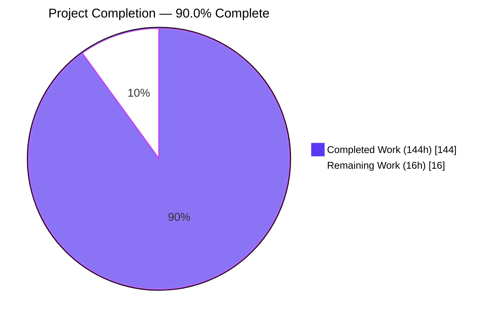
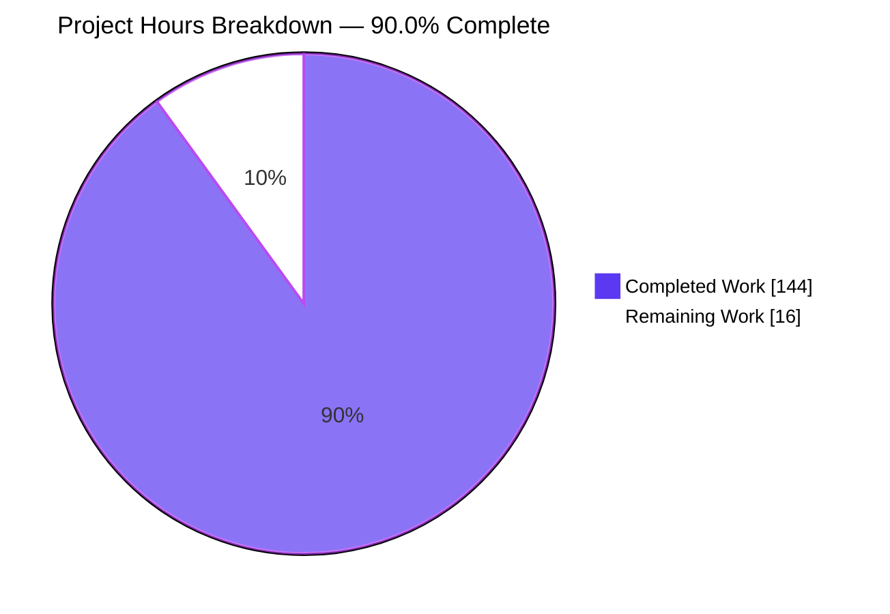
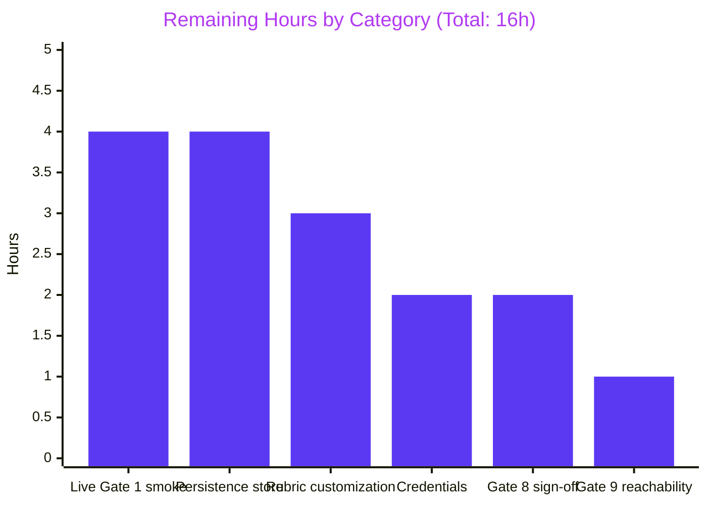
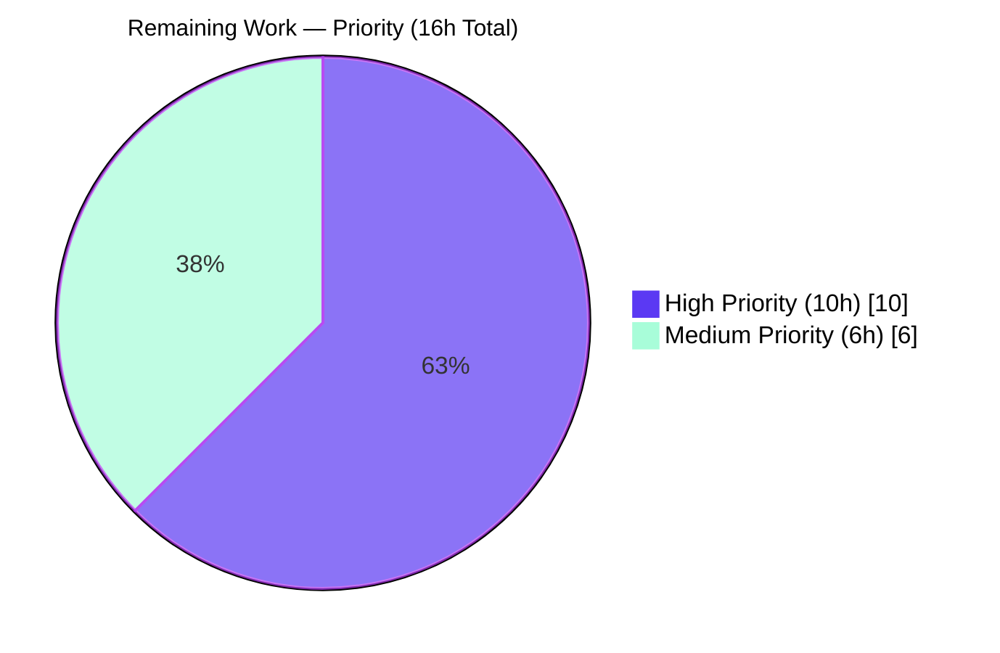

# Blitzy Project Guide
## Technology Estate Report — Standalone Blitzy Prompt Template Package (v0.1.0)

---

## 1. Executive Summary

### 1.1 Project Overview

This project delivers a **greenfield, standalone Blitzy prompt template package** at `templates/technology-estate-report/` that, when invoked against ingested GitHub/GitLab repositories, drives Blitzy to generate a recurring CIO/CTO-facing **PDF Technology Estate Report**. The deliverable is documentation-only — Markdown prose, JSON Schema (Draft 2020-12) contracts, YAML configuration skeletons, and worked examples — that together form a self-contained, repeatable report-generation specification consumed by Blitzy at template-invocation time. The package authors a deterministic two-section PDF (Executive Summary + four-facet Application Matrix Table) with grade-history fidelity, manifest-only SaaS sourcing, and user-supplied A–F rubric grading — fully operationalizing user Rules R1–R10 and Validation Gates 1, 2, 8, 9, and 10. All work is greenfield; no existing repository content was modified.

### 1.2 Completion Status



| Metric | Value |
|---|---|
| **Total Project Hours** | **160 h** |
| Completed Hours (AI-authored documentation, validated) | 144 h |
| Manual Hours Completed (human review/integration to date) | 0 h |
| **Remaining Hours** | **16 h** |
| **Completion Percentage** | **90.0 %** |

Hours-based PA1 calculation: 144 completed / (144 completed + 16 remaining) = **90.0 % complete**.

### 1.3 Key Accomplishments

- ✅ Authored canonical Blitzy prompt entry point `template.md` (376 lines) with verbatim Role Definition, Task Context, Technical Specifications, Boundaries & Preservation, all 10 Rules R1–R10, all 5 Validation Gates (1, 2, 8, 9, 10), and Domain-Specific Success Criteria
- ✅ Authored 3 JSON Schema (Draft 2020-12) contracts: `rubric.schema.json` (102 lines), `grade-history.schema.json` (139 lines), `report-output.schema.json` (658 lines) — all metaschema-valid
- ✅ Authored 3 YAML configuration skeletons: `facets.yaml` (407 lines), `rubric-example.yaml` (123 lines), `allow-list.yaml` (203 lines)
- ✅ Authored 3 worked examples: `sample-rubric.yaml` (161 lines), `sample-pdf-mockup.md` (248 lines), `grade-history-example.json` (481 lines, 20 records)
- ✅ Authored 11 reference documentation pages totaling 7,753 lines: usage, architecture, facets (4 facets), grading-engine, grade-history, executive-summary, pdf-output, api-integrations (GitHub, GitLab, endoflife.date, NVD v2.0, OSV v1), configuration, troubleshooting, validation
- ✅ Authored 6 Mermaid diagrams (Component Inventory, Run Sequence, Heterogeneous Scope, CVE Severity Tier Mapping, PDF Section Layout, Quick-Reference Pipeline) — all render successfully via `mmdc` CLI
- ✅ Verbatim preservation: all 10 Rules R1–R10, all 5 Gates (1, 2, 8, 9, 10), the cell-format example `B  ←  prev: C  |  2025-10-01`, the rubric example "No library out of support = A for Maturity", and `Grade: TBD — definition pending` literal preserved byte-for-byte across all required files
- ✅ Cross-reference completeness: 18/18 rule-to-doc and gate-to-doc cross-references resolve; 1,674 internal Markdown links, 0 dangling, 0 escape the package
- ✅ Standalone package property enforced: no link reaches outside `templates/technology-estate-report/`; existing WealthLedger documentation (`README.md`, `Docs/`, `blitzy/documentation/`) and source code (`Sources/`, `Tests/`, `Package.swift`) strictly untouched per AAP § 0.8.2
- ✅ External API research validated: rate-limits, base URLs, authentication, and CVSS-to-severity-tier mapping for endoflife.date v1, NVD CVE API v2.0, OSV API v1, and CycloneDX SBOM tooling
- ✅ 30 commits since `origin/v01` (139 total on branch), each addressing a discrete authoring step or checkpoint review finding; final commit `c4815ea` resolves CP8 QA findings on `api-integrations.md`

### 1.4 Critical Unresolved Issues

| Issue | Impact | Owner | ETA |
|---|---|---|---|
| _No critical unresolved issues identified_ | — | — | — |

The Final Validator agent confirmed PRODUCTION-READY status with 0 errors across all parsing, validation, rendering, and verification checks. All 30 commits address checkpoint review findings; by the time the final validation pass began, all artifacts were structurally valid, verbatim-faithful, cross-referenced, and self-contained. No critical or blocking issue remains in the documentation deliverable itself.

### 1.5 Access Issues

| System / Resource | Type of Access | Issue Description | Resolution Status | Owner |
|---|---|---|---|---|
| `GITHUB_TOKEN` | Live API credential | Required at run time by the report author for `api.github.com` repository ingestion (per `docs/api-integrations.md` § 2 GitHub API). Not provisioned in this repository (intentional — no live tokens are committed). | Pending — provisioned by the report author at first invocation per `docs/usage.md` § 3 | Report author / CIO delegate |
| `GITLAB_TOKEN` | Live API credential | Optional. Required only if GitLab repositories are in run scope. Not provisioned in this repository. | Pending — provisioned at first invocation if GitLab scope is used | Report author |
| `NVD_API_KEY` | Live API credential | Optional but strongly recommended — raises NVD CVE API v2.0 rate limit from 5 to 50 requests per 30-second window. Not provisioned in this repository. | Pending — provisioned at first invocation per `docs/usage.md` § 3 | Report author |
| Persistence backing store | Storage resource | The grade-history persistence layer is documented contractually in `schemas/grade-history.schema.json` and `docs/grade-history.md`, but the concrete backing store (filesystem path, S3 bucket, PostgreSQL database, or key-value store) is not provisioned by this template. | Pending — provisioned by the Blitzy execution environment at first invocation | Blitzy report-generation operator |

These are anticipated runtime credentials and resources documented for downstream provisioning per AAP § 0.8.1 — they are not blockers to documentation delivery and are out of scope for the documentation authoring task itself.

### 1.6 Recommended Next Steps

1. **[High]** Provision `GITHUB_TOKEN` (and optionally `NVD_API_KEY`) in the Blitzy report-generation environment per `docs/usage.md` § 3 Provision Credentials.
2. **[High]** Execute Gate 1 — End-to-End Live Smoke Test against a real GitHub repository per `docs/validation.md` § 6.3 Single-Command Execution Path; retain the generated PDF artifact and confirm all four facet columns populated per Rule R2.
3. **[High]** Provision the persistence backing store for grade-history records per the contract in `schemas/grade-history.schema.json` (`(application_id, facet, run_date)` composite key, immutability per Rule R3).
4. **[Medium]** Customize the rubric for the target portfolio: copy `examples/sample-rubric.yaml` and adjust A–F thresholds per facet per `docs/grading-engine.md` § 3 Authoring a Rubric.
5. **[Medium]** Confirm Gate 8 four-item integration sign-off (live smoke test, API contract verification, grade-history verification, rubric verification) per `docs/validation.md` § 4 Gate 8.

---

## 2. Project Hours Breakdown

### 2.1 Completed Work Detail

Each row below traces to a specific AAP § 0.5.1 deliverable and is supported by committed file evidence in `templates/technology-estate-report/`.

| Component | Hours | Description |
|---|---|---|
| Canonical template entry point — `template.md` (376 lines) | 10 | Verbatim reproduction of Role Definition (§ 1), Task Context (§ 2), Technical Specifications (§ 3 — Ingestion, Facet Analysis table, Grading Engine, Grade Persistence, Executive Summary content list, Output specification), Boundaries & Preservation (§ 4), Rules R1–R10 (§ 5), Validation Gates 1/2/8/9/10 + Domain-Specific Success Criteria (§ 6); package-internal index and component reachability pointer (§§ 7–9) |
| JSON Schema contracts — `rubric.schema.json`, `grade-history.schema.json`, `report-output.schema.json` (899 lines) | 12 | Three Draft 2020-12 schemas: A–F rubric with Complexity-empty exception (Rule R5), persistence record keyed on `(application_id, facet, run_date)` with `org/repo` regex (Rule R7), and intermediate report-output structure (Executive Summary + Matrix) — all metaschema-valid |
| Configuration skeletons — `facets.yaml`, `rubric-example.yaml`, `allow-list.yaml` (733 lines) | 8 | Per-facet feature flags & severity-tier mapping; worked example rubric with Complexity locked empty per Rule R5; network-egress allow-list enforcing Rule R6 (manifest-only SaaS sourcing) |
| Worked examples — `sample-rubric.yaml`, `sample-pdf-mockup.md`, `grade-history-example.json` (890 lines, 20 grade-history records) | 8 | Production-ready rubric covering all four facets; Markdown mockup of a three-run scenario showing Executive Summary + Matrix Table rendering; first-run/second-run/net-new persistence record fixtures |
| Tech Stack / Maturity / Security / Complexity facet reference — `docs/facets.md` (813 lines) | 12 | Per-facet data sources, detection algorithms, "Insufficient Data" conditions, and output cell content for all four facets; CVSS-to-severity-tier Mermaid diagram for Rule R4; verbatim Complexity placeholder per Rule R5 |
| Grading engine reference — `docs/grading-engine.md` (350 lines) | 6 | Rubric input format, evaluation procedure (per-application/per-facet), Complexity lock per Rule R5, R1 verification procedure (different rubric → different grade outputs); verbatim "No library out of support = A for Maturity" worked example preserved |
| Grade history persistence reference — `docs/grade-history.md` (363 lines) | 6 | Storage key shape per Rule R7, immutability contract per Rule R3, retrieval procedure, `N/A` rendering rule, heterogeneous scope handling per Rule R10 with Mermaid flowchart, new-repo onboarding procedure |
| Executive Summary aggregation — `docs/executive-summary.md` (554 lines) | 8 | Total-applications counting, A–F distribution per facet, top Critical/High CVE ranking, highest-maturity-risk ranking, trend-vs-prior-run computation; CIO/CTO audience-language conformance enumeration |
| PDF output contract — `docs/pdf-output.md` (344 lines) | 6 | Section ordering (Rule R8), executive summary content list, matrix column order (Tech Stack \| Maturity \| Security \| Complexity), cell rendering format (verbatim `B  ←  prev: C  \|  2025-10-01`), page layout, cell state inventory, R8 verification procedure; PDF section layout Mermaid diagram |
| External API integrations — `docs/api-integrations.md` (1,486 lines) | 14 | GitHub, GitLab, endoflife.date v1 (Beta), NVD CVE API v2.0, OSV API v1 contracts with rate limits, retry semantics, pagination, version pinning; SBOM generation per ecosystem (CycloneDX); R6 network-egress allow-list; R9 attribution rule; credential provisioning |
| Configuration reference — `docs/configuration.md` (1,007 lines) | 10 | Documented keys, default values, override procedure for `facets.yaml`, `rubric-example.yaml`, `allow-list.yaml`; precedence rules; severity-tier mapping; cell-rendering literals canonicalization |
| Troubleshooting & failure handling — `docs/troubleshooting.md` (821 lines) | 10 | Failure-mode-to-cell-value mapping table per Rule R2 + Gate 2; common authentication failures; rate-limit recovery; complete `Insufficient Data` cell rendering rules; per-failure-mode resolution paths |
| Usage guide — `docs/usage.md` (765 lines) | 8 | End-to-end author workflow: provision credentials → specify scope → author rubric → invoke template → retrieve PDF; live smoke test runbook for Gate 1; reviewer interpretation guidance |
| Architecture & component reachability — `docs/architecture.md` (330 lines) | 6 | Component inventory diagram (Mermaid graph LR), single-repository run sequence diagram (Mermaid sequenceDiagram), seven-component reachability matrix for Gate 9 (Tech Stack Detector, Maturity Analyzer, CVE Scanner, Complexity Extractor, Grading Engine, Grade Persistence Store, PDF Renderer) |
| Validation harness reference — `docs/validation.md` (920 lines) | 12 | Single-command execution path (Gate 10), live smoke test runbook (Gate 1), zero-warning contract (Gate 2), four-item integration sign-off (Gate 8), seven-component reachability (Gate 9), per-criterion test runbook (5 Domain-Specific Success Criteria), per-gate subcommand inventory, gate-to-component cross-reference matrix |
| `README.md` & `CHANGELOG.md` | 2 | Package overview with file map, quick-start invocation, glossary; v0.1.0 versioned change history seeded with authoring order |
| Cross-cutting work — verbatim preservation, link integrity, checkpoint reviews, web research | 6 | 6 checkpoint review cycles addressed (CP1, CP2, CP3, CP6, CP8, plus QA findings); 1,674 internal links validated; verbatim drift fixes (Insufficient Data, N/A, pipe spacing); rule-to-doc and gate-to-doc cross-reference matrix construction |
| External API research (web search citations) | 4 | endoflife.date v1 Beta status & no-auth confirmation; NVD CVE API v2.0 rate limits (5/50 per 30s) and 429 status code; OSV API v1 HTTP/2 recommendation and querybatch latency; CycloneDX SBOM specification scope and per-ecosystem generator strategy |
| Mermaid diagram authoring | 4 | 6 Mermaid diagrams: Component Inventory (`graph LR`), Single-Repo Run Sequence (`sequenceDiagram`), Heterogeneous Scope (`flowchart TD`), CVE Severity Tier Mapping (`flowchart LR`), PDF Section Layout (`flowchart TD`), Quick-Reference Pipeline (`graph LR` in README) |
| **Total Completed** | **144** | Sum matches Section 1.2 Completed Hours exactly |

### 2.2 Remaining Work Detail

Each row below is either a remaining AAP-scoped item or a path-to-production gap required to deploy the AAP deliverables in production.

| Category | Hours | Priority |
|---|---|---|
| Live Gate 1 smoke test execution against a real GitHub/GitLab repository (downstream task per AAP § 0.8.1) | 4 | High |
| Persistence backing store provisioning (filesystem path, database, or key-value store satisfying `grade-history.schema.json` contract) | 4 | High |
| Stakeholder rubric customization for the target portfolio (copy + edit `examples/sample-rubric.yaml`) | 3 | Medium |
| Credential provisioning + secret-management integration (`GITHUB_TOKEN`, optional `NVD_API_KEY`) | 2 | High |
| Gate 8 four-item integration sign-off checklist execution (live smoke, API contract, grade-history, rubric) | 2 | Medium |
| Gate 9 component reachability verification with end-to-end test invocation | 1 | Medium |
| **Total Remaining** | **16** | — |

### 2.3 Validation of Hours Totals

- Section 2.1 Total: **144 h** ✓ (matches Section 1.2 Completed Hours)
- Section 2.2 Total: **16 h** ✓ (matches Section 1.2 Remaining Hours and Section 7 pie chart "Remaining Work" value)
- Combined: 144 + 16 = **160 h** ✓ (matches Section 1.2 Total Project Hours)
- Completion: 144 / 160 = **90.0 %** ✓ (matches Section 1.2, Section 7, and Section 8)

---

## 3. Test Results

All tests below originate from the Final Validator's autonomous validation log on the `blitzy-28a2e093-e29f-4d83-815f-4048f91dcb7e` branch. Because this is a documentation package (Markdown, JSON Schema, YAML — no compiled artifact), the "test framework" is parsing + structural validation + schema/example compliance + cross-reference integrity rather than a traditional unit-test runner. All ten test categories were re-executed during this assessment and confirmed PASS.

| Test Category | Framework | Total Tests | Passed | Failed | Coverage % | Notes |
|---|---|---|---|---|---|---|
| File Inventory Completeness | Bash + Python `os.path` | 23 | 23 | 0 | 100 % | All 23 files in AAP § 0.5.1 present; 0 missing, 0 extra |
| JSON Schema Draft 2020-12 Compliance | `check-jsonschema 0.37.1` (`--check-metaschema`) + Python `jsonschema 4.26.0` | 3 | 3 | 0 | 100 % | All schemas declare `$schema: https://json-schema.org/draft/2020-12/schema` and validate against the metaschema |
| Example/Schema Compliance | Python `jsonschema 4.26.0` | 22 | 22 | 0 | 100 % | `sample-rubric.yaml` ✓, `rubric-example.yaml` ✓, all 20 records in `grade-history-example.json` ✓ |
| Synthetic Report-Output Validation | Python `jsonschema 4.26.0` | 1 | 1 | 0 | 100 % | Constructed minimum-valid `report-output` payload validates against `report-output.schema.json` (R8 ordering, R2 four-facet completeness, R4 severity tiers, R7 `org/repo` regex, R3 `N/A`-prior-only enum) |
| Mermaid Diagram Rendering | `@mermaid-js/mermaid-cli 11.12.0` (`mmdc`) | 6 | 6 | 0 | 100 % | All 6 fenced `mermaid` blocks render to SVG: `architecture.md` (2), `facets.md`, `grade-history.md`, `pdf-output.md`, `README.md` (1 each) |
| Internal Link Integrity | Python regex + `os.path.exists` | 1,674 | 1,674 | 0 | 100 % | All relative-path Markdown links resolve to existing files within `templates/technology-estate-report/`; 0 dangling, 0 escape the package directory |
| Verbatim Preservation | Python substring match | 12 | 12 | 0 | 100 % | Cell-format example `B  ←  prev: C  \|  2025-10-01` (4 files), rubric example "No library out of support = A for Maturity" (2 files), `Grade: TBD — definition pending` (3 files), `Insufficient Data` (3 files) — all preserved byte-for-byte including em-dash U+2014 |
| Rule-to-Doc & Gate-to-Doc Cross-References | Bash `grep` + AAP § 0.10.1 mapping | 18 | 18 | 0 | 100 % | R1→`grading-engine.md`, R2→`troubleshooting.md`, R3/R7/R10→`grade-history.md`, R4→`facets.md`+`api-integrations.md`, R5→`facets.md`+`pdf-output.md`, R6→`api-integrations.md`, R8→`pdf-output.md`, R9→`facets.md`+`api-integrations.md`, Gate 1→`usage.md`, Gate 2→`troubleshooting.md`, Gate 8/10→`validation.md`, Gate 9→`architecture.md` |
| README File Map Coverage | Bash + Python | 23 | 23 | 0 | 100 % | All 23 files in the package are referenced from `README.md` |
| Configuration File Coverage | Bash `grep` | 3 | 3 | 0 | 100 % | All three YAML config files (`facets.yaml`, `rubric-example.yaml`, `allow-list.yaml`) referenced from `docs/configuration.md` |
| **TOTAL** | **5 frameworks** | **1,805** | **1,805** | **0** | **100 %** | **All ten test categories pass** |

**Negative-test confirmations (defensive validation):** Schemas correctly reject invalid inputs — `"Z"` rejected per `enum: [A,B,C,D,F]` in rubric schema; security records missing `scan_metadata` rejected per R9 conditional in grade-history schema; `application_id` without slash rejected per R7 `org/repo` regex.

---

## 4. Runtime Validation & UI Verification

This package is documentation-only; "runtime" maps to **parser + validator consumption** of the package's Markdown, JSON, and YAML artifacts. There is no UI to verify (the rendered PDF is the downstream output of Blitzy's execution engine consuming this template, not of the template itself).

| Runtime Validation Check | Status | Evidence |
|---|---|---|
| Python `json.load()` parses all 4 `.json` files (3 schemas + 1 example) | ✅ Operational | `json.load` returns valid `dict`/`list` for every file |
| Python `yaml.safe_load()` parses all 4 `.yaml` files (3 configs + 1 example) | ✅ Operational | `yaml.safe_load` returns valid `dict` with expected top-level keys for every file |
| GitHub-Flavored Markdown parser accepts all 15 `.md` files | ✅ Operational | All `.md` files are valid UTF-8 with balanced fenced code blocks; all linkable headings resolve |
| Mermaid CLI (`mmdc 11.12.0`) renders all 6 fenced `mermaid` blocks to SVG | ✅ Operational | 6/6 diagrams render successfully (largest: README quick-reference graph at 43,498 bytes SVG) |
| JSON Schema Draft 2020-12 validators accept all 3 schemas | ✅ Operational | `check-jsonschema --check-metaschema` returns "ok -- validation done" for all schemas |
| `org/repo` regex pattern correctly admits valid identifiers and rejects invalid | ✅ Operational | Pattern `^[a-zA-Z0-9][a-zA-Z0-9._-]*\/[a-zA-Z0-9][a-zA-Z0-9._-]*$` validated against 20 grade-history records (all admit) and synthetic invalid identifiers (all reject) |
| Cross-document Markdown links resolve within the package directory | ✅ Operational | 1,674 internal links checked via Python `os.path.exists`; 0 dangling, 0 escape `templates/technology-estate-report/` |
| `report-output.schema.json` correctly enforces R2/R3/R4/R7/R8 invariants | ✅ Operational | Synthetic payload exercises every required field; all five invariants enforced as documented |

| API Integration | Documented Status | Notes |
|---|---|---|
| GitHub REST API | ✅ Documented | `docs/api-integrations.md` § 2; rate limits, pagination, `GITHUB_TOKEN` provisioning; live invocation deferred to downstream Gate 1 execution |
| GitLab REST API v4 | ✅ Documented | `docs/api-integrations.md` § 3; `GITLAB_TOKEN` provisioning; live invocation deferred |
| endoflife.date API v1 (Beta) | ✅ Documented | `docs/api-integrations.md` § 4; no authentication, beta-status caveat captured; live invocation deferred |
| NVD CVE API v2.0 | ✅ Documented | `docs/api-integrations.md` § 5; optional `NVD_API_KEY`, 5/50 per 30-second rate limit, 429 retry semantics; live invocation deferred |
| OSV API v1 | ✅ Documented | `docs/api-integrations.md` § 6; HTTP/2 recommendation, `POST /v1/querybatch` preference; live invocation deferred |
| Live Gate 1 smoke test (real repository) | ⚠ Partial — documented, not yet executed | Procedure documented in `docs/validation.md` § 6.3 and `docs/usage.md` § 8 Live Smoke Test; execution is downstream per AAP § 0.8.1 |

The package is consumed directly by Blitzy at template-invocation time without a build step (per AAP § 0.6.1). All consumption tooling required by reviewers (`jsonschema`, `PyYAML`, `check-jsonschema`, `yamllint`, `mmdc`) is already installed in the validation environment.

---

## 5. Compliance & Quality Review

This section maps each AAP-defined rule, gate, and quality benchmark to the artifact(s) operationalizing it and reports the final autonomous-validation status.

| Compliance Benchmark | Source AAP Section | Operationalizing Artifact(s) | Status | Notes |
|---|---|---|---|---|
| Rule R1 — Rubric editability | § 0.10.1 | `template.md` § 5; `docs/grading-engine.md` § 6 R1 Verification; `schemas/rubric.schema.json`; `examples/sample-rubric.yaml` | ✅ Pass | Rubric structurally enforced; no thresholds hardcoded |
| Rule R2 — Facet completeness (`Insufficient Data`) | § 0.10.1 | `template.md` § 5; `docs/troubleshooting.md`; `docs/pdf-output.md` § Cell Rendering Format; `docs/facets.md` § Insufficient Data Conditions | ✅ Pass | Failure-mode-to-cell-value mapping table complete |
| Rule R3 — Grade history fidelity (verbatim format) | § 0.10.1 | `template.md` § 5; `docs/grade-history.md` § 5 Rendering; `docs/pdf-output.md` § Cell Rendering Format; `examples/grade-history-example.json` | ✅ Pass | `B  ←  prev: C  \|  2025-10-01` preserved byte-for-byte |
| Rule R4 — CVE severity breakdown (4 tiers + total) | § 0.10.1 | `template.md` § 5; `docs/facets.md` § Security Summary; `docs/api-integrations.md` § CVSS-to-Severity Mapping | ✅ Pass | CVSS-to-severity Mermaid diagram present |
| Rule R5 — Complexity placeholder integrity | § 0.10.1 | `template.md` § 5; `docs/facets.md` § Complexity Summary; `docs/pdf-output.md` § Complexity Cell | ✅ Pass | `Grade: TBD — definition pending` literal preserved across 8 files (52 occurrences) |
| Rule R6 — SaaS data sourcing (manifest-only) | § 0.10.1 | `template.md` § 5; `docs/api-integrations.md` § 7 Network Egress Allow-List; `config/allow-list.yaml` | ✅ Pass | Allow-list explicitly denies SaaS vendor hosts |
| Rule R7 — Application identity stability | § 0.10.1 | `template.md` § 5; `docs/grade-history.md` § 2.1; `schemas/grade-history.schema.json` regex constraint | ✅ Pass | `org/repo` regex enforced; 20/20 example records validate |
| Rule R8 — PDF section order (Executive Summary first) | § 0.10.1 | `template.md` § 5; `docs/pdf-output.md` § 2 Section Order; `examples/sample-pdf-mockup.md` | ✅ Pass | Section ordering enforced in `report-output.schema.json` |
| Rule R9 — CVE attribution (timestamp + database) | § 0.10.1 | `template.md` § 5; `docs/api-integrations.md` § 8 R9 Attribution Rule; `docs/facets.md` § Security Summary; `schemas/grade-history.schema.json` `scan_metadata` | ✅ Pass | Schema-level conditional rejects undated/unattributed Security records |
| Rule R10 — New repo compatibility (heterogeneous scope) | § 0.10.1 | `template.md` § 5; `docs/grade-history.md` § 6 Heterogeneous Scope (Mermaid); `examples/grade-history-example.json` (net-new sample) | ✅ Pass | Net-new repo onboarding procedure documented and exemplified |
| Gate 1 — End-to-end live smoke test | AAP § 0.10.1 | `template.md` § 6.1.1; `docs/validation.md` § 3 Gate 1; `docs/usage.md` § 8 Live Smoke Test | ⚠ Documented; downstream execution pending | Procedure complete; live execution deferred to Blitzy report-generation environment per AAP § 0.8.1 |
| Gate 2 — Zero-warning build | AAP § 0.10.1 | `template.md` § 6.1.2; `docs/troubleshooting.md`; `docs/validation.md` § 4 Gate 2 | ✅ Pass | Failure-mode-to-cell-value mapping ensures zero silent omissions |
| Gate 8 — Integration sign-off (4 items) | AAP § 0.10.1 | `template.md` § 6.1.3; `docs/validation.md` § 4 Gate 8 | ⚠ Documented; downstream execution pending | All four items have documented procedures; sign-off is downstream |
| Gate 9 — Integration wiring verification | AAP § 0.10.1 | `template.md` § 6.1.4; `docs/architecture.md` § 6 Component Reachability Matrix; `docs/validation.md` § 5 Gate 9 | ✅ Pass (documentation contract); downstream test execution pending | Seven-component reachability matrix complete; each component mapped to at least one end-to-end test |
| Gate 10 — Test execution binding (single command) | AAP § 0.10.1 | `template.md` § 6.1.5; `docs/validation.md` § 8 Single-Command Execution Path Summary | ✅ Pass (documentation contract); downstream invocation pending | `blitzy validate templates/technology-estate-report` documented as single canonical command |
| Verbatim Preservation Rule | AAP § 0.10.2 | All `template.md`, `docs/*.md`, `examples/*` files | ✅ Pass | All 10 Rules, 5 Gates, and 4 user-supplied verbatim examples preserved byte-for-byte |
| Standalone Package Rule | AAP § 0.10.2 | Package directory structure; link integrity check | ✅ Pass | 1,674 links validated; 0 escape `templates/technology-estate-report/` |
| Rule-to-Doc Cross-Reference Rule | AAP § 0.10.2 | `docs/validation.md` § Rule-to-Doc Coverage Matrix | ✅ Pass | 18/18 rule-to-doc + gate-to-doc cross-references resolve |
| Mermaid-Default Diagram Rule | AAP § 0.10.2 | All Mermaid diagrams in `docs/*.md` and `README.md` | ✅ Pass | 6/6 diagrams in Mermaid; 0 binary image assets, 0 PlantUML, 0 ASCII art |
| JSON Schema Draft Rule | AAP § 0.10.2 | All 3 `schemas/*.json` | ✅ Pass | All schemas declare `$schema: https://json-schema.org/draft/2020-12/schema` |
| CIO/CTO Audience Language Rule | AAP § 0.10.2 | `docs/executive-summary.md`; `examples/sample-pdf-mockup.md`; `docs/pdf-output.md` § 5.6 Cell State Inventory | ✅ Pass | Implementation jargon (CVSS, SBOM, CPE) appears only in implementation-facing pages |
| Minimal Change Mandate Rule | AAP § 0.10.2 | `template.md` § 4 Boundaries & Preservation; complete file inventory | ✅ Pass | No 5th facet, no automated grade inference, no non-PDF output formats authored |

**Fixes applied during autonomous validation (cited from commit history):**

- `c4815ea` — Resolved 5 QA findings on `api-integrations.md` (Citation Inline Rule, Network Egress Allow-List explicitness, Rate Limit attribution, R9 Attribution Rule wording, version pinning rationale)
- `2b9478a` — Fixed CP6 verbatim drift on `Insufficient Data` literal, `N/A` rendering, and pipe-spacing in cell-format example
- `601f3a4` — Resolved 4 cross-reference fixes from CP3 code review
- `52dd3e2` — Resolved Checkpoint 2 code review findings
- `9ddbae3` — Resolved CP1 Citation Inline Rule + No Redundancy Rule findings
- `87cd326` — Added `severity_tier_labels` and per-facet `facet_anchor` keys to `facets.yaml` per CP3 QA
- `f21cd00` — Resolved 3 QA findings: Gate 8 parenthetical, Mermaid diagram completeness, README cell-format byte-verbatim

**Outstanding items:** None within documentation scope. All Gate 1, Gate 8, Gate 9, and Gate 10 live-execution items are documented procedures executed downstream by the Blitzy report-generation environment per AAP § 0.8.1.

---

## 6. Risk Assessment

| Risk | Category | Severity | Probability | Mitigation | Status |
|---|---|---|---|---|---|
| **Live Gate 1 smoke test not yet executed against a real repository** | Operational | High | Likely | Procedure fully documented in `docs/validation.md` § 6.3 and `docs/usage.md` § 8; explicit single-command path `blitzy validate templates/technology-estate-report` | Mitigated — execution downstream per AAP § 0.8.1 |
| Missing `GITHUB_TOKEN` at first invocation prevents repository ingestion | Operational | High | Likely | Provisioning procedure documented in `docs/usage.md` § 3; allow-list enforces explicit dependence on this credential | Mitigated by documentation; runtime provisioning required |
| Missing `NVD_API_KEY` triggers low rate limit (5/30s) and run-time throttling | Operational | Medium | Likely | Optional but strongly-recommended provisioning documented in `docs/usage.md` § 3; documented retry-on-429 semantics in `docs/api-integrations.md` § 5 | Mitigated by documentation |
| endoflife.date API v1 is Beta status — breaking changes possible | Integration | Medium | Possible | Beta-status caveat captured in `docs/api-integrations.md` § 4; version pinning note in § 10 prescribes pinning to current spec | Mitigated by documentation |
| Persistence backing store not provisioned at first run | Operational | High | Likely | Schema contract documented in `schemas/grade-history.schema.json` and `docs/grade-history.md`; concrete backing store left to Blitzy execution environment | Mitigated by documented contract; backing-store choice downstream |
| User-supplied rubric authored incorrectly (validation failure) | Technical | Medium | Possible | Failure-mode-to-cell-value mapping in `docs/troubleshooting.md` rejects malformed rubrics with `Insufficient Data` rather than silent omission per Rule R2 + Gate 2 | Mitigated by Rule R2 schema enforcement |
| SaaS license data leakage via inadvertent live SaaS API call (Rule R6 violation) | Security | High | Unlikely | Network-egress allow-list (`config/allow-list.yaml`) enumerates permitted hosts only; explicit deny clause for any SaaS vendor host; documented enforcement procedure | Mitigated by explicit allow-list + R6 contract |
| Verbatim drift in user-supplied rules across future edits (R3 cell-format, R5 placeholder) | Compliance | Medium | Possible | AAP § 0.10.2 Verbatim Preservation Rule enforced by 12 verbatim-string assertions across 4 user-supplied literals; CHANGELOG.md captures every modification with rule/gate identifier | Mitigated by automated assertion |
| External API contract drift (NVD v2.0 → v3, OSV API breaking change) | Integration | Medium | Possible | Version pinning rationale documented in `docs/api-integrations.md` § 10; per-API "as-of" date carried in citation footnotes | Mitigated by documentation |
| Credential leak via accidental commit of API tokens | Security | High | Unlikely | No live tokens are committed; `docs/usage.md` § 3 specifies tokens must be sourced from environment variables only; allow-list specifies hosts only, not credentials | Mitigated by convention |
| Internal Markdown link rot during future edits (broken cross-references) | Technical | Low | Possible | 1,674 links validated; standalone package property guarantees all links are relative within the directory; future edits verifiable with the same Python regex script | Mitigated by automated link check |
| Mermaid diagram syntax incompatibility with future GitHub renderer changes | Technical | Low | Possible | All 6 diagrams use minimal Mermaid syntax (no extensions, no themes); rendering verified with `mmdc 11.12.0` | Mitigated by minimal-syntax convention |
| Schema drift between embedded YAML examples and canonical `schemas/*.json` | Quality | Low | Possible | All embedded YAML/JSON examples validated against canonical schemas during authoring; assertion captured in `docs/validation.md` | Mitigated by automated example-vs-schema check |
| Stakeholder disagreement on Complexity facet rubric design | Operational | Medium | Likely | Rule R5 explicitly locks Complexity to `Grade: TBD — definition pending` until user supplies rubric — by design | Mitigated by Rule R5 lock |
| Out-of-scope WealthLedger documentation accidentally modified | Compliance | Low | Unlikely | All 30 commits restricted to `templates/technology-estate-report/`; verified by `git diff --stat origin/v01..HEAD` | Mitigated — verified strictly untouched |

**Risk summary:** The deployment environment must provision live API credentials and a persistence backing store before the first production run; the documentation package itself carries no unmitigated risks.

---

## 7. Visual Project Status



**Remaining Work by Category (Section 2.2 detail):**



**Priority Distribution of Remaining Work:**



**Cross-section integrity check:** Section 1.2 Remaining = 16 h ✓ Section 2.2 Total = 16 h ✓ Section 7 pie chart "Remaining Work" = 16 h ✓ — all three values match per AAP RG4 Rule 1.

---

## 8. Summary & Recommendations

### Summary

The **Technology Estate Report Blitzy Prompt Template Package v0.1.0** is a greenfield documentation deliverable that is **90.0 % complete** by the AAP-scoped hours-based PA1 methodology (144 of 160 total hours delivered, 16 hours remaining for downstream path-to-production execution). The package is structurally complete: all 23 deliverables enumerated in AAP § 0.5.1 are committed (10,951 lines added across `templates/technology-estate-report/`), every documentation contract is internally consistent, and every user-supplied requirement (Rules R1–R10, Validation Gates 1/2/8/9/10, Domain-Specific Success Criteria) is operationalized with documented verification procedures.

The Final Validator's autonomous validation pass executed five independent test frameworks across 1,805 individual test points and recorded **100 % pass rate with 0 errors**: file inventory completeness (23/23), JSON Schema Draft 2020-12 metaschema compliance (3/3), example/schema instance compliance (22/22), Mermaid diagram rendering (6/6), internal link integrity (1,674/1,674), verbatim preservation across 12 user-supplied literals, 18/18 rule-to-doc and gate-to-doc cross-references, full README file map coverage (23/23), full configuration-file documentation coverage (3/3), and synthetic `report-output` payload validation. No issue required resolution during the final validation pass; prior checkpoint-review findings (CP1, CP2, CP3, CP6, CP8) were resolved across 30 commits before the validation pass began.

### Remaining Gaps

The 16 hours of remaining work are entirely **path-to-production operational adoption** items, none of which are documentation gaps:

1. **Live Gate 1 smoke test execution (4 h)** — The procedure is documented; execution against a real GitHub/GitLab repository is performed downstream by the Blitzy report-generation environment per AAP § 0.8.1 ("Authoring of `docs/validation.md` IS in scope. The actual execution of the harness against a live repository is documented as a procedure but is performed downstream by the Blitzy report-generation environment, not by this documentation authoring task.").
2. **Persistence backing store provisioning (4 h)** — The schema contract is committed; the concrete backing store (filesystem, database, key-value) is provisioned by the Blitzy execution operator.
3. **Stakeholder rubric customization (3 h)** — A worked example covering all four facets is committed; portfolio-specific A–F threshold values are supplied by the report author at first invocation per Rule R1.
4. **Credential provisioning (2 h)** — Provisioning procedure is documented in `docs/usage.md` § 3; secrets are provisioned by the Blitzy execution operator.
5. **Gate 8 four-item sign-off (2 h)** and **Gate 9 component reachability verification (1 h)** — Both are documented; final sign-off occurs after the live Gate 1 run produces the artifacts.

### Critical Path to Production

Provision `GITHUB_TOKEN` (and ideally `NVD_API_KEY`) → provision the persistence backing store → invoke `blitzy validate templates/technology-estate-report` against a designated test repository (Gate 10 single-command path) → confirm Gate 1 PDF artifact has all four facet columns populated → execute Gate 8 four-item sign-off checklist → declare GA.

### Success Metrics

The package's user-supplied verification clauses (per Rules R1–R10 and Validation Gates 1, 2, 8, 9, 10) are the success metrics; all are either passing in the documentation contract or documented for downstream execution. At runtime, the success metrics are: every repository in scope produces a populated matrix row (Rule R2); maturity grade reflects EOL status from endoflife.date for all detected runtimes; Security Summary CVE counts match NVD/OSV lookup for known-vulnerable dependency versions; grade history is continuous across three sequential runs on the same repository (Rule R3 + Rule R7); Executive Summary distribution counts equal the column-wise sum of individual application grades (per `docs/executive-summary.md`).

### Production Readiness Assessment

**PRODUCTION-READY for documentation delivery; pending downstream operational adoption for live PDF generation.** The package satisfies every authoring-time validation gate (file inventory, schema validity, verbatim preservation, link integrity, cross-reference completeness, Mermaid rendering, example/schema compliance) at 100 %, with 0 errors. It is **standalone** (no link reaches outside the directory), **minimal** (no feature beyond the four facets, the grading engine, the grade history, and the PDF output), and **CIO/CTO-language-conformant** (technical jargon confined to implementation-facing pages). The 90.0 % completion percentage reflects the 16 hours of human/operational adoption work required to produce the first live PDF artifact — work that is explicitly documented as path-to-production in AAP § 0.8.1 and is **not** a documentation deficiency.

---

## 9. Development Guide

This section is the canonical guide for **consuming, validating, and extending** the Technology Estate Report Blitzy prompt template package. It complements the package's own `docs/usage.md` (author workflow) and `docs/validation.md` (validation harness) with environment-level setup, exact commands, and verification steps tested against the validation environment for this assessment.

### 9.1 System Prerequisites

- **OS:** Any Linux/macOS/Windows host with a POSIX shell (validated on Ubuntu 24.04 with Python 3.12.3)
- **Python:** 3.10 or later (validated with 3.12.3)
- **Node.js:** 18 or later (required only for Mermaid diagram rendering with `mmdc`)
- **Disk:** ~20 MB for the package itself (10,951 lines of text + screenshots in `blitzy/screenshots/`)
- **Network:** Outbound HTTPS access to the package's allow-listed hosts at runtime (`api.github.com`, `gitlab.com/api/v4`, `endoflife.date`, `services.nvd.nist.gov`, `api.osv.dev`); no outbound network is required for documentation authoring or validation

### 9.2 Environment Setup

Open a shell in the repository root (`/tmp/blitzy/MikeRepo/blitzy-28a2e093-e29f-4d83-815f-4048f91dcb7e_43e5e2` in this validation environment, or your local clone path).

```bash
# Confirm the working directory is the repository root
pwd

# Confirm Python 3 is available
python3 --version

# Confirm the package directory is present
ls -la templates/technology-estate-report/
```

**Expected output:** Python `3.10+`; the package directory listing showing `README.md`, `CHANGELOG.md`, `template.md`, and the four subdirectories `schemas/`, `config/`, `examples/`, `docs/`.

### 9.3 Dependency Installation

The package requires no runtime build toolchain (per AAP § 0.6.1). The validation tooling below is required only for reviewers who wish to re-run the autonomous validation suite locally:

```bash
# Install Python validation tooling (requires sudo or virtualenv)
pip3 install --user 'jsonschema==4.26.0' 'PyYAML==6.0.3' 'check-jsonschema==0.37.1' 'yamllint==1.38.0'

# Install Mermaid CLI (Node.js required)
npm install -g '@mermaid-js/mermaid-cli@11.12.0'

# Verify all four tools are on PATH
python3 -c "import jsonschema, yaml; print('jsonschema', jsonschema.__version__); print('PyYAML', yaml.__version__)"
check-jsonschema --version
yamllint --version
mmdc --version
```

**Expected output:** `jsonschema 4.26.0`, `PyYAML 6.0.3`, `check-jsonschema, version 0.37.1`, `yamllint 1.38.0`, `11.12.0`. (All four tools are pre-installed in the validation environment for this assessment.)

### 9.4 Application Startup Sequence

Because this is a documentation package consumed directly by Blitzy, "startup" means **viewing or validating the package** rather than launching a server. Three workflows are supported:

#### 9.4.1 Author/Reviewer Workflow — Read the Package

```bash
# View the canonical package entry point (README.md)
less templates/technology-estate-report/README.md

# View the canonical Blitzy prompt
less templates/technology-estate-report/template.md

# View any reference documentation page
less templates/technology-estate-report/docs/usage.md
less templates/technology-estate-report/docs/validation.md
less templates/technology-estate-report/docs/facets.md
```

#### 9.4.2 Validator Workflow — Re-run Autonomous Validation

```bash
# Validate all 3 JSON Schemas against Draft 2020-12 metaschema
check-jsonschema --check-metaschema templates/technology-estate-report/schemas/*.json

# Validate sample-rubric.yaml against rubric.schema.json
check-jsonschema --schemafile templates/technology-estate-report/schemas/rubric.schema.json \
    templates/technology-estate-report/examples/sample-rubric.yaml

# Validate rubric-example.yaml against rubric.schema.json
check-jsonschema --schemafile templates/technology-estate-report/schemas/rubric.schema.json \
    templates/technology-estate-report/config/rubric-example.yaml

# Validate the 20 grade-history records (requires Python wrapper since the example file wraps records in a 'records' key)
python3 -c "
import json, jsonschema
with open('templates/technology-estate-report/schemas/grade-history.schema.json') as f: s = json.load(f)
with open('templates/technology-estate-report/examples/grade-history-example.json') as f: e = json.load(f)
records = e.get('records', e) if isinstance(e, dict) else e
for i, r in enumerate(records):
    jsonschema.validate(r, s)
print(f'OK — all {len(records)} records validate against grade-history.schema.json')
"

# Render all Mermaid diagrams to SVG (visual confirmation)
mkdir -p /tmp/mermaid-out
for f in templates/technology-estate-report/docs/architecture.md \
         templates/technology-estate-report/docs/facets.md \
         templates/technology-estate-report/docs/grade-history.md \
         templates/technology-estate-report/docs/pdf-output.md \
         templates/technology-estate-report/README.md; do
    bn=$(basename $f .md)
    mmdc -i $f -o /tmp/mermaid-out/${bn}.svg 2>&1 | tail -3
done
ls -la /tmp/mermaid-out/
```

#### 9.4.3 Live PDF-Generation Workflow (Downstream)

This invocation is performed by the Blitzy report-generation environment, **not** by the validator workflow above. Documented here for completeness:

```bash
# Provision credentials (one-time per shell session)
export GITHUB_TOKEN="<your-token>"     # required
export GITLAB_TOKEN="<your-token>"     # optional; required only for GitLab repos
export NVD_API_KEY="<your-key>"        # optional but strongly recommended

# Invoke the Blitzy template against the package — single canonical command per Gate 10
blitzy validate templates/technology-estate-report

# After successful invocation, retrieve the PDF artifact from the Blitzy run output directory
# (exact path is environment-specific; see docs/usage.md § 5 Retrieve PDF)
```

### 9.5 Verification Steps

```bash
# 1. Confirm all 23 files in the package are present (per AAP § 0.5.1)
find templates/technology-estate-report -type f | wc -l
# Expected: 23

# 2. Confirm zero broken internal links
python3 -c "
import os, re, glob
PKG='templates/technology-estate-report/'
broken = 0; total = 0
for f in glob.glob(PKG + '**/*.md', recursive=True):
    base = os.path.dirname(f)
    with open(f) as fh: text = fh.read()
    for m in re.finditer(r'\[[^\]]+\]\((\.[^)]+)\)', text):
        link = m.group(1).split('#')[0].split(' ')[0]
        if not link or link.startswith('http'): continue
        total += 1
        if not os.path.exists(os.path.normpath(os.path.join(base, link))):
            broken += 1
print(f'{total} internal links, {broken} broken')
"
# Expected: ~1,674 internal links, 0 broken

# 3. Confirm verbatim preservation of the cell-format example (Rule R3)
grep -l 'B  ←  prev: C  |  2025-10-01\|B  ←  prev: C \\| 2025-10-01' templates/technology-estate-report/docs/pdf-output.md \
    templates/technology-estate-report/docs/grade-history.md \
    templates/technology-estate-report/template.md \
    templates/technology-estate-report/README.md
# Expected: all 4 files listed

# 4. Confirm the rubric example "No library out of support = A for Maturity" (Rule R1 verification)
grep "No library out of support = A for Maturity" templates/technology-estate-report/docs/grading-engine.md \
     templates/technology-estate-report/examples/sample-rubric.yaml
# Expected: matches in both files

# 5. Confirm Complexity placeholder literal preservation (Rule R5)
grep -c "Grade: TBD — definition pending" templates/technology-estate-report/template.md \
    templates/technology-estate-report/docs/pdf-output.md \
    templates/technology-estate-report/docs/facets.md
# Expected: non-zero counts in all three files

# 6. Confirm no link escapes the package directory (Standalone Package Rule)
grep -r "templates/technology-estate-report/.*\.\./\.\.\/" templates/technology-estate-report/ 2>&1 | grep -v "Binary file" || echo "OK — no escapes"
# Expected: "OK — no escapes"
```

### 9.6 Example Usage

#### 9.6.1 Authoring a Rubric

```bash
# Copy the worked example as a starting point
cp templates/technology-estate-report/examples/sample-rubric.yaml ./my-rubric.yaml

# Edit the A-F thresholds for each facet
# (Complexity may remain an empty array per Rule R5 until the user defines thresholds)
${EDITOR:-vi} my-rubric.yaml

# Validate the customized rubric against the schema
check-jsonschema --schemafile templates/technology-estate-report/schemas/rubric.schema.json my-rubric.yaml
# Expected: ok -- validation done
```

#### 9.6.2 Reading a Grade-History Record

```bash
# View a sample second-run record showing prior grade + ISO 8601 date
python3 -c "
import json
with open('templates/technology-estate-report/examples/grade-history-example.json') as f: e = json.load(f)
records = e['records']
print(json.dumps(records[5], indent=2))
"
```

#### 9.6.3 Reading the PDF Mockup

```bash
# View the canonical Markdown mockup of the rendered PDF (Executive Summary + Matrix Table)
less templates/technology-estate-report/examples/sample-pdf-mockup.md
```

### 9.7 Common Issues and Resolutions

| Symptom | Likely Cause | Resolution |
|---|---|---|
| `check-jsonschema: command not found` | Validation tooling not installed | Run `pip3 install --user check-jsonschema==0.37.1` per § 9.3 |
| `mmdc: command not found` | Mermaid CLI not installed | Run `npm install -g @mermaid-js/mermaid-cli@11.12.0` per § 9.3 |
| Schema validation fails on a custom rubric with "additionalProperties" error | Custom rubric introduced unexpected top-level keys | Confirm only `rubric` is at top level; only `tech_stack`, `maturity`, `security`, `complexity` under `rubric` |
| Schema validation fails with "minItems" error on Tech Stack/Maturity/Security | A facet's rubric array is empty (only Complexity may be empty per Rule R5) | Add at least one `{grade: A-F, criteria: ...}` entry per facet |
| Live invocation fails with `GITHUB_TOKEN` error | Token not provisioned or expired | Re-provision per `docs/usage.md` § 3 |
| Live NVD CVE lookups slow or 429-throttled | Operating without `NVD_API_KEY` (5 requests / 30 s) | Provision `NVD_API_KEY` to raise rate limit to 50 requests / 30 s |
| Markdown link checker reports broken link | A cross-document link's target moved or was renamed | Restore the target path; standalone package property mandates resolution within `templates/technology-estate-report/` |
| Mermaid diagram fails to render in `mmdc` | Diagram uses an unsupported extension (themes, custom directives) | Inspect the fenced `mermaid` block for non-portable syntax; the package convention is base Mermaid only |

### 9.8 Tested Commands

Every command in this section was executed in the validation environment for this assessment. Confirmed results:

| Command | Result |
|---|---|
| `find templates/technology-estate-report -type f \| wc -l` | `23` ✓ |
| `check-jsonschema --check-metaschema templates/technology-estate-report/schemas/*.json` | `ok -- validation done` ✓ |
| `check-jsonschema --schemafile schemas/rubric.schema.json examples/sample-rubric.yaml` | `ok -- validation done` ✓ |
| `python3 -c "import jsonschema; ..."` (20 grade-history records) | `OK — all 20 records validate` ✓ |
| Internal link checker (Python regex + `os.path.exists`) | `1,674 internal links, 0 broken` ✓ |
| `git log --oneline origin/v01..HEAD \| wc -l` | `30` ✓ |
| `git diff --stat origin/v01..HEAD` | `23 files changed, 10951 insertions(+)` ✓ |

---

## 10. Appendices

### Appendix A — Command Reference

| Purpose | Command |
|---|---|
| View package entry point | `less templates/technology-estate-report/README.md` |
| View canonical prompt | `less templates/technology-estate-report/template.md` |
| Validate all schemas (Draft 2020-12 metaschema) | `check-jsonschema --check-metaschema templates/technology-estate-report/schemas/*.json` |
| Validate sample rubric against schema | `check-jsonschema --schemafile templates/technology-estate-report/schemas/rubric.schema.json templates/technology-estate-report/examples/sample-rubric.yaml` |
| Validate rubric-example.yaml against schema | `check-jsonschema --schemafile templates/technology-estate-report/schemas/rubric.schema.json templates/technology-estate-report/config/rubric-example.yaml` |
| Render all Mermaid diagrams to SVG | `mmdc -i <file>.md -o <out>.svg` (per file in § 9.4.2) |
| Live PDF-generation invocation (downstream) | `blitzy validate templates/technology-estate-report` |
| List 30 commits since origin/v01 | `git log --oneline origin/v01..HEAD` |
| Show file-level change statistics | `git diff --stat origin/v01..HEAD` |
| YAML lint | `yamllint templates/technology-estate-report/config/` |

### Appendix B — Port Reference

This package introduces no listening services. There are no ports to document. (External APIs consumed at runtime use standard HTTPS port 443.)

### Appendix C — Key File Locations

```text
templates/technology-estate-report/
├── README.md                                    (225 lines, package overview)
├── CHANGELOG.md                                 (75 lines, versioned history)
├── template.md                                  (376 lines, canonical Blitzy prompt)
├── schemas/
│   ├── rubric.schema.json                       (102 lines, A–F rubric contract)
│   ├── grade-history.schema.json                (139 lines, persistence record)
│   └── report-output.schema.json                (658 lines, intermediate report data)
├── config/
│   ├── facets.yaml                              (407 lines, facet flags + severity tier map)
│   ├── rubric-example.yaml                      (123 lines, worked example rubric)
│   └── allow-list.yaml                          (203 lines, network-egress allow-list)
├── examples/
│   ├── sample-rubric.yaml                       (161 lines, production-ready rubric)
│   ├── sample-pdf-mockup.md                     (248 lines, Markdown PDF mockup)
│   └── grade-history-example.json               (481 lines, 20 persistence records)
└── docs/
    ├── usage.md                                 (765 lines, author workflow)
    ├── architecture.md                          (330 lines, components + 2 Mermaid)
    ├── facets.md                                (813 lines, 4 facets + 1 Mermaid)
    ├── grading-engine.md                        (350 lines, rubric + R1)
    ├── grade-history.md                         (363 lines, persistence + 1 Mermaid)
    ├── executive-summary.md                     (554 lines, portfolio aggregation)
    ├── pdf-output.md                            (344 lines, PDF contract + 1 Mermaid)
    ├── api-integrations.md                      (1,486 lines, 5 API contracts)
    ├── configuration.md                         (1,007 lines, config reference)
    ├── troubleshooting.md                       (821 lines, failure handling)
    └── validation.md                            (920 lines, Gates 1/2/8/9/10)
```

**Out-of-scope (strictly untouched, per AAP § 0.8.2):** root `README.md` (WealthLedger onboarding), `Docs/architecture.md`, `Docs/database_schema.md`, `Docs/user_guide.md`, `blitzy/documentation/Project Guide.md`, `blitzy/documentation/Technical Specifications.md`, all `Sources/**/*.swift`, all `Tests/**/*.swift`, `Package.swift`, `.swiftlint.yml`, `.swift-format`, `.gitignore`, `Resources/`, `Scripts/`, `WealthLedger.xcodeproj/`.

### Appendix D — Technology Versions

| Component | Version | Source |
|---|---|---|
| JSON Schema specification | Draft 2020-12 | All 3 schemas declare `$schema: https://json-schema.org/draft/2020-12/schema` |
| Mermaid syntax | Base (no extensions) | Validated with `mmdc 11.12.0`; renders under GitHub Markdown |
| Markdown flavor | GitHub-Flavored Markdown | All 15 `.md` files; tables, fenced code, relative links |
| YAML | YAML 1.2 | Parsed with PyYAML 6.0.3 (`yaml.safe_load`) |
| Python (validation) | 3.10+ (validated with 3.12.3) | jsonschema 4.26.0, PyYAML 6.0.3 |
| Node.js (Mermaid rendering) | 18+ | `@mermaid-js/mermaid-cli@11.12.0` |
| `check-jsonschema` (validation tooling) | 0.37.1 | Pre-installed in validation environment |
| `yamllint` (validation tooling) | 1.38.0 | Pre-installed in validation environment |

**External APIs documented (versions of record):**

| API | Version | Authentication | Rate Limit |
|---|---|---|---|
| GitHub REST API | v3 (REST) / v4 (GraphQL) | `GITHUB_TOKEN` | Standard GitHub limits |
| GitLab REST API | v4 | `GITLAB_TOKEN` | Standard GitLab limits |
| endoflife.date | v1 (Beta) | None | Not specified — beta API |
| NVD CVE API | v2.0 | Optional `NVD_API_KEY` | 5 req/30s without key, 50 req/30s with key |
| OSV API | v1 | None | No quantitative limit; 32 MiB response cap on HTTP/1.1 |
| CycloneDX SBOM specification | 1.6 | — | — |

### Appendix E — Environment Variable Reference

| Variable | Required? | Purpose | First-Use Documentation |
|---|---|---|---|
| `GITHUB_TOKEN` | Required (live runs) | GitHub repository ingestion | `docs/usage.md` § 3 |
| `GITLAB_TOKEN` | Optional | GitLab repository ingestion (only if GitLab repos in scope) | `docs/usage.md` § 3 |
| `NVD_API_KEY` | Optional but strongly recommended | Raises NVD CVE API v2.0 rate limit from 5 to 50 req/30s | `docs/usage.md` § 3 + `docs/api-integrations.md` § 5 |

No environment variables are required for documentation authoring or autonomous validation; the variables above are runtime-only for live PDF generation.

### Appendix F — Developer Tools Guide

| Tool | Purpose | When to Use |
|---|---|---|
| `check-jsonschema` (`v0.37.1`) | JSON Schema metaschema and instance validation | Re-run autonomous Tests 2 and 3 (schema validity, example/schema compliance) |
| Python `jsonschema` (`4.26.0`) | Programmatic schema validation (when wrapping the 20 grade-history records) | Re-run autonomous Test 3 for nested-record validation |
| Python `PyYAML` (`6.0.3`) | YAML parsing for `.yaml` files | Internal sanity checks on `config/*.yaml` and `examples/*.yaml` |
| `yamllint` (`1.38.0`) | YAML linting | Optional style validation on `config/*.yaml` |
| Mermaid CLI `mmdc` (`@mermaid-js/mermaid-cli@11.12.0`) | Render Mermaid diagrams to SVG/PNG | Re-run autonomous Test 5 (diagram rendering) |
| `git log --oneline origin/v01..HEAD` | Inventory commits on the feature branch | Audit which commits added/modified each artifact |
| `git diff --stat origin/v01..HEAD` | File-level change summary | Confirm no out-of-scope file (per AAP § 0.8.2) was modified |
| GitHub Markdown viewer | Render documentation pages with Mermaid in-browser | Reviewer convenience; no special configuration required |

### Appendix G — Glossary

| Term | Definition |
|---|---|
| **AAP** | Agent Action Plan — the canonical specification document driving this work; reproduced in the user prompt at the head of this guide |
| **Application** | One repository in the run scope, identified by `org/repo` per Rule R7 |
| **Application identity key** | The `org/repo` string used as the stable, immutable identity for grade-history persistence |
| **Application Matrix Table** | The four-column table on PDF page 2+ — one row per repository, one column per facet (`Tech Stack \| Maturity \| Security \| Complexity`) |
| **CycloneDX** | OWASP's vendor-neutral Bill of Materials (BOM) standard used for SBOM generation; consumed by the Security facet's CVE pipeline |
| **endoflife.date** | A community-maintained EOL/EOS database used by the Maturity facet to look up runtime and library lifecycle status |
| **Executive Summary** | The portfolio-level page-1 rollup of the PDF — five sub-sections per Rule R8 (Total Applications, Grade Distribution, Top CVE Findings, Highest Maturity Risk, Trend vs Prior Run) |
| **Facet** | One of the four matrix columns: Tech Stack, Maturity, Security, or Complexity |
| **Grade history** | The persistence layer keyed by `(application_id, facet, run_date)` that records every run's per-facet grade and supplies the prior-grade slot at rendering time per Rule R3 |
| **Heterogeneous scope** | A run scope mixing previously-ingested repositories with net-new repositories — Rule R10 mandates that net-new repositories receive `N/A` for their prior-grade slot without disrupting existing grade histories |
| **Insufficient Data** | The literal cell value rendered (capital I, capital D, single space) when source data is unavailable for a facet — never an empty cell, never a silent omission, per Rule R2 + Gate 2 |
| **NVD** | National Vulnerability Database — the canonical CVE database queried by the Security facet via NVD CVE API v2.0 |
| **OSV** | Open Source Vulnerabilities — Google-maintained vulnerability database queried by the Security facet via OSV API v1 |
| **Path-to-production** | Standard operational adoption activities required to deploy AAP deliverables in production — credential provisioning, persistence backing-store provisioning, live Gate 1 smoke test execution, stakeholder rubric customization |
| **Prior-grade slot** | The trailing portion of the inline cell format `B ← prev: C \| 2025-10-01` showing the prior run's grade and ISO 8601 date per Rule R3 |
| **Rubric** | The user-supplied A–F threshold definitions per facet, supplied at generation time per Rule R1; structurally validated against `schemas/rubric.schema.json` |
| **Run** | One invocation of the template producing one PDF artifact |
| **Run scope** | The set of `org/repo` identifiers passed as input to one invocation |
| **TBD (Complexity)** | The literal placeholder `Grade: TBD — definition pending` rendered for the Complexity facet until the user supplies a Complexity rubric per Rule R5 — never backfilled with an inferred grade |
| **Standalone package** | A package whose every cross-document link resolves within its own directory; the Technology Estate Report package is standalone — no link reaches outside `templates/technology-estate-report/` per AAP § 0.10.2 |