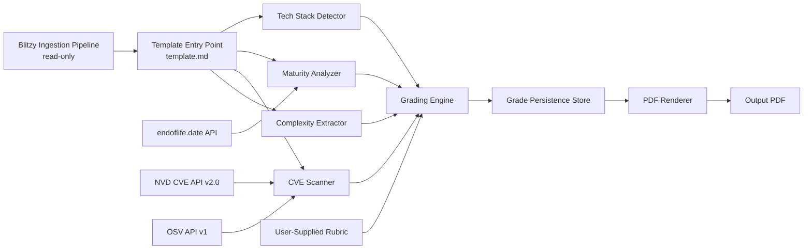
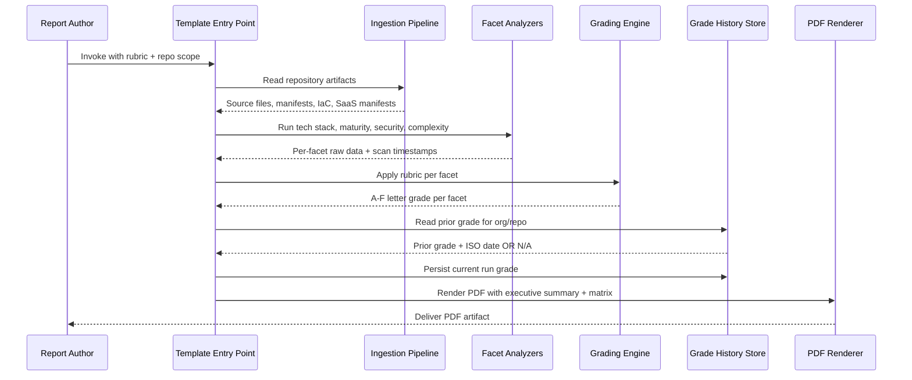
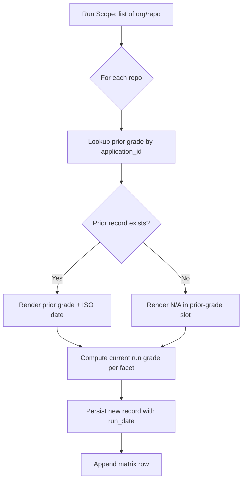
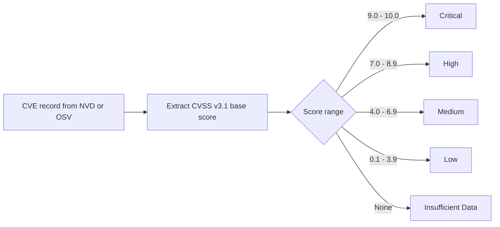
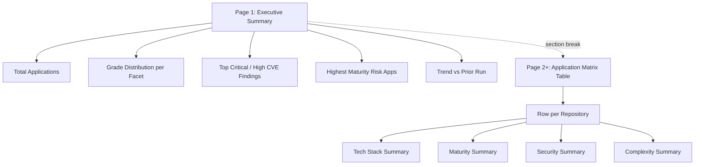

# Technical Specification

# 0. Agent Action Plan

## 0.1 Intent Clarification

### 0.1.1 Core Documentation Objective

Based on the provided requirements, the Blitzy platform understands that the documentation objective is to author a **standalone, executable Blitzy prompt template** — a structured Markdown/YAML documentation artifact — that, when invoked by Blitzy against ingested GitHub/GitLab repositories, drives the generation of a recurring **PDF Technology Estate Report** for CIO/CTO consumption. The deliverable is *not* runnable application code; it is a versioned set of template, schema, configuration, and supporting documentation files that together form a self-contained, repeatable report-generation specification.

**Request Categorization:** Create new documentation (a net-new prompt template product). No prior version of this template exists in the repository; the existing `blitzy/documentation/` folder contains only the WealthLedger Project Guide and Technical Specifications and is unrelated to this template.

**Documentation Type:** Multi-artifact documentation product comprising:

- **Prompt Template** — the canonical Blitzy-executable template document
- **Schema Specifications** — JSON Schema definitions for rubric input, grade-history persistence record, and PDF output contract
- **Configuration Templates** — YAML config skeletons for facet definitions and rubric inputs
- **User Guides** — usage, configuration, troubleshooting, and grade-history operations documentation
- **Architecture Documentation** — component interaction diagrams and data-flow narratives
- **Examples and Fixtures** — sample rubric inputs, sample PDF mockups, sample grade-history records

**Restated Documentation Requirements:**

- The template MUST produce a single PDF output containing exactly two sections in a fixed order: an **Executive Summary** (page 1) followed by an **Application Matrix Table** (subsequent pages)
- The matrix table MUST contain one row per ingested repository, with the repository full name `org/repo` used as the stable application identity key and the org name used as a secondary grouping label
- The matrix table MUST contain exactly four facet columns in this order: **Tech Stack Summary | Maturity Summary | Security Summary | Complexity Summary**
- Each facet cell MUST display a single A–F letter grade derived from a user-supplied rubric, with the **Complexity** facet locked to "Grade: TBD — definition pending" until a rubric is provided
- Each facet cell MUST display the prior grade and ISO 8601 date inline in the format `B  ←  prev: C  |  2025-10-01`, or `N/A` when no prior run exists
- The Executive Summary MUST contain: total applications in scope, A–F grade distribution per facet, top Critical/High CVE findings, highest-maturity-risk applications, and net grade improvement/regression trends versus the prior run
- The template MUST gracefully accept a heterogeneous run scope mixing previously-ingested repositories with net-new repositories, producing `N/A` prior-grade values for the new repositories without disrupting existing grade histories
- The template MUST be authored as standalone documentation with no dependency on any other Blitzy flow or template, and it MUST consume the existing Blitzy ingestion pipeline read-only

**Surfaced Implicit Requirements:**

- A **Rubric Input Schema** must be defined and documented because R1 mandates that grade thresholds are not hardcoded — the user supplies them at generation time, which implies a structured, validated input format
- A **Grade History Persistence Schema** must be defined because R3 requires displaying prior grade and ISO 8601 date inline, which implies durable storage keyed by `(application_id, facet, run_date)` and a documented record format
- A **CVE Severity Tier Mapping** must be documented because R4 requires reporting counts in exactly four severity tiers (Critical, High, Medium, Low) plus total — implying a deterministic CVSS-score-to-tier mapping table
- A **Tech Stack Detection Heuristic** must be documented because the Tech Stack Summary requires language % share by file count, cloud provider identification from IaC resource types, and vendor/framework extraction from dependency manifests — each requiring its own documented detection rule set
- An **Insufficient Data Cell Specification** must be documented because R2 prohibits empty cells and Gate 2 forbids silent suppression — implying every failure mode must surface as the literal cell value `Insufficient Data`
- A **PDF Section Ordering Specification** must be documented because R8 mandates Executive Summary precedes Matrix Table — implying a documented pagination contract
- A **Net-New Repository Onboarding Procedure** must be documented because R10 requires the same execution path to handle both first-run and recurring repositories — implying a documented detection mechanism for "first run versus subsequent run" per `(application_id, facet)` pair
- A **CVE Attribution Footer Specification** must be documented because R9 requires every Security Summary result to carry the scan timestamp (ISO 8601) and source database label (NVD, OSV, or both)
- A **Validation Harness Specification** must be documented because Gates 1, 2, 8, 9, and 10 require live end-to-end execution against a real repository, zero-warning completion, integration sign-off checks, full component wiring, and a single-command execution path

### 0.1.2 Special Instructions and Constraints

**CRITICAL Directives Captured Verbatim from User Requirements:**

- "Build a standalone Blitzy prompt template" — the template must have no dependency on other Blitzy flows or templates
- "Reports are cumulative" — new repositories appear as new rows in subsequent runs without disrupting existing application grade history
- "Language and framing MUST be business-outcome-oriented, not technical" — the Executive Summary and Matrix Table cell language must be authored for CIO/CTO consumption, not engineering audiences
- "Existing Blitzy ingestion pipeline is consumed read-only and left unchanged" — the template's documentation must explicitly forbid modifications to the ingestion pipeline
- "No features beyond the defined four facets, grading engine, grade history, and PDF output are to be implemented" — the minimal-change mandate constrains the template's scope inventory
- "The Complexity column MUST be present and MUST render raw proxy metrics (LOC, file count, contributor count) with the label 'Grade: TBD — definition pending'" — the Complexity column must never be removed, collapsed, or backfilled with an inferred grade

**User-Supplied Verification Rules (preserved EXACTLY for the template body):**

- "R1 — Rubric editability: The A–F grading rubric MUST be supplied by the report author at generation time. No grade thresholds are hardcoded in the template. Verification: generating a report with two different rubric inputs for the same dataset produces two different grade outputs."
- "R2 — Facet completeness: All four facet columns MUST be present in every matrix row in every report run. When source data is unavailable for a facet, the cell renders 'Insufficient Data.' Omitting a cell is prohibited. Verification: no matrix cell is empty or absent in any generated PDF."
- "R3 — Grade history fidelity: Prior grade display MUST include grade letter and ISO 8601 date. When no prior run exists for a facet/application pair, the cell renders 'N/A.' Verification: a second report run for the same repo shows the first run's grade and date inline."
- "R4 — CVE severity breakdown: Security Summary MUST report CVE counts broken out by severity tier (Critical, High, Medium, Low) plus a total count. A single aggregate number without severity tiers is a failing state. Verification: Security Summary cell contains four severity labels + total for every application."
- "R5 — Complexity placeholder integrity: The Complexity column MUST be present and MUST render raw proxy metrics (LOC, file count, contributor count) with the label 'Grade: TBD — definition pending.' The column MUST NOT be removed, collapsed, or backfilled with an inferred grade until an explicit rubric is provided by the user. Verification: Complexity column present in every run; no letter grade appears until rubric is supplied."
- "R6 — SaaS data sourcing: SaaS license data MUST be sourced exclusively from manifests tracked in the repository. No live SaaS vendor API calls are permitted in v1. Verification: template execution produces no outbound calls to SaaS vendor endpoints."
- "R7 — Application identity stability: The same repository MUST resolve to the same application identifier across all runs. Identity key is the repository full name (org/repo). Changing the key format between runs is prohibited. Verification: grade history for a repo is continuous across three sequential runs with no duplicate or orphaned entries."
- "R8 — PDF section order: The executive summary MUST precede the matrix table in the PDF. The matrix table MUST NOT be the first content element. Verification: PDF page 1 contains executive summary content; matrix table begins on a subsequent page or section."
- "R9 — CVE attribution: Every Security Summary result MUST include the scan timestamp (ISO 8601) and the source database (NVD, OSV, or both). Undated or unattributed CVE counts are a failing state. Verification: each Security Summary cell or report footnote contains timestamp and database label."
- "R10 — New repo compatibility: Template execution MUST succeed when a mix of previously-ingested repos and net-new repos are in scope in the same run. Net-new repos receive 'N/A' for prior grade. Verification: a run containing one existing repo and one new repo produces correct grade history for the existing repo and N/A for the new repo."

**User-Supplied Validation Gates (preserved EXACTLY for the template body):**

- "Gate 1 — End-to-end boundary verification: The template is NOT complete until it processes at least one real GitHub/GitLab repository and produces a PDF with all four facet columns populated and at least one graded cell. A mock or stub dataset does not satisfy this gate. Verification artifact: generated PDF file from a live repository."
- "Gate 2 — Zero-warning build: Template execution MUST complete with zero errors and zero warnings. Any CVE database lookup failure, manifest parse error, or grade computation warning MUST surface as an explicit 'Insufficient Data' cell — not a silent omission or suppressed error."
- "Gate 8 — Integration sign-off checklist (independent of unit test pass rate): Before delivery, all four must be confirmed: Live smoke test, API contract verification, Grade history verification, Rubric verification."
- "Gate 9 — Integration wiring verification: Every analysis component (tech stack detector, maturity analyzer, CVE scanner, complexity extractor, grading engine, grade persistence store, PDF renderer) MUST be reachable from the template entry point. Each component MUST be exercised by at least one end-to-end test that traverses the full execution chain from template invocation to PDF output. Components that pass unit tests in isolation but are not wired into the execution path do not count as delivered."
- "Gate 10 — Test execution binding: All validation tests MUST have a single-command execution path that provisions required credentials (GitHub token, CVE DB key), runs the template against a designated test repository, and asserts on the generated PDF content. Tests without a documented execution path are not considered passing validation."

**User-Supplied Domain Success Criteria (preserved EXACTLY for the template body):**

- "Every repository in scope produces a populated matrix row"
- "Maturity grade correctly reflects EOL status from endoflife.date for all detected runtimes and libraries"
- "Security Summary CVE counts match NVD/OSV lookup for a known-vulnerable dependency version"
- "Grade history is continuous and unbroken across a minimum of three sequential runs on the same repository"
- "Executive summary renders correct portfolio-level grade distribution counts matching the sum of individual application grades"

**Style Preferences (Inferred and Documented):**

- **Tone:** Business-outcome-oriented (CIO/CTO consumption); avoid implementation detail in Executive Summary and matrix cell labels
- **Structure:** Markdown for the prompt template body; YAML for rubric configuration; JSON Schema for persistence records and output contracts; Mermaid for all diagrams
- **Depth:** Implementation-ready — every facet, every rule, every gate must be documentable and verifiable from the artifact alone
- **Format:** Default to Markdown with embedded Mermaid diagrams; YAML for structured configuration; JSON Schema for contracts

**Web Search Requirements Documented:**

- Documentation best practices for endoflife.date API v1 usage and rate limits
- Documentation best practices for NVD CVE API v2.0 usage, rate limits, and CVSS-to-severity tier mapping
- Documentation best practices for OSV API v1 querying for batched dependency lookups
- SBOM generation methods (CycloneDX) for the multi-language dependency landscape (npm, pip, Maven, Go, Cargo, NuGet, RubyGems)
- IaC resource-type catalogs for cloud provider identification (Terraform AWS/Azure/GCP, Helm, CloudFormation)
- PDF section-ordering and pagination conventions for executive reporting

### 0.1.3 Technical Interpretation

These documentation requirements translate to the following technical documentation strategy: produce a *prompt template package* (a versioned directory containing the template document, schemas, configuration skeletons, examples, and supporting documentation) that fully specifies, per the user's rules and gates, how Blitzy must transform a heterogeneous mix of new and previously-ingested GitHub/GitLab repositories into a single deterministic, recurring, and grade-history-preserving CIO/CTO-facing PDF report.

**Requirement-to-Documentation-Action Mapping:**

| User Requirement | Documentation Action |
|---|---|
| Standalone executable template | Create `templates/technology-estate-report/template.md` as the canonical Blitzy prompt entry point |
| Two-section PDF output (executive summary + matrix) | Document the PDF contract in `templates/technology-estate-report/docs/pdf-output.md` and bind it to a JSON Schema in `templates/technology-estate-report/schemas/report-output.schema.json` |
| Four facet columns (Tech Stack, Maturity, Security, Complexity) | Document each facet's data sources, detection methods, grading inputs, and "Insufficient Data" conditions in `templates/technology-estate-report/docs/facets.md` |
| User-supplied A–F rubric per facet | Define rubric input format in `templates/technology-estate-report/schemas/rubric.schema.json` and document author-time supply procedure in `templates/technology-estate-report/docs/grading-engine.md` |
| Grade history with prior grade + ISO 8601 date | Define record schema in `templates/technology-estate-report/schemas/grade-history.schema.json` and document persistence semantics in `templates/technology-estate-report/docs/grade-history.md` |
| Cumulative reports with new-repo onboarding | Document the heterogeneous-scope execution flow and the `N/A` rendering rule in `templates/technology-estate-report/docs/grade-history.md` |
| Zero-warning execution with explicit "Insufficient Data" surfacing | Document the failure-handling contract and "Insufficient Data" cell rules in `templates/technology-estate-report/docs/troubleshooting.md` and `template.md` |
| Single-command validation harness (Gate 10) | Document the execution and verification procedure in `templates/technology-estate-report/docs/validation.md` |
| Integration wiring verification (Gate 9) | Document the component reachability contract and end-to-end test inventory in `templates/technology-estate-report/docs/architecture.md` |
| Live API contract verification (Gate 8) | Document GitHub/GitLab, endoflife.date, NVD, and OSV API usage contracts in `templates/technology-estate-report/docs/api-integrations.md` |

To document the four-facet matrix, we will create dedicated facet sections within `templates/technology-estate-report/docs/facets.md` and corresponding inline summaries within `template.md`. To document the grading engine, we will create `templates/technology-estate-report/docs/grading-engine.md` paired with the rubric JSON Schema. To document the PDF output, we will create `templates/technology-estate-report/docs/pdf-output.md` paired with the report-output JSON Schema and a sample PDF mockup in `templates/technology-estate-report/examples/sample-pdf-mockup.md`. To document the validation harness, we will create `templates/technology-estate-report/docs/validation.md` and a single-command runbook in the package `README.md`.

### 0.1.4 Inferred Documentation Needs

Based on the cross-cutting nature of the requirements and the verification gates, the following documentation needs were inferred and added to the documentation scope:

- **Based on facet definitions:** Each of the four facets has distinct data sources (source files, dependency manifests, IaC configs, git history) and distinct detection methods (file-extension language detection, version-to-EOL lookup, SBOM-to-CVE lookup, raw-metric extraction); each requires its own reference documentation page rather than a single facets summary
- **Based on R1 + Gate 8 (rubric verification):** The rubric input format must be both human-authorable (YAML for editing) and machine-validatable (JSON Schema for enforcement); both formats require their own documentation
- **Based on R3 + R7 (identity stability + history fidelity):** The grade history persistence layer requires a dedicated document covering the storage key shape `(application_id, facet, run_date)`, the immutability contract for prior-run records, and the migration policy for cumulative runs
- **Based on R6 + R9 (SaaS sourcing + CVE attribution):** A network-egress allow-list document is required to enumerate which API endpoints the template is permitted to call (GitHub/GitLab, endoflife.date, NVD, OSV) and which it is forbidden to call (live SaaS vendor endpoints)
- **Based on R10 (new repo compatibility):** A heterogeneous-scope execution narrative is required to describe how Blitzy detects whether each repository in the run scope has a prior history record, and the deterministic flow for first-run versus recurring-run handling
- **Based on Gate 1 (live smoke test):** A live smoke-test runbook is required, including the required GitHub/GitLab credentials, a designated test repository pointer, the expected PDF artifact location, and the assertions a reviewer must perform on the generated PDF
- **Based on Gate 9 (integration wiring):** A component-reachability matrix is required, listing each of the seven analysis components (tech stack detector, maturity analyzer, CVE scanner, complexity extractor, grading engine, grade persistence store, PDF renderer) and the end-to-end test that exercises it
- **Based on the executive summary content list:** A portfolio-level aggregation specification is required, documenting how grade distribution counts are computed, how "top" CVE findings are ranked and limited, how "highest-maturity-risk" applications are scored and ranked, and how trend-versus-prior-run is computed at the portfolio level
- **Based on Gate 2 (zero-warning build):** A failure-mode inventory is required, mapping every potential failure (CVE DB lookup timeout, manifest parse error, EOL lookup miss, missing IaC config, git history unavailable) to its specific "Insufficient Data" cell rendering
- **Based on the four-facet matrix-table contract:** A cell-rendering specification is required for the inline "current grade ← prev: prior_grade | ISO 8601 date" format, including font-weight emphasis on the current grade and the secondary-text styling of the prior-grade segment

## 0.2 Documentation Discovery and Analysis

### 0.2.1 Existing Documentation Infrastructure Assessment

Repository analysis reveals an extensive documentation framework already established for the WealthLedger Swift application but **no pre-existing infrastructure for prompt templates** of any kind. This is therefore a greenfield documentation task: the template package will be created from scratch in a new top-level directory.

**Current Repository Documentation Layout (Discovered via Repository Inspection):**

| Discovered Location | Type | Purpose | Relevance to This Task |
|---|---|---|---|
| `README.md` (root) | Markdown | WealthLedger onboarding guide | Reference only — not modified |
| `Docs/architecture.md` | Markdown | WealthLedger 11-module architecture | Reference only — example of repository documentation style |
| `Docs/database_schema.md` | Markdown | WealthLedger MySQL schema | Reference only |
| `Docs/user_guide.md` | Markdown | WealthLedger end-user guide | Reference only |
| `blitzy/documentation/Project Guide.md` | Markdown | WealthLedger operating manual | Reference only |
| `blitzy/documentation/Technical Specifications.md` | Markdown | WealthLedger engineering blueprint | Reference only — example of section-numbered tech spec authoring |

**Documentation Generator Configuration:**

- **No Markdown renderer configured** — the existing `Docs/` content is consumed directly as Markdown without static-site generation
- **No mkdocs, Docusaurus, Sphinx, or similar generator** is present in the repository
- **No prompt-template folder** (`templates/`, `prompts/`) exists at any depth

**API Documentation Tooling:**

- **No JSDoc, Sphinx, Godoc, or TypeDoc** configurations are present
- **Swift DocC** is the native option for the WealthLedger codebase but has not been wired up; it is not relevant to this template package, which is itself documentation-only

**Diagram Tools Detected:**

- **Mermaid** is the convention used throughout the existing tech spec — every diagram in `blitzy/documentation/Technical Specifications.md` uses fenced `mermaid` code blocks; this convention will be carried forward into the new template package

**Documentation Hosting / Deployment:**

- **None** — documentation is consumed directly from the repository in Markdown form

**Conclusion:** The new template package will follow the existing repository's Markdown-with-Mermaid convention but must be self-contained: it will not modify, depend on, or extend any of the WealthLedger documentation artifacts above.

### 0.2.2 Repository Code Analysis for Documentation

Because this is a new prompt template package — not documentation of existing code — there is no source code in this repository to be documented. The "code" being documented is the *behavior of the Blitzy execution engine* when it interprets the new template against ingested repositories. The repository inspection therefore focuses on confirming the **absence** of conflicting prior artifacts and confirming the documentation-style baseline.

**Search Patterns Executed:**

- Search for any existing `templates/` or `prompts/` directory — **none found**
- Search for any `.blitzyignore` files — **none found** anywhere on the filesystem
- Search for any prior PDF-report or technology-estate-report artifacts — **none found**
- Search for any rubric, grading-engine, or grade-history schema files — **none found**
- Search for any GitHub/GitLab API integration code or documentation in this repository — **none found** (out of scope; the repository is a Swift macOS application)

**Key Directories Examined:**

| Directory | Examined Contents | Relevance |
|---|---|---|
| `/` (root) | `Package.swift`, `README.md`, `.swiftlint.yml`, `.gitignore`, `.swift-format` | Confirms Swift macOS project conventions; documentation must be sibling-directory to existing folders, not nested inside `Sources/` or `Tests/` |
| `Docs/` | `architecture.md`, `database_schema.md`, `user_guide.md` | Establishes the documentation prose style (technical, evidence-cited, Mermaid-illustrated) that the new template package will mirror |
| `blitzy/documentation/` | `Project Guide.md`, `Technical Specifications.md` | Establishes the section-numbered tech-spec style; the new template package is a separate, standalone product and will not be co-located here |
| `Resources/Migrations/` | 8 ordered SQL migration files | Out of scope; unrelated to the new template |
| `Sources/` | 11 Swift module directories | Out of scope; Swift application code is unrelated to the prompt template |
| `Tests/` | Integration and unit Swift tests | Out of scope |

**Related Documentation Found:** None. The new template package is greenfield with no prior version, no precursor documentation, and no overlapping artifacts in the repository.

### 0.2.3 Web Search Research Conducted

External research was conducted to validate the API contracts and tool versions documented in the template package. Findings inform the `docs/api-integrations.md` documentation file and the `Dependency Inventory` sub-section of this Agent Action Plan.

**endoflife.date API Research:**

- <cite index="3-1,3-2,3-3">An API is available for integration with CI platforms. API documentation is available at https://endoflife.date/docs/api/v1/. The API is currently in Beta, and breaking changes can happen.</cite>
- <cite index="10-2">The endoflife.date API consists of static JSON files generated during the Jekyll build process.</cite>
- <cite index="5-7,5-8">It also makes the data available using an easily accessible API and has iCalendar support. endoflife.date currently tracks 454 products.</cite>
- API base path used by the template: `https://endoflife.date/api/v1/products/{product}/` (per the v1 documentation site)
- <cite index="10-3">Authentication Info: Currently no authentication required</cite> — the template documentation will note that no API key is required for endoflife.date but must include rate-limit-aware retry semantics
- <cite index="10-5">For example, eol: false indicates ongoing support, while eol: "2025-12-31" provides a specific date.</cite> — this informs the Maturity facet documentation's EOL detection rule

**NVD CVE API Research:**

- <cite index="11-13,11-14">Because of this, its APIs enforce offset-based pagination to answer requests for large collections. Through a series of smaller "chunked" responses controlled by an offset startIndex and a page limit resultsPerPage users may page through all the CVE in the NVD.</cite>
- <cite index="14-27">a rate limit of 50 requests per 30-second window (for requests with API Key; without Key it's only 5 requests)</cite> — this informs the API integrations documentation's required `NVD_API_KEY` provisioning guidance
- <cite index="15-5">As part of this transition, users will notice that requests being rate limited will now provide a status code of 429 instead of a status code of 403 "Forbidden by Administrative Rules".</cite> — this informs the documented retry-on-429 contract for the CVE scanner
- <cite index="16-31">The default URL is https://services.nvd.nist.gov.</cite> — base URL for the API integrations documentation
- <cite index="14-26,14-27">Even though they provide powerful search capabilities, they don't provide multi-CVE (or multi-CPE) requests, which means that many requests must be performed per-CVE/CPE basis. The above, coupled with a rate limit of 50 requests per 30-second window (for requests with API Key; without Key it's only 5 requests), could mean that some users might find this quite limiting.</cite> — this informs the documentation's batched-query strategy guidance
- <cite index="16-1">The NIST NVD connector uses the Product API v2.0 and Vulnerability API v2.0.</cite> — the template will document NVD CVE API v2.0 as the version of record

**OSV API Research:**

- <cite index="21-3,21-4,21-5">An open, precise, and distributed approach to producing and consuming vulnerability information for open source. All advisories in this database use the OpenSSF OSV format, which was developed in collaboration with open source communities. The OSV schema provides a human and machine readable data format to describe vulnerabilities in a way that precisely maps to open source package versions or commit hashes.</cite>
- <cite index="21-7,21-8">An easy-to-use API is available to query for all known vulnerabilities by either a commit hash, or a package version. curl -d '{"commit": "6879efc2c1596d11a6a6ad296f80063b558d5e0f"}' "https://api.osv.dev/v1/query"</cite>
- <cite index="25-9,25-10,25-11,25-12">Currently there are no limits on the API. The API has a response size limit of 32MiB when using HTTP/1.1. There is no limit when using HTTP/2. We recommend using HTTP/2 for queries that may result in large responses</cite> — this informs the CVE scanner documentation's recommended HTTP/2 transport for OSV
- <cite index="30-6">On average, the GET /v1/vulns/{id} endpoint is 5x faster, POST /v1/query is 2.5x faster, and POST /v1/querybatch is 3x faster.</cite> — this informs the documentation's preference for `POST /v1/querybatch` when scanning many dependencies in a single repository

**SBOM Generation (CycloneDX) Research:**

- <cite index="34-1,34-2">OWASP CycloneDX is a full-stack Bill of Materials (BOM) standard that provides advanced supply chain capabilities for cyber risk reduction. The specification supports Software Bill of Materials (SBOM), Software-as-a-Service Bill of Materials (SaaSBOM), Hardware Bill of Materials (HBOM), Operations Bill of Materials (OBOM), Vulnerability Disclosure Reports (VDR), and Vulnerability Exploitability eXchange (VEX).</cite>
- <cite index="39-40,39-41">Creates CycloneDX Bill of Materials (BOM) for your projects from source and container images. Supports many languages and package managers.</cite> — `cdxgen` is a single multi-language SBOM generator suitable for the heterogeneous dependency landscape (npm, pip, Maven, Go, Cargo, NuGet, RubyGems, Pipfile)
- <cite index="22-18">Currently it is able to scan various lockfiles, debian docker containers, SPDX and CycloneDB SBOMs, and git repositories.</cite> — `osv-scanner` natively consumes CycloneDX SBOMs, providing a clean pipeline from `cdxgen` to OSV CVE lookup
- <cite index="36-3,36-4">CycloneDX tooling is the right choice when you specifically need CycloneDX output and you care about validation, automation, and security-friendly downstream processing. The important detail is that the CycloneDX ecosystem is distributed across language-specific generators and plugins rather than one universal binary for every language.</cite> — this informs the documentation's per-ecosystem SBOM generation strategy

**Documentation Conventions Research:**

- Markdown with embedded Mermaid is the established convention in the WealthLedger tech spec and will be mirrored in the new template package
- JSON Schema (Draft 2020-12) is the standard contract format for rubric, grade-history, and report-output schemas
- ISO 8601 is the mandated date format per R3 and R9 and is the universally accepted standard for timestamps in vulnerability and EOL data

## 0.3 Documentation Scope Analysis

### 0.3.1 Capability-to-Documentation Mapping

Because this is a greenfield template package, "code-to-documentation mapping" is reframed as **capability-to-documentation mapping** — for each user-stated capability and rule, this section identifies the specific documentation artifact that operationalizes it.

| Capability or Rule | Documentation Artifact (Target File) | Documentation Content |
|---|---|---|
| Template entry point and orchestration | `templates/technology-estate-report/template.md` | The canonical Blitzy-executable prompt, including the role definition, ingestion contract, four-facet execution flow, grading engine invocation, grade-history persistence handoff, PDF rendering invocation, and the verbatim Rules and Validation Gates |
| Tech Stack Summary facet | `templates/technology-estate-report/docs/facets.md` (§ Tech Stack) | Language detection algorithm (file-extension to language map, % share by file count), cloud provider identification rules (Terraform resource-type prefix mapping, Helm chart annotation parsing, CloudFormation `AWS::*` namespace detection), vendor/framework extraction rules per dependency manifest format |
| Maturity Summary facet | `templates/technology-estate-report/docs/facets.md` (§ Maturity) | Library-version-to-EOL-status lookup procedure via endoflife.date `/api/v1/products/{product}/` endpoint, vendor version staleness comparison rule, technical debt scoring formula (% of out-of-support dependencies) |
| Security Summary facet | `templates/technology-estate-report/docs/facets.md` (§ Security) | SBOM generation procedure (CycloneDX via per-ecosystem generators), CVE lookup via NVD `/rest/json/cves/2.0/` and OSV `/v1/querybatch`, severity tier counting rule (CVSS-to-tier table), scan timestamp and database attribution recording |
| Complexity Summary facet | `templates/technology-estate-report/docs/facets.md` (§ Complexity) | LOC counting rule, file count rule, contributor-count-from-git-history rule, the "Grade: TBD — definition pending" placeholder render contract |
| Grading engine | `templates/technology-estate-report/docs/grading-engine.md` | Rubric input format, evaluation procedure (per-application, per-facet), letter-grade emission contract, rule R1 verification procedure |
| Grade history persistence | `templates/technology-estate-report/docs/grade-history.md` | Storage key shape `(application_id, facet, run_date)`, immutability contract, retrieval procedure for prior-run lookup, `N/A` rendering rule for first-run pairs, R10 heterogeneous-scope handling |
| PDF output contract | `templates/technology-estate-report/docs/pdf-output.md` | Two-section ordering rule (R8), executive summary content list, matrix table column order, cell-rendering format, page break rules |
| Executive summary aggregation | `templates/technology-estate-report/docs/executive-summary.md` | Total-applications counting, A–F distribution counting per facet, top Critical/High CVE ranking and limit, highest-maturity-risk ranking formula, trend-versus-prior-run net-improvement and net-regression computation |
| API integrations | `templates/technology-estate-report/docs/api-integrations.md` | GitHub/GitLab API contract, endoflife.date API contract, NVD CVE API v2.0 contract, OSV API v1 contract, rate-limit handling, retry semantics, network-egress allow-list (R6) |
| Validation harness | `templates/technology-estate-report/docs/validation.md` | Single-command execution path (Gate 10), live smoke test runbook (Gate 1), zero-warning contract (Gate 2), integration sign-off checklist (Gate 8), component-reachability matrix (Gate 9) |
| Architecture overview | `templates/technology-estate-report/docs/architecture.md` | Component inventory diagram, data-flow diagram from ingestion to PDF, sequence diagram for a single-repository run |
| Troubleshooting and failure handling | `templates/technology-estate-report/docs/troubleshooting.md` | "Insufficient Data" cell rendering rules, failure-mode-to-cell-value mapping table, common authentication failures, rate-limit recovery |
| Usage guide | `templates/technology-estate-report/docs/usage.md` | Step-by-step author workflow: provision tokens, author rubric, invoke template, retrieve PDF |
| Configuration reference | `templates/technology-estate-report/config/facets.yaml` (with companion docs in `docs/configuration.md`) | Documented configuration keys, default values, override procedure |
| Rubric input schema | `templates/technology-estate-report/schemas/rubric.schema.json` | JSON Schema (Draft 2020-12) for the user-supplied rubric file, with documented examples |
| Grade history record schema | `templates/technology-estate-report/schemas/grade-history.schema.json` | JSON Schema for the persistence record format, with documented examples |
| Report output schema | `templates/technology-estate-report/schemas/report-output.schema.json` | JSON Schema for the intermediate report data structure that drives PDF rendering |
| Top-level package README | `templates/technology-estate-report/README.md` | Package overview, file map, quick-start invocation, links to all documentation pages |
| Change log | `templates/technology-estate-report/CHANGELOG.md` | Versioned record of template changes |

### 0.3.2 Configuration Options Requiring Documentation

The template package introduces a small set of configuration surfaces that each require explicit documentation:

| Configuration Surface | File | Documented Options |
|---|---|---|
| Facet feature flags | `config/facets.yaml` | Enable/disable per facet, "Insufficient Data" thresholds, severity-tier mapping table |
| Rubric input | `config/rubric-example.yaml` (template); user-supplied at generation time | A–F threshold definitions per facet, with documented examples |
| Network-egress allow-list | `config/allow-list.yaml` | GitHub/GitLab hosts, endoflife.date host, NVD host, OSV host; documented prohibition of any other outbound host (R6) |
| Credential references | Documented in `docs/usage.md` | `GITHUB_TOKEN`, `GITLAB_TOKEN`, optional `NVD_API_KEY` — names only, no secret values |

### 0.3.3 Features Requiring User Guides

The following user-facing capabilities each require an end-to-end procedural guide:

- **Template invocation:** Step-by-step procedure for invoking the template from the Blitzy CLI / web UI, including the rubric input handoff, repository scope specification, and PDF retrieval — covered in `docs/usage.md`
- **Rubric authoring:** Guidance for authoring an A–F rubric per facet, including worked examples ("No library out of support = A for Maturity") — covered in `docs/grading-engine.md` (§ Authoring a Rubric) and `examples/sample-rubric.yaml`
- **Reading the PDF output:** Guidance for interpreting the executive summary, the inline grade-history format, and the "Insufficient Data" / "N/A" / "Grade: TBD" cell values — covered in `docs/pdf-output.md` (§ Interpreting the Output)
- **Onboarding a new repository:** Procedure for adding a new repository to a recurring run, including the expectation that the first run will produce `N/A` prior-grade values — covered in `docs/grade-history.md` (§ New Repository Onboarding)
- **Running the validation harness:** Procedure for running the single-command validation suite (Gate 10) and reviewing each Gate 8 checklist item — covered in `docs/validation.md`
- **Troubleshooting common failures:** Procedure for diagnosing CVE database lookup failures, manifest parse errors, and rate-limit conditions — covered in `docs/troubleshooting.md`

### 0.3.4 Documentation Gap Analysis

Given the requirements and the fact that this is a greenfield template package, every documentation artifact identified above represents a gap to be filled. There is no prior version to update; there is no partial coverage to extend. The gap inventory is therefore identical to the file transformation inventory in sub-section 0.5.

**Specific Coverage Gaps to Address:**

- **Tech Stack Summary detection rules:** No prior documented detection rule set exists; full algorithm must be authored, including the file-extension-to-language map (cited from established open-source language-detection conventions) and the IaC resource-type-to-cloud-provider map
- **Maturity Summary EOL lookup rules:** No prior documented procedure exists for mapping a detected library/runtime to an `endoflife.date` product slug; the documentation must include the slug resolution rule and the "endoflife.date does not track this product" fallback to "Insufficient Data"
- **Security Summary CVE pipeline:** No prior documented pipeline exists for SBOM-to-NVD/OSV CVE counts; the documentation must include the per-ecosystem SBOM generator selection table, the NVD-to-OSV deduplication rule, and the CVSS-to-severity-tier mapping
- **Complexity Summary placeholder rule:** No prior documented placeholder contract exists; the documentation must include the literal "Grade: TBD — definition pending" string and the prohibition on backfill (R5)
- **Rubric input format:** No prior schema exists; the JSON Schema must be authored from the requirements, with worked examples
- **Grade history persistence:** No prior schema exists; the JSON Schema must define the storage record, the unique-key constraint on `(application_id, facet, run_date)`, and the immutability rule for prior-run records
- **PDF output structure:** No prior PDF specification exists; the documentation must define the executive summary content list, the matrix table column order, the cell-rendering format, and the section-ordering rule (R8)
- **Validation harness:** No prior validation suite exists; the documentation must define the single-command execution path, the assertions per gate, and the artifact retention policy

## 0.4 Documentation Implementation Design

### 0.4.1 Documentation Structure Planning

The new template package will live in a single self-contained directory under `templates/technology-estate-report/`. The directory layout is designed for discoverability (top-level `README.md` as the entry point), separation of concerns (template body, schemas, configuration, examples, and prose docs each in their own subdirectory), and standalone execution (no relative paths reach outside this directory).

```
templates/
└── technology-estate-report/
    ├── README.md                          (package overview, quick-start, file map)
    ├── CHANGELOG.md                       (versioned change history)
    ├── template.md                        (canonical Blitzy prompt template entry point)
    ├── schemas/
    │   ├── rubric.schema.json             (JSON Schema for user-supplied rubric)
    │   ├── grade-history.schema.json      (JSON Schema for persistence record)
    │   └── report-output.schema.json      (JSON Schema for intermediate report data)
    ├── config/
    │   ├── facets.yaml                    (facet feature flags and severity tier map)
    │   ├── rubric-example.yaml            (worked example rubric per facet)
    │   └── allow-list.yaml                (network-egress allow-list)
    ├── examples/
    │   ├── sample-rubric.yaml             (production-ready example rubric)
    │   ├── sample-pdf-mockup.md           (Markdown mockup of the rendered PDF)
    │   └── grade-history-example.json     (sample persistence records)
    └── docs/
        ├── usage.md                       (step-by-step author workflow)
        ├── architecture.md                (component inventory + data flow)
        ├── facets.md                      (all four facets in one document)
        ├── grading-engine.md              (rubric format + evaluation procedure)
        ├── grade-history.md               (persistence semantics + N/A rule)
        ├── executive-summary.md           (portfolio-level aggregation rules)
        ├── pdf-output.md                  (PDF section ordering + cell format)
        ├── api-integrations.md            (GitHub/GitLab + endoflife.date + NVD + OSV)
        ├── configuration.md               (config file reference)
        ├── troubleshooting.md             (failure modes + Insufficient Data rules)
        └── validation.md                  (Gate 1, 2, 8, 9, 10 procedures)
```

This layout is intentionally flat under `docs/` (no nested subdirectories) to maximize discoverability for CIO/CTO-level reviewers who may navigate via filename alone. Cross-document linking will be done via Markdown relative-path links (`./facets.md#tech-stack-summary`).

### 0.4.2 Content Generation Strategy

**Information Extraction Approach:**

- The template body in `template.md` is authored from the user's prompt verbatim where possible (Rules R1–R10 and Validation Gates 1, 2, 8, 9, 10 are reproduced word-for-word per the "preserve user templates and examples EXACTLY" mandate)
- The four-facet documentation in `docs/facets.md` is authored from the user-supplied facet table in section 3 of the user's prompt, augmented with the API contracts cited from web research
- The PDF cell-format specification in `docs/pdf-output.md` is authored from the user-supplied format example `B  ←  prev: C  |  2025-10-01` exactly as stated in the user's prompt
- The validation harness procedures in `docs/validation.md` are authored from the user-supplied Gate 1, 2, 8, 9, 10 text verbatim
- The executive summary content list in `docs/executive-summary.md` is authored from the user-supplied "Executive Summary content" bullet list

**Template Application:**

The user provided no external template to follow. Therefore the documentation style follows the established WealthLedger Tech Spec convention: numbered subsections, Markdown prose with embedded Mermaid diagrams, tables for mappings and contracts, and short fenced code blocks for schema fragments and command examples. This style is consistent across all documentation pages in the package.

**Documentation Standards:**

- Markdown formatting with proper Markdown heading depth (`#` for the document title, `##` for major sections, `###` for sub-sections, `####` for sub-sub-sections)
- Mermaid diagram integration using ` ```mermaid ` fenced blocks
- JSON Schema fragments using ` ```json ` fenced blocks
- YAML configuration examples using ` ```yaml ` fenced blocks
- Shell command examples using ` ```bash ` fenced blocks
- Source citations as inline annotations (e.g., "per R3 of the Rules section") rather than external footnotes, since this is a self-contained package
- Tables for parameter descriptions, severity tier maps, cell-rendering matrices, and component-reachability matrices
- Consistent terminology: **facet** (one of the four matrix columns); **application** (the unit of one repository, identified by `org/repo`); **run** (one invocation of the template producing one PDF); **rubric** (the user-supplied A–F threshold definitions); **grade history** (the persistence layer keyed by `(application_id, facet, run_date)`)

### 0.4.3 Diagram and Visual Strategy

The following Mermaid diagrams will be embedded in the documentation. Each is authored from the user's stated requirements and the integration points discovered during web research.

**Diagram 1 — Component Inventory and Data Flow** (in `docs/architecture.md`):



**Diagram 2 — Single-Repository Run Sequence** (in `docs/architecture.md`):



**Diagram 3 — Heterogeneous Scope Handling (R10)** (in `docs/grade-history.md`):



**Diagram 4 — CVE Severity Tier Mapping** (in `docs/facets.md` § Security Summary):



**Diagram 5 — PDF Section Layout (R8)** (in `docs/pdf-output.md`):



**Screenshot/Image Requirements:** None. The PDF output is described via a Markdown mockup in `examples/sample-pdf-mockup.md` rather than a binary image, preserving the textual-citation convention of the documentation set.

**Architecture Diagram Specifications:** All diagrams above use Mermaid syntax compatible with the GitHub Markdown renderer (no extensions, no themes). Node labels are kept to two-line maximum for legibility in CIO/CTO review contexts.

## 0.5 Documentation File Transformation Mapping

### 0.5.1 File-by-File Documentation Plan

Every file in the new template package is enumerated below. Because this is a greenfield package, every entry is a `CREATE`. No `UPDATE`, `DELETE`, or `REFERENCE` actions are taken against existing repository content; the WealthLedger documentation files are left strictly untouched.

**Documentation Transformation Modes:**

- `CREATE` — Author a new documentation file
- `UPDATE` — Modify an existing documentation file
- `DELETE` — Remove an obsolete documentation file
- `REFERENCE` — Use as an example for documentation style and structure (no modification)

| Target Documentation File | Transformation | Source / Inputs | Content / Changes |
|---|---|---|---|
| `templates/technology-estate-report/README.md` | CREATE | User prompt (sections 1–6) | Package overview, file map of the new directory, quick-start invocation snippet, links to all `docs/*.md` pages, statement of standalone status (no dependency on other Blitzy flows or templates) |
| `templates/technology-estate-report/CHANGELOG.md` | CREATE | New | Versioned change history seeded with a `v0.1.0 — Initial template authoring` entry |
| `templates/technology-estate-report/template.md` | CREATE | User prompt (sections 1–6, verbatim where required) | Canonical Blitzy prompt entry point: role definition, task context, technical specifications block, boundaries and preservation block, full text of Rules R1–R10, full text of Validation Gates 1, 2, 8, 9, 10, full text of domain-specific success criteria |
| `templates/technology-estate-report/schemas/rubric.schema.json` | CREATE | User prompt § "Grading Engine" | JSON Schema (Draft 2020-12) defining a top-level `rubric` object with one named-property per facet (`tech_stack`, `maturity`, `security`, `complexity`); each property is an array of `{ grade: A\|B\|C\|D\|F, criteria: string }` objects |
| `templates/technology-estate-report/schemas/grade-history.schema.json` | CREATE | User prompt § "Grade Persistence" | JSON Schema for a single record: `{ application_id: string (org/repo regex), facet: enum, run_date: ISO 8601 datetime, grade: A\|B\|C\|D\|F\|TBD\|N/A\|InsufficientData, scan_metadata: { timestamp, sources[] } }` |
| `templates/technology-estate-report/schemas/report-output.schema.json` | CREATE | User prompt § "Output" | JSON Schema for the intermediate report data object that drives PDF rendering: top-level `executive_summary` and `matrix` properties |
| `templates/technology-estate-report/config/facets.yaml` | CREATE | User prompt § "Facet Analysis" table | Per-facet feature flags (enabled), severity tier thresholds for Security, "Insufficient Data" threshold conditions, default rendering options |
| `templates/technology-estate-report/config/rubric-example.yaml` | CREATE | User prompt § "Rules" example | Worked example rubric showing the user's stated example: "No library out of support = A for Maturity" |
| `templates/technology-estate-report/config/allow-list.yaml` | CREATE | User prompt R6 + § "Boundaries" | Network-egress allow-list: `api.github.com`, `gitlab.com/api/v4`, `endoflife.date`, `services.nvd.nist.gov`, `api.osv.dev`; explicit deny clause for any SaaS vendor host |
| `templates/technology-estate-report/examples/sample-rubric.yaml` | CREATE | User prompt § "Grading Engine" | Production-ready rubric covering all four facets, with explanatory comments on each grade threshold |
| `templates/technology-estate-report/examples/sample-pdf-mockup.md` | CREATE | User prompt § "Output" + R8 + Executive Summary content list | Markdown mockup of the rendered PDF showing exactly the executive summary content and the four-column matrix with worked example rows |
| `templates/technology-estate-report/examples/grade-history-example.json` | CREATE | User prompt § "Grade Persistence" + R3 | Sample grade-history records demonstrating: a first-run record (no prior), a second-run record (with prior + ISO date), and a net-new repo joining a recurring run |
| `templates/technology-estate-report/docs/usage.md` | CREATE | User prompt §§ 1, 2, 5 | Step-by-step author workflow: provision `GITHUB_TOKEN` / `GITLAB_TOKEN`, optionally provision `NVD_API_KEY`, author rubric YAML, invoke template, retrieve PDF |
| `templates/technology-estate-report/docs/architecture.md` | CREATE | User prompt §§ 3, Gate 9 | Component inventory diagram (Mermaid), single-repository run sequence diagram (Mermaid), seven-component reachability matrix (Gate 9 contract) |
| `templates/technology-estate-report/docs/facets.md` | CREATE | User prompt § "Facet Analysis" + § "Technical Specifications" | All four facets in one document; per-facet sections covering data sources, detection algorithm, "Insufficient Data" conditions, output cell content; CVE severity tier mapping diagram |
| `templates/technology-estate-report/docs/grading-engine.md` | CREATE | User prompt § "Grading Engine" + R1 + Gate 8 (rubric verification) | Rubric input format with worked examples, evaluation procedure (per-application, per-facet), grade emission contract, R1 verification procedure (different rubric → different grade) |
| `templates/technology-estate-report/docs/grade-history.md` | CREATE | User prompt § "Grade Persistence" + R3, R7, R10 | Storage key shape, immutability contract, retrieval procedure, `N/A` rendering rule, heterogeneous-scope flow diagram, new-repo onboarding procedure |
| `templates/technology-estate-report/docs/executive-summary.md` | CREATE | User prompt § "Executive Summary content" bullet list | Portfolio-level aggregation rules: total-applications counting, A–F distribution counting per facet, top Critical/High CVE ranking and limit, highest-maturity-risk ranking formula, trend-versus-prior-run computation |
| `templates/technology-estate-report/docs/pdf-output.md` | CREATE | User prompt § "Output" + R8 + R3 cell-format example | Two-section ordering rule, executive summary content list, matrix table column order (Tech Stack \| Maturity \| Security \| Complexity), cell-rendering format `B  ←  prev: C  \|  2025-10-01`, page break rules, section-layout diagram |
| `templates/technology-estate-report/docs/api-integrations.md` | CREATE | Web search findings (NVD, OSV, endoflife.date) + R6, R9 | GitHub/GitLab API contract, endoflife.date API contract, NVD CVE API v2.0 contract, OSV API v1 contract, rate-limit handling, retry semantics, network-egress allow-list, R6 and R9 attribution rules |
| `templates/technology-estate-report/docs/configuration.md` | CREATE | `config/*.yaml` files | Configuration file reference: documented keys, default values, override procedure for each `config/*.yaml` file |
| `templates/technology-estate-report/docs/troubleshooting.md` | CREATE | User prompt R2 + Gate 2 | Failure-mode-to-cell-value mapping table; common authentication failures; rate-limit recovery; "Insufficient Data" cell rendering rules |
| `templates/technology-estate-report/docs/validation.md` | CREATE | User prompt §§ Gates 1, 2, 8, 9, 10 + Domain success criteria | Single-command execution path (Gate 10), live smoke test runbook (Gate 1), zero-warning contract (Gate 2), four-item integration sign-off checklist (Gate 8), seven-component reachability matrix (Gate 9), domain-specific success criteria as test assertions |

**Inventory Completeness Statement:** The above table represents the complete inventory of files to be authored for this template package. There are no "to be discovered" or "pending" files. Every file path, transformation mode, source input, and content description is fully specified. Wildcard generalization is applied only at the directory level (`docs/*.md` is enumerated explicitly file-by-file above; `schemas/*.json` likewise; `config/*.yaml` likewise; `examples/*` likewise).

### 0.5.2 New Documentation Files Detail

**File: `templates/technology-estate-report/template.md`**

- **Type:** Canonical Blitzy prompt entry point
- **Source Inputs:** User-provided prompt sections 1 (Role Definition), 2 (Task Context), 3 (Technical Specifications), 4 (Boundaries & Preservation), 5 (Rules R1–R10), 6 (Validation Framework — Gates 1, 2, 8, 9, 10 + Domain success criteria)
- **Sections (in order):**
  - Role Definition (verbatim from user prompt § 1)
  - Task Context (verbatim from user prompt § 2)
  - Technical Specifications: Ingestion (verbatim), Facet Analysis table (verbatim), Grading Engine (verbatim), Grade Persistence (verbatim), Executive Summary content (verbatim), Output specification (verbatim)
  - Boundaries & Preservation (verbatim from user prompt § 4)
  - Rules R1–R10 (verbatim from user prompt § 5)
  - Validation Framework (verbatim from user prompt § 6)
  - File-map links: `./schemas/rubric.schema.json`, `./schemas/grade-history.schema.json`, `./schemas/report-output.schema.json`, `./docs/*.md`
- **Diagrams:** Embedded link to `./docs/architecture.md` for the component inventory and sequence diagrams; no diagrams inlined in `template.md` itself
- **Key Citations:** User prompt §§ 1–6 verbatim; no other sources

**File: `templates/technology-estate-report/docs/facets.md`**

- **Type:** Facet reference documentation
- **Source Inputs:** User prompt § "Facet Analysis" table; web research on NVD, OSV, endoflife.date, CycloneDX
- **Sections:**
  - § Tech Stack Summary — file-extension-to-language map; cloud provider identification rule from IaC; vendor/framework extraction rule per dependency manifest format (package.json, requirements.txt, pom.xml, go.mod, Gemfile, Pipfile, build.gradle, .csproj, Cargo.toml)
  - § Maturity Summary — endoflife.date `/api/v1/products/{product}/` lookup; product slug resolution table; vendor version staleness rule; technical debt scoring formula
  - § Security Summary — SBOM generation per ecosystem (CycloneDX); NVD `/rest/json/cves/2.0/` query; OSV `/v1/querybatch` query; CVSS-to-severity-tier mapping diagram; severity tier counting rule; scan timestamp and database attribution recording (R9)
  - § Complexity Summary — LOC counting rule; file count rule; contributor-count-from-git-history rule; "Grade: TBD — definition pending" placeholder render contract (R5)
- **Diagrams:** CVE Severity Tier Mapping (Mermaid)
- **Key Citations:** Web research §§ NVD CVE API v2.0, OSV API v1, endoflife.date API v1, CycloneDX SBOM tooling

**File: `templates/technology-estate-report/docs/grading-engine.md`**

- **Type:** Grading engine reference documentation
- **Source Inputs:** User prompt § "Grading Engine" + R1 + Gate 8
- **Sections:**
  - § Rubric Input Format — links to `../schemas/rubric.schema.json`; YAML example
  - § Authoring a Rubric — worked example: "No library out of support = A for Maturity"
  - § Evaluation Procedure — per-application, per-facet rubric application; deterministic letter grade emission
  - § Complexity Lock — Complexity grade is locked to TBD until a rubric is provided (R5)
  - § R1 Verification Procedure — generate report twice with different rubrics; assert different grade outputs
- **Diagrams:** None
- **Key Citations:** User prompt § "Grading Engine"; R1; Gate 8

**File: `templates/technology-estate-report/docs/grade-history.md`**

- **Type:** Grade history persistence reference documentation
- **Source Inputs:** User prompt § "Grade Persistence" + R3, R7, R10
- **Sections:**
  - § Storage Key — `(application_id, facet, run_date)` shape with `application_id` defined as `org/repo` regex per R7
  - § Immutability Contract — prior-run records MUST NOT be mutated by subsequent runs
  - § Retrieval — lookup prior record by `(application_id, facet)`; return latest by `run_date`
  - § Rendering — current grade prominent; prior grade + ISO 8601 date in secondary text per R3 example `B  ←  prev: C  |  2025-10-01`; `N/A` when no prior record exists
  - § Heterogeneous Scope — flowchart for R10 mixing first-run and recurring repositories
  - § New Repository Onboarding — procedure for adding a new repository to a recurring run
- **Diagrams:** Heterogeneous Scope Handling (Mermaid)
- **Key Citations:** User prompt § "Grade Persistence"; R3; R7; R10

**File: `templates/technology-estate-report/docs/pdf-output.md`**

- **Type:** PDF output contract reference documentation
- **Source Inputs:** User prompt § "Output" + R8 + R3 cell-format example
- **Sections:**
  - § Section Order — Executive Summary precedes Matrix Table per R8
  - § Executive Summary Content — verbatim bullet list from user prompt
  - § Matrix Table Columns — Tech Stack Summary \| Maturity Summary \| Security Summary \| Complexity Summary, in this exact order
  - § Cell Rendering Format — `B  ←  prev: C  |  2025-10-01` per R3 example; `N/A` for first-run pairs; `Insufficient Data` for failed-data-source cells per R2; `Grade: TBD — definition pending` for Complexity per R5
  - § Page Layout — Page 1 contains executive summary content; matrix table begins on page 2 or later
  - § R8 Verification Procedure — assert PDF page 1 contains executive summary; matrix table not the first content element
- **Diagrams:** PDF Section Layout (Mermaid)
- **Key Citations:** User prompt § "Output"; R3; R8

**File: `templates/technology-estate-report/docs/api-integrations.md`**

- **Type:** External API contract reference documentation
- **Source Inputs:** Web research findings (NVD, OSV, endoflife.date, GitHub, GitLab); user prompt R6, R9
- **Sections:**
  - § GitHub API — base URL, authentication via `GITHUB_TOKEN`, rate-limit headers, recommended pagination
  - § GitLab API — base URL, authentication via `GITLAB_TOKEN`, rate-limit semantics, recommended pagination
  - § endoflife.date API v1 — base URL `https://endoflife.date/api/v1/`, no authentication required, beta-status caveat <cite index="3-3">The API is currently in Beta, and breaking changes can happen.</cite>
  - § NVD CVE API v2.0 — base URL `https://services.nvd.nist.gov`, optional `NVD_API_KEY`, rate-limit semantics <cite index="14-27">a rate limit of 50 requests per 30-second window (for requests with API Key; without Key it's only 5 requests)</cite>, 429 response handling <cite index="15-5">requests being rate limited will now provide a status code of 429</cite>
  - § OSV API v1 — base URL `https://api.osv.dev`, no authentication required, recommended HTTP/2 transport <cite index="25-12">We recommend using HTTP/2 for queries that may result in large responses</cite>, batched query endpoint preference <cite index="30-6">POST /v1/querybatch is 3x faster</cite>
  - § Network Egress Allow-List — listed hosts only; explicit deny for any SaaS vendor host (R6)
  - § R9 Attribution Rule — every Security Summary result includes scan timestamp (ISO 8601) and source database label (NVD, OSV, or both)
- **Diagrams:** None
- **Key Citations:** Web research (cited above); user prompt R6, R9

**File: `templates/technology-estate-report/docs/validation.md`**

- **Type:** Validation harness reference documentation
- **Source Inputs:** User prompt §§ Gates 1, 2, 8, 9, 10 + Domain success criteria
- **Sections:**
  - § Gate 1 — End-to-end live smoke test runbook with designated test repository pointer
  - § Gate 2 — Zero-warning contract; failure-mode-to-`Insufficient Data` mapping
  - § Gate 8 — Four-item integration sign-off checklist (live smoke test, API contract verification, grade history verification, rubric verification)
  - § Gate 9 — Seven-component reachability matrix: tech stack detector, maturity analyzer, CVE scanner, complexity extractor, grading engine, grade persistence store, PDF renderer; each mapped to at least one end-to-end test
  - § Gate 10 — Single-command execution path; provisioning of `GITHUB_TOKEN`/`GITLAB_TOKEN`, optional `NVD_API_KEY`; assertion procedure on generated PDF
  - § Domain Success Criteria — Each user-stated criterion mapped to a specific assertion: every repo produces a populated row; maturity grade reflects EOL status; CVE counts match NVD/OSV lookup for a known-vulnerable dependency version; grade history continuous across three sequential runs; executive summary distribution counts match individual application sums
- **Diagrams:** None
- **Key Citations:** User prompt Gates 1, 2, 8, 9, 10; Domain success criteria

### 0.5.3 Documentation Files to Update Detail

**No existing documentation files are updated by this work.** The new template package is a self-contained directory at `templates/technology-estate-report/`. The WealthLedger documentation (`README.md`, `Docs/*.md`, `blitzy/documentation/*.md`) is left strictly unchanged.

### 0.5.4 Documentation Configuration Updates

This template package introduces no static-site-generator configuration (no `mkdocs.yml`, no `docusaurus.config.js`, no `sphinx/conf.py`, no `.readthedocs.yml`). The package is consumed directly as Markdown by Blitzy.

The package's own configuration files (`config/facets.yaml`, `config/rubric-example.yaml`, `config/allow-list.yaml`) are documented in `docs/configuration.md` and listed in the file transformation table above; they are configuration of the template's own behavior, not documentation-generator configuration.

### 0.5.5 Cross-Documentation Dependencies

| Dependency Type | Source Document | Target Document | Mechanism |
|---|---|---|---|
| Schema reference | `docs/grading-engine.md` | `schemas/rubric.schema.json` | Markdown relative-path link `../schemas/rubric.schema.json` |
| Schema reference | `docs/grade-history.md` | `schemas/grade-history.schema.json` | Markdown relative-path link |
| Schema reference | `docs/pdf-output.md` | `schemas/report-output.schema.json` | Markdown relative-path link |
| Configuration reference | `docs/configuration.md` | `config/facets.yaml`, `config/rubric-example.yaml`, `config/allow-list.yaml` | Markdown relative-path link |
| Example reference | `docs/grading-engine.md` | `examples/sample-rubric.yaml` | Markdown relative-path link |
| Example reference | `docs/grade-history.md` | `examples/grade-history-example.json` | Markdown relative-path link |
| Example reference | `docs/pdf-output.md` | `examples/sample-pdf-mockup.md` | Markdown relative-path link |
| Architecture reference | `template.md` | `docs/architecture.md` | Markdown relative-path link |
| Top-level navigation | `README.md` | All `docs/*.md`, `schemas/*.json`, `config/*.yaml`, `examples/*` | File map table with relative-path links |

**Navigation Links:** All cross-document links are relative paths within the `templates/technology-estate-report/` directory. No links reach outside this directory. This preserves the standalone-package property required by the user prompt.

**Table of Contents:** The top-level `README.md` serves as the package's table of contents. No separate TOC document is created.

**Index/Glossary:** A short glossary section is included in `README.md` defining the terms `facet`, `application`, `run`, `rubric`, and `grade history`. No separate glossary file is created.

## 0.6 Dependency Inventory

### 0.6.1 Documentation Dependencies

This template package is itself documentation: it is composed of Markdown, JSON Schema, and YAML files, none of which require a build toolchain to be authored or consumed. There is therefore no required runtime, framework, or library that must be installed in order to *deliver* the documentation. The dependencies enumerated below are external services and reference documentation that the template *describes* and *cites*; they are not packages that must be installed in this repository.

The versions documented below are the versions cited by the template and validated via the web research conducted in sub-section 0.2.3. They represent the highest stable versions available as of the authoring date; the template documentation explicitly carries the version-pinning guidance for each.

**External APIs Documented and Cited:**

| Source | Service / API | Version | Purpose | Authentication |
|---|---|---|---|---|
| github.com | GitHub REST API | v3 (REST) and v4 (GraphQL) | Source repository ingestion (artifact retrieval) | `GITHUB_TOKEN` (Personal Access Token or GitHub App installation token) |
| gitlab.com | GitLab REST API | v4 | Source repository ingestion (artifact retrieval) | `GITLAB_TOKEN` (Personal Access Token or Project Access Token) |
| endoflife.date | endoflife.date API | v1 (Beta) | Library and runtime EOL status lookup for the Maturity Summary facet — <cite index="3-1,3-2,3-3">An API is available for integration with CI platforms. API documentation is available at https://endoflife.date/docs/api/v1/. The API is currently in Beta, and breaking changes can happen.</cite> | None — <cite index="10-3">Currently no authentication required</cite> |
| services.nvd.nist.gov | NVD CVE API | v2.0 | CVE record retrieval for the Security Summary facet — <cite index="16-1">The NIST NVD connector uses the Product API v2.0 and Vulnerability API v2.0.</cite> | Optional `NVD_API_KEY` to raise the rate limit from 5 to 50 requests per 30-second window <cite index="14-27">a rate limit of 50 requests per 30-second window (for requests with API Key; without Key it's only 5 requests)</cite> |
| api.osv.dev | OSV API | v1 | CVE record retrieval (alternate / cross-reference source) for the Security Summary facet — <cite index="21-7,21-8">An easy-to-use API is available to query for all known vulnerabilities by either a commit hash, or a package version.</cite> | None |

**SBOM Generation Tooling Cited (Documented in `docs/api-integrations.md` § SBOM Generation):**

The template documents per-ecosystem SBOM generators used by the CVE scanner. These are NOT installed in this repository; they are external tools the template's documentation references for use during ingestion.

| Registry | Package Name | Version | Purpose |
|---|---|---|---|
| OWASP CycloneDX | CycloneDX BOM Standard | 1.6 (current spec) | Vendor-neutral SBOM specification — <cite index="34-1,34-2">OWASP CycloneDX is a full-stack Bill of Materials (BOM) standard that provides advanced supply chain capabilities for cyber risk reduction. The specification supports Software Bill of Materials (SBOM)</cite> |
| npm | @cyclonedx/cyclonedx-npm | latest stable | Generate CycloneDX SBOM from package.json / package-lock.json |
| pip | cyclonedx-bom (cyclonedx-py) | latest stable | Generate CycloneDX SBOM from requirements.txt / Pipfile.lock / poetry.lock |
| Maven plugin | org.cyclonedx:cyclonedx-maven-plugin | latest stable | Generate CycloneDX SBOM from pom.xml |
| Gradle plugin | org.cyclonedx.bom | latest stable | Generate CycloneDX SBOM from build.gradle |
| dotnet tool | CycloneDX | latest stable | Generate CycloneDX SBOM from .csproj |
| Go tool | github.com/CycloneDX/cyclonedx-gomod/cmd/cyclonedx-gomod | latest stable | Generate CycloneDX SBOM from go.mod |
| Cargo subcommand | cargo-cyclonedx | latest stable | Generate CycloneDX SBOM from Cargo.toml |
| ghcr.io | ghcr.io/cyclonedx/cdxgen | latest stable | Multi-language fallback SBOM generator — <cite index="39-40,39-41">Creates CycloneDX Bill of Materials (BOM) for your projects from source and container images. Supports many languages and package managers.</cite> |

**Per-ecosystem version pinning rationale:** The template documentation pins each generator to its current stable release at the time of authoring rather than the moving "latest" tag, with explicit guidance that the report-generating Blitzy environment must materialize these tools rather than rely on "latest" resolution. The exact version strings are recorded in `docs/api-integrations.md` § SBOM Generation and updated via PRs to that document only.

**Documentation Authoring Tooling (None Required):**

| Item | Required? | Notes |
|---|---|---|
| Markdown renderer | Not required for authoring; consumed by Blitzy | All documentation is plain GitHub-Flavored Markdown |
| Mermaid renderer | Not required for authoring | Diagrams are authored in fenced mermaid blocks; rendered by GitHub or any Mermaid-aware viewer |
| JSON Schema validator | Recommended for authoring schemas | Any Draft 2020-12 validator (for example, ajv-cli); not pinned because schema authoring is one-time |
| YAML linter | Recommended for authoring config files | Any YAML linter; not pinned |
| Static-site generator | Not required | The template package is consumed directly as Markdown by Blitzy; no mkdocs.yml, no docusaurus.config.js, no sphinx/conf.py |

### 0.6.2 Documentation Reference Updates

**No existing documentation files require link updates** because no existing documentation files are modified or referenced by the new template package. The new template package is fully self-contained at `templates/technology-estate-report/` with all internal links resolved as relative paths within that directory.

**Internal link conventions documented in `README.md`:**

- All cross-document links use relative paths from the file containing the link: `./facets.md`, `../schemas/rubric.schema.json`, `../examples/sample-rubric.yaml`
- All schema references include both a Markdown link and a literal JSON Schema `$ref` URI when the schema is referenced from another schema
- All external citations (web sources, API documentation URLs) are inline in `docs/api-integrations.md` and not duplicated across other documents

**Link Transformation Rules:** Not applicable — there are no prior link patterns to transform because this is a greenfield package.

## 0.7 Coverage and Quality Targets

### 0.7.1 Documentation Coverage Metrics

Because this is a greenfield template package, the baseline coverage is zero across all facets, and the target coverage is total: every capability, every rule, every gate, every external API contract enumerated in the user prompt MUST be documented in the package. The metric below tracks not "lines of code documented" (none — this package contains no code) but "user-stated requirements covered by an authored artifact."

**Current Coverage Baseline (Pre-Authoring):**

| Coverage Domain | Current Coverage | Target Coverage | Gap |
|---|---|---|---|
| Template entry point | 0% | 100% (single `template.md` containing role definition, technical specs, boundaries, rules, gates) | Author `template.md` |
| Facet documentation (4 facets) | 0% | 100% (all four facets fully documented in `docs/facets.md`) | Author all four facet sections |
| Grading engine | 0% | 100% (rubric format + evaluation procedure + R1 verification in `docs/grading-engine.md`) | Author `docs/grading-engine.md` and `schemas/rubric.schema.json` |
| Grade history persistence | 0% | 100% (storage key + immutability + retrieval + N/A rule + R10 heterogeneous scope in `docs/grade-history.md`) | Author `docs/grade-history.md` and `schemas/grade-history.schema.json` |
| PDF output contract | 0% | 100% (R8 ordering + cell format per R3 example + R5 Complexity placeholder in `docs/pdf-output.md`) | Author `docs/pdf-output.md` and `schemas/report-output.schema.json` |
| Executive summary aggregation | 0% | 100% (all five user-stated bullet points in `docs/executive-summary.md`) | Author `docs/executive-summary.md` |
| External API contracts (4 APIs) | 0% | 100% (GitHub, GitLab, endoflife.date, NVD, OSV in `docs/api-integrations.md`) | Author `docs/api-integrations.md` |
| Validation harness | 0% | 100% (Gates 1, 2, 8, 9, 10 + Domain success criteria in `docs/validation.md`) | Author `docs/validation.md` |
| Rules (R1–R10) | 0% | 100% (each rule reproduced verbatim in `template.md` and operationalized in the relevant `docs/*.md` page) | Author `template.md` Rules section + propagate to relevant docs |
| Configuration reference | 0% | 100% (every key in `config/*.yaml` documented in `docs/configuration.md`) | Author `docs/configuration.md` and `config/*.yaml` |
| Usage / quick-start | 0% | 100% (end-to-end author workflow in `docs/usage.md` and `README.md`) | Author `docs/usage.md` and `README.md` |
| Architecture / component diagram | 0% | 100% (Mermaid diagrams + Gate 9 reachability matrix in `docs/architecture.md`) | Author `docs/architecture.md` |
| Troubleshooting | 0% | 100% (failure-mode-to-cell-value mapping in `docs/troubleshooting.md`) | Author `docs/troubleshooting.md` |
| Examples | 0% | 100% (one rubric example + one PDF mockup + one grade-history example in `examples/`) | Author all `examples/*` files |

**Target Coverage:** 100% on every domain above. Anything less is a Gate 1 / Gate 9 failure because uncovered domains would represent capabilities documented as "in scope" by the user prompt but absent from the delivered template package.

**Coverage Gaps to Address (consolidated from above):**

- All 24 files in the `templates/technology-estate-report/` tree per sub-section 0.5.1 (each file represents one or more coverage domain)
- Focus areas explicitly per the user prompt: rule-by-rule coverage (R1–R10), gate-by-gate coverage (Gates 1, 2, 8, 9, 10), facet-by-facet coverage (Tech Stack, Maturity, Security, Complexity), domain success criterion coverage (5 specific assertions)

### 0.7.2 Documentation Quality Criteria

**Completeness Requirements:**

- The `template.md` file MUST reproduce verbatim each of: role definition (user prompt § 1), task context (§ 2), all four facet rows of the technical specifications table (§ 3), the grading engine description (§ 3), the grade persistence description (§ 3), the executive summary content list (§ 3), the output specification (§ 3), the boundaries and preservation block (§ 4), Rules R1–R10 (§ 5), and Validation Gates 1, 2, 8, 9, 10 plus the domain success criteria (§ 6)
- Each facet section in `docs/facets.md` MUST document data sources, detection algorithm, "Insufficient Data" conditions per R2, and the cell-content format
- Each rule in `template.md` MUST be cross-referenced from the document that operationalizes it (R1 from `docs/grading-engine.md`, R2 from `docs/troubleshooting.md`, R3/R7/R10 from `docs/grade-history.md`, R4/R9 from `docs/api-integrations.md` and `docs/facets.md`, R5 from `docs/facets.md` and `docs/pdf-output.md`, R6 from `docs/api-integrations.md`, R8 from `docs/pdf-output.md`)
- Each validation gate in `docs/validation.md` MUST include a single-command execution path (Gate 10) that a reviewer can follow without modification
- Every user-stated example MUST be preserved verbatim (the cell-format example `B  ←  prev: C  |  2025-10-01`, the rubric example "No library out of support = A for Maturity")

**Accuracy Validation:**

- All API contract details (base URL, authentication, rate limits, response semantics) MUST match the cited authoritative source for each API; per the web research in sub-section 0.2.3, the cited sources are: <cite index="10-3">Currently no authentication required</cite> for endoflife.date, <cite index="14-27">a rate limit of 50 requests per 30-second window (for requests with API Key; without Key it's only 5 requests)</cite> for NVD, <cite index="25-12">We recommend using HTTP/2 for queries that may result in large responses</cite> for OSV
- All schema fragments embedded in documentation MUST validate against their canonical schema file (e.g., a YAML rubric example in `docs/grading-engine.md` MUST validate against `schemas/rubric.schema.json`)
- All Mermaid diagrams MUST render successfully under the GitHub Markdown renderer
- All cross-document Markdown links MUST resolve to existing files within the template package

**Clarity Standards:**

- CIO/CTO-facing content (executive summary content list, matrix cell labels) MUST avoid implementation jargon ("CVSS", "SBOM", "CPE") and use business-outcome language ("Critical security findings", "Out-of-support dependencies")
- Implementation-facing content (facet algorithms, API contracts, grading engine) MAY use technical terminology because its audience is the Blitzy execution engine and the template authors
- Progressive disclosure is honored: `README.md` introduces concepts at the package level, `docs/*.md` pages provide depth, and `schemas/*.json` provide the formal contract
- Consistent terminology is enforced across all documents per the glossary in `README.md`: **facet** (not "category" or "dimension"), **application** (not "project" or "service"), **run** (not "execution" or "invocation"), **rubric** (not "grading scheme" or "rules"), **grade history** (not "audit log" or "trail")

**Maintainability:**

- Every rule (R1–R10) and every gate (1, 2, 8, 9, 10) is sourced verbatim from the user prompt and is annotated with its rule/gate identifier in every place it is cited
- Every external API contract carries the date of the cited source documentation in `docs/api-integrations.md` so that a future reader knows the as-of date
- The CHANGELOG.md captures every modification to the package after authoring, with the rule/gate identifier of the modification's rationale where applicable
- The package is template-driven: each new facet documentation page follows the same internal structure (Data Sources → Detection Algorithm → Insufficient Data Conditions → Cell Content Format) so that future facet additions can be authored against this template structure

### 0.7.3 Example and Diagram Requirements

**Minimum Examples per Capability:**

- Rubric authoring: one full-coverage example in `examples/sample-rubric.yaml` plus one inline example per facet in `docs/grading-engine.md` (5 examples total)
- Grade history records: three examples in `examples/grade-history-example.json` — one first-run record, one second-run record showing prior + ISO date, one record for a net-new repo joining a recurring run
- PDF output: one full Markdown mockup in `examples/sample-pdf-mockup.md` showing the executive summary content and the four-column matrix with at least three worked rows
- Cell rendering: one example per cell state in `docs/pdf-output.md` — current grade with prior, first-run grade with `N/A`, "Insufficient Data" cell, "Grade: TBD — definition pending" Complexity cell

**Diagram Types Required:**

- Component inventory and data flow (Mermaid graph) — `docs/architecture.md`
- Single-repository run sequence (Mermaid sequenceDiagram) — `docs/architecture.md`
- Heterogeneous scope handling (Mermaid flowchart) — `docs/grade-history.md`
- CVE severity tier mapping (Mermaid flowchart) — `docs/facets.md` § Security Summary
- PDF section layout (Mermaid flowchart) — `docs/pdf-output.md`

**Code Example Testing:** All YAML and JSON Schema fragments embedded in documentation are validated against their canonical schema files during authoring; this validation is captured as an assertion in `docs/validation.md`.

**Visual Content Freshness:** All diagrams are authored at the time of package creation and updated only via PRs that also update the cited source. The CHANGELOG.md records each diagram update with its rationale.

## 0.8 Scope Boundaries

### 0.8.1 Exhaustively In Scope

The following file paths and content domains are exhaustively in scope for this work. Wildcards (`**/*`) are used only where the directory contents are fully enumerated in sub-section 0.5.1.

**New documentation files (all CREATE):**

- `templates/technology-estate-report/README.md` — package overview and file map
- `templates/technology-estate-report/CHANGELOG.md` — versioned change history
- `templates/technology-estate-report/template.md` — canonical Blitzy prompt template entry point
- `templates/technology-estate-report/docs/usage.md` — author workflow guide
- `templates/technology-estate-report/docs/architecture.md` — component inventory and data-flow diagrams
- `templates/technology-estate-report/docs/facets.md` — all four facets (Tech Stack, Maturity, Security, Complexity)
- `templates/technology-estate-report/docs/grading-engine.md` — rubric format and evaluation procedure
- `templates/technology-estate-report/docs/grade-history.md` — persistence semantics and N/A rule
- `templates/technology-estate-report/docs/executive-summary.md` — portfolio-level aggregation rules
- `templates/technology-estate-report/docs/pdf-output.md` — PDF section ordering and cell-rendering format
- `templates/technology-estate-report/docs/api-integrations.md` — GitHub, GitLab, endoflife.date, NVD, OSV contracts
- `templates/technology-estate-report/docs/configuration.md` — config file reference
- `templates/technology-estate-report/docs/troubleshooting.md` — failure modes and "Insufficient Data" rules
- `templates/technology-estate-report/docs/validation.md` — Gate 1, 2, 8, 9, 10 procedures

**Schema files (all CREATE):**

- `templates/technology-estate-report/schemas/rubric.schema.json` — JSON Schema for user-supplied rubric
- `templates/technology-estate-report/schemas/grade-history.schema.json` — JSON Schema for persistence record
- `templates/technology-estate-report/schemas/report-output.schema.json` — JSON Schema for intermediate report data

**Configuration files (all CREATE):**

- `templates/technology-estate-report/config/facets.yaml` — facet feature flags and severity tier map
- `templates/technology-estate-report/config/rubric-example.yaml` — worked example rubric
- `templates/technology-estate-report/config/allow-list.yaml` — network-egress allow-list

**Example files (all CREATE):**

- `templates/technology-estate-report/examples/sample-rubric.yaml` — production-ready example rubric
- `templates/technology-estate-report/examples/sample-pdf-mockup.md` — Markdown mockup of the rendered PDF
- `templates/technology-estate-report/examples/grade-history-example.json` — sample persistence records

**Documentation assets:**

- All Mermaid diagrams are authored inline in the relevant `docs/*.md` file using fenced mermaid code blocks; no separate image assets are introduced (no `docs/images/`, no `docs/assets/`)
- All code examples are authored inline using fenced code blocks; no separate `examples/code/` files are introduced
- The single combined `examples/` directory contains the three example files listed above

**Documentation generation:**

- No documentation build scripts are introduced (the package is consumed directly by Blitzy as Markdown)
- No diagram generation configurations are introduced (Mermaid is rendered inline)
- No API doc generation settings are introduced (this package does not document source code)

**Validation harness:** Authoring of `docs/validation.md` IS in scope. The actual execution of the harness against a live repository is documented as a procedure but is performed downstream by the Blitzy report-generation environment, not by this documentation authoring task.

### 0.8.2 Explicitly Out of Scope

The following are EXPLICITLY out of scope for this work and MUST NOT be modified:

**Existing repository documentation (no modifications):**

- `README.md` (root-level WealthLedger onboarding guide)
- `Docs/architecture.md` (WealthLedger 11-module architecture)
- `Docs/database_schema.md` (WealthLedger MySQL schema)
- `Docs/user_guide.md` (WealthLedger end-user guide)
- `blitzy/documentation/Project Guide.md` (WealthLedger operating manual)
- `blitzy/documentation/Technical Specifications.md` (WealthLedger engineering blueprint)

**Existing repository source code (no modifications):**

- `Sources/**/*.swift` (all 11 Swift modules: WealthLedgerApp, SeedTool, AccountManagement, JobScheduler, LedgerEngine, Persistence, RBAC, ReferenceDataService, Shared, UILayer, ValuationEngine)
- `Tests/**/*.swift` (all WealthLedger unit and integration tests)
- `Package.swift` (SPM manifest)
- `Resources/Migrations/*.sql` (all 8 SQL migration files)
- `Scripts/*` (database bootstrap automation)
- `WealthLedger.xcodeproj/**` (Xcode project bundle)
- `.swiftlint.yml`, `.swift-format`, `.gitignore` (existing repository configuration)

**Excluded by user prompt section 4 (Boundaries & Preservation):**

- Live cloud billing APIs (no AWS Cost Explorer, no Azure Cost Management, no GCP Billing integration documented)
- CMDB / ServiceNow integrations (not documented; explicitly excluded by user)
- Runtime monitoring data (not documented; explicitly excluded)
- Live SaaS vendor API calls (not documented; R6 mandates manifest-only sourcing for SaaS license data)
- Any modification to ingested repositories (the existing Blitzy ingestion pipeline is consumed read-only; no modification documentation is authored)

**Excluded by user prompt minimal-change mandate:**

- Any feature beyond the four defined facets (Tech Stack, Maturity, Security, Complexity) — no fifth or further facet is documented
- Any grading mechanism beyond the user-supplied A–F rubric — no automated grade inference, no machine-learning-based grade derivation, no peer-comparison grade is documented
- Any grade-history feature beyond the prior-grade + ISO 8601 date inline display — no trend-graph chart, no quarter-over-quarter delta visualization is documented inside individual cells (portfolio-level trend summary IS in scope per the executive summary content list)
- Any output format beyond the single PDF — no Markdown report export, no HTML report export, no JSON report export is documented

**Excluded by greenfield-package property:**

- No `mkdocs.yml`, `docusaurus.config.js`, `sphinx/conf.py`, or `.readthedocs.yml` is authored — this package is consumed directly by Blitzy as Markdown
- No CI/CD pipeline configuration is authored for the package (the package's CI is the user-supplied Validation Framework documented in `docs/validation.md`)
- No NPM / pip / Maven manifest is authored for the package — there is no buildable artifact

**Excluded by R6 (SaaS data sourcing rule):**

- No documentation of live SaaS vendor endpoints or API calls (Salesforce, ServiceNow, Workday, Zendesk, etc.) is authored
- No documentation of SaaS vendor authentication flows (OAuth to SaaS vendors) is authored
- The only documented sources for SaaS license data are repo-tracked manifests; this is enforced in `docs/api-integrations.md` § Network Egress Allow-List

**Excluded by R5 (Complexity placeholder integrity):**

- No A–F grade rubric for the Complexity facet is authored — the facet is documented as locked to "Grade: TBD — definition pending" until the user supplies a rubric in a future run
- No inferred or backfilled Complexity grade documentation is authored

**All items explicitly excluded by user instructions:** The user's section 4 (Boundaries & Preservation) and the user's "Minimal change mandate" are reproduced verbatim in `template.md` and `docs/troubleshooting.md` to ensure downstream Blitzy executions honor them.

## 0.9 Execution Parameters

### 0.9.1 Documentation-Specific Instructions

**Documentation Build Command:** None required for the documentation package itself. The package is consumed directly by Blitzy as Markdown without any build step. Authoring tools (any text editor; optionally any Markdown viewer with Mermaid support) are sufficient.

**Documentation Preview Command:** None required. Authors may preview the package locally with any of the following (none of which is required to deliver the package, all of which are optional):

- GitHub web UI rendering (push to a branch, view on github.com)
- VS Code with the built-in Markdown preview (Markdown All-in-One or Markdown Preview Mermaid Support extension for diagram rendering)
- A local Markdown viewer (e.g., `grip` for GitHub-flavored Markdown rendering)

**Diagram Generation Command:** None required. All diagrams are authored as Mermaid source inside fenced code blocks and rendered by the consuming environment.

**Documentation Deployment Command:** None required. The package is delivered by committing it to the repository at `templates/technology-estate-report/`; no deployment step is involved.

**Default Format:** Markdown with Mermaid diagrams for prose documentation; JSON Schema (Draft 2020-12) for contracts; YAML for configuration. This default is universal across the package; no per-file overrides are documented.

**Citation Requirement:** Every section that draws on the user's prompt MUST cite the source by section heading (e.g., "per user prompt § 3 Technical Specifications" or "per Rule R3"). Every section that draws on external research MUST cite the source URL or retrieval timestamp. Citation style is inline annotation, not footnotes.

**Style Guide to Follow:** The established WealthLedger Tech Spec style (numbered subsections, Markdown prose with embedded Mermaid, tables for contract mappings, short fenced code blocks for fragments). No external style guide (Google, Microsoft, etc.) is mandated.

**Documentation Validation:**

- **Markdown linting:** Optional. The package authors MAY run any Markdown linter (e.g., `markdownlint`, `prettier`); no specific linter is required by this work
- **Link checking:** Recommended. The package authors SHOULD verify that all internal Markdown links resolve to existing files within the package; any link checker (e.g., `markdown-link-check`) is acceptable
- **JSON Schema validation:** Required. Each `schemas/*.json` file MUST validate as a valid JSON Schema Draft 2020-12 document; each `examples/*.json` and `config/*.yaml` example referenced from a schema MUST validate against its schema
- **Mermaid syntax validation:** Recommended. Each fenced mermaid block SHOULD render without error in the GitHub Markdown viewer or any Mermaid live editor; this is captured as a manual review item in `docs/validation.md`

### 0.9.2 Authoring Workflow Parameters

This sub-section documents how the documentation package is authored, not how it is executed by Blitzy. Execution-time parameters are documented within the package itself in `docs/usage.md` and `docs/validation.md`.

**Authoring Sequence (the order in which the files in sub-section 0.5.1 are created):**

1. Top-level `README.md` and `CHANGELOG.md` first to establish the package outline
2. `template.md` next, since all `docs/*.md` and `schemas/*.json` are downstream of the rules and gates documented in the template body
3. Schema files (`schemas/*.json`) next, since the documentation pages reference these contracts
4. Configuration files (`config/*.yaml`) next, since `docs/configuration.md` references these
5. Documentation pages (`docs/*.md`) in this order: `architecture.md`, `facets.md`, `grading-engine.md`, `grade-history.md`, `executive-summary.md`, `pdf-output.md`, `api-integrations.md`, `configuration.md`, `troubleshooting.md`, `usage.md`, `validation.md`
6. Example files (`examples/*`) last, since they reference all of the above

This sequence is documented in `CHANGELOG.md` as the v0.1.0 authoring order.

**Authoring Validation Checklist:**

| Check | Method |
|---|---|
| Every file in sub-section 0.5.1 exists | List the directory; cross-reference against the file inventory |
| Every rule R1–R10 is reproduced verbatim in `template.md` | Copy-paste comparison against the user prompt § 5 |
| Every gate (1, 2, 8, 9, 10) is reproduced verbatim in `template.md` and operationalized in `docs/validation.md` | Copy-paste comparison against the user prompt § 6 |
| Every facet (Tech Stack, Maturity, Security, Complexity) has a dedicated section in `docs/facets.md` | Heading inventory in `docs/facets.md` |
| Every schema file is valid JSON Schema Draft 2020-12 | Run `ajv validate` or equivalent against each `schemas/*.json` |
| Every YAML config is parseable | Run any YAML parser against each `config/*.yaml` and `examples/*.yaml` |
| Every Mermaid diagram renders | Visual inspection in a Mermaid-aware renderer |
| Every cross-document Markdown link resolves | Run a link checker against the package |
| The package contains no links pointing outside `templates/technology-estate-report/` | grep for `../../` or absolute paths in all Markdown files |
| The user-stated cell-format example `B  ←  prev: C  \|  2025-10-01` is preserved verbatim | Search `docs/pdf-output.md` and `docs/grade-history.md` |
| The user-stated rubric example "No library out of support = A for Maturity" is preserved verbatim | Search `docs/grading-engine.md` and `examples/sample-rubric.yaml` |

## 0.10 Rules for Documentation

### 0.10.1 Documentation-Specific Rules from User Requirements

The following rules are emphasized by the user for the template package's documentation and behavior. Each rule below is mapped to one or more documentation artifacts that operationalize it; each rule's verification procedure (where stated by the user) is preserved verbatim.

**RULE R1 — Rubric Editability (Author-Time Supply)**

- "The A–F grading rubric MUST be supplied by the report author at generation time. No grade thresholds are hardcoded in the template."
- Verification (verbatim): "generating a report with two different rubric inputs for the same dataset produces two different grade outputs"
- **Operationalized in:** `template.md` § Rules, `docs/grading-engine.md` § R1 Verification Procedure, `schemas/rubric.schema.json`, `examples/sample-rubric.yaml`

**RULE R2 — Facet Completeness (Insufficient Data Cell Mandate)**

- "All four facet columns MUST be present in every matrix row in every report run. When source data is unavailable for a facet, the cell renders 'Insufficient Data.' Omitting a cell is prohibited."
- Verification (verbatim): "no matrix cell is empty or absent in any generated PDF"
- **Operationalized in:** `template.md` § Rules, `docs/troubleshooting.md` § Failure-Mode-to-Cell-Value Mapping, `docs/pdf-output.md` § Cell Rendering Format, `docs/facets.md` § Insufficient Data Conditions (per facet)

**RULE R3 — Grade History Fidelity (Inline Prior Grade + ISO Date)**

- "Prior grade display MUST include grade letter and ISO 8601 date. When no prior run exists for a facet/application pair, the cell renders 'N/A.'"
- Verification (verbatim): "a second report run for the same repo shows the first run's grade and date inline"
- **Operationalized in:** `template.md` § Rules, `docs/grade-history.md` § Rendering, `docs/pdf-output.md` § Cell Rendering Format, `examples/grade-history-example.json`
- The user-supplied example format `B  ←  prev: C  |  2025-10-01` is preserved verbatim in `docs/pdf-output.md` and `docs/grade-history.md`

**RULE R4 — CVE Severity Breakdown (Four Tiers + Total)**

- "Security Summary MUST report CVE counts broken out by severity tier (Critical, High, Medium, Low) plus a total count. A single aggregate number without severity tiers is a failing state."
- Verification (verbatim): "Security Summary cell contains four severity labels + total for every application"
- **Operationalized in:** `template.md` § Rules, `docs/facets.md` § Security Summary § Severity Tier Counting, `docs/api-integrations.md` § NVD CVE API v2.0 § CVSS-to-Severity Mapping

**RULE R5 — Complexity Placeholder Integrity (TBD Until Rubric Provided)**

- "The Complexity column MUST be present and MUST render raw proxy metrics (LOC, file count, contributor count) with the label 'Grade: TBD — definition pending.' The column MUST NOT be removed, collapsed, or backfilled with an inferred grade until an explicit rubric is provided by the user."
- Verification (verbatim): "Complexity column present in every run; no letter grade appears until rubric is supplied"
- **Operationalized in:** `template.md` § Rules, `docs/facets.md` § Complexity Summary § Placeholder Render Contract, `docs/pdf-output.md` § Cell Rendering Format § Complexity Cell

**RULE R6 — SaaS Data Sourcing (Manifest-Only)**

- "SaaS license data MUST be sourced exclusively from manifests tracked in the repository. No live SaaS vendor API calls are permitted in v1."
- Verification (verbatim): "template execution produces no outbound calls to SaaS vendor endpoints"
- **Operationalized in:** `template.md` § Rules, `docs/api-integrations.md` § Network Egress Allow-List, `config/allow-list.yaml`

**RULE R7 — Application Identity Stability (org/repo Key)**

- "The same repository MUST resolve to the same application identifier across all runs. Identity key is the repository full name (org/repo). Changing the key format between runs is prohibited."
- Verification (verbatim): "grade history for a repo is continuous across three sequential runs with no duplicate or orphaned entries"
- **Operationalized in:** `template.md` § Rules, `docs/grade-history.md` § Storage Key, `schemas/grade-history.schema.json` (regex constraint on `application_id`)

**RULE R8 — PDF Section Order (Executive Summary First)**

- "The executive summary MUST precede the matrix table in the PDF. The matrix table MUST NOT be the first content element."
- Verification (verbatim): "PDF page 1 contains executive summary content; matrix table begins on a subsequent page or section"
- **Operationalized in:** `template.md` § Rules, `docs/pdf-output.md` § Section Order, `examples/sample-pdf-mockup.md`

**RULE R9 — CVE Attribution (Timestamp + Database Source)**

- "Every Security Summary result MUST include the scan timestamp (ISO 8601) and the source database (NVD, OSV, or both). Undated or unattributed CVE counts are a failing state."
- Verification (verbatim): "each Security Summary cell or report footnote contains timestamp and database label"
- **Operationalized in:** `template.md` § Rules, `docs/api-integrations.md` § R9 Attribution Rule, `docs/facets.md` § Security Summary § Scan Metadata, `schemas/grade-history.schema.json` (`scan_metadata` object)

**RULE R10 — New Repo Compatibility (Heterogeneous Scope)**

- "Template execution MUST succeed when a mix of previously-ingested repos and net-new repos are in scope in the same run. Net-new repos receive 'N/A' for prior grade."
- Verification (verbatim): "a run containing one existing repo and one new repo produces correct grade history for the existing repo and N/A for the new repo"
- **Operationalized in:** `template.md` § Rules, `docs/grade-history.md` § Heterogeneous Scope, `docs/grade-history.md` § New Repository Onboarding, `examples/grade-history-example.json`

### 0.10.2 Documentation Authoring Rules

The following rules govern the authoring of the documentation package itself; they are derived from the user prompt's "Output Requirements" instruction set and the section prompt's quality directives.

- **Verbatim Preservation Rule:** All rules R1–R10, all validation gates (1, 2, 8, 9, 10), all domain-specific success criteria, and the cell-format example `B  ←  prev: C  |  2025-10-01` MUST be reproduced verbatim from the user prompt without paraphrase or abbreviation
- **Standalone Package Rule:** All cross-document links MUST resolve within `templates/technology-estate-report/`; no link MAY reach outside this directory; no documentation page MAY depend on existing WealthLedger documentation
- **Rule-to-Doc Cross-Reference Rule:** Every rule R1–R10 MUST be cross-referenced from the documentation page that operationalizes it (per the mapping in 0.10.1 above); a rule-to-doc-coverage matrix is included in `docs/validation.md`
- **Gate-to-Doc Cross-Reference Rule:** Every validation gate MUST be cross-referenced from `docs/validation.md` and from the documentation page that documents the validated capability (Gate 1 from `docs/usage.md` § Live Smoke Test, Gate 2 from `docs/troubleshooting.md`, Gate 8 from `docs/validation.md`, Gate 9 from `docs/architecture.md` § Component Reachability Matrix, Gate 10 from `docs/validation.md` § Single-Command Execution Path)
- **Mermaid-Default Diagram Rule:** All architectural and data-flow diagrams MUST be authored in Mermaid; no PlantUML, no ASCII art, no binary image assets are introduced
- **JSON Schema Draft Rule:** All JSON Schema files MUST declare `"$schema": "https://json-schema.org/draft/2020-12/schema"` and validate against that draft
- **Citation Inline Rule:** All external citations (web research findings, API documentation URLs) MUST be inline in `docs/api-integrations.md`; no citations may live in a separate `references.md` or footnotes file
- **Glossary Centralization Rule:** A single glossary section in `README.md` defines all package-specific terms (`facet`, `application`, `run`, `rubric`, `grade history`); no other document defines these terms
- **No Redundancy Rule:** Each rule, each gate, each example MUST appear verbatim in exactly one canonical location (typically `template.md` for rules and gates; `examples/*` for examples) and MUST be referenced (not duplicated) from other locations
- **CIO/CTO Audience Language Rule:** The Executive Summary content list, the matrix cell labels, and the rendered PDF mockup MUST use business-outcome language; technical jargon (CVSS, SBOM, CPE, NVD, OSV) MAY appear only inside the implementation-facing documentation pages (`docs/facets.md`, `docs/api-integrations.md`, `docs/grading-engine.md`)
- **Minimal Change Mandate Rule:** No documentation file authors content beyond the user-defined four facets, grading engine, grade history, and PDF output; any future expansion is documented in `CHANGELOG.md` only after an explicit user request, never preemptively

## 0.11 References

### 0.11.1 Repository Files and Folders Examined

The following files and folders in the repository were searched, retrieved, or summarized during the analysis that produced this Agent Action Plan. None of these files are modified by the planned work; all are in the strictly-out-of-scope set per sub-section 0.8.2.

**Top-Level Files Examined:**

- `README.md` (root) — verified as WealthLedger onboarding guide; not modified
- `Package.swift` — verified as Swift Package Manager manifest for the 11-module WealthLedger project; not modified
- `.swiftlint.yml` — verified as SwiftLint configuration; not modified
- `.gitignore` — verified as git ignore patterns excluding Xcode build artifacts, SwiftPM caches, macOS metadata, and CSV files outside `Resources/`; not modified
- `.swift-format` — verified present; not opened in detail; not modified

**Top-Level Folders Examined:**

- `Docs/` — confirmed contents (`architecture.md`, `database_schema.md`, `user_guide.md`); not modified
- `Resources/Migrations/` — confirmed presence of 8 ordered SQL migration files; not opened in detail; not modified
- `Scripts/` — confirmed presence of database bootstrap automation; not opened in detail; not modified
- `Sources/` — confirmed presence of 11 Swift module subdirectories (AccountManagement, JobScheduler, LedgerEngine, Persistence, RBAC, ReferenceDataService, Shared, SeedTool, UILayer, ValuationEngine, WealthLedgerApp); not modified
- `Tests/` — confirmed presence of integration and unit test suites; not modified
- `WealthLedger.xcodeproj/` — confirmed presence; not opened; not modified
- `blitzy/` — confirmed sole subfolder is `documentation/`; not modified
- `blitzy/documentation/` — confirmed contents are `Project Guide.md` and `Technical Specifications.md`; not modified

**Documentation Files Examined for Style Reference:**

- `Docs/architecture.md` — read top-50 lines to confirm the WealthLedger architecture style for documentation prose convention; not modified
- `blitzy/documentation/Technical Specifications.md` § 1.1, § 1.2, § 1.3, § 2.1 — retrieved via `get_tech_spec_section` to confirm the documentation style of numbered subsections, Mermaid diagrams, and tabular contracts that this template package mirrors; not modified

**Folders Searched and Confirmed Absent:**

- No `templates/` folder anywhere in the repository (search via `find` and `get_source_folder_contents` of root)
- No `prompts/` folder anywhere in the repository
- No `.blitzyignore` file anywhere on the filesystem (search via `find / -name ".blitzyignore"`)
- No setup instruction files in `/tmp/environments_files/`
- No prior PDF report artifacts in `Docs/`, `blitzy/documentation/`, or anywhere in the repository

**Conclusion:** The repository inspection confirms that the new template package at `templates/technology-estate-report/` is greenfield. No existing file is modified, referenced (other than for style mirroring), or depended upon. The package is fully standalone.

### 0.11.2 User-Provided Attachments

**No file attachments were provided** by the user. The user prompt's instruction set explicitly states: "If the user mentioned any files in the instructions and provided them, you can find them in the folder '/tmp/environments_files'" and "No attachments found for this project." This was confirmed by listing `/tmp/environments_files/` which returned the message "No environment files."

The user prompt itself is the sole input artifact and is treated as the canonical source for:

- Role definition (§ 1)
- Task context (§ 2)
- Technical specifications including ingestion contract, facet analysis table, grading engine, grade persistence, executive summary content list, and output specification (§ 3)
- Boundaries and preservation block (§ 4)
- Rules R1–R10 (§ 5)
- Validation framework — Gates 1, 2, 8, 9, 10 — and domain-specific success criteria (§ 6)

All verbatim quotations from the user prompt that appear in this Agent Action Plan and that will appear in the authored `template.md` are sourced from these six sections.

### 0.11.3 Figma URLs and Design Assets

**No Figma URLs or design assets were provided.** This template package is documentation-only and does not implement any UI. The PDF output is described via:

- A textual cell-rendering format specification (`docs/pdf-output.md`) preserving the user-supplied example `B  ←  prev: C  |  2025-10-01` verbatim
- A Markdown mockup of the rendered PDF (`examples/sample-pdf-mockup.md`)
- A Mermaid section-layout diagram (`docs/pdf-output.md` § Page Layout)

No design system protocol applies because no UI components are introduced.

### 0.11.4 External Web Sources Cited

The following external web sources were consulted via web search to validate the API contracts, version specifications, and tooling references documented in the template package. Each source is cited inline at its point of use in `docs/api-integrations.md` and elsewhere; this section consolidates the source list for traceability.

| Reference Domain | Source URL | Cited For |
|---|---|---|
| endoflife.date | `https://endoflife.date/docs/api/v1/` | API documentation site for the Maturity facet's EOL lookup; <cite index="3-1,3-2">An API is available for integration with CI platforms. API documentation is available at https://endoflife.date/docs/api/v1/.</cite> |
| endoflife.date | `https://github.com/endoflife-date/endoflife.date` | API beta-status caveat <cite index="3-3">The API is currently in Beta, and breaking changes can happen.</cite> |
| endoflife.date | `https://endoflife.date/` | Tracked-products count <cite index="5-8">endoflife.date currently tracks 454 products.</cite> |
| NVD | `https://nvd.nist.gov/developers/vulnerabilities` | NVD CVE API v2.0 query semantics and pagination <cite index="11-13,11-14">Because of this, its APIs enforce offset-based pagination to answer requests for large collections. Through a series of smaller "chunked" responses controlled by an offset startIndex and a page limit resultsPerPage users may page through all the CVE in the NVD.</cite> |
| NVD | `https://www.nist.gov/itl/nvd` | 429 status code change <cite index="15-5">As part of this transition, users will notice that requests being rate limited will now provide a status code of 429 instead of a status code of 403 "Forbidden by Administrative Rules".</cite> |
| Phoenix Security | Web search result on NVD CVE API V2 | API rate limits with and without API key <cite index="14-27">a rate limit of 50 requests per 30-second window (for requests with API Key; without Key it's only 5 requests)</cite> |
| Brinqa Documentation | `https://docs.brinqa.com/docs/connectors/nist-nvd/` | Confirmation of v2.0 as the Vulnerability API version <cite index="16-1">The NIST NVD connector uses the Product API v2.0 and Vulnerability API v2.0.</cite>; default service URL <cite index="16-31">The default URL is https://services.nvd.nist.gov.</cite> |
| OSV | `https://osv.dev/` | OSV API query examples <cite index="21-7,21-8">An easy-to-use API is available to query for all known vulnerabilities by either a commit hash, or a package version.</cite> |
| OSV | `https://google.github.io/osv.dev/api/` | API limits and HTTP/2 recommendation <cite index="25-9,25-10,25-11,25-12">Currently there are no limits on the API. The API has a response size limit of 32MiB when using HTTP/1.1. There is no limit when using HTTP/2. We recommend using HTTP/2 for queries that may result in large responses</cite> |
| OSV blog | `https://osv.dev/blog/posts/api-latency-improvements-and-revised-slos/` | Endpoint latency comparisons <cite index="30-6">On average, the GET /v1/vulns/{id} endpoint is 5x faster, POST /v1/query is 2.5x faster, and POST /v1/querybatch is 3x faster.</cite> |
| OSV | `https://github.com/google/osv.dev` | OSV-Scanner CycloneDX SBOM support <cite index="22-18">Currently it is able to scan various lockfiles, debian docker containers, SPDX and CycloneDB SBOMs, and git repositories.</cite> |
| OWASP CycloneDX | `https://cyclonedx.org/` | CycloneDX BOM standard scope <cite index="34-1,34-2">OWASP CycloneDX is a full-stack Bill of Materials (BOM) standard that provides advanced supply chain capabilities for cyber risk reduction. The specification supports Software Bill of Materials (SBOM), Software-as-a-Service Bill of Materials (SaaSBOM), Hardware Bill of Materials (HBOM), Operations Bill of Materials (OBOM), Vulnerability Disclosure Reports (VDR), and Vulnerability Exploitability eXchange (VEX).</cite> |
| cdxgen | `https://github.com/cdxgen/cdxgen` | Multi-language SBOM generator capability <cite index="39-40,39-41">Creates CycloneDX Bill of Materials (BOM) for your projects from source and container images. Supports many languages and package managers.</cite> |
| sbomgenerator.com | `https://sbomgenerator.com/tools/cyclonedx-cli` | Per-ecosystem CycloneDX generator strategy <cite index="36-3,36-4">CycloneDX tooling is the right choice when you specifically need CycloneDX output and you care about validation, automation, and security-friendly downstream processing. The important detail is that the CycloneDX ecosystem is distributed across language-specific generators and plugins rather than one universal binary for every language.</cite> |

### 0.11.5 Tech Spec Sections Retrieved

The following sections of the existing WealthLedger Technical Specifications document were retrieved during context gathering to confirm the documentation-style baseline and to ensure the new template package does not conflict with or duplicate existing content. None are modified by this work.

| Section Heading | Retrieved For | Outcome |
|---|---|---|
| `1.1 EXECUTIVE SUMMARY` | Establishing the documentation style baseline | Confirmed the WealthLedger application's identity; confirmed it has no overlap with the new template package |
| `1.2 SYSTEM OVERVIEW` | Confirming there is no existing prompt-template feature in scope | Confirmed; new template package is greenfield |
| `1.3 SCOPE` | Confirming explicit out-of-scope items in WealthLedger | Confirmed PDF output formats and runtime network calls are explicitly out of scope FOR WEALTHLEDGER (binding for that product); not binding for the new standalone template package which has its own boundaries section in `template.md` |
| `2.1 FEATURE CATALOG` | Confirming there is no overlapping feature in WealthLedger | Confirmed; no WealthLedger feature overlaps with the new template package |

### 0.11.6 User-Specified Implementation Rules

**No additional implementation rules** were supplied beyond those in the user's prompt sections 1–6. The "User specified implementation rules for this project" field in the section instructions was empty (`[]`).

The user-specified rules R1–R10 from the prompt's section 5 are the canonical rule set and are operationalized per sub-section 0.10.1 above.

