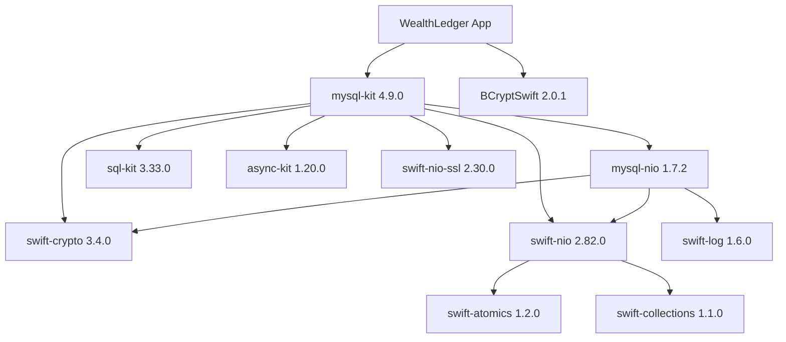
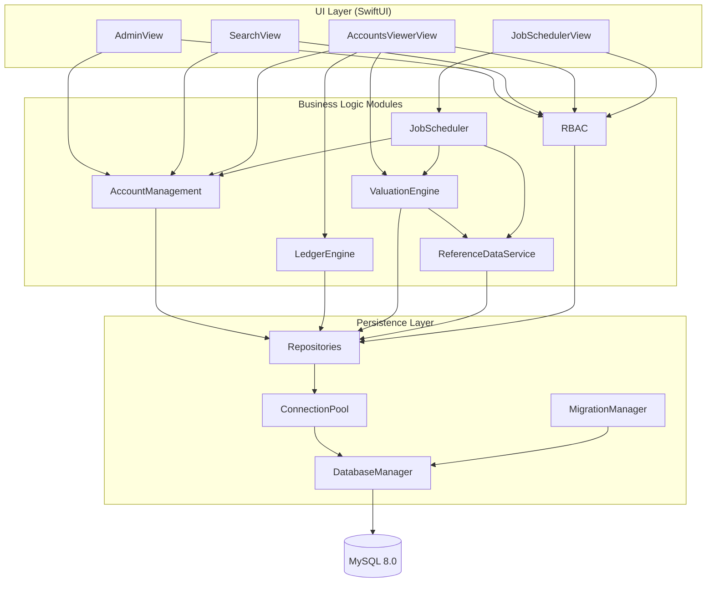

# Technical Specification

# 0. Agent Action Plan

## 0.1 Intent Clarification


### 0.1.1 Core Feature Objective

Based on the prompt, the Blitzy platform understands that the new feature requirement is to build a **standalone macOS desktop application**: a general ledger accounting engine purpose-built for institutional and wealth management accounts. This is a greenfield product — the repository contains only a `README.md` at commit `103791c` with no existing source code, dependency manifests, build tooling, or infrastructure definitions.

The complete feature requirements are:

- **General Ledger Accounting Engine** — Implement a double-entry credit/debit system with an immutable transaction log. Restatements are performed exclusively through offsetting entries that reference the original transaction via foreign key. No `UPDATE` or `DELETE` operations are permitted on the `transactions` table.

- **Institutional and Wealth Account Universe** — Support 100,000 accounts spanning two categories: Institutional accounts (open/closed mutual funds, ETFs, hedge funds) and Wealth accounts (separately managed accounts, unified managed accounts). Each account has a lifecycle status of Active, Inactive, Pending, or Suspended, with batch status updates for up to 1,000 accounts simultaneously.

- **Per-Account Closed-Book NAV Valuation** — Calculate account values as `Σ(quantity × EOD midpoint) + cash balance`, where EOD midpoint equals `(bid + ask) / 2` and cash position price is fixed at `1.00`. Each account stores its own IANA timezone string and valuation schedule; the `ValuationEngine` must use exclusively the account's stored timezone — never the system clock timezone.

- **Simulated Reference Data** — Generate and ingest synthetic NYSE equity data with a minimum of 500 securities, each containing ticker, name, SOD bid, SOD ask, EOD bid, and EOD ask fields. No real or externally sourced market data is required or permitted.

- **Role-Based Access Control (RBAC)** — Manage users, account groups, and per-user entitlements (READ/CREATE/MODIFY/DELETE) per account group. All data reads must verify user-group entitlement before returning records. Users without READ access receive an empty result set — not an error.

- **Job Scheduler** — Support manually triggered report generation (field selection, account selection, target date, CSV export) and CSV ingestion jobs. No automated cron scheduling.

- **Four SwiftUI Screens** — Admin (user creation, account group creation, entitlement assignment), Search (name/ID/type/group with up to 1,000 results), Accounts Viewer (scrollable list of selected accounts with values, positions, and value dates), Job Scheduler (create and manually trigger report and CSV ingestion jobs).

- **Performance Thresholds** — Full-universe search of 100,000 accounts in under 2 seconds; batch valuation of 1,000 accounts in under 30 seconds; Accounts Viewer initial render of 1,000 accounts in under 1 second; scrolling at 30fps or above; CSV ingestion of files up to 100MB without crash; MySQL RAM footprint under 4GB.

Implicit requirements detected:

- A MySQL database schema migration system to bootstrap the schema from a clean MySQL 8.0 instance
- A Swift CLI target to generate synthetic NYSE equity CSV data and seed the `reference_data` table
- Connection pooling and pagination infrastructure to meet the batch memory cap of 1,000 account records in memory simultaneously
- MySQL index strategy for search fields (account name partial match, account ID exact, account type, account group) to meet the 2-second search threshold across 100,000 accounts
- bcrypt password hashing implementation for local authentication
- Atomic transaction support for cached valuation denormalization (updating `accounts` table within the same DB transaction as valuation completion)

### 0.1.2 Special Instructions and Constraints

- **MySQLKit-only persistence**: SwiftData must not appear anywhere in the project. All database interactions must use MySQLKit via Swift Package Manager. Verification: `grep -r "import SwiftData"` returns zero results.

- **Offline runtime**: The application must function with the network adapter disabled. All data sources (MySQL, CSV files) must be local. Zero network dependencies at runtime.

- **Equities-only asset class**: The application must reject creation of any position or transaction for a non-equity instrument at the application layer.

- **Swift 6 strict concurrency**: The Xcode build must produce zero warnings with Swift 6 strict concurrency checking enabled. No `@unchecked Sendable`, no warning suppressions, no `// swiftlint:disable` suppressions that mask architectural issues.

- **Batch memory cap**: No UI operation may load more than 1,000 account records into memory simultaneously. Background jobs must paginate at 1,000 records or fewer per page.

- **Schema referential integrity**: All inter-table relationships enforced via MySQL foreign key constraints. Each primary entity occupies a distinct table with a typed primary key.

- **Cached valuation denormalization**: The `accounts` table must store a cached latest valuation amount and value date, updated atomically within the same DB transaction as each valuation run completion.

- **Validation Framework**: The deliverable is not accepted until all validation gates pass — including Gate 1 (end-to-end boundary verification against live MySQL), Gate 2 (zero-warning build), Gate 8 (integration sign-off checklist), Gate 9 (integration wiring verification for all six modules), and Gate 10 (test execution binding via single `xcodebuild test` command with dedicated `accounting_test` schema).

- **Single concurrent user**: The system is designed for 1 concurrent user at launch with 300 registered users.

- **Target hardware**: Apple Silicon M5, 16GB RAM, macOS Tahoe.

### 0.1.3 Technical Interpretation

These feature requirements translate to the following technical implementation strategy:

- To **implement the general ledger accounting engine**, we will create the `LedgerEngine` module with a `LedgerService` that enforces balanced debit/credit pairs summing to zero at the application layer before any DB write, and a `DoubleEntryValidator` that rejects unbalanced entries. The `transactions` table will be designed as append-only with no UPDATE or DELETE access. Corrections use offsetting entries referencing the original transaction ID.

- To **support 100,000 accounts with performant search**, we will create the `AccountManagement` module with MySQL composite indexes on `(account_name)`, `(account_id)`, `(account_type)`, and `(account_group_id)` columns. Partial name matching uses `LIKE 'prefix%'` with a B-tree index. Result sets are capped at 1,000 records with server-side pagination.

- To **implement per-account NAV valuation with timezone awareness**, we will create the `ValuationEngine` module that reads each account's stored IANA timezone string and applies it when computing value dates. The `NAVCalculator` computes `Σ(quantity × EOD midpoint) + cash balance` per account. Cached valuation amounts and value dates are written atomically back to the `accounts` table in the same transaction.

- To **deliver RBAC with entitlement enforcement**, we will create the `RBAC` module containing `AuthenticationService` (bcrypt-based local authentication), `EntitlementService` (per-user, per-account-group permission verification), and `PasswordHasher` (bcrypt wrapper). All query paths in `AccountManagement`, `LedgerEngine`, and the UI layer will invoke entitlement checks before returning data.

- To **implement reference data simulation**, we will create the `ReferenceDataService` module with a `SyntheticDataGenerator` Swift CLI target that produces a minimum of 500 NYSE equity records, and a `CSVParser` for ingestion by filename/type/directory.

- To **support job scheduling**, we will create the `JobScheduler` module with manually triggered report generation (CSV export with field selection, account selection, target date) and CSV ingestion jobs. No cron automation.

- To **build the four SwiftUI screens**, we will create the `UILayer` module with `AdminView`, `SearchView`, `AccountsViewerView`, and `JobSchedulerView` — each wired to the corresponding backend module and reachable from the `@main` entry point.

- To **meet all performance thresholds**, we will implement MySQL index optimization, connection pooling via MySQLKit/AsyncKit, lazy loading with pagination at 1,000 records per page, and SwiftUI `LazyVStack` for scrollable lists.

- To **establish the persistence layer**, we will create a `Persistence` module with `DatabaseManager` (MySQLKit configuration and connection management), `ConnectionPool` (AsyncKit-based pooling), repository classes for each entity, and a `MigrationManager` that executes SQL DDL scripts in order.


## 0.2 Repository Scope Discovery


### 0.2.1 Comprehensive File Analysis

The repository is in a **greenfield state** — containing only `README.md` (content: `# MikeRepo`) at commit `103791c`. There are no existing source files, dependency manifests, build configurations, test files, CI/CD pipelines, or documentation to modify. All files listed below represent new creations.

**Existing files (modification required):**

| File | Action | Purpose |
|------|--------|---------|
| `README.md` | MODIFY | Replace placeholder content with project documentation, build instructions, database setup guide, and architecture overview |

**New project configuration files to create:**

| File | Purpose |
|------|---------|
| `Package.swift` | Swift Package Manager manifest defining targets, dependencies (MySQLKit, BCryptSwift, swift-nio), and platform requirements |
| `WealthLedger.xcodeproj/` | Xcode project directory with build schemes for the main app, CLI seed tool, unit tests, and integration tests |
| `.gitignore` | Git ignore rules for Xcode artifacts, build products, `.DS_Store`, `DerivedData/` |
| `.swiftlint.yml` | SwiftLint configuration enforcing project coding standards |
| `.swift-format` | Swift format configuration for consistent code style |

**New source files — Main Application Target (`Sources/WealthLedgerApp/`):**

| File | Purpose |
|------|---------|
| `Sources/WealthLedgerApp/WealthLedgerApp.swift` | `@main` entry point; initializes database connection, sets up dependency container, launches root SwiftUI view |
| `Sources/WealthLedgerApp/AppState.swift` | Observable application state: current user session, navigation state, selected accounts |
| `Sources/WealthLedgerApp/DependencyContainer.swift` | Service locator registering all module services for dependency injection |

**New source files — AccountManagement Module (`Sources/AccountManagement/`):**

| File | Purpose |
|------|---------|
| `Sources/AccountManagement/Models/Account.swift` | Account data model: ID, name, fund type, ownership details, timezone (IANA), valuation schedule, cached valuation amount/date, status |
| `Sources/AccountManagement/Models/AccountGroup.swift` | Account group data model: group ID, name, metadata |
| `Sources/AccountManagement/Models/AccountStatus.swift` | Enum: Active, Inactive, Pending, Suspended with batch update support |
| `Sources/AccountManagement/Models/FundType.swift` | Enum covering Institutional (open/closed mutual funds, ETFs, hedge funds) and Wealth (SMAs, UMAs) categories |
| `Sources/AccountManagement/Services/AccountService.swift` | CRUD operations on accounts with entitlement checks, batch status update, search with pagination |
| `Sources/AccountManagement/Services/AccountGroupService.swift` | CRUD operations on account groups |

**New source files — LedgerEngine Module (`Sources/LedgerEngine/`):**

| File | Purpose |
|------|---------|
| `Sources/LedgerEngine/Models/Transaction.swift` | Immutable transaction model: ID, account FK, instrument, quantity, asset type, ownership percentage, debit/credit amounts, restatement reference FK |
| `Sources/LedgerEngine/Models/Position.swift` | Position model: ID, account FK, instrument FK, quantity, asset type |
| `Sources/LedgerEngine/Services/LedgerService.swift` | Transaction posting with double-entry validation, offsetting entry creation for restatements |
| `Sources/LedgerEngine/Services/DoubleEntryValidator.swift` | Validates that every transaction set sums to zero (debits = credits) before DB write |

**New source files — ValuationEngine Module (`Sources/ValuationEngine/`):**

| File | Purpose |
|------|---------|
| `Sources/ValuationEngine/Models/Valuation.swift` | Valuation result model: account ID, value amount, value date, timezone, positions valued |
| `Sources/ValuationEngine/Services/ValuationService.swift` | Orchestrates batch valuation: loads positions, retrieves EOD prices, invokes NAVCalculator, writes cached results atomically |
| `Sources/ValuationEngine/Services/NAVCalculator.swift` | Pure calculation: `Σ(quantity × (EOD_bid + EOD_ask) / 2) + cash_balance`; cash price fixed at 1.00 |

**New source files — ReferenceDataService Module (`Sources/ReferenceDataService/`):**

| File | Purpose |
|------|---------|
| `Sources/ReferenceDataService/Models/ReferenceData.swift` | Reference data model: ticker, name, SOD bid/ask, EOD bid/ask, market date |
| `Sources/ReferenceDataService/Services/ReferenceDataService.swift` | Query reference data, manage market data records |
| `Sources/ReferenceDataService/Services/CSVParser.swift` | Parse CSV files by filename/type/directory; validate column structure; paginated ingestion for files up to 100MB |
| `Sources/ReferenceDataService/Services/CSVExporter.swift` | Export report data to CSV format with configurable field selection |
| `Sources/ReferenceDataService/Generators/SyntheticDataGenerator.swift` | Generate 500+ synthetic NYSE equity records with realistic ticker, name, and six price fields |

**New source files — JobScheduler Module (`Sources/JobScheduler/`):**

| File | Purpose |
|------|---------|
| `Sources/JobScheduler/Models/Job.swift` | Job model: ID, type (report/ingestion), status, parameters (field selection, account selection, target date), timestamps |
| `Sources/JobScheduler/Services/JobSchedulerService.swift` | Job lifecycle management: create, execute, track status; manual trigger only |
| `Sources/JobScheduler/Services/ReportGenerator.swift` | Generate CSV reports with field selection, account filtering, date targeting |

**New source files — RBAC Module (`Sources/RBAC/`):**

| File | Purpose |
|------|---------|
| `Sources/RBAC/Models/User.swift` | User model: ID, username, bcrypt-hashed password |
| `Sources/RBAC/Models/Entitlement.swift` | Entitlement model: user ID FK, account group ID FK, permission flags (READ/CREATE/MODIFY/DELETE) |
| `Sources/RBAC/Services/AuthenticationService.swift` | Local authentication: username/password verification against bcrypt hashes; session management |
| `Sources/RBAC/Services/EntitlementService.swift` | Entitlement queries: check user permissions per account group, filter accessible account groups per user |
| `Sources/RBAC/Services/PasswordHasher.swift` | bcrypt hashing wrapper using BCryptSwift library |

**New source files — UILayer Module (`Sources/UILayer/`):**

| File | Purpose |
|------|---------|
| `Sources/UILayer/AdminScreen/AdminView.swift` | Admin screen: user creation, account group creation, entitlement assignment (RCMD per user-group pair) |
| `Sources/UILayer/SearchScreen/SearchView.swift` | Search screen: search by name/ID/type/group, select up to 1,000 accounts for viewing |
| `Sources/UILayer/AccountsViewer/AccountsViewerView.swift` | Accounts Viewer: scrollable `LazyVStack` list of selected accounts with name, ID, value, positions, value date |
| `Sources/UILayer/JobSchedulerScreen/JobSchedulerView.swift` | Job Scheduler screen: create report and CSV ingestion jobs, manual trigger |
| `Sources/UILayer/Navigation/MainNavigationView.swift` | Root navigation: tab or sidebar layout routing to all four screens |
| `Sources/UILayer/Components/AccountRowView.swift` | Reusable row component for account display in lists |
| `Sources/UILayer/Components/PositionDetailView.swift` | Position detail view showing instrument and quantity per account |
| `Sources/UILayer/Components/EntitlementFormView.swift` | Reusable form for assigning READ/CREATE/MODIFY/DELETE permissions |

**New source files — Persistence Module (`Sources/Persistence/`):**

| File | Purpose |
|------|---------|
| `Sources/Persistence/DatabaseManager.swift` | MySQLKit configuration, connection lifecycle, schema initialization |
| `Sources/Persistence/ConnectionPool.swift` | AsyncKit-based connection pool management |
| `Sources/Persistence/MigrationManager.swift` | Execute ordered SQL migration scripts against the database |
| `Sources/Persistence/Repositories/AccountRepository.swift` | Account table CRUD, search queries with indexes, batch operations |
| `Sources/Persistence/Repositories/TransactionRepository.swift` | Append-only transaction inserts, offsetting entry creation |
| `Sources/Persistence/Repositories/PositionRepository.swift` | Position CRUD with FK enforcement |
| `Sources/Persistence/Repositories/UserRepository.swift` | User CRUD with password hash storage |
| `Sources/Persistence/Repositories/EntitlementRepository.swift` | Entitlement CRUD, permission flag queries |
| `Sources/Persistence/Repositories/AccountGroupRepository.swift` | Account group CRUD |
| `Sources/Persistence/Repositories/ReferenceDataRepository.swift` | Reference data bulk insert, EOD price queries |

**New source files — Shared Module (`Sources/Shared/`):**

| File | Purpose |
|------|---------|
| `Sources/Shared/Extensions/Date+Timezone.swift` | Date utilities: convert between IANA timezones, compute value dates per account timezone |
| `Sources/Shared/Extensions/Decimal+Currency.swift` | Decimal precision utilities for financial calculations |
| `Sources/Shared/Protocols/RepositoryProtocol.swift` | Generic repository protocol for consistent data access patterns |
| `Sources/Shared/Constants.swift` | Application-wide constants: batch size (1,000), max search results, default pagination |
| `Sources/Shared/Errors/AppError.swift` | Typed error hierarchy for domain-specific error handling |

**New source files — CLI Seed Tool (`Sources/SeedTool/`):**

| File | Purpose |
|------|---------|
| `Sources/SeedTool/SeedToolMain.swift` | `@main` CLI entry point: generate synthetic NYSE CSV, seed `reference_data` with 500+ rows, optionally seed sample accounts |

**New SQL Migration Files (`Resources/Migrations/`):**

| File | Purpose |
|------|---------|
| `Resources/Migrations/001_create_users.sql` | Users table DDL with bcrypt password column |
| `Resources/Migrations/002_create_account_groups.sql` | Account groups table DDL |
| `Resources/Migrations/003_create_entitlements.sql` | Entitlements table DDL with FKs to users and account_groups |
| `Resources/Migrations/004_create_accounts.sql` | Accounts table DDL with fund type, timezone, cached valuation, status, FK to account_groups |
| `Resources/Migrations/005_create_reference_data.sql` | Reference data table DDL with ticker/price columns and market date |
| `Resources/Migrations/006_create_positions.sql` | Positions table DDL with FKs to accounts and reference_data |
| `Resources/Migrations/007_create_transactions.sql` | Transactions table DDL with immutability constraints, restatement FK, FKs to accounts |
| `Resources/Migrations/008_create_indexes.sql` | Composite indexes for search optimization and performance thresholds |

**New test files:**

| File | Purpose |
|------|---------|
| `Tests/UnitTests/LedgerEngineTests/DoubleEntryValidatorTests.swift` | Validate balanced/unbalanced entry rejection logic |
| `Tests/UnitTests/LedgerEngineTests/LedgerServiceTests.swift` | Validate transaction creation and restatement logic |
| `Tests/UnitTests/ValuationEngineTests/NAVCalculatorTests.swift` | Validate NAV formula: `Σ(qty × midpoint) + cash` |
| `Tests/UnitTests/ValuationEngineTests/ValuationServiceTests.swift` | Validate timezone-aware valuation date computation |
| `Tests/UnitTests/RBACTests/AuthenticationTests.swift` | Validate bcrypt hash/verify cycle |
| `Tests/UnitTests/RBACTests/EntitlementTests.swift` | Validate permission flag checks |
| `Tests/UnitTests/AccountManagementTests/AccountServiceTests.swift` | Validate search, status updates, CRUD |
| `Tests/UnitTests/ReferenceDataTests/CSVParserTests.swift` | Validate CSV parsing, column validation |
| `Tests/IntegrationTests/TestDatabaseSetup.swift` | Create `accounting_test` schema, run migrations, teardown after tests |
| `Tests/IntegrationTests/EndToEndWorkflowTests.swift` | Gate 1: create account → post transaction → run valuation → verify in viewer |
| `Tests/IntegrationTests/AccountManagementIntegrationTests.swift` | Account CRUD against live MySQL |
| `Tests/IntegrationTests/LedgerIntegrationTests.swift` | Transaction posting against live MySQL |
| `Tests/IntegrationTests/ValuationIntegrationTests.swift` | Valuation run against live MySQL with timezone verification |
| `Tests/IntegrationTests/RBACIntegrationTests.swift` | Entitlement enforcement against live MySQL |
| `Tests/IntegrationTests/ReferenceDataIntegrationTests.swift` | CSV ingestion and reference data seeding against live MySQL |
| `Tests/IntegrationTests/JobSchedulerIntegrationTests.swift` | Job creation and execution against live MySQL |

**New documentation and scripts:**

| File | Purpose |
|------|---------|
| `Scripts/setup_database.sh` | Shell script to initialize MySQL 8.0, create schema, run migrations |
| `Docs/architecture.md` | Module dependency diagram, data flow, integration points |
| `Docs/database_schema.md` | Complete ERD, table definitions, FK relationships, index strategy |
| `Docs/user_guide.md` | End-user documentation for all four screens |

### 0.2.2 Web Search Research Conducted

The following research was conducted to validate technology choices and versions:

- **Swift version landscape** — Swift 6.3 was released March 24, 2026, and is the latest stable release. It is included in Xcode 26.4. Swift 6.2 was released September 15, 2025. Swift 6.1 was released March 31, 2025. The user specifies "Swift 6.x" which maps to Swift 6.3 as the latest release with Xcode 26.4 on macOS Tahoe.

- **macOS Tahoe** — macOS Tahoe (version 26) was released September 15, 2025, with the latest update being 26.4.1 (April 9, 2026). It supports Apple Silicon M5 chips. The M5 MacBook Pro was announced October 2025 and the M5 MacBook Air in early 2026.

- **Xcode version** — Xcode 26.4 is the current release, including Swift 6.3 and macOS 26.4 SDK. It runs on macOS Tahoe 26.2 or later.

- **MySQLKit** — The latest release is MySQLKit 4.9.0 from the Vapor project. It is a pure Swift MySQL client using MySQLNIO for asynchronous communication and AsyncKit for connection pooling. Its `Package.swift` requires swift-tools-version 5.10 with dependencies on async-kit 1.20.0, mysql-nio 1.7.2, sql-kit 3.33.0, swift-crypto 2.0.0..<4.0.0, swift-nio 2.82.0, and swift-nio-ssl 2.30.0.

- **BCrypt for Swift** — BCryptSwift v2.0.1 is a pure Swift bcrypt implementation compatible with Swift 6.2/6.1/6.0/5.10, available via SPM. It has no external dependencies, making it suitable for the offline runtime requirement.

- **MySQL 8.0 on macOS** — Installed via Homebrew with `brew install mysql@8.0`. MySQL 8.0 is the specified version for local development on macOS Tahoe.

### 0.2.3 New File Requirements

Since this is a greenfield project, all files are new creations. The complete project will contain approximately:

- **5 project configuration files** (Package.swift, .xcodeproj, .gitignore, .swiftlint.yml, .swift-format)
- **3 main app target files** (entry point, app state, dependency container)
- **6 AccountManagement files** (4 models, 2 services)
- **4 LedgerEngine files** (2 models, 2 services)
- **3 ValuationEngine files** (1 model, 2 services)
- **5 ReferenceDataService files** (1 model, 3 services, 1 generator)
- **3 JobScheduler files** (1 model, 2 services)
- **5 RBAC files** (2 models, 3 services)
- **8 UILayer files** (4 screens, 1 navigation, 3 components)
- **10 Persistence files** (3 infrastructure, 7 repositories)
- **5 Shared files** (2 extensions, 1 protocol, 1 constants, 1 errors)
- **1 SeedTool CLI file**
- **8 SQL migration files**
- **17 test files** (8 unit, 8 integration, 1 test setup)
- **4 documentation/script files**

**Total: approximately 87 files** composing the complete application.


## 0.3 Dependency Inventory


### 0.3.1 Private and Public Packages

All dependencies are public, open-source packages distributed via Swift Package Manager. No private packages are required. The user specifies MySQLKit as the sole database access layer and bcrypt for password hashing. All versions below are verified against published releases.

| Registry | Package | Version | License | Purpose |
|----------|---------|---------|---------|---------|
| SPM (GitHub) | `vapor/mysql-kit` | 4.9.0 | MIT | SQLKit driver for MySQL; serializes MySQL-dialect SQL queries; wraps MySQLNIO for async communication |
| SPM (GitHub) | `vapor/mysql-nio` | 1.7.2 | MIT | Low-level async MySQL protocol implementation using SwiftNIO |
| SPM (GitHub) | `vapor/sql-kit` | 3.33.0 | MIT | SQL query builder abstraction used by MySQLKit |
| SPM (GitHub) | `vapor/async-kit` | 1.20.0 | MIT | Connection pooling (EventLoopGroupConnectionPool) for MySQLKit |
| SPM (GitHub) | `apple/swift-crypto` | 3.4.0 | Apache-2.0 | Cryptographic primitives required by MySQLKit authentication |
| SPM (GitHub) | `apple/swift-nio` | 2.82.0 | Apache-2.0 | Non-blocking event-driven networking foundation for MySQLNIO |
| SPM (GitHub) | `apple/swift-nio-ssl` | 2.30.0 | Apache-2.0 | TLS support for MySQL connections |
| SPM (GitHub) | `apple/swift-log` | 1.6.0 | Apache-2.0 | Structured logging API used by MySQLKit/SwiftNIO |
| SPM (GitHub) | `apple/swift-atomics` | 1.2.0 | Apache-2.0 | Low-level atomic operations required by SwiftNIO |
| SPM (GitHub) | `apple/swift-collections` | 1.1.0 | Apache-2.0 | Ordered collections used by SwiftNIO internals |
| SPM (GitHub) | `wisetail/BCryptSwift` | 2.0.1 | MIT | Pure Swift bcrypt implementation for password hashing; no external dependencies |
| Homebrew | `mysql@8.0` | 8.0.x | GPL-2.0 | Local MySQL 8.0 database server installed via `brew install mysql@8.0` |
| Built-in | SwiftUI | macOS 26 SDK | Apple | Native macOS UI framework — ships with Xcode 26.4, no SPM dependency required |
| Built-in | Foundation | macOS 26 SDK | Apple | Core Swift framework for dates, timezones, file I/O, JSON — no SPM dependency required |
| Built-in | Swift Testing | Swift 6.3 | Apache-2.0 | Test framework included with Swift 6.3 toolchain |

**Dependency Graph (direct SPM declarations in `Package.swift`):**



**Package.swift Direct Dependencies (only these two are declared; transitives are resolved automatically):**

```swift
.package(url: "https://github.com/vapor/mysql-kit.git", from: "4.9.0"),
.package(url: "https://github.com/wisetail/BCryptSwift.git", from: "2.0.1"),
```

### 0.3.2 Dependency Updates

Since this is a greenfield project with no existing dependency manifests, there are no dependency updates to perform. All dependencies will be declared fresh in the new `Package.swift`.

**Import Patterns to Establish:**

All source files will use explicit, module-scoped imports. The following import patterns will be established across the codebase:

- **Persistence layer files** (`Sources/Persistence/**/*.swift`):
  - `import MySQLKit` — database connection, query execution
  - `import MySQLNIO` — low-level MySQL types (MySQLData, MySQLRow)
  - `import SQLKit` — SQL query builder (SQLDatabase, SQLRaw)
  - `import AsyncKit` — connection pool management
  - `import NIOCore` — EventLoopFuture, EventLoopGroup
  - `import Logging` — structured logging

- **RBAC authentication files** (`Sources/RBAC/Services/PasswordHasher.swift`):
  - `import BCryptSwift` — bcrypt hash generation and verification

- **UI layer files** (`Sources/UILayer/**/*.swift`):
  - `import SwiftUI` — all view definitions
  - No direct MySQLKit imports — views interact with services only

- **Model files** (`Sources/*/Models/*.swift`):
  - `import Foundation` — Date, Decimal, UUID, TimeZone
  - No external dependency imports in model files

- **Shared utilities** (`Sources/Shared/**/*.swift`):
  - `import Foundation` — Date, TimeZone, Decimal extensions

**External Reference Configuration:**

| File | Configuration Purpose |
|------|----------------------|
| `Package.swift` | SPM dependency declarations, target definitions, platform requirements (`.macOS(.v15)` minimum) |
| `Scripts/setup_database.sh` | MySQL 8.0 installation via Homebrew, schema creation, user setup |
| `Resources/Migrations/*.sql` | DDL scripts for MySQL 8.0 schema |
| `README.md` | Build instructions, dependency installation guide, database setup |
| `Docs/architecture.md` | Dependency rationale and version selection documentation |


## 0.4 Integration Analysis


### 0.4.1 Existing Code Touchpoints

Since this is a greenfield project, there are no existing code touchpoints to modify. All integration points are new constructions. The analysis below documents how the six application modules interconnect with each other, the persistence layer, and the UI layer.

**Module Integration Map:**



**Cross-Module Integration Points:**

- **`@main` Entry Point → All Modules (WealthLedgerApp.swift)**
  - The `@main` entry point initializes `DatabaseManager` with MySQLKit configuration
  - `DependencyContainer` registers all services: `AccountService`, `LedgerService`, `ValuationService`, `ReferenceDataService`, `JobSchedulerService`, `AuthenticationService`, `EntitlementService`
  - `MainNavigationView` provides navigation to all four screens
  - Gate 9 requires every module to be reachable from `@main`

- **AdminView → RBAC + AccountManagement**
  - `AdminView` calls `AuthenticationService.createUser()` for user creation with bcrypt-hashed passwords
  - `AdminView` calls `AccountGroupService.createGroup()` for account group creation
  - `AdminView` calls `EntitlementService.assignEntitlement()` to set READ/CREATE/MODIFY/DELETE per user-group pair
  - All operations require the current user to have admin-level access

- **SearchView → AccountManagement + RBAC**
  - `SearchView` calls `AccountService.search()` with filters (name partial match, ID exact, type, group)
  - `AccountService.search()` internally calls `EntitlementService.filterAccessibleGroups()` to restrict results to entitled account groups
  - Results capped at 1,000 accounts; users without READ access to a group receive zero records for that group

- **AccountsViewerView → AccountManagement + ValuationEngine + LedgerEngine + RBAC**
  - `AccountsViewerView` receives selected accounts from `SearchView`
  - Displays account name, ID, cached valuation amount, positions (instrument + quantity), and value date
  - `ValuationEngine` provides per-account value and value date computation
  - `LedgerEngine` provides transaction history and position data
  - Entitlement checks applied before any data is displayed

- **JobSchedulerView → JobScheduler + ReferenceDataService + ValuationEngine + AccountManagement**
  - `JobSchedulerView` calls `JobSchedulerService.createJob()` for report and ingestion jobs
  - Report jobs invoke `ReportGenerator` which queries `AccountService` and `ValuationService` for data, then exports via `CSVExporter`
  - Ingestion jobs invoke `CSVParser` to parse CSV files and `ReferenceDataService` to insert records
  - All jobs are manually triggered — no cron automation

- **ValuationEngine → ReferenceDataService + AccountManagement + Persistence**
  - `ValuationService.runValuation()` loads account positions via `PositionRepository`
  - Retrieves EOD prices from `ReferenceDataRepository` for each instrument
  - `NAVCalculator` computes `Σ(quantity × EOD midpoint) + cash_balance`
  - Writes cached valuation amount and value date back to `AccountRepository` atomically in the same DB transaction
  - Uses account's stored IANA timezone (not system clock) for value date computation

- **LedgerEngine → AccountManagement + Persistence**
  - `LedgerService.postTransaction()` validates balanced debit/credit pairs via `DoubleEntryValidator`
  - Validates asset class is equities only before any DB write
  - Creates position records via `PositionRepository` when new holdings are established
  - Restatements create offsetting entries referencing the original transaction ID via FK

- **RBAC → Persistence (Cross-cutting concern)**
  - `EntitlementService` is called by `AccountService`, `LedgerService`, and all UI screens
  - Queries `EntitlementRepository` to verify READ/CREATE/MODIFY/DELETE permissions per user-group pair
  - Returns empty result sets (not errors) for unauthorized access attempts

**Database/Schema Integration:**

- **Migration execution**: `MigrationManager` runs SQL files in `Resources/Migrations/` in numerical order against the MySQL instance
- **Schema creation for tests**: Integration tests create a dedicated `accounting_test` schema and drop it after completion (Gate 10)
- **FK constraint enforcement**: All inter-table relationships enforced via MySQL foreign key constraints (Rule 15)
- **Atomic valuation cache**: `ValuationService` updates `accounts.cached_valuation_amount` and `accounts.cached_value_date` within the same MySQL transaction as the valuation write (Rule 16)

**Dependency Injection Wiring (`DependencyContainer.swift`):**

| Service | Dependencies Injected |
|---------|----------------------|
| `AccountService` | `AccountRepository`, `EntitlementService` |
| `AccountGroupService` | `AccountGroupRepository` |
| `LedgerService` | `TransactionRepository`, `PositionRepository`, `DoubleEntryValidator`, `EntitlementService` |
| `ValuationService` | `AccountRepository`, `PositionRepository`, `ReferenceDataRepository`, `NAVCalculator` |
| `ReferenceDataService` | `ReferenceDataRepository`, `CSVParser` |
| `JobSchedulerService` | `ReportGenerator`, `CSVParser`, `ReferenceDataService`, `AccountService`, `ValuationService` |
| `AuthenticationService` | `UserRepository`, `PasswordHasher` |
| `EntitlementService` | `EntitlementRepository` |
| All Repositories | `ConnectionPool` (via `DatabaseManager`) |


## 0.5 Technical Implementation


### 0.5.1 File-by-File Execution Plan

Every file listed below must be created. Files are organized into execution groups reflecting dependency order — each group builds on the foundation established by preceding groups.

**Group 1 — Project Foundation and Build Configuration:**

- CREATE: `Package.swift` — Define SPM package with targets: `WealthLedgerApp` (executable), `SeedTool` (executable), `AccountManagement`, `LedgerEngine`, `ValuationEngine`, `ReferenceDataService`, `JobScheduler`, `RBAC`, `UILayer`, `Persistence`, `Shared` (libraries), plus `UnitTests` and `IntegrationTests` (test targets). Declare dependencies on `mysql-kit` 4.9.0 and `BCryptSwift` 2.0.1. Set platform to `.macOS(.v15)`.
- CREATE: `.gitignore` — Ignore `.build/`, `DerivedData/`, `.DS_Store`, `*.xcuserstate`, `Package.resolved` (optional)
- CREATE: `.swiftlint.yml` — Enforce Swift coding conventions consistent with Swift 6 strict concurrency
- MODIFY: `README.md` — Replace `# MikeRepo` with comprehensive project documentation: architecture overview, build prerequisites (Xcode 26.4, MySQL 8.0 via Homebrew), setup instructions, module descriptions, test execution command

**Group 2 — Database Schema and Migration Infrastructure:**

- CREATE: `Resources/Migrations/001_create_users.sql` — `CREATE TABLE users (id BIGINT UNSIGNED AUTO_INCREMENT PRIMARY KEY, username VARCHAR(255) UNIQUE NOT NULL, password_hash VARCHAR(255) NOT NULL, created_at TIMESTAMP DEFAULT CURRENT_TIMESTAMP);`
- CREATE: `Resources/Migrations/002_create_account_groups.sql` — `CREATE TABLE account_groups (id BIGINT UNSIGNED AUTO_INCREMENT PRIMARY KEY, group_name VARCHAR(255) NOT NULL, metadata JSON, created_at TIMESTAMP DEFAULT CURRENT_TIMESTAMP);`
- CREATE: `Resources/Migrations/003_create_entitlements.sql` — Entitlements table with FKs to `users` and `account_groups`, permission flags (can_read, can_create, can_modify, can_delete) as BOOLEAN columns
- CREATE: `Resources/Migrations/004_create_accounts.sql` — Accounts table with fund_type, ownership_details, valuation_timezone (VARCHAR for IANA string), valuation_schedule, cached_valuation_amount (DECIMAL(20,6)), cached_value_date (DATE), account_status ENUM, FK to account_groups
- CREATE: `Resources/Migrations/005_create_reference_data.sql` — Reference data table with ticker, name, sod_bid, sod_ask, eod_bid, eod_ask (all DECIMAL(20,6) NOT NULL), market_date
- CREATE: `Resources/Migrations/006_create_positions.sql` — Positions table with FKs to accounts and reference_data, quantity DECIMAL, asset_type ENUM restricted to equities
- CREATE: `Resources/Migrations/007_create_transactions.sql` — Transactions table: immutable (no UPDATE/DELETE at app layer), instrument FK, quantity, asset_type, ownership_pct, debit_amount, credit_amount, restatement_ref_id FK to self, FK to accounts
- CREATE: `Resources/Migrations/008_create_indexes.sql` — Composite indexes: `idx_accounts_name` (account_name), `idx_accounts_type` (account_type), `idx_accounts_group` (account_group_id), `idx_positions_account` (account_id), `idx_transactions_account` (account_id), `idx_reference_data_ticker` (ticker), `idx_reference_data_date` (market_date)
- CREATE: `Scripts/setup_database.sh` — Script to: install MySQL 8.0 via Homebrew, start MySQL service, create database `wealth_ledger`, create application user, run all migration scripts in order

**Group 3 — Shared Module and Persistence Layer:**

- CREATE: `Sources/Shared/Constants.swift` — Define `BATCH_SIZE = 1000`, `MAX_SEARCH_RESULTS = 1000`, `CASH_PRICE = Decimal(1.0)`, `DEFAULT_PAGINATION = 1000`
- CREATE: `Sources/Shared/Errors/AppError.swift` — Define error types: `unbalancedEntry`, `unauthorizedAccess`, `invalidAssetClass`, `accountNotFound`, `duplicateUser`, `invalidTimezone`, `migrationFailed`
- CREATE: `Sources/Shared/Extensions/Date+Timezone.swift` — Implement `valueDateForTimezone(_ iana: String) -> Date` that computes the value date using the account's stored timezone exclusively
- CREATE: `Sources/Shared/Extensions/Decimal+Currency.swift` — Implement `midpoint(bid: Decimal, ask: Decimal) -> Decimal` returning `(bid + ask) / 2`
- CREATE: `Sources/Shared/Protocols/RepositoryProtocol.swift` — Define generic `Repository` protocol with `findById`, `findAll`, `create`, `delete` methods
- CREATE: `Sources/Persistence/DatabaseManager.swift` — Initialize MySQLKit with `MySQLConfiguration(hostname: "localhost", port: 3306, username:, password:, database: "wealth_ledger")`; manage EventLoopGroup lifecycle
- CREATE: `Sources/Persistence/ConnectionPool.swift` — Configure `EventLoopGroupConnectionPool` with AsyncKit; expose `withConnection` method for transactional operations
- CREATE: `Sources/Persistence/MigrationManager.swift` — Read SQL files from `Resources/Migrations/` directory, execute in numerical order, track applied migrations
- CREATE: `Sources/Persistence/Repositories/AccountRepository.swift` — Implement search with partial name match (`LIKE ?`), exact ID, type filter, group filter; pagination; batch status update; cached valuation atomic update
- CREATE: `Sources/Persistence/Repositories/TransactionRepository.swift` — Append-only inserts; offsetting entry creation with restatement FK; no UPDATE/DELETE methods
- CREATE: `Sources/Persistence/Repositories/PositionRepository.swift` — CRUD with FK enforcement to accounts and reference_data; asset type validation (equities only)
- CREATE: `Sources/Persistence/Repositories/UserRepository.swift` — User creation with password hash; lookup by username
- CREATE: `Sources/Persistence/Repositories/EntitlementRepository.swift` — Permission queries by user_id + account_group_id; CRUD for entitlement assignments
- CREATE: `Sources/Persistence/Repositories/AccountGroupRepository.swift` — Account group CRUD
- CREATE: `Sources/Persistence/Repositories/ReferenceDataRepository.swift` — Bulk insert for CSV ingestion; EOD price lookups by ticker and market_date

**Group 4 — Core Business Logic Modules:**

- CREATE: `Sources/RBAC/Models/User.swift` — User struct with id, username, passwordHash; Sendable conformance
- CREATE: `Sources/RBAC/Models/Entitlement.swift` — Entitlement struct with userId, accountGroupId, canRead/canCreate/canModify/canDelete; Sendable conformance
- CREATE: `Sources/RBAC/Services/PasswordHasher.swift` — Wrapper around BCryptSwift: `hash(_ password: String) -> String` and `verify(_ password: String, against hash: String) -> Bool`
- CREATE: `Sources/RBAC/Services/AuthenticationService.swift` — `login(username:password:)` validates credentials against bcrypt hash; `createUser(username:password:)` stores new user with hashed password
- CREATE: `Sources/RBAC/Services/EntitlementService.swift` — `checkPermission(userId:accountGroupId:permission:) -> Bool`; `filterAccessibleGroups(userId:) -> [AccountGroup]`; returns empty results for unauthorized access
- CREATE: `Sources/AccountManagement/Models/Account.swift` — Account struct with all fields including IANA timezone, cached valuation, status; Sendable conformance
- CREATE: `Sources/AccountManagement/Models/AccountGroup.swift` — AccountGroup struct; Sendable conformance
- CREATE: `Sources/AccountManagement/Models/AccountStatus.swift` — Enum: `.active`, `.inactive`, `.pending`, `.suspended`
- CREATE: `Sources/AccountManagement/Models/FundType.swift` — Enum with cases for institutional (openMutualFund, closedMutualFund, etf, hedgeFund) and wealth (sma, uma) categories
- CREATE: `Sources/AccountManagement/Services/AccountService.swift` — Search (name/ID/type/group), CRUD, batch status update (up to 1,000); all operations enforce entitlement checks
- CREATE: `Sources/AccountManagement/Services/AccountGroupService.swift` — Account group CRUD operations
- CREATE: `Sources/LedgerEngine/Models/Transaction.swift` — Immutable transaction struct; Sendable conformance
- CREATE: `Sources/LedgerEngine/Models/Position.swift` — Position struct with account FK, instrument FK, quantity, asset type
- CREATE: `Sources/LedgerEngine/Services/DoubleEntryValidator.swift` — `validate(debits: [Decimal], credits: [Decimal]) throws` — rejects if sum != 0
- CREATE: `Sources/LedgerEngine/Services/LedgerService.swift` — `postTransaction()` with double-entry validation and asset class guard; `createRestatement()` with offsetting entry referencing original
- CREATE: `Sources/ValuationEngine/Models/Valuation.swift` — Valuation result struct: accountId, valueAmount, valueDate, timezone, positions
- CREATE: `Sources/ValuationEngine/Services/NAVCalculator.swift` — Pure calculation: iterates positions, computes midpoint per instrument, sums `qty × midpoint`, adds cash balance
- CREATE: `Sources/ValuationEngine/Services/ValuationService.swift` — Orchestrates batch valuation with pagination (1,000 per batch); uses account timezone for value date; writes cached result atomically
- CREATE: `Sources/ReferenceDataService/Models/ReferenceData.swift` — ReferenceData struct with all six price fields
- CREATE: `Sources/ReferenceDataService/Services/ReferenceDataService.swift` — Query by ticker, market date; manage reference data lifecycle
- CREATE: `Sources/ReferenceDataService/Services/CSVParser.swift` — Parse CSV by filename/type/directory; validate columns; paginated ingestion for large files (up to 100MB)
- CREATE: `Sources/ReferenceDataService/Services/CSVExporter.swift` — Export to CSV with configurable field selection
- CREATE: `Sources/ReferenceDataService/Generators/SyntheticDataGenerator.swift` — Generate 500+ synthetic NYSE equities with realistic tickers (3-5 uppercase letters), names, and six non-null non-zero price fields
- CREATE: `Sources/JobScheduler/Models/Job.swift` — Job struct: type (report/ingestion), status (pending/running/completed/failed), parameters
- CREATE: `Sources/JobScheduler/Services/JobSchedulerService.swift` — Job CRUD, manual trigger execution, status tracking
- CREATE: `Sources/JobScheduler/Services/ReportGenerator.swift` — Build CSV reports with field selection, account filtering, target date

**Group 5 — UI Layer:**

- CREATE: `Sources/UILayer/Navigation/MainNavigationView.swift` — Root navigation with sidebar or tab layout routing to Admin, Search, Accounts Viewer, Job Scheduler; gate behind authentication
- CREATE: `Sources/UILayer/AdminScreen/AdminView.swift` — Three sections: user creation form, account group creation form, entitlement assignment grid (user × group × RCMD permissions)
- CREATE: `Sources/UILayer/SearchScreen/SearchView.swift` — Search fields (name, ID, type dropdown, group dropdown), results list capped at 1,000, multi-select for accounts, "View Selected" button navigating to Accounts Viewer
- CREATE: `Sources/UILayer/AccountsViewer/AccountsViewerView.swift` — `LazyVStack` scrollable list: account name, ID, value, positions (instrument + quantity), value date; 30fps scrolling target; initial render under 1 second for 1,000 accounts
- CREATE: `Sources/UILayer/JobSchedulerScreen/JobSchedulerView.swift` — Job creation form (report type, field selection, account selection, target date, CSV file picker for ingestion), job list with status, manual trigger buttons
- CREATE: `Sources/UILayer/Components/AccountRowView.swift` — Reusable row: account name, ID, formatted value amount, status badge
- CREATE: `Sources/UILayer/Components/PositionDetailView.swift` — Expandable position list per account: instrument ticker, quantity, current midpoint value
- CREATE: `Sources/UILayer/Components/EntitlementFormView.swift` — Permission toggle form: READ/CREATE/MODIFY/DELETE checkboxes per user-group pair

**Group 6 — Application Entry Point and Dependency Wiring:**

- CREATE: `Sources/WealthLedgerApp/WealthLedgerApp.swift` — `@main` struct conforming to `App`; initializes `DatabaseManager`, `DependencyContainer`; presents `MainNavigationView` as the root scene
- CREATE: `Sources/WealthLedgerApp/AppState.swift` — `@Observable` class: currentUser, selectedAccounts, navigationPath; drives reactive UI updates
- CREATE: `Sources/WealthLedgerApp/DependencyContainer.swift` — Service locator pattern; registers all services from all modules; injectable into SwiftUI environment

**Group 7 — CLI Seed Tool:**

- CREATE: `Sources/SeedTool/SeedToolMain.swift` — `@main` CLI entry point: connects to MySQL, generates synthetic NYSE CSV via `SyntheticDataGenerator`, inserts 500+ rows into `reference_data`, optionally seeds sample accounts and users

**Group 8 — Tests:**

- CREATE: `Tests/UnitTests/LedgerEngineTests/DoubleEntryValidatorTests.swift` — Test balanced/unbalanced entry rejection
- CREATE: `Tests/UnitTests/LedgerEngineTests/LedgerServiceTests.swift` — Test transaction posting, restatement creation
- CREATE: `Tests/UnitTests/ValuationEngineTests/NAVCalculatorTests.swift` — Test NAV formula with known inputs against hand-calculated expected values
- CREATE: `Tests/UnitTests/ValuationEngineTests/ValuationServiceTests.swift` — Test timezone-aware value date computation (US/Eastern vs Europe/London)
- CREATE: `Tests/UnitTests/RBACTests/AuthenticationTests.swift` — Test bcrypt hash/verify round-trip
- CREATE: `Tests/UnitTests/RBACTests/EntitlementTests.swift` — Test permission flag checks, empty result for unauthorized
- CREATE: `Tests/UnitTests/AccountManagementTests/AccountServiceTests.swift` — Test search filtering, batch status update logic, fund type validation
- CREATE: `Tests/UnitTests/ReferenceDataTests/CSVParserTests.swift` — Test CSV column validation, row parsing
- CREATE: `Tests/IntegrationTests/TestDatabaseSetup.swift` — Create `accounting_test` schema, run all migrations, teardown; shared by all integration tests
- CREATE: `Tests/IntegrationTests/EndToEndWorkflowTests.swift` — Gate 1: create account → post buy transaction → run valuation → verify account value in viewer
- CREATE: `Tests/IntegrationTests/AccountManagementIntegrationTests.swift` — Account CRUD, search, batch update against live MySQL
- CREATE: `Tests/IntegrationTests/LedgerIntegrationTests.swift` — Transaction posting, restatement, double-entry enforcement against live MySQL
- CREATE: `Tests/IntegrationTests/ValuationIntegrationTests.swift` — Valuation with timezone verification (US/Eastern vs Europe/London distinct value dates)
- CREATE: `Tests/IntegrationTests/RBACIntegrationTests.swift` — Entitlement enforcement: user without READ access receives zero records
- CREATE: `Tests/IntegrationTests/ReferenceDataIntegrationTests.swift` — CSV ingestion, 500+ row seed verification against live MySQL
- CREATE: `Tests/IntegrationTests/JobSchedulerIntegrationTests.swift` — Job creation and execution against live MySQL

**Group 9 — Documentation:**

- CREATE: `Docs/architecture.md` — Module diagram, dependency graph, data flow descriptions
- CREATE: `Docs/database_schema.md` — Complete ERD, table definitions, FK map, index strategy
- CREATE: `Docs/user_guide.md` — Screen-by-screen user guide for all four UI screens

### 0.5.2 Implementation Approach per File

The implementation follows a bottom-up construction order to ensure each layer has its foundation in place before dependent layers are built:

- **Establish persistence foundation** by creating the MySQL schema via migration scripts, then implementing `DatabaseManager` and `ConnectionPool` with MySQLKit configuration, followed by all seven repository classes that provide typed CRUD access to each table

- **Build core business logic modules** by implementing model structs (all conforming to `Sendable` for Swift 6 strict concurrency), then service classes that compose repository calls with business rules — specifically the `DoubleEntryValidator` for balanced entries, `NAVCalculator` for valuation formula, `EntitlementService` for permission enforcement, and `PasswordHasher` for bcrypt operations

- **Wire cross-module integrations** by implementing `AccountService` (which internally calls `EntitlementService` for every query), `LedgerService` (which calls `DoubleEntryValidator` before every write), `ValuationService` (which calls `NAVCalculator` and writes cached results atomically), and `JobSchedulerService` (which orchestrates `ReportGenerator` and `CSVParser`)

- **Construct the UI layer** by creating SwiftUI views that consume services through the `DependencyContainer` injected via SwiftUI environment — using `LazyVStack` for performant scrolling, `@Observable` for reactive state, and `async/await` for non-blocking database operations

- **Complete the entry point** by wiring `WealthLedgerApp.swift` as the `@main` struct that initializes all infrastructure and presents `MainNavigationView`

- **Ensure quality** by implementing unit tests for pure business logic (validators, calculators, permission checks) and integration tests that exercise the full call chain against a live MySQL `accounting_test` schema

For files that require Figma URL references: **no Figma URLs or design assets were specified** for this project. The UI is defined by functional requirements in the user prompt.

### 0.5.3 User Interface Design

The application has exactly four screens as specified in the requirements:

**Admin Screen** — Provides three administrative functions: user creation (username + password form with bcrypt hashing on submit), account group creation (group name + metadata form), and entitlement assignment (grid or form selecting a user, an account group, and toggling READ/CREATE/MODIFY/DELETE flags). Admin access is gated behind RBAC verification.

**Search Screen** — Offers four search fields: account name (partial match via text input), account ID (exact match via text input), account type (dropdown: mutual fund, ETF, hedge fund, SMA, UMA), and account group (dropdown populated from entitled groups). Search results display in a scrollable list capped at 1,000 records. Users can select multiple accounts (up to 1,000) and navigate to Accounts Viewer with the selection.

**Accounts Viewer Screen** — Displays selected accounts in a `LazyVStack` for 30fps scrolling. Each row shows account name, account ID, cached valuation amount, and value date. Expanding a row reveals position details (instrument ticker, quantity, per-position midpoint value). Initial render of 1,000 accounts targets under 1 second. All displayed data respects entitlement enforcement — zero data shown for groups without READ permission.

**Job Scheduler Screen** — Provides a job creation form with two modes: report generation (field selection checkboxes, account selection from search, target date picker, trigger button producing CSV export) and CSV ingestion (file picker for local CSV, type selection, trigger button). A job list shows pending/running/completed/failed jobs. All triggers are manual — no automated scheduling.


## 0.6 Scope Boundaries


### 0.6.1 Exhaustively In Scope

**All feature source files:**
- `Sources/WealthLedgerApp/**/*.swift` — Main application entry point, app state, dependency container
- `Sources/AccountManagement/**/*.swift` — Account models, services, group management
- `Sources/LedgerEngine/**/*.swift` — Transaction model, position model, ledger service, double-entry validator
- `Sources/ValuationEngine/**/*.swift` — Valuation model, NAV calculator, valuation service with timezone handling
- `Sources/ReferenceDataService/**/*.swift` — Reference data model, CSV parser/exporter, synthetic data generator, reference data service
- `Sources/JobScheduler/**/*.swift` — Job model, scheduler service, report generator
- `Sources/RBAC/**/*.swift` — User model, entitlement model, authentication service, entitlement service, password hasher
- `Sources/UILayer/**/*.swift` — All four screens (Admin, Search, Accounts Viewer, Job Scheduler), navigation, reusable components
- `Sources/Persistence/**/*.swift` — Database manager, connection pool, migration manager, all seven repository classes
- `Sources/Shared/**/*.swift` — Extensions (Date+Timezone, Decimal+Currency), protocols, constants, error types
- `Sources/SeedTool/**/*.swift` — CLI seed tool for synthetic data generation

**All test files:**
- `Tests/UnitTests/**/*.swift` — Unit tests for DoubleEntryValidator, LedgerService, NAVCalculator, ValuationService, Authentication, Entitlements, AccountService, CSVParser
- `Tests/IntegrationTests/**/*.swift` — Integration tests for all six modules against live MySQL, end-to-end workflow test, test database setup/teardown

**Database schema and migrations:**
- `Resources/Migrations/001_create_users.sql`
- `Resources/Migrations/002_create_account_groups.sql`
- `Resources/Migrations/003_create_entitlements.sql`
- `Resources/Migrations/004_create_accounts.sql`
- `Resources/Migrations/005_create_reference_data.sql`
- `Resources/Migrations/006_create_positions.sql`
- `Resources/Migrations/007_create_transactions.sql`
- `Resources/Migrations/008_create_indexes.sql`

**Configuration files:**
- `Package.swift` — SPM manifest with all targets and dependencies
- `.gitignore` — Git ignore rules
- `.swiftlint.yml` — Linting configuration
- `.swift-format` — Formatting configuration

**Documentation:**
- `README.md` — Project overview, build instructions, database setup, module descriptions
- `Docs/architecture.md` — Architecture diagram, module dependencies, data flow
- `Docs/database_schema.md` — ERD, table definitions, FK map, index strategy
- `Docs/user_guide.md` — Screen-by-screen user guide

**Scripts:**
- `Scripts/setup_database.sh` — MySQL installation, schema creation, migration execution

**Validation gates (all must pass):**
- Gate 1: End-to-end boundary verification against live MySQL 8.0
- Gate 2: Zero-warning Xcode build with Swift 6 strict concurrency
- Gate 8: Integration sign-off checklist (live smoke test, entitlement contract, valuation correctness, batch performance)
- Gate 9: Integration wiring verification for all six modules (reachable from `@main`, exercised via integration tests)
- Gate 10: Test execution via single `xcodebuild test` command with `accounting_test` schema

**Performance targets:**
- Full-universe account search (100,000 accounts): under 2 seconds
- Batch valuation (1,000 accounts): under 30 seconds
- Accounts Viewer initial render (1,000 accounts): under 1 second
- Accounts Viewer scrolling: 30fps or above
- CSV ingestion (up to 100MB): no crash, runs to completion
- MySQL RAM footprint: under 4GB

### 0.6.2 Explicitly Out of Scope

The following items are explicitly excluded from this implementation and must not be built:

- **Fixed income, derivatives, digital assets** — Only equities are supported. The asset class guard rejects any non-equity instrument at the application layer.
- **Multi-currency** — All values are in a single currency. No currency conversion or multi-currency accounting.
- **Multi-tenancy** — Single-tenant application with one local MySQL database per installation.
- **Audit logging** — No tracking of who changed what and when. Transaction immutability provides a partial audit trail, but formal audit logging is not implemented.
- **External API surface** — No REST API, GraphQL, or any external-facing API. The application is a standalone desktop app.
- **Event-driven or async messaging architecture** — No message queues, event buses, or pub/sub patterns. All operations are synchronous request-response via MySQLKit.
- **Real or live market data feeds** — All reference data is simulated. No connections to Bloomberg, Reuters, NYSE, or any external data provider.
- **Any network calls at runtime** — The application must function with network adapter disabled. Zero external HTTP/HTTPS calls.
- **Automated cron scheduling** — All jobs are manually triggered. No background schedulers, timers, or cron expressions.
- **Multi-entity consolidation** — No cross-entity or cross-account-group aggregation beyond what is shown in Accounts Viewer.
- **Report formats other than CSV** — No PDF, Excel, HTML, or JSON report exports.
- **SwiftData** — Explicitly forbidden. `grep -r "import SwiftData"` must return zero results.
- **Docker or cloud services** — No containerization, no cloud deployment, no CI/CD pipelines. Single-machine Xcode build only.
- **OAuth, SSO, token expiry** — Local authentication only via username + bcrypt password stored in MySQL. No external identity providers.
- **Performance optimizations beyond stated thresholds** — No over-engineering for scenarios beyond the 100,000 account / 1 concurrent user specification.
- **Refactoring of existing code** — Greenfield project; there is no existing code to refactor.
- **Multi-user concurrency** — System designed for 1 concurrent user at launch. No optimistic locking, no row-level conflict resolution.


## 0.7 Rules for Feature Addition


The user has specified the following rules that must be strictly enforced throughout all implementation work. Each rule includes its scope and verification criteria as defined in the requirements.

**Rule 1 — Double-Entry Enforcement**
Every ledger write must produce balanced debit/credit pairs summing to zero. Unbalanced entries must be rejected at the application layer before any DB write. Scope: all writes to the `transactions` table. Verification: attempting to post an unbalanced entry returns an application-layer error; no unbalanced rows exist in `transactions`.

**Rule 2 — Transaction Immutability**
The `transactions` table must not be targeted by UPDATE or DELETE statements in application code. Corrections must use offsetting entries that reference the original transaction ID via FK. Scope: `transactions` table exclusively. Verification: `grep -r "UPDATE transactions|DELETE.*transactions"` across the project returns zero results.

**Rule 3 — Per-Account Valuation Timezone**
Each account must store its own IANA timezone string and valuation schedule. `ValuationEngine` must use the account's stored timezone; system clock timezone must not be used. Scope: `ValuationEngine` module. Verification: two accounts configured for US/Eastern and Europe/London produce distinct value dates for the same calendar day.

**Rule 4 — Entitlement Enforcement**
All data reads must verify user-group entitlement before returning records. Users without READ access to an account group must receive an empty result set — not an error, not a partial result. Scope: all query paths in `AccountManagement`, `LedgerEngine`, and Accounts Viewer. Verification: authenticated user without entitlement queries an account group and receives zero records.

**Rule 5 — Asset Class Guard**
The application must reject creation of any position or transaction for a non-equity instrument at the application layer. Scope: position and transaction creation paths. Verification: attempt to create a fixed-income position returns a rejection error with zero DB writes.

**Rule 6 — Reference Data Simulation Fidelity**
Simulated NYSE equity data must include at least 500 synthetic securities, each with ticker, name, SOD bid, SOD ask, EOD bid, EOD ask. No real or externally sourced market data is required or permitted. Scope: reference data seeding script. Verification: seed script produces at least 500 rows in `reference_data`, each with all six price fields non-null and non-zero.

**Rule 7 — Batch Memory Cap**
No UI operation may load more than 1,000 account records into memory simultaneously. Background jobs processing accounts in bulk must paginate at 1,000 records or fewer per page. Scope: all UI list operations and job processing loops. Verification: Instruments memory profiler shows 1,000 or fewer account objects live simultaneously during any batch operation.

**Rule 8 — MySQLKit-Only Persistence**
SwiftData must not appear anywhere in the project. All DB interactions must use MySQLKit. Scope: entire project. Verification: `grep -r "import SwiftData"` returns zero results.

**Rule 9 — Offline Runtime**
The application must function with the network adapter disabled. All data sources (MySQL, CSV files) must be local. Scope: entire application runtime. Verification: application operates normally with Wi-Fi and Ethernet disabled.

**Rule 10 — Schema Referential Integrity**
All inter-table relationships must be enforced via MySQL foreign key constraints. Each primary entity (account, position, transaction, user, account_group, entitlement, reference_data) must occupy a distinct table with a typed primary key. Scope: MySQL schema DDL. Verification: `SHOW CREATE TABLE [table]` reveals FK constraints on all relationship columns.

**Rule 11 — Cached Valuation Denormalization**
The `accounts` table must store a cached latest valuation amount and value date. This cache must be updated atomically within the same DB transaction as each valuation run completion. Scope: `accounts` table and `ValuationEngine` write path. Verification: `accounts` row reflects correct valuation amount and date immediately after valuation completes.

**Rule 12 — Validation Framework Gates**
The deliverable is not accepted until all validation gates pass:
- Gate 1: End-to-end boundary verification against live MySQL (no mocks) traversing AccountManagement → LedgerEngine → ValuationEngine → UI Layer
- Gate 2: Zero-warning Xcode build with Swift 6 strict concurrency; no `@unchecked Sendable` or warning suppressions
- Gate 8: Integration sign-off (live smoke test, entitlement contract, valuation correctness with timezone verification, batch performance thresholds)
- Gate 9: Integration wiring verification (every module referenced by a SwiftUI view, reachable from `@main`, exercised via integration test against live MySQL)
- Gate 10: Test execution via `xcodebuild test -scheme [SchemeName] -destination 'platform=macOS'` with `accounting_test` schema created/dropped by test suite

**Rule 13 — Performance Thresholds**
All performance thresholds must be met on target hardware (Apple Silicon M5, 16GB RAM):
- Full-universe search (100,000 accounts): under 2 seconds
- Batch valuation (1,000 accounts): under 30 seconds
- Accounts Viewer initial render (1,000 accounts): under 1 second
- Accounts Viewer scrolling: 30fps or above
- CSV ingestion (up to 100MB): no crash, completes to completion
- MySQL RAM footprint: under 4GB
- Concurrent users: 1 (by design)


## 0.8 References


### 0.8.1 Repository Files and Folders Searched

The following files and folders were searched across the codebase to derive conclusions for this Agent Action Plan:

| Path | Type | Findings |
|------|------|----------|
| `""` (root) | Folder | Greenfield repository containing only `README.md` |
| `README.md` | File | Contains only `# MikeRepo` — placeholder content |
| `/tmp/environments_files/` | Directory | Empty — no user-provided environment files |
| `**/` (recursive) | Pattern | No `.blitzyignore` files found anywhere in the filesystem |

The repository is confirmed to be in a **pre-development greenfield state** with no source code, no dependency manifests, no build tooling, no CI/CD pipelines, and no infrastructure definitions. All technical decisions documented in this plan represent new constructions.

### 0.8.2 Technical Specification Sections Retrieved

The following tech spec sections were retrieved for contextual analysis:

| Section | Key Findings |
|---------|-------------|
| §1.1 Executive Summary | Confirmed greenfield state at commit `103791c`, initialized April 13, 2026; branches `main` and `v01` identical |
| §2.2 Feature Catalog | Five sequential features: F-001 (completed), F-002–F-005 (proposed); no existing implementation beyond `README.md` |
| §3.1 Programming Languages | Tech spec lists Objective-C for macOS and Swift for iOS only — **overridden by user requirements** specifying Swift 6.x for macOS desktop |
| §3.2 Frameworks & Libraries | Tech spec lists Electron for desktop — **overridden by user requirements** specifying SwiftUI; no MySQLKit mentioned in spec |
| §3.3 Open Source Dependencies | Tech spec lists Python/JavaScript packages only — **overridden by user requirements** specifying MySQLKit and BCryptSwift via SPM |
| §3.5 Databases & Storage | Tech spec lists MongoDB — **overridden by user requirements** specifying MySQL 8.0 |
| §5.1 High-Level Architecture | Multi-tier client-server with Flask backend — **not applicable to this standalone macOS desktop application** |

**Critical discrepancy resolution:** The existing tech spec documents a multi-platform product with Python/Flask backend, React web frontend, and MongoDB database. The user's requirements for this section describe a completely different architecture — a standalone macOS desktop application with Swift/SwiftUI/MySQLKit/MySQL 8.0 and zero network dependencies. The user's requirements take precedence for all architectural and technology decisions in this Agent Action Plan.

### 0.8.3 Web Research Conducted

| Topic | Source | Key Finding |
|-------|--------|-------------|
| Swift version | swift.org, GitHub swift-evolution | Swift 6.3 released March 24, 2026; Swift 6.4 announced March 18, 2026 |
| Xcode version | Apple App Store listing | Xcode 26.4 includes Swift 6.3 and macOS 26.4 SDK |
| macOS Tahoe | Wikipedia, Apple support | macOS Tahoe (version 26) released September 15, 2025; latest 26.4.1 |
| Apple M5 | Apple newsroom | M5 MacBook Pro released October 2025; M5 MacBook Air released early 2026 |
| MySQLKit | GitHub vapor/mysql-kit | Latest release 4.9.0; depends on MySQLNIO 1.7.2, SQLKit 3.33.0, AsyncKit 1.20.0 |
| MySQLKit Package.swift | GitHub vapor/mysql-kit/Package.swift | swift-tools-version 5.10; requires swift-crypto 2.0.0..<4.0.0, swift-nio 2.82.0 |
| BCryptSwift | Swift Package Index | BCryptSwift v2.0.1 compatible with Swift 6.2/6.1/6.0/5.10; no external dependencies |
| Vapor BCrypt | Vapor docs, GitHub vapor-community/bcrypt | Vapor provides BCrypt hashing; standalone BCryptSwift is preferred for non-Vapor apps |

### 0.8.4 User-Provided Attachments and Metadata

| Item | Details |
|------|---------|
| Attachments | No attachments provided |
| Figma URLs | No Figma URLs specified |
| Environment files | None found in `/tmp/environments_files/` |
| Environment variables | None provided |
| Secrets | None provided |
| Implementation rules | None provided beyond the rules embedded in the prompt itself |
| Setup instructions | "None provided" for Environment 1 |

### 0.8.5 Technology Version Summary

The following versions are confirmed for this implementation based on user requirements and web research:

| Technology | Version | Source of Truth |
|-----------|---------|-----------------|
| Swift | 6.3 | User specifies "Swift 6.x"; latest stable is 6.3 per swift.org |
| SwiftUI | macOS 26 SDK | Ships with Xcode 26.4; no separate version |
| Xcode | 26.4 | Latest stable release; includes Swift 6.3 |
| macOS | Tahoe (26) | User specifies "macOS Tahoe" |
| Apple Silicon | M5 | User specifies "Apple Silicon M5, 16GB RAM" |
| MySQL | 8.0 | User specifies "MySQL 8.0 (local Homebrew)" |
| MySQLKit | 4.9.0 | Latest release from vapor/mysql-kit GitHub |
| MySQLNIO | 1.7.2 | Transitive dependency of MySQLKit 4.9.0 |
| SQLKit | 3.33.0 | Transitive dependency of MySQLKit 4.9.0 |
| AsyncKit | 1.20.0 | Transitive dependency of MySQLKit 4.9.0 |
| swift-crypto | 3.4.0 | Transitive dependency resolved by SPM |
| swift-nio | 2.82.0 | Transitive dependency of MySQLKit 4.9.0 |
| swift-nio-ssl | 2.30.0 | Transitive dependency of MySQLKit 4.9.0 |
| BCryptSwift | 2.0.1 | Latest release from wisetail/BCryptSwift |
| Swift Testing | Built-in (6.3) | Test framework included with Swift 6.3 toolchain |


