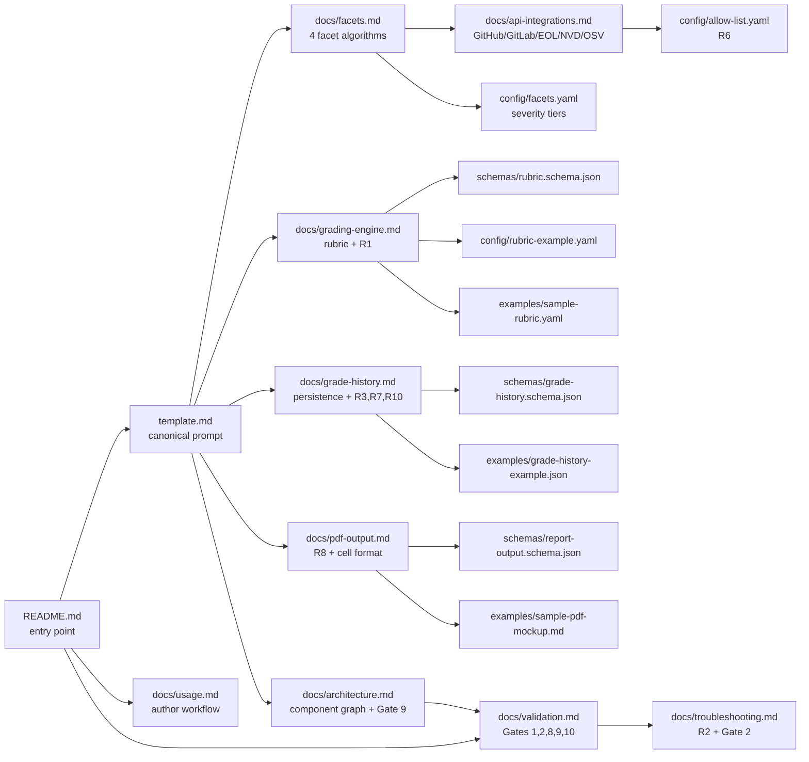

# Technology Estate Report — Blitzy Prompt Template Package

*Greenfield v0.1.0 — a standalone, executable Blitzy prompt template that generates a recurring CIO/CTO-facing PDF Technology Estate Report from ingested GitHub/GitLab repositories.*

**Version:** v0.1.0  
**Status:** Initial authoring  
**Audience:** CIO / CTO (output) | Template authors (this package)

## Overview

This directory is a **Blitzy prompt template package**, not a runnable application. The deliverable is a versioned set of template, schema, configuration, example, and supporting documentation files that together form a self-contained, repeatable report-generation specification. The package is consumed directly by Blitzy as Markdown — there is no build toolchain, no static-site generator, and no NPM/pip/Maven manifest required to author or invoke it.

When Blitzy executes this template against a defined repository scope, the output is a **single PDF artifact** containing exactly **two sections in fixed order** (per Rule R8): an **Executive Summary** on page 1, followed by an **Application Matrix Table** on page 2 onward. The matrix table contains **one row per ingested repository** with the repository full name `org/repo` used as the stable application identity key (per Rule R7), and exactly **four facet columns** in this order: **Tech Stack Summary | Maturity Summary | Security Summary | Complexity Summary**.

The package is **standalone**: it has no dependency on any other Blitzy flow or template, and it consumes the existing Blitzy ingestion pipeline strictly **read-only**. The minimal-change mandate is binding — no feature beyond the four defined facets, the grading engine, the grade history, and the PDF output is implemented by this template.

## At a Glance

| Property | Value |
|---|---|
| Package version | v0.1.0 |
| Output format | PDF |
| Output sections | Executive Summary (page 1), Application Matrix Table (page 2+) |
| Facet columns | Tech Stack Summary \| Maturity Summary \| Security Summary \| Complexity Summary |
| Application identity key | `org/repo` (stable across all runs per Rule R7) |
| Grading scale | A–F (per user-supplied rubric per Rule R1) |
| Complexity facet | Locked to `Grade: TBD — definition pending` until rubric is supplied (per Rule R5) |
| Grade history format | `B  ←  prev: C  \|  2025-10-01` (per Rule R3 cell-rendering example) |
| First-run prior grade | `N/A` (per Rule R3) |
| Failed-data-source cell | `Insufficient Data` (per Rule R2) |
| Standalone | Yes — no dependency on other Blitzy flows or templates |
| Ingestion pipeline | Consumed read-only; not modified |
| External APIs | GitHub/GitLab (`GITHUB_TOKEN`/`GITLAB_TOKEN`), endoflife.date v1, NVD CVE API v2.0 (optional `NVD_API_KEY`), OSV API v1 |

## Quick Start

This is a **conceptual quick-start**. The full single-command execution path required by Gate 10 is documented in [`./docs/validation.md`](./docs/validation.md).

1. **Provision credentials** — set the environment variables that the template uses to authenticate against the GitHub/GitLab REST APIs and (optionally) the NVD CVE API. Setting `NVD_API_KEY` raises the NVD rate limit from 5 to 50 requests per 30 seconds and is strongly recommended for any non-trivial repository scope.

   ```bash
   export GITHUB_TOKEN="ghp_<your-token>"
   export GITLAB_TOKEN="glpat-<your-token>"   # optional
   export NVD_API_KEY="<your-key>"            # optional but strongly recommended
   ```

2. **Author your rubric** — copy [`./examples/sample-rubric.yaml`](./examples/sample-rubric.yaml) to a working location and edit the A–F thresholds for each facet. The Complexity facet rubric is locked to `Grade: TBD — definition pending` until you supply explicit thresholds (Rule R5). The rubric document MUST validate against [`./schemas/rubric.schema.json`](./schemas/rubric.schema.json).

3. **Invoke the template** — point Blitzy at this package's [`./template.md`](./template.md) with your rubric document and a list of `org/repo` paths defining the run scope. The exact invocation command is environment-dependent and is documented in detail in [`./docs/usage.md`](./docs/usage.md) and [`./docs/validation.md`](./docs/validation.md).

4. **Retrieve the PDF** — the output PDF contains the Executive Summary on page 1 followed by the Application Matrix Table on page 2 onward, per Rule R8. Reviewer-facing interpretation guidance is in [`./docs/pdf-output.md`](./docs/pdf-output.md) § Interpreting the Output.

## File Map

The package is a single self-contained directory. Every file is enumerated below; all cross-document links are relative paths within this directory. No link reaches outside `templates/technology-estate-report/`.

```text
templates/technology-estate-report/
├── README.md                          ← you are here
├── CHANGELOG.md
├── template.md
├── schemas/
│   ├── rubric.schema.json
│   ├── grade-history.schema.json
│   └── report-output.schema.json
├── config/
│   ├── facets.yaml
│   ├── rubric-example.yaml
│   └── allow-list.yaml
├── examples/
│   ├── sample-rubric.yaml
│   ├── sample-pdf-mockup.md
│   └── grade-history-example.json
└── docs/
    ├── usage.md
    ├── architecture.md
    ├── facets.md
    ├── grading-engine.md
    ├── grade-history.md
    ├── executive-summary.md
    ├── pdf-output.md
    ├── api-integrations.md
    ├── configuration.md
    ├── troubleshooting.md
    └── validation.md
```

### Top-Level Files

| Path | Purpose |
|---|---|
| [`./template.md`](./template.md) | Canonical Blitzy prompt template entry point — Role Definition, Task Context, Technical Specifications, Boundaries, Rules R1–R10, and Validation Gates 1, 2, 8, 9, 10 |
| [`./CHANGELOG.md`](./CHANGELOG.md) | Versioned change history seeded with the v0.1.0 initial-authoring entry |

### Schemas

| Path | Purpose |
|---|---|
| [`./schemas/rubric.schema.json`](./schemas/rubric.schema.json) | JSON Schema (Draft 2020-12) for the user-supplied A–F rubric per facet (Rule R1) |
| [`./schemas/grade-history.schema.json`](./schemas/grade-history.schema.json) | JSON Schema for the persistence record keyed by `(application_id, facet, run_date)` (Rules R3, R7, R10) |
| [`./schemas/report-output.schema.json`](./schemas/report-output.schema.json) | JSON Schema for the intermediate report data structure that drives PDF rendering |

### Configuration

| Path | Purpose |
|---|---|
| [`./config/facets.yaml`](./config/facets.yaml) | Per-facet feature flags and CVSS-to-severity-tier mapping |
| [`./config/rubric-example.yaml`](./config/rubric-example.yaml) | Worked example rubric for all four facets |
| [`./config/allow-list.yaml`](./config/allow-list.yaml) | Network-egress allow-list (Rule R6) |

### Examples

| Path | Purpose |
|---|---|
| [`./examples/sample-rubric.yaml`](./examples/sample-rubric.yaml) | Production-ready example rubric covering all four facets |
| [`./examples/sample-pdf-mockup.md`](./examples/sample-pdf-mockup.md) | Markdown mockup of the rendered PDF |
| [`./examples/grade-history-example.json`](./examples/grade-history-example.json) | Sample persistence records (first run, second run, net-new repo joining a recurring run) |

### Documentation

| Path | Purpose |
|---|---|
| [`./docs/usage.md`](./docs/usage.md) | Step-by-step author workflow (provision tokens, author rubric, invoke template, retrieve PDF) |
| [`./docs/architecture.md`](./docs/architecture.md) | Component inventory diagram, single-repository run sequence diagram, seven-component reachability matrix (Gate 9) |
| [`./docs/facets.md`](./docs/facets.md) | Tech Stack, Maturity, Security, and Complexity facet reference documentation |
| [`./docs/grading-engine.md`](./docs/grading-engine.md) | Rubric format, evaluation procedure, Rule R1 verification procedure |
| [`./docs/grade-history.md`](./docs/grade-history.md) | Storage key shape, immutability, retrieval semantics, `N/A` rule, Rule R10 heterogeneous-scope flow |
| [`./docs/executive-summary.md`](./docs/executive-summary.md) | Portfolio-level aggregation rules (totals, distribution, top CVE, highest-maturity-risk, trend) |
| [`./docs/pdf-output.md`](./docs/pdf-output.md) | Rule R8 section ordering, matrix column order, cell-rendering format, page-layout diagram |
| [`./docs/api-integrations.md`](./docs/api-integrations.md) | GitHub, GitLab, endoflife.date, NVD, OSV contracts; Rule R6 network-egress allow-list; Rule R9 attribution rule |
| [`./docs/configuration.md`](./docs/configuration.md) | Configuration file reference for all `config/*.yaml` |
| [`./docs/troubleshooting.md`](./docs/troubleshooting.md) | Failure-mode-to-`Insufficient Data` mapping (Rule R2; Gate 2) |
| [`./docs/validation.md`](./docs/validation.md) | Validation Gates 1, 2, 8, 9, 10 procedures and domain success criteria assertions |

## Glossary

This README is the **single canonical location** for the package-specific terminology. No other file in the package may redefine these terms; cross-document references must use the definitions below.

| Term | Definition |
|---|---|
| **Facet** | One of the four columns in the Application Matrix Table: Tech Stack Summary, Maturity Summary, Security Summary, or Complexity Summary. The package documentation never uses the synonyms "category" or "dimension" for this concept. |
| **Application** | The unit of one ingested repository, identified by its full name `org/repo`. The package documentation never uses the synonyms "project" or "service" for this concept. |
| **Run** | One invocation of the template producing one PDF artifact. The package documentation never uses the synonyms "execution" or "invocation" for this concept. |
| **Rubric** | The user-supplied A–F threshold definitions per facet, supplied at generation time per Rule R1. The package documentation never uses the synonyms "grading scheme" or "rules" for this concept. |
| **Grade History** | The persistence layer keyed by `(application_id, facet, run_date)` that records each run's grade outcome and is read at the start of each subsequent run to render prior-grade values inline per Rule R3. The package documentation never uses the synonyms "audit log" or "trail" for this concept. |

## How the Pieces Fit Together

The diagram below maps the package's internal navigation: which documents reference which schemas, configurations, and examples. Every node corresponds to a file in the [File Map](#file-map) above. Every edge represents a Markdown link inside the source document.



## Rules at a Glance

> The canonical, verbatim text of all ten Rules R1–R10 is in [`./template.md`](./template.md) § Rules. The table below is a navigation aid; refer to `./template.md` for the authoritative rule text.

| Rule | Topic | Operationalized By |
|---|---|---|
| R1 | Rubric editability — author-time supply, no hardcoded thresholds | [`./docs/grading-engine.md`](./docs/grading-engine.md), [`./schemas/rubric.schema.json`](./schemas/rubric.schema.json) |
| R2 | Facet completeness — `Insufficient Data` for missing data | [`./docs/troubleshooting.md`](./docs/troubleshooting.md), [`./docs/pdf-output.md`](./docs/pdf-output.md) |
| R3 | Grade history fidelity — inline prior grade + ISO 8601 date | [`./docs/grade-history.md`](./docs/grade-history.md), [`./docs/pdf-output.md`](./docs/pdf-output.md) |
| R4 | CVE severity breakdown — Critical/High/Medium/Low + total | [`./docs/facets.md`](./docs/facets.md) § Security |
| R5 | Complexity placeholder integrity — `Grade: TBD — definition pending` | [`./docs/facets.md`](./docs/facets.md) § Complexity, [`./docs/pdf-output.md`](./docs/pdf-output.md) |
| R6 | SaaS data sourcing — manifest-only, no live SaaS API calls | [`./docs/api-integrations.md`](./docs/api-integrations.md), [`./config/allow-list.yaml`](./config/allow-list.yaml) |
| R7 | Application identity stability — `org/repo` key | [`./docs/grade-history.md`](./docs/grade-history.md), [`./schemas/grade-history.schema.json`](./schemas/grade-history.schema.json) |
| R8 | PDF section order — Executive Summary precedes Matrix Table | [`./docs/pdf-output.md`](./docs/pdf-output.md) |
| R9 | CVE attribution — scan timestamp + database label | [`./docs/api-integrations.md`](./docs/api-integrations.md), [`./schemas/grade-history.schema.json`](./schemas/grade-history.schema.json) |
| R10 | New repo compatibility — heterogeneous scope, `N/A` for net-new | [`./docs/grade-history.md`](./docs/grade-history.md), [`./examples/grade-history-example.json`](./examples/grade-history-example.json) |

## Validation Gates at a Glance

> The canonical, verbatim text of all five Validation Gates (1, 2, 8, 9, 10) is in [`./template.md`](./template.md) § Validation Framework. The table below is a navigation aid. The gate numbering is deliberately non-consecutive — gates 3 through 7 do not exist in this template's validation framework.

| Gate | Topic | Operationalized By |
|---|---|---|
| Gate 1 | End-to-end boundary verification — live smoke test on a real repository | [`./docs/validation.md`](./docs/validation.md) § Gate 1, [`./docs/usage.md`](./docs/usage.md) |
| Gate 2 | Zero-warning build — every failure surfaces as `Insufficient Data` | [`./docs/troubleshooting.md`](./docs/troubleshooting.md), [`./docs/validation.md`](./docs/validation.md) § Gate 2 |
| Gate 8 | Integration sign-off checklist (4 items) | [`./docs/validation.md`](./docs/validation.md) § Gate 8 |
| Gate 9 | Integration wiring verification — 7-component reachability | [`./docs/architecture.md`](./docs/architecture.md), [`./docs/validation.md`](./docs/validation.md) § Gate 9 |
| Gate 10 | Test execution binding — single-command path | [`./docs/validation.md`](./docs/validation.md) § Gate 10 |

## Boundaries

This package is a standalone Blitzy prompt template with no dependency on any other Blitzy flow or template. It consumes the existing Blitzy ingestion pipeline strictly **read-only** and produces exactly one output artifact: the PDF Technology Estate Report. The package explicitly does not call any of the following data sources: live cloud billing APIs (AWS Cost Explorer, Azure Cost Management, GCP Billing), CMDB / ServiceNow integrations, runtime monitoring data sources (APM, logs, metrics), or live SaaS vendor APIs (per Rule R6 — SaaS license data is sourced exclusively from repository-tracked manifests). The canonical, verbatim statement of these boundaries is in [`./template.md`](./template.md) § 4. Boundaries & Preservation.

## Versioning

This package follows Semantic Versioning 2.0.0. The versioned change history is recorded in [`./CHANGELOG.md`](./CHANGELOG.md); the current package version is **v0.1.0** (initial authoring).

## License & Attribution

This package inherits the license of the containing repository. No separate license file is introduced inside `templates/technology-estate-report/`.
