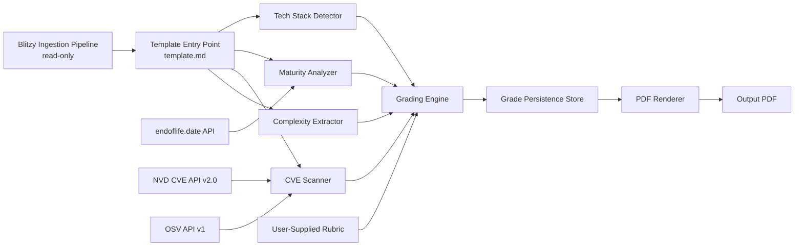
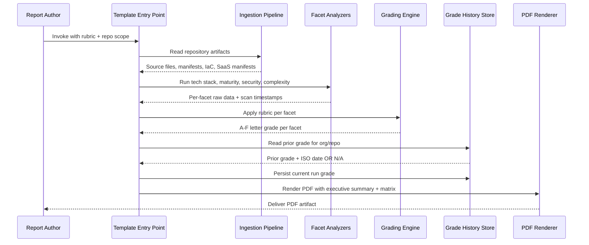

# Architecture — Technology Estate Report Template

## 1. Overview

The Technology Estate Report template is a **standalone Blitzy prompt template package** that orchestrates
**seven analysis components** to transform ingested GitHub/GitLab repositories into a deterministic,
recurring, grade-history-preserving CIO/CTO-facing PDF. The seven components — listed in the canonical order
below and preserved in this exact order throughout the package — are: **Tech Stack Detector**, **Maturity
Analyzer**, **CVE Scanner**, **Complexity Extractor**, **Grading Engine**, **Grade Persistence Store**, and
**PDF Renderer**. Each component owns a discrete responsibility in the template's execution chain, and the
diagrams in [§ 3 Component Inventory and Data Flow](#3-component-inventory-and-data-flow) and [§ 4
Single-Repository Run Sequence](#4-single-repository-run-sequence) show how they compose end to end.

Per [Gate 9](../template.md#614-gate-9--integration-wiring-verification) (canonical, verbatim text in
[`../template.md`](../template.md) § 6.1.4), every one of the seven components MUST be reachable from the
template entry point ([`../template.md`](../template.md)) and MUST be exercised by at least one end-to-end
test that traverses the full execution chain from template invocation to PDF output. This document is the
canonical home of the **Component Reachability Matrix** in [§ 6](#6-component-reachability-matrix-gate-9)
that maps each of the seven components to its end-to-end test, and is referenced by
[`../template.md`](../template.md) § 7 Architecture & Component Reachability and by
[`./validation.md`](./validation.md) § 5 Gate 9 — Integration Wiring Verification.

The **Blitzy ingestion pipeline** is consumed strictly **read-only** per
[`../template.md`](../template.md) § 4 Boundaries & Preservation; it is therefore **not** part of the
template's component inventory in the sense that this template owns or modifies it. The pipeline is shown in
the data-flow diagram as the upstream input that produces the per-repository artifact bundle the template's
seven components consume. All diagrams in this document use **Mermaid** syntax compatible with the GitHub
Markdown renderer per the AAP § 0.10.2 "Mermaid-Default Diagram Rule"; no diagrams are inlined as binary
images.

## 2. Component Inventory

The table below enumerates the **seven analysis components** that this template owns, plus the **upstream
Blitzy ingestion pipeline** (read-only consumer relationship), plus the **three external API dependencies**
(`endoflife.date`, NVD CVE API v2.0, OSV API v1) that two of the analyzers contact through the network-egress
allow-list in [`../config/allow-list.yaml`](../config/allow-list.yaml). The seven analysis components appear
in the canonical order matching [`../template.md`](../template.md) § 7 and the verbatim Gate 9 enumeration in
[`../template.md`](../template.md) § 6.1.4.

| Component | Role | Inputs | Outputs | Documentation |
|---|---|---|---|---|
| **Blitzy Ingestion Pipeline** (upstream; read-only) | Reads repository artifacts from GitHub or GitLab and produces the per-repository artifact bundle that the template's components consume. The pipeline is consumed read-only per [`../template.md`](../template.md) § 4 Boundaries & Preservation. | `GITHUB_TOKEN` / `GITLAB_TOKEN` credentials; the run-scope list of `org/repo` identifiers (per [Rule R7](../template.md#r7--application-identity-stability)) | Per repository: source files; dependency manifests (npm, pip, Maven, Go, Cargo, NuGet, RubyGems, Pipfile); Infrastructure-as-Code configs (Terraform, Helm, CloudFormation); SaaS license manifests; full git history | [`./api-integrations.md`](./api-integrations.md) § GitHub API and § GitLab API |
| **Tech Stack Detector** | Characterizes the per-application language and platform footprint by combining language detection, cloud provider identification, and vendor/framework extraction. | Source files, dependency manifests, IaC configs from the ingestion pipeline | Language % share by file count; identified cloud providers; vendor/framework list | [`./facets.md`](./facets.md) § Tech Stack Summary |
| **Maturity Analyzer** | Assesses per-application end-of-life (EOL) posture for runtimes and libraries and produces a technical-debt score. | Dependency manifests, runtime declarations from the ingestion pipeline | Per-dependency EOL status from `endoflife.date`; technical-debt score (% of out-of-support dependencies) | [`./facets.md`](./facets.md) § Maturity Summary |
| **CVE Scanner** | Generates a CycloneDX SBOM from dependency manifests and looks up CVEs against NVD and OSV; counts CVEs by severity tier per [Rule R4](../template.md#r4--cve-severity-breakdown) and records scan metadata per [Rule R9](../template.md#r9--cve-attribution). | Dependency manifests from the ingestion pipeline | SBOM (CycloneDX); CVE list with severity-tier counts (Critical / High / Medium / Low + total); scan metadata (timestamp + source database label `NVD`, `OSV`, or both) | [`./facets.md`](./facets.md) § Security Summary; [`./api-integrations.md`](./api-integrations.md) § NVD CVE API v2.0 and § OSV API v1 |
| **Complexity Extractor** | Extracts raw proxy metrics (LOC, file count, contributor count) per [Rule R5](../template.md#r5--complexity-placeholder-integrity); does **not** emit a letter grade. | Source files, full git history from the ingestion pipeline | LOC; file count; contributor count | [`./facets.md`](./facets.md) § Complexity Summary |
| **Grading Engine** | Applies the user-supplied A–F rubric per facet (per [Rule R1](../template.md#r1--rubric-editability)) and emits a single letter grade per `(application, facet)` pair. Locks Complexity to the literal `Grade: TBD — definition pending` per [Rule R5](../template.md#r5--complexity-placeholder-integrity) until a Complexity rubric is supplied; emits `Insufficient Data` per [Rule R2](../template.md#r2--facet-completeness) when the upstream analyzer was unable to produce data. | Per-facet raw outputs from the four analyzers above; user-supplied rubric (per [`../schemas/rubric.schema.json`](../schemas/rubric.schema.json)) | A–F letter grade per `(application, facet)` pair; `Grade: TBD — definition pending` for Complexity until rubric supplied; `Insufficient Data` for unavailable data | [`./grading-engine.md`](./grading-engine.md) |
| **Grade Persistence Store** | Append-only store for grade-history records keyed by `(application_id, facet, run_date)` per [Rule R3](../template.md#r3--grade-history-fidelity); reads prior records for the inline `prev: <grade> | <ISO 8601 date>` render; never mutates prior records. | Current-run grades from the Grading Engine; lookup queries from the PDF Renderer for the prior-grade slot | Persisted records per [`../schemas/grade-history.schema.json`](../schemas/grade-history.schema.json); prior grade + ISO 8601 date OR `N/A` when no prior record exists for the `(application_id, facet)` pair | [`./grade-history.md`](./grade-history.md) |
| **PDF Renderer** | Produces the single PDF artifact with Executive Summary on page 1 and Application Matrix Table on subsequent pages per [Rule R8](../template.md#r8--pdf-section-order); enforces the cell-rendering format `B  ←  prev: C  |  2025-10-01` per [Rule R3](../template.md#r3--grade-history-fidelity). | Validated report-output object per [`../schemas/report-output.schema.json`](../schemas/report-output.schema.json) (assembled from the Grading Engine + Grade Persistence Store) | Single PDF artifact | [`./pdf-output.md`](./pdf-output.md) |
| **`endoflife.date` API** (external dependency, v1) | EOL status lookup endpoint consumed exclusively by the Maturity Analyzer; mediated by the network-egress allow-list. | Product slug per detected runtime/library | EOL status records (boolean `eol` flag or specific EOL date) | [`./api-integrations.md`](./api-integrations.md) § endoflife.date API v1 |
| **NVD CVE API v2.0** (external dependency) | CVE record retrieval endpoint consumed exclusively by the CVE Scanner; mediated by the network-egress allow-list; optional `NVD_API_KEY` raises rate limit. | CPE/package query parameters | CVE records with CVSS scores and metadata | [`./api-integrations.md`](./api-integrations.md) § NVD CVE API v2.0 |
| **OSV API v1** (external dependency) | CVE record retrieval endpoint (cross-reference / batched lookup) consumed exclusively by the CVE Scanner; mediated by the network-egress allow-list. | Package version or commit-hash batched query payloads | CVE records in the OSV format | [`./api-integrations.md`](./api-integrations.md) § OSV API v1 |

## 3. Component Inventory and Data Flow

The diagram below traces the end-to-end data flow from the upstream Blitzy ingestion pipeline through the
template entry point ([`../template.md`](../template.md)) into each of the four facet analyzers, then into
the Grading Engine, the Grade Persistence Store, and finally the PDF Renderer. The user-supplied rubric is
shown as a separate input flowing only into the Grading Engine, and the three external APIs are shown
flowing into the analyzers that consume them.

The data flow above is **strictly directional**: the four facet analyzers (`C`, `D`, `E`, `F`) operate
independently against the ingestion-pipeline output and emit per-facet raw data into the Grading Engine
(`G`), which then writes the per-facet letter grades into the Grade Persistence Store (`H`). The PDF Renderer
(`I`) reads the validated report-output object assembled from the Grading Engine and the Grade Persistence
Store and emits the single PDF artifact (`J`). The **user-supplied rubric** (`K`) is an additional input
**only to the Grading Engine** — the four facet analyzers do not consume the rubric, in keeping with
[Rule R1](../template.md#r1--rubric-editability) which makes rubric thresholds a Grading-Engine concern and
not an analyzer concern.

The three external APIs — `endoflife.date` (`L`), NVD CVE API v2.0 (`M`), and OSV API v1 (`N`) — are consumed
**exclusively** by the Maturity Analyzer and the CVE Scanner per [Rule R6](../template.md#r6--saas-data-sourcing).
No other component issues outbound network calls, and **no live SaaS vendor endpoint** is reachable from any
component. The canonical egress allow-list lives in [`../config/allow-list.yaml`](../config/allow-list.yaml);
the API contracts (rate limits, retry semantics, attribution rules per [Rule R9](../template.md#r9--cve-attribution))
are documented in [`./api-integrations.md`](./api-integrations.md).

## 4. Single-Repository Run Sequence

The diagram below walks through a single end-to-end invocation against one repository in the run scope. Each
arrow represents a synchronous interaction between the named participants; the diagram intentionally elides
internal control flow within each participant in favor of the inter-component contract that Gate 9 verifies.

The chronological narrative: the **Report Author** invokes the template with a rubric document and a list of
repositories in scope; the **Template Entry Point** reads the repository artifacts via the **Ingestion
Pipeline** and dispatches them to the four **Facet Analyzers** (Tech Stack Detector, Maturity Analyzer, CVE
Scanner, Complexity Extractor — the Facet Analyzers participant in the diagram is the union of these four
components). The Facet Analyzers return per-facet raw data plus, for the Security Summary specifically, the
scan timestamp and source database label required by [Rule R9](../template.md#r9--cve-attribution). The
**Grading Engine** then applies the user-supplied rubric per facet and emits a letter grade per `(application,
facet)` pair (or `Insufficient Data` per [Rule R2](../template.md#r2--facet-completeness), or `Grade: TBD —
definition pending` for Complexity per [Rule R5](../template.md#r5--complexity-placeholder-integrity)).

The **prior-grade lookup** against the **Grade History Store** happens **before** the persist step
specifically so that the rendered PDF can include the inline `prev: <grade> | <ISO date>` segment per
[Rule R3](../template.md#r3--grade-history-fidelity) — the reader must consult the prior record to render the
current cell, and the prior record is by definition the most recent record whose `run_date` is strictly less
than the current run's `run_date`. The persist step is **append-only** per [Rule R3](../template.md#r3--grade-history-fidelity)
and the immutability contract: subsequent runs append new records but MUST NOT mutate, delete, or rewrite
prior records. See [`./grade-history.md`](./grade-history.md) § Immutability Contract for the canonical
storage-layer guarantee. When no prior record exists for the `(application_id, facet)` pair — the case for
first-run repositories and for net-new repositories joining a recurring run per
[Rule R10](../template.md#r10--new-repo-compatibility) — the Grade History Store returns the literal `N/A`
in the prior-grade slot, and the PDF Renderer renders that literal in place of the `prev: <grade> | <ISO
date>` segment. Finally, the **PDF Renderer** emits the single PDF artifact with Executive Summary on page 1
and Application Matrix Table on subsequent pages per [Rule R8](../template.md#r8--pdf-section-order), and
delivers it back to the Report Author.

## 5. Multi-Repository Run Behavior

The single-repository sequence in [§ 4](#4-single-repository-run-sequence) is the unit of execution: it runs
**once per repository** in the run scope. Per-repository runs are otherwise independent — the Grading Engine
result for repository `org/repo-A` does not influence the Grading Engine result for repository `org/repo-B` —
which is the foundation of the parallelization and determinism guarantees in [§ 8 Concurrency & Determinism
Notes](#8-concurrency--determinism-notes).

Heterogeneous-scope handling — the case where a single run mixes previously-ingested repositories (which
have prior grade-history records) with net-new repositories (which do not) — is documented in detail in
[`./grade-history.md`](./grade-history.md) § Heterogeneous Scope per
[Rule R10](../template.md#r10--new-repo-compatibility). The branching logic is uniform across both cases:
the Grade History Store returns either a prior record OR the literal `N/A`, and the PDF Renderer renders
the result identically. There is no separate "first-run code path" — [Rule R10](../template.md#r10--new-repo-compatibility)
explicitly prohibits divergent execution paths for first-run versus recurring repositories. **Portfolio-level
aggregation** (Total Applications, A–F grade distribution per facet, Top Critical/High CVE findings,
Highest-Maturity-Risk applications, and Trend vs Prior Run) is computed by the PDF Renderer **after** all
per-repository runs complete and is rendered into the Executive Summary per
[Rule R8](../template.md#r8--pdf-section-order); the aggregation rules are documented in
[`./executive-summary.md`](./executive-summary.md).

## 6. Component Reachability Matrix (Gate 9)

This section is the **canonical, definitive home** of the Gate 9 reachability matrix. Reviewers consulting
Gate 9 compliance should be able to read this single section and confirm full reachability for all seven
components.

> **Gate 9 — Integration wiring verification:** every analysis component MUST be reachable from the template
> entry point and exercised by at least one end-to-end test. Canonical verbatim text in
> [`../template.md`](../template.md) § 6.1.4.

Per the AAP § 0.10.2 "No Redundancy Rule" this section does not duplicate the verbatim Gate 9 text; it cites
the canonical location and reproduces the **operational** content (the per-component end-to-end test mapping)
that reviewers need to verify Gate 9.

| Component | Reachable from `../template.md`? | End-to-End Test ID | Verifies |
|---|---|---|---|
| Tech Stack Detector | Yes — invoked from `../template.md` § 3.2 row 1 | `e2e-tech-stack` | Detector emits language % share, cloud provider list, vendor/framework list for the designated test repository |
| Maturity Analyzer | Yes — invoked from `../template.md` § 3.2 row 2 | `e2e-maturity` | Analyzer emits per-dependency EOL status from endoflife.date and the technical-debt score |
| CVE Scanner | Yes — invoked from `../template.md` § 3.2 row 3 | `e2e-cve-scanner` | Scanner emits CVE counts in four severity tiers + total (Rule R4), with scan metadata (Rule R9) |
| Complexity Extractor | Yes — invoked from `../template.md` § 3.2 row 4 | `e2e-complexity` | Extractor emits LOC, file count, contributor count; cell renders `Grade: TBD — definition pending` (Rule R5) |
| Grading Engine | Yes — invoked from `../template.md` § 3.3 | `e2e-grading-engine` | Engine emits A–F letter grade per (application, facet); rubric editability verified by Rule R1 procedure (different rubric → different grade) |
| Grade Persistence Store | Yes — invoked from `../template.md` § 3.4 | `e2e-grade-history` | Store appends current-run record; subsequent run reads prior record and renders inline `prev: <grade> | <ISO date>` (Rule R3); net-new repo gets `N/A` (Rule R10) |
| PDF Renderer | Yes — invoked from `../template.md` § 3.6 | `e2e-pdf-render` | Renderer produces PDF with Executive Summary on page 1 and Matrix Table on subsequent pages (Rule R8); cell-rendering format `B  ←  prev: C  |  2025-10-01` (Rule R3) |

The procedural execution of these seven end-to-end tests — including the per-test invocation, the assertion
list, and the artifact retention policy — is documented in [`./validation.md`](./validation.md) § 5 Gate 9 —
Integration Wiring Verification. The single-command execution path that runs the entire Gate 9 suite (and the
other four gates) in one invocation is documented in [`./validation.md`](./validation.md) § 8 Single-Command
Execution Path Summary, which is the operational realization of
[Gate 10](../template.md#615-gate-10--test-execution-binding).

## 7. Component Boundaries & Side-Effect Discipline

Each component in the inventory operates under an explicit side-effect contract. The contracts below are the
per-component statement of "what may this component read, write, or call externally?" and are the foundation
for the network-egress allow-list in [`../config/allow-list.yaml`](../config/allow-list.yaml) and the
read-only consumption guarantee for the Blitzy ingestion pipeline.

- **Tech Stack Detector**, **Maturity Analyzer**, **Complexity Extractor** — **read-only** consumers of the
  ingestion-pipeline output; no writes to the ingestion pipeline; no network egress except for the Maturity
  Analyzer's outbound calls to `endoflife.date`, which are the analyzer's only network egress and are
  mediated by [`../config/allow-list.yaml`](../config/allow-list.yaml). The Tech Stack Detector and the
  Complexity Extractor have **zero** network egress.
- **CVE Scanner** — **read-only** consumer of dependency manifests; the only outbound calls permitted are to
  the **NVD CVE API v2.0** and the **OSV API v1**, both mediated by
  [`../config/allow-list.yaml`](../config/allow-list.yaml). Per [Rule R6](../template.md#r6--saas-data-sourcing),
  no live SaaS vendor endpoints are contacted under any circumstance. Per
  [Rule R9](../template.md#r9--cve-attribution), every CVE result the scanner emits is recorded with a scan
  timestamp (ISO 8601) and a source database label (`NVD`, `OSV`, or both); undated or unattributed CVE
  counts are a Gate 2 failure surface.
- **Grading Engine** — **pure function** of `(per-facet raw data, user-supplied rubric)`; no I/O beyond
  reading the rubric document, reading the analyzers' raw-data outputs, and writing the emitted grades into
  the Grade Persistence Store. No network egress. The pure-function discipline is what makes
  [Rule R1](../template.md#r1--rubric-editability) verifiable: with the same `(raw data, rubric)` inputs the
  engine MUST emit the same grades, and with two different rubrics the engine MUST emit two different grade
  outputs (the verbatim verification clause).
- **Grade Persistence Store** — **append-only** per [Rule R3](../template.md#r3--grade-history-fidelity); the
  store reads prior records exclusively to populate the inline `prev: <grade> | <ISO date>` render and never
  mutates them. The storage backend (file-system, embedded database, or external store) is documented in
  [`./grade-history.md`](./grade-history.md) and is opaque to the other components — they interact with the
  store solely via its read and append interfaces.
- **PDF Renderer** — **pure function** of `(validated report-output object) -> PDF artifact`; no I/O beyond
  reading its input from the Grading Engine + Grade Persistence Store and writing the output PDF to the
  configured output path. No network egress. The renderer is the **enforcement point** for
  [Rule R8](../template.md#r8--pdf-section-order) (section ordering: Executive Summary on page 1, Matrix
  Table on page 2 onward) and [Rule R3](../template.md#r3--grade-history-fidelity) (cell-rendering format
  `B  ←  prev: C  |  2025-10-01`).
- **Blitzy Ingestion Pipeline** — **read-only from the perspective of this template** per
  [`../template.md`](../template.md) § 4 Boundaries & Preservation. This template MUST NOT modify, extend,
  replace, or transform ingestion behavior; the pipeline is the upstream source of repository artifacts and
  nothing more.

## 8. Concurrency & Determinism Notes

**Per-repository parallelism.** Per-repository runs are independent and may be parallelized by the executing
environment without altering output: the Tech Stack Detector, Maturity Analyzer, CVE Scanner, Complexity
Extractor, Grading Engine, and Grade Persistence Store all operate on a single `application_id` per
invocation, and the only cross-repository synchronization point is the **portfolio-level aggregation** in the
PDF Renderer that depends on the union of per-repository outputs (see [§ 5 Multi-Repository Run
Behavior](#5-multi-repository-run-behavior) and [`./executive-summary.md`](./executive-summary.md)).
**Determinism.** The Grading Engine is deterministic given the same `(per-facet raw data, user-supplied
rubric)` input pair; this property is the foundation for [Rule R1](../template.md#r1--rubric-editability)'s
verification clause — generating a report with two different rubric inputs for the same dataset MUST produce
two different grade outputs, and conversely, generating a report with the same rubric for the same dataset
MUST produce identical grade outputs. The PDF Renderer is also deterministic: the same validated
report-output object MUST render to byte-identical PDF artifacts (modulo PDF metadata fields such as creation
timestamp, which are documented as renderer-controlled metadata in [`./pdf-output.md`](./pdf-output.md)).
**Run-date capture.** The `run_date` is captured **once per run invocation** at the Template Entry Point and
is propagated to every persistence record produced by that run. Every record from the same run therefore
shares the same `run_date`, which provides cross-application comparability inside a single run and supports
the trend-versus-prior-run computation in [`./executive-summary.md`](./executive-summary.md). The `run_date`
format is ISO 8601 datetime per [Rule R3](../template.md#r3--grade-history-fidelity) and
[Rule R9](../template.md#r9--cve-attribution).

## 9. Cross-References

The relative-path links below are the complete outbound dependency surface of this document. All links
resolve within [`templates/technology-estate-report/`](../) per the AAP § 0.10.2 "Standalone Package Rule";
no link reaches outside this directory. External API URLs (NVD, OSV, `endoflife.date`, GitHub, GitLab) are
documented exclusively in [`./api-integrations.md`](./api-integrations.md) per the AAP § 0.10.2 "Citation
Inline Rule" and are intentionally absent from this document's body.

**Schemas.**

- [`../schemas/rubric.schema.json`](../schemas/rubric.schema.json) — user-supplied rubric contract consumed by
  the Grading Engine
- [`../schemas/grade-history.schema.json`](../schemas/grade-history.schema.json) — Grade Persistence Store
  record contract keyed by `(application_id, facet, run_date)`
- [`../schemas/report-output.schema.json`](../schemas/report-output.schema.json) — intermediate report-output
  object consumed by the PDF Renderer

**Configuration.**

- [`../config/allow-list.yaml`](../config/allow-list.yaml) — network-egress allow-list per
  [Rule R6](../template.md#r6--saas-data-sourcing); the canonical reference for permitted outbound hosts
- [`../config/facets.yaml`](../config/facets.yaml) — per-facet feature flags, CVSS-to-severity-tier map, and
  default rendering options consumed by the analyzers and the PDF Renderer

**Template entry point and rule anchors.**

- [`../template.md`](../template.md) — canonical template entry point and verbatim home of all rules and
  gates
- [`../template.md`](../template.md) § 3.1 Ingestion — ingestion contract referenced by the Ingestion
  Pipeline row in [§ 2 Component Inventory](#2-component-inventory)
- [`../template.md`](../template.md) § 3.2 Facet Analysis — the four-row facet table referenced by the four
  analyzer rows in [§ 6 Component Reachability Matrix (Gate 9)](#6-component-reachability-matrix-gate-9)
- [`../template.md`](../template.md) § 3.3 Grading Engine — referenced by the Grading Engine reachability
  row
- [`../template.md`](../template.md) § 3.4 Grade Persistence — referenced by the Grade Persistence Store
  reachability row
- [`../template.md`](../template.md) § 3.6 Output — referenced by the PDF Renderer reachability row
- [`../template.md`](../template.md) § 4 Boundaries & Preservation — read-only ingestion guarantee
- [`../template.md`](../template.md) § 6.1.4 Gate 9 — canonical verbatim text of the gate this document
  operationalizes
- [`../template.md`](../template.md) § 7 Architecture & Component Reachability — pointer back into this
  document

**Sibling documentation.**

- [`./facets.md`](./facets.md) — per-facet algorithms, "Insufficient Data" conditions, and output cell
  content for Tech Stack, Maturity, Security, and Complexity Summaries
- [`./grading-engine.md`](./grading-engine.md) — rubric format and Grading Engine evaluation procedure
- [`./grade-history.md`](./grade-history.md) — Grade Persistence Store storage key, immutability contract,
  retrieval procedure, heterogeneous-scope handling, and new-repository onboarding
- [`./executive-summary.md`](./executive-summary.md) — portfolio-level aggregation rules computed by the PDF
  Renderer after all per-repository runs complete
- [`./pdf-output.md`](./pdf-output.md) — PDF section ordering and cell-rendering format enforced by the PDF
  Renderer
- [`./api-integrations.md`](./api-integrations.md) — GitHub, GitLab, `endoflife.date`, NVD, and OSV API
  contracts and the canonical Network Egress Allow-List
- [`./configuration.md`](./configuration.md) — configuration file reference for `../config/*.yaml`
- [`./troubleshooting.md`](./troubleshooting.md) — failure-mode-to-cell-value mapping per
  [Rule R2](../template.md#r2--facet-completeness)
- [`./usage.md`](./usage.md) — author workflow including credential provisioning and live smoke-test
  retrieval
- [`./validation.md`](./validation.md) — Gate 1, 2, 8, 9, 10 procedures and Domain Success Criteria
  assertions; § 5 Gate 9 cross-references this document's [§ 6 Component Reachability Matrix
  (Gate 9)](#6-component-reachability-matrix-gate-9)
