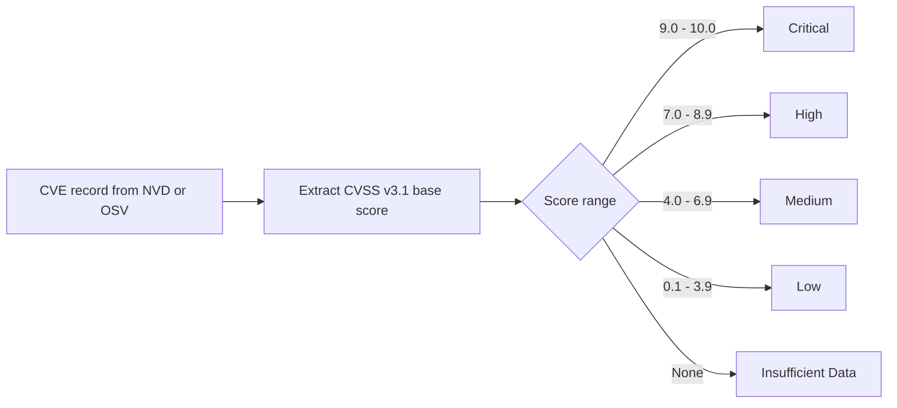

# Facet Reference — Technology Estate Report Template

## Overview

The Technology Estate Report PDF contains an **Application Matrix Table** with exactly four facet columns
in the canonical order — **never reordered, never abbreviated, never collapsed**:
**Tech Stack Summary | Maturity Summary | Security Summary | Complexity Summary**. Each row of the matrix
represents one repository in the run scope (identified by `application_id` in `org/repo` form per Rule R7
in [`../template.md`](../template.md) § 5), and every cell at the intersection of a row and a facet column
contains a value drawn from a closed set of permitted states. This document is the canonical reference for
each facet's data sources, detection algorithms, "Insufficient Data" conditions, and output cell content.

Each facet emits a single A–F letter grade per application, derived by the grading engine in
[`./grading-engine.md`](./grading-engine.md) from the user-supplied rubric and the per-facet raw data this
document specifies. Three special non-letter values are also defined in the cell-state inventory: **`TBD`**
(Complexity placeholder per Rule R5; renders as the literal `Grade: TBD — definition pending`), **`N/A`**
(no prior run for the `(application_id, facet)` pair per Rule R3; rendered exclusively in the prior-grade
slot), and **`InsufficientData`** (current-run cell renders as `Insufficient Data` per Rule R2 when source
data is unavailable). Per Rule R1 in [`../template.md`](../template.md) § 5, the user supplies the A–F
threshold rubric at generation time; this document does NOT define or hardcode the thresholds — see
[`./grading-engine.md`](./grading-engine.md) for the rubric format and
[`../schemas/rubric.schema.json`](../schemas/rubric.schema.json) for the formal contract.

The four facet sections below — [Tech Stack Summary](#tech-stack-summary),
[Maturity Summary](#maturity-summary), [Security Summary](#security-summary), and
[Complexity Summary](#complexity-summary) — each follow the same internal structure: **Data Sources**,
**Detection Method**, **"Insufficient Data" Conditions** (per Rule R2), and **Output Cell Content**. The
final two sections — [Cross-Facet Conventions](#cross-facet-conventions) and
[Cross-References](#cross-references) — consolidate the rendering literals and outbound documentation
links shared across all four facets. Per Rule R6, the only permitted external network calls are to the
hosts enumerated in [`../config/allow-list.yaml`](../config/allow-list.yaml); under no circumstance does
the template contact a live SaaS vendor endpoint, and SaaS license data is sourced exclusively from
manifests tracked in the ingested repository — see [`./api-integrations.md`](./api-integrations.md) §
Network Egress Allow-List for the canonical egress contract.

This document operationalizes Rules R2, R4, R5, R6, and R9 for the four facets. The verbatim text of every
rule lives in [`../template.md`](../template.md) § 5 and is referenced (not duplicated) here per the AAP
§ 0.10.2 No Redundancy Rule. The verbatim cell-format example `B  ←  prev: C  |  2025-10-01` and the
verbatim Complexity placeholder `Grade: TBD — definition pending` are preserved byte-for-byte wherever they
appear; both literals are also available in machine-readable form in
[`../config/facets.yaml`](../config/facets.yaml) `rendering_defaults` for the PDF renderer.

## Tech Stack Summary

The Tech Stack Summary facet characterizes the per-application **language and platform footprint** by
combining three independent sub-detectors that operate over different artifact types in the ingested
repository. The facet's per-application output is the input to the user-supplied Tech Stack rubric per
[`./grading-engine.md`](./grading-engine.md) and is used by the Executive Summary's portfolio-level
language and cloud distribution counts per [`./executive-summary.md`](./executive-summary.md).

### Data Sources

- **Source files** — every repository-tracked file whose extension matches the file-extension-to-language
  map in [§ Language Detection](#language-detection) below. Binary files, generated files (e.g.,
  `node_modules/`, `vendor/`, `target/`), and lock files are excluded from the source-file count for both
  this facet and the Complexity facet.
- **Dependency manifests** — the canonical set of per-ecosystem manifests tracked by the ingestion
  pipeline per [`../template.md`](../template.md) § 3.1: npm `package.json` (and `package-lock.json`),
  pip `requirements.txt` / `Pipfile.lock` / `poetry.lock`, Maven `pom.xml`, Go `go.mod`, RubyGems
  `Gemfile` (and `Gemfile.lock`), Pipfile (and `Pipfile.lock`), Gradle `build.gradle` (and
  `build.gradle.kts`), .NET `.csproj`, and Cargo `Cargo.toml`. Per Rule R6, **SaaS license manifests
  tracked in the repository** (e.g., `.salesforce.json`, `licenses/saas-vendors.yaml`, or any
  repository-tracked vendor-license manifest) are also scanned; live SaaS vendor API calls are
  prohibited.
- **Infrastructure-as-Code (IaC) configurations** — Terraform configurations (`*.tf` files matching the
  HCL syntax), Helm charts (`Chart.yaml`, `values.yaml`), and CloudFormation templates (`*.yaml` or
  `*.json` files containing the top-level `AWSTemplateFormatVersion` key).

### Detection Method

The Tech Stack Detector runs three sub-detectors in parallel; each produces an independent output that is
combined into the per-facet raw data record consumed by the grading engine. The three sub-detectors are
[Language Detection](#language-detection), [Cloud Provider Identification](#cloud-provider-identification),
and [Vendor & Framework Extraction](#vendor--framework-extraction). All three sub-detectors must each
return a non-empty result for the facet to render a graded cell; if all three return empty, the cell
renders `Insufficient Data` per Rule R2 (see [§ Insufficient Data Conditions
(Rule R2)](#insufficient-data-conditions-rule-r2) below).

#### Language Detection

The detector computes per-language **% share by file count** by partitioning the source-file inventory
according to a file-extension-to-language map and dividing each per-language file count by the total
source file count. The output is a sorted list of `(language, percent_share)` tuples in descending order
of share. The illustrative subset of the canonical extension map below covers the most common ecosystems
the template encounters; the full map is consumed by the detector at run time:

| File Extension(s) | Language |
|---|---|
| `.swift` | Swift |
| `.py` | Python |
| `.go` | Go |
| `.ts` | TypeScript |
| `.java` | Java |
| `.kt` | Kotlin |
| `.rb` | Ruby |
| `.cs` | C# |
| `.rs` | Rust |
| `.js`, `.mjs`, `.cjs` | JavaScript |
| `.c`, `.h` | C |
| `.cpp`, `.cc`, `.cxx`, `.hpp` | C++ |
| `.php` | PHP |
| `.scala` | Scala |
| `.m`, `.mm` | Objective-C |
| `.dart` | Dart |
| `.lua` | Lua |
| `.pl`, `.pm` | Perl |
| `.r`, `.R` | R |
| `.sh`, `.bash` | Shell |

Files whose extension is not present in the map contribute to a residual `Other` bucket; per
[`./troubleshooting.md`](./troubleshooting.md) § 2 Failure-Mode-to-Cell-Value Mapping, an `Other: 100%`
result is a low-signal but valid state and does NOT trigger the `Insufficient Data` rendering. Per-language
file counts below the language threshold (default 5%, configurable via `facets.tech_stack.language_threshold`
in [`../config/facets.yaml`](../config/facets.yaml)) are aggregated into the same `Other` bucket so the
matrix cell remains compact and readable for CIO/CTO review.

#### Cloud Provider Identification

The detector identifies cloud providers by parsing IaC resource type prefixes from Terraform configurations,
CloudFormation template namespaces, and Helm chart annotations. The canonical mapping table below is the
single source of truth for provider detection; the machine-readable copy is in
[`../config/facets.yaml`](../config/facets.yaml) `tech_stack.cloud_provider_detection.iac_resource_type_namespaces`.

| Provider | Terraform Resource Prefix | CloudFormation Namespace | Helm Annotation Examples |
|---|---|---|---|
| AWS | `aws_*` | `AWS::*` | `app.kubernetes.io/cloud=aws` |
| Azure | `azurerm_*`, `azapi_*` | `Microsoft.*` | `cloud.provider=azure` |
| GCP | `google_*` | n/a | `app.kubernetes.io/cloud=gcp` |

The output is a deduplicated set of detected providers (e.g., `{aws}`, `{aws, azure}`, `{}` if no IaC
configurations are present). Multi-cloud detection is supported by design — a repository with both
`aws_*` and `google_*` Terraform resources renders as a multi-cloud application in the cell summary. A
repository with **no** IaC configurations does not by itself trigger `Insufficient Data` for the facet;
Tech Stack remains computable from the language and framework sub-detectors when IaC is absent.

#### Vendor & Framework Extraction

The detector walks the top-level dependency declarations in each detected manifest and extracts the
framework name and version. Common frameworks recognized include `react`, `vue`, `angular`, `django`,
`flask`, `fastapi`, `spring-boot`, `gin-gonic`, `echo`, `rails`, `sinatra`, `aspnetcore`, `actix`,
`rocket`, `express`, `nestjs`, and others as the per-ecosystem dependency-name conventions allow. The
output is a flat list of `(framework, version)` tuples deduplicated across manifests within the same
repository; manifests are not parsed transitively (only top-level dependencies are extracted) because
transitive dependencies are the concern of the Security facet's SBOM pipeline rather than the Tech Stack
characterization.

Per Rule R6, the Vendor & Framework Extraction sub-detector also scans repository-tracked **SaaS license
manifests** when present. A SaaS license manifest is any repository-tracked file the report author has
included to enumerate the application's SaaS vendor inventory — common forms include
`licenses/saas-vendors.yaml`, `.salesforce.json`, `manifest.yml`, `force-app/`, or any custom file the
author has chosen for the purpose. The detector emits `(saas_vendor, license_count)` tuples from these
manifests as part of the framework output. **NO live SaaS vendor API calls are made** under any
circumstance; per Rule R6, SaaS data MUST come exclusively from repository-tracked manifests, and the
network-egress allow-list in [`../config/allow-list.yaml`](../config/allow-list.yaml) enforces this rule
at the transport layer per [`./api-integrations.md`](./api-integrations.md) § Network Egress Allow-List.

### Insufficient Data Conditions (Rule R2)

Per Rule R2 in [`../template.md`](../template.md) § 5 (verbatim text in the canonical location; not
duplicated here), the cell renders the literal value `Insufficient Data` when source data is unavailable
for the facet. The Tech Stack Summary cell renders `Insufficient Data` exactly when any one of the
following conditions is met (the canonical machine-readable copy is in
[`../config/facets.yaml`](../config/facets.yaml) `facets.tech_stack.insufficient_data_conditions`):

- **No source files detected** — the repository contains zero files matching any extension in the
  file-extension-to-language map.
- **No dependency manifests detected** — the repository contains zero files from the canonical manifest
  set in [§ Data Sources](#data-sources) above.
- **All three sub-detectors returned empty results** — Language Detection, Cloud Provider Identification,
  and Vendor & Framework Extraction all returned empty outputs, leaving no signal to feed the rubric.

Cross-reference [`./troubleshooting.md`](./troubleshooting.md) § 2 Failure-Mode-to-Cell-Value Mapping for
the canonical failure-mode-to-cell-value mapping; per Gate 2 in [`../template.md`](../template.md) § 6, no
failure mode is permitted to surface as a silent omission — every failure surfaces as the literal cell
value `Insufficient Data`.

### Output Cell Content

When raw data is available and the rubric matches, the Tech Stack Summary cell renders:

- The **A–F current grade** emitted by the grading engine per [`./grading-engine.md`](./grading-engine.md)
  for the `(application_id, tech_stack)` pair, as the visually prominent first segment of the cell.
- The **prior-grade segment** per Rule R3, formatted as `prev: <prior_grade>  |  <ISO 8601 date>`, where
  `<prior_grade>` is the most recent prior persisted grade and `<ISO 8601 date>` is the prior run's
  `run_date`. When no prior persistence record exists for the `(application_id, tech_stack)` pair, the
  prior-grade slot renders the literal value `N/A` per Rule R3 (see also Rule R10 for the heterogeneous
  run-scope onboarding case in [`./grade-history.md`](./grade-history.md) § Heterogeneous Scope).
- A **brief multi-line summary** of the detected stack — typically the top languages by % share, the
  identified cloud providers, and a short count of detected frameworks. The summary text is rendered in
  business-outcome language for CIO/CTO consumption and avoids implementation jargon.

When source data is unavailable, the **entire cell value** is `Insufficient Data` per Rule R2; the
prior-grade segment is suppressed for visual clarity per [`./pdf-output.md`](./pdf-output.md) § Cell
Rendering Format. The full prior-grade record remains queryable via the persistence layer; suppression
applies only to the rendered cell text.

## Maturity Summary

The Maturity Summary facet characterizes the per-application **end-of-life (EOL) and out-of-support
posture** of detected dependencies and runtimes by cross-referencing each detected `(product, version)`
pair against the public endoflife.date API and computing a quantified technical-debt score. The
facet's per-application output is the input to the user-supplied Maturity rubric per
[`./grading-engine.md`](./grading-engine.md) and is used by the Executive Summary's
highest-maturity-risk ranking per [`./executive-summary.md`](./executive-summary.md).

### Data Sources

- **Dependency manifests** — the same canonical manifest set defined in
  [§ Tech Stack Summary § Data Sources](#data-sources). Each manifest contributes one or more
  `(dependency_name, declared_version)` tuples to the Maturity input set.
- **Runtime declarations** — files declaring the runtime version the application targets:
  - `.nvmrc` (Node version)
  - `runtime.txt` (typically used by Heroku-style deployments to declare a Python or Ruby runtime)
  - `Pipfile` `[requires] python_version` block (Python runtime via Pipenv)
  - Maven `pom.xml` `<release>` or `<maven.compiler.release>` (Java toolchain)
  - `.tool-versions` (asdf-style runtime declarations across multiple languages)
  - `Dockerfile` `FROM` lines (base-image runtime declaration)
  - `package.json` `engines.node`, `engines.npm` (Node runtime constraints)
  - `go.mod` `go` directive (Go toolchain version)
  - `.ruby-version` (Ruby version)
  - `runtime.yaml` or `runtime.yml` (CloudFoundry-style runtime declarations)

### Detection Method

The Maturity Analyzer extracts a flat list of `(product_identifier, version)` pairs from the union of
dependency manifests and runtime declarations, resolves each `product_identifier` to an endoflife.date
product slug per [§ Product Slug Resolution](#product-slug-resolution), looks up the EOL status for each
slug per [§ EOL Status Lookup](#eol-status-lookup), and computes the application-level technical-debt
score per [§ Technical Debt Score](#technical-debt-score). The score and the underlying out-of-support
inventory together form the per-facet raw data record consumed by the grading engine.

#### Product Slug Resolution

The detector maps each detected dependency or runtime identifier to its endoflife.date product slug.
endoflife.date product slugs are documented at the products index of the API; the canonical contract is
in [`./api-integrations.md`](./api-integrations.md) § endoflife.date API v1. The illustrative subset
below covers the most common products the template encounters in practice; the full mapping is
maintained in the detector's resolution table at run time:

| Detected Identifier | endoflife.date Product Slug | Lookup Endpoint Pattern |
|---|---|---|
| `python` (runtime) | `python` | `/api/v1/products/python/` |
| `node`, `nodejs` (runtime) | `nodejs` | `/api/v1/products/nodejs/` |
| `go`, `golang` (runtime) | `go` | `/api/v1/products/go/` |
| `java`, `openjdk`, `oraclejdk` (runtime) | `openjdk` (or `oracle-jdk` for Oracle JDK) | `/api/v1/products/openjdk/` |
| `ruby` (runtime) | `ruby` | `/api/v1/products/ruby/` |
| `dotnet`, `dotnetcore`, `aspnetcore` (runtime) | `dotnet` | `/api/v1/products/dotnet/` |
| `php` (runtime) | `php` | `/api/v1/products/php/` |
| `rust`, `rustc` (runtime) | `rust` | `/api/v1/products/rust/` |
| `django` (framework) | `django` | `/api/v1/products/django/` |
| `spring-boot` (framework) | `spring-boot` | `/api/v1/products/spring-boot/` |
| `react` (framework) | `react` | `/api/v1/products/react/` |
| `vue` (framework) | `vue` | `/api/v1/products/vue/` |
| `angular` (framework) | `angular` | `/api/v1/products/angular/` |
| `postgresql`, `postgres` (datastore) | `postgresql` | `/api/v1/products/postgresql/` |
| `mysql` (datastore) | `mysql` | `/api/v1/products/mysql/` |
| `mongodb` (datastore) | `mongodb` | `/api/v1/products/mongodb/` |
| `redis` (datastore) | `redis` | `/api/v1/products/redis/` |
| `rabbitmq` (datastore) | `rabbitmq` | `/api/v1/products/rabbitmq/` |
| `ubuntu` (OS) | `ubuntu` | `/api/v1/products/ubuntu/` |
| `debian` (OS) | `debian` | `/api/v1/products/debian/` |
| `alpine` (OS) | `alpine` | `/api/v1/products/alpine/` |

A detected identifier that does NOT resolve to any endoflife.date slug is recorded as **untracked** and
is excluded from both the numerator and the denominator of the technical-debt score; an application whose
entire detected inventory is untracked surfaces as `Insufficient Data` per [§ Insufficient Data
Conditions (Rule R2)](#insufficient-data-conditions-rule-r2-1) below. Per
[`./api-integrations.md`](./api-integrations.md) § endoflife.date API v1, the API does not require
authentication and is documented at its `/api/v1/` path; this document references the canonical contract
rather than duplicating the URL or rate-limit semantics.

#### EOL Status Lookup

For each resolved `(product_slug, version)` pair, the detector issues an HTTP GET against the
documented `/api/v1/products/{product_slug}/` endpoint per
[`./api-integrations.md`](./api-integrations.md) § endoflife.date API v1 and parses the response to
determine the EOL status of the specified version. Per the API specification documented in
[`./api-integrations.md`](./api-integrations.md) § endoflife.date API v1, the per-cycle response object
contains an `eol` field that takes one of two forms:

- `eol: false` — the product cycle is still under active support; no EOL date applies.
- `eol: "YYYY-MM-DD"` — the product cycle has a published EOL date in ISO 8601 form.

A dependency or runtime is classified as **out of support** if **either** of the following holds:

1. The matched cycle's `eol` field is a date string and that date is **before the current run date**, OR
2. The detected version is older than the **oldest currently-supported cycle** published by
   endoflife.date for that product (i.e., the version falls below the lowest cycle whose `eol` is `false`
   or whose `eol` date is in the future).

Per Rule R6 and the network-egress allow-list, only the `endoflife.date` host is contacted for this
lookup; no fallback to a SaaS vendor's own product-EOL endpoint is permitted. Rate-limit and retry
semantics for the endoflife.date API are documented in
[`./api-integrations.md`](./api-integrations.md) § endoflife.date API v1; persistent unreachability after
the documented retry budget surfaces as `Insufficient Data` per Gate 2's zero-warning contract.

#### Technical Debt Score

The detector computes a per-application **technical-debt score** as a real number in the closed interval
`[0.0, 1.0]`, defined as:

```
score = out_of_support_count / total_tracked_count
```

where `out_of_support_count` is the count of `(product_slug, version)` pairs classified as out of support
per [§ EOL Status Lookup](#eol-status-lookup), and `total_tracked_count` is the count of
`(product_slug, version)` pairs that resolved to an endoflife.date product slug (untracked pairs are
excluded from both numerator and denominator). The score is the per-facet raw data record handed to the
grading engine per [`./grading-engine.md`](./grading-engine.md); the grading engine applies the
user-supplied Maturity rubric per Rule R1 to translate the score into an A–F letter grade. The canonical
machine-readable definition of the formula and its bounds is in
[`../config/facets.yaml`](../config/facets.yaml) `facets.maturity.technical_debt_score`.

### Insufficient Data Conditions (Rule R2)

Per Rule R2 in [`../template.md`](../template.md) § 5, the Maturity Summary cell renders the literal
value `Insufficient Data` exactly when any one of the following conditions is met (the canonical
machine-readable copy is in
[`../config/facets.yaml`](../config/facets.yaml) `facets.maturity.insufficient_data_conditions`):

- **No dependency manifests OR runtime declarations detected** — the repository contains zero files from
  either the manifest set or the runtime-declaration set defined in [§ Data Sources](#data-sources-1).
- **No detected product resolved to an endoflife.date slug** — the entire detected inventory is
  untracked, leaving an empty `total_tracked_count` and an undefined technical-debt score.
- **endoflife.date API persistently unreachable after retries** — per Gate 2's zero-warning contract,
  this surfaces as `Insufficient Data` rather than a silent failure or a partial result.

Cross-reference [`./troubleshooting.md`](./troubleshooting.md) § 2 Failure-Mode-to-Cell-Value Mapping for
the canonical failure-mode-to-cell-value mapping.

### Output Cell Content

When raw data is available and the rubric matches, the Maturity Summary cell renders:

- The **A–F current grade** emitted by the grading engine for the `(application_id, maturity)` pair, as
  the visually prominent first segment of the cell.
- The **prior-grade segment** per Rule R3, formatted as `prev: <prior_grade>  |  <ISO 8601 date>`, with
  `N/A` substituting for the prior-grade slot when no prior record exists.
- A **brief summary** of the detected dependencies and their EOL status — typically a count of
  out-of-support dependencies, the most-out-of-support runtime, and the published EOL date for that
  runtime. Example summary text: `Python 3.8 (EOL 2024-10-07); Node 16 (EOL 2023-09-11); 3 of 24
  dependencies out of support`.

The user-supplied **verbatim Maturity grade-A example** is preserved here as authored:
**"No library out of support = A for Maturity"**. This worked example is the canonical illustration of
the Rule R1 rubric-editability principle: when the user-supplied Maturity rubric maps a technical-debt
score of `0.0` to grade A, an application whose entire detected dependency inventory is in active support
emits an A. The full rubric format and additional worked examples are in
[`./grading-engine.md`](./grading-engine.md); the example rubric file demonstrating this binding is in
[`../examples/sample-rubric.yaml`](../examples/sample-rubric.yaml).

When source data is unavailable, the entire cell value is `Insufficient Data` per Rule R2.

## Security Summary

The Security Summary facet characterizes the per-application **known-vulnerability exposure** by
generating a CycloneDX Software Bill of Materials (SBOM) per ecosystem, querying the NVD CVE API v2.0
and OSV API v1 for known vulnerabilities affecting the SBOM components, deduplicating the results,
classifying each CVE by CVSS v3.1 severity tier per Rule R4, and recording the scan timestamp and source
database labels per Rule R9. The per-application output is the input to the user-supplied Security
rubric per [`./grading-engine.md`](./grading-engine.md) and is used by the Executive Summary's top
Critical/High CVE rankings per [`./executive-summary.md`](./executive-summary.md).

### Data Sources

- **Dependency manifests** — the same canonical manifest set defined in
  [§ Tech Stack Summary § Data Sources](#data-sources). Per-ecosystem manifests are converted into
  per-ecosystem CycloneDX SBOMs in [§ SBOM Generation](#sbom-generation) below; the SBOM is the
  intermediate artifact handed to the CVE lookup pipeline.
- **CycloneDX SBOM** — the intermediate machine-readable artifact produced by the SBOM generators in
  [§ SBOM Generation](#sbom-generation). The SBOM lists all transitive components with their PURL
  (Package URL) identifiers and version constraints, in the CycloneDX JSON format.
- **NVD CVE API v2.0** — the National Vulnerability Database's REST API, queried per [§ CVE Lookup
  via NVD CVE API v2.0](#cve-lookup-via-nvd-cve-api-v20). Optional `NVD_API_KEY` raises the rate limit;
  canonical contract (base URL, authentication, rate limits) in
  [`./api-integrations.md`](./api-integrations.md) § NVD CVE API v2.0.
- **OSV API v1** — the Open Source Vulnerabilities API, queried per [§ CVE Lookup via OSV API
  v1](#cve-lookup-via-osv-api-v1). No authentication required; canonical contract (base URL, transport,
  batched-query strategy) in [`./api-integrations.md`](./api-integrations.md) § OSV API v1.

### Detection Method

The CVE Scanner runs the following pipeline, per application: generate per-ecosystem CycloneDX SBOMs,
query both NVD and OSV for CVE records affecting the SBOM components, deduplicate the union by canonical
CVE identifier, classify each CVE by CVSS v3.1 base score per Rule R4, count by severity tier per Rule
R4, and record the scan timestamp and source database labels per Rule R9. The seven sub-sections below
specify each step.

#### SBOM Generation

The CVE Scanner generates a CycloneDX SBOM per detected ecosystem using the per-ecosystem generator
table below; the generators are documented and version-pinned in
[`./api-integrations.md`](./api-integrations.md) § SBOM Generation. Per-ecosystem generation is
preferred over multi-language fallback because per-ecosystem generators produce more accurate
component metadata; the multi-language fallback `cdxgen` is used only when the per-ecosystem generator
fails or no per-ecosystem generator exists for a detected manifest type.

| Ecosystem | Generator | Manifest |
|---|---|---|
| npm | `@cyclonedx/cyclonedx-npm` | `package.json` / `package-lock.json` |
| pip | `cyclonedx-bom` (cyclonedx-py) | `requirements.txt` / `Pipfile.lock` / `poetry.lock` |
| Maven | `cyclonedx-maven-plugin` | `pom.xml` |
| Gradle | `cyclonedx.bom` plugin | `build.gradle` |
| dotnet | `CycloneDX` dotnet tool | `.csproj` |
| Go | `cyclonedx-gomod` | `go.mod` |
| Cargo | `cargo-cyclonedx` | `Cargo.toml` |
| Multi-language fallback | `cdxgen` (`ghcr.io/cyclonedx/cdxgen`) | any of the above |

Per-ecosystem SBOM generation is **resilient by design**: a failure for one ecosystem does NOT abort the
scan for the remaining ecosystems, per [`./troubleshooting.md`](./troubleshooting.md) § 4 Per-Ecosystem
SBOM Resilience. If SBOM generation fails for **all** detected ecosystems, the cell renders
`Insufficient Data` per [§ Insufficient Data Conditions
(Rule R2)](#insufficient-data-conditions-rule-r2-2) below.

#### CVE Lookup via NVD CVE API v2.0

For each component in the union of per-ecosystem SBOMs, the scanner queries the NVD Vulnerability API
v2.0 at the documented `/rest/json/cves/2.0/` endpoint per
[`./api-integrations.md`](./api-integrations.md) § NVD CVE API v2.0 for CVE records affecting the
component's PURL or CPE. Per [`./api-integrations.md`](./api-integrations.md) § NVD CVE API v2.0:

- The API enforces **offset-based pagination** via `startIndex` and `resultsPerPage` query parameters.
  The scanner walks all pages until the response's `totalResults` count is exhausted.
- The default rate limit is **5 requests per 30-second rolling window** without an API key; with an
  `NVD_API_KEY` provisioned per [`./usage.md`](./usage.md), the rate limit is **50 requests per
  30-second rolling window**.
- HTTP `429` responses indicate a rate-limit overrun and are retryable per the documented backoff
  schedule in [`./api-integrations.md`](./api-integrations.md) § NVD CVE API v2.0.

The scanner extracts the CVE identifier (`CVE-YYYY-NNNNN`), the CVSS v3.1 base score, and the
modification timestamp from each returned record. The result set is keyed by canonical CVE identifier
and prepared for deduplication with the OSV result set in [§ Deduplication](#deduplication).

#### CVE Lookup via OSV API v1

In parallel with the NVD lookup, the scanner queries the OSV API v1 per
[`./api-integrations.md`](./api-integrations.md) § OSV API v1 for the same SBOM components. Per
[`./api-integrations.md`](./api-integrations.md) § OSV API v1:

- The scanner **prefers `POST /v1/querybatch`** over per-package `POST /v1/query` because the batch
  endpoint is approximately 3x faster and supports up to 1000 packages per request.
- The scanner uses **HTTP/2 transport** to avoid the 32 MiB response-size limit that applies under
  HTTP/1.1; HTTP/2 has no documented response-size limit on the OSV API.
- No authentication is required and no per-client rate limit is published.

The scanner extracts the OSV identifier, the aliased CVE identifier (when present), the CVSS v3.1 base
score (when published in the OSV record's `severity` array), and the published timestamp from each
returned record. The result set is keyed by canonical CVE identifier where one is published; OSV-only
records (e.g., `GHSA-*` advisories that have not been assigned a CVE) are retained under their OSV
identifier.

#### Deduplication

The scanner deduplicates the union of NVD and OSV result sets per the following rules:

1. **Match by canonical CVE identifier**: a record from NVD with `CVE-YYYY-NNNNN` and a record from OSV
   referring to the same `CVE-YYYY-NNNNN` (via the OSV record's `aliases` array) are merged into a
   single deduplicated record.
2. **Source attribution**: the merged record's `sources` array contains both `NVD` and `OSV` if both
   reported the CVE; otherwise, it contains only the source that reported it. This `sources` array
   is the basis for the per-cell scan-metadata footer per Rule R9; see [§ Scan Metadata
   (Rule R9)](#scan-metadata-rule-r9) below.
3. **CVSS preference**: when both NVD and OSV publish a CVSS v3.1 base score for the same CVE, NVD's
   score is preferred for the severity-tier classification because NVD is the canonical authoritative
   source for CVSS scoring per the NIST National Vulnerability Database. OSV's score is recorded as a
   secondary metadata field but is NOT used for tier classification.
4. **OSV-only records**: an OSV record with no associated CVE identifier (e.g., a `GHSA-*` advisory not
   yet assigned a CVE) is retained as an OSV-only record with `sources: [OSV]`; its severity tier is
   classified from the OSV-published CVSS score per [§ CVSS-to-Severity Tier Mapping
   (Rule R4)](#cvss-to-severity-tier-mapping-rule-r4) below.

#### CVSS-to-Severity Tier Mapping (Rule R4)

Per Rule R4 in [`../template.md`](../template.md) § 5, every CVE in the deduplicated result set is
classified into one of four severity tiers — **Critical**, **High**, **Medium**, **Low** — by mapping
its CVSS v3.1 base score to a tier per the canonical decision below. The diagram below is the canonical
flowchart for the mapping (sourced byte-for-byte from AAP § 0.4.3 Diagram 4):



The score-range table below is the canonical lookup table for the mapping; the machine-readable copy is
in [`../config/facets.yaml`](../config/facets.yaml) `severity_tier_mapping`, and the corresponding enum
is in [`../schemas/report-output.schema.json`](../schemas/report-output.schema.json) `$defs.severityTier`.

| Severity Tier | CVSS v3.1 Range | Notes |
|---|---|---|
| Critical | 9.0 – 10.0 | Per Rule R4 |
| High | 7.0 – 8.9 | Per Rule R4 |
| Medium | 4.0 – 6.9 | Per Rule R4 |
| Low | 0.1 – 3.9 | Per Rule R4 |
| (none) | record has no CVSS v3.1 base score | Surfaces as `Insufficient Data` per Rule R2 / Gate 2 |

A record with no CVSS v3.1 base score (the `None` branch in the diagram) does NOT silently disappear
from the count; per Gate 2's zero-warning contract, the scanner surfaces such records as a contributing
factor to the per-cell `Insufficient Data` rendering when the unscored count exceeds the configured
threshold; otherwise, unscored records are excluded from all four tier counts but their existence is
preserved in the persistence-layer scan metadata for traceability. See
[`./troubleshooting.md`](./troubleshooting.md) § 5 CVE Without CVSS Score for the precise threshold
behavior.

#### Severity Tier Counting (Rule R4)

Per Rule R4 in [`../template.md`](../template.md) § 5, the Security Summary cell MUST report CVE counts
broken out by **severity tier (Critical, High, Medium, Low) plus a total count**. A single aggregate
number without severity tiers is a failing state per the verbatim rule text. The counts are computed as:

```
critical_count = count of CVEs classified as Critical
high_count     = count of CVEs classified as High
medium_count   = count of CVEs classified as Medium
low_count      = count of CVEs classified as Low
total          = critical_count + high_count + medium_count + low_count
```

The total is the **sum of the four severity tier counts** (it does NOT include unscored records per
[§ CVSS-to-Severity Tier Mapping (Rule R4)](#cvss-to-severity-tier-mapping-rule-r4)). The five integer
counts together with the source attribution and scan timestamp per [§ Scan Metadata
(Rule R9)](#scan-metadata-rule-r9) form the per-facet raw data record handed to the grading engine.

#### Scan Metadata (Rule R9)

Per Rule R9 in [`../template.md`](../template.md) § 5, every Security Summary result MUST include the
**scan timestamp (ISO 8601)** and the **source database label (`NVD`, `OSV`, or both)**. Undated or
unattributed CVE counts are a failing state per the verbatim rule text. The scan-metadata structure
recorded per cell and per persistence record is:

- `scan_timestamp` — ISO 8601 UTC datetime in the form `YYYY-MM-DDTHH:MM:SSZ`, captured at the start of
  the CVE lookup phase. The same timestamp is shared across all CVE records in a single run for a
  single application; it represents the consistent point-in-time view of the vulnerability databases
  used to compute the cell.
- `sources` — array containing one or more of the literal labels `NVD` and `OSV` (uppercase, exactly as
  spelled). The array enumerates the databases that contributed at least one CVE to the deduplicated
  result set for the application. Both `[NVD]` and `[OSV]` and `[NVD, OSV]` are valid; an empty array
  triggers the `Insufficient Data` rendering per Rule R2.

The scan-metadata structure is recorded in two places: the report-output object per
[`../schemas/report-output.schema.json`](../schemas/report-output.schema.json) `$defs.scanMetadata`
(consumed by the PDF renderer to display the per-cell footer), and the persistence record per
[`../schemas/grade-history.schema.json`](../schemas/grade-history.schema.json) `$defs.scanMetadata`
(consumed by future runs to enable retrospective audit of the CVE inputs to a historical grade).

### Insufficient Data Conditions (Rule R2)

Per Rule R2 in [`../template.md`](../template.md) § 5, the Security Summary cell renders the literal
value `Insufficient Data` exactly when any one of the following conditions is met (the canonical
machine-readable copy is in
[`../config/facets.yaml`](../config/facets.yaml) `facets.security.insufficient_data_conditions`):

- **SBOM generation failed for all detected ecosystems** — every per-ecosystem generator returned a
  failure or empty SBOM, AND the multi-language `cdxgen` fallback also failed; no SBOM is available to
  feed the CVE lookup pipeline.
- **Both NVD and OSV CVE databases persistently unreachable after retries** — per Gate 2's zero-warning
  contract, complete CVE-pipeline unreachability surfaces as `Insufficient Data` rather than a partial
  result. A successful scan against ONE of NVD or OSV with the other unreachable does NOT trigger
  `Insufficient Data`; the cell renders the available counts with `sources: [NVD]` or `sources: [OSV]`
  per Rule R9.
- **No dependency manifests detected** — the repository contains zero files from the canonical manifest
  set in [§ Tech Stack Summary § Data Sources](#data-sources); without manifests, no SBOM can be
  generated and no CVE lookup can be performed.

Cross-reference [`./troubleshooting.md`](./troubleshooting.md) § 2 Failure-Mode-to-Cell-Value Mapping
for the canonical failure-mode-to-cell-value mapping.

### Output Cell Content

When raw data is available and the rubric matches, the Security Summary cell renders:

- The **A–F current grade** emitted by the grading engine for the `(application_id, security)` pair, as
  the visually prominent first segment of the cell.
- The **prior-grade segment** per Rule R3, formatted as `prev: <prior_grade>  |  <ISO 8601 date>`, with
  `N/A` substituting for the prior-grade slot when no prior record exists.
- The **four severity tier counts plus total** per Rule R4, displayed inline as
  `Critical: <c> | High: <h> | Medium: <m> | Low: <l> | Total: <t>`.
- A **footer** noting the scan timestamp and source databases per Rule R9, displayed as
  `scanned <ISO 8601 datetime> (<sources>)`. Example footer text:
  `scanned 2025-10-01T08:00:00Z (NVD+OSV)` — when both databases contributed records, sources are
  joined with `+`; when only one contributed, the single source label appears unjoined.

A complete example of the Security cell content, combining all elements, looks like:
`B  ←  prev: C  |  2025-10-01\nCritical: 0 | High: 2 | Medium: 5 | Low: 12 | Total: 19  —  scanned
2025-10-01T08:00:00Z (NVD+OSV)`. When source data is unavailable, the entire cell value is
`Insufficient Data` per Rule R2.


## Complexity Summary

The Complexity Summary facet characterizes the per-application **scale and contributor footprint** by
extracting three raw proxy metrics from source files and git history: lines of code (LOC), file count,
and distinct-contributor count. **Per Rule R5, the Complexity facet is locked to a placeholder state
until the user supplies an explicit Complexity rubric** — see [§ Placeholder Render Contract
(Rule R5)](#placeholder-render-contract-rule-r5) below for the canonical contract.

### Data Sources

- **Source files** — every repository-tracked file whose extension matches the file-extension-to-language
  map in [§ Tech Stack Summary § Language Detection](#language-detection). Binary files, generated
  files (e.g., `node_modules/`, `vendor/`, `target/`), and lock files are excluded from both LOC and
  file-count metrics, identical to the exclusion rules used by the Tech Stack facet.
- **Git history** — the full commit log of the repository, accessed through the standard git porcelain.
  When the repository was ingested via a shallow clone (e.g., `--depth 1`), the contributor-count metric
  is unavailable and surfaces as `Insufficient Data` per [§ Insufficient Data Conditions
  (Rule R2)](#insufficient-data-conditions-rule-r2-3) below.

### Detection Method

The Complexity Extractor runs three independent metric sub-detectors that each emit a single integer
value per repository. The metrics are recorded as raw proxy numbers (i.e., NOT normalized, NOT graded)
and are presented in the rendered cell verbatim per Rule R5. The three sub-detectors are
[LOC Counting](#loc-counting), [File Count](#file-count), and
[Contributor Count](#contributor-count).

#### LOC Counting

The detector computes the **total lines of code** across all detected source files using a language-aware
comment stripper. The counter excludes:

- Blank lines (lines containing only whitespace).
- Single-line comments per the source language's convention (e.g., `//` for C-family languages and
  Swift, `#` for Python / Ruby / Shell, `;` for Lisp dialects, `--` for SQL / Haskell).
- Multi-line comment blocks per the source language's convention (e.g., `/* ... */` for C-family,
  `<!-- ... -->` for HTML / XML, `""" ... """` and `''' ... '''` for Python docstrings, `=begin ... =end`
  for Ruby).

The result is a single non-negative integer representing the application's net LOC count. The counter
operates only over files in the language-detection inventory; files in the residual `Other` bucket are
excluded from LOC counting because language-aware comment stripping is undefined for unrecognized
extensions.

#### File Count

The detector counts the **total number of source files** after applying the file-extension-to-language
map and the exclusion rules from [§ Data Sources](#data-sources-3). The result is a single non-negative
integer. Generated artifacts under `node_modules/`, `vendor/`, `target/`, `dist/`, `build/`, `.gradle/`,
and other build-output directories are excluded from this count; lock files (`package-lock.json`,
`Pipfile.lock`, `poetry.lock`, `Gemfile.lock`, `go.sum`, `Cargo.lock`, etc.) are also excluded because
they are generated, not authored, content.

#### Contributor Count

The detector counts the **distinct authors (by email address)** committing to the repository across the
entire git history. The reference command is:

```bash
git log --format='%ae' | sort -u | wc -l
```

The result is a single non-negative integer. Bot-account emails (e.g., `dependabot[bot]@users.noreply.github.com`,
`renovate[bot]@users.noreply.github.com`, `github-actions[bot]@users.noreply.github.com`) are recorded
as contributors but flagged in the persistence-layer scan metadata so the rendering layer may
optionally exclude them; the rendered cell counts all distinct authors by default, including bots, to
preserve a faithful raw-metric semantics. Repositories ingested via shallow clone produce an
incomplete contributor count and surface as `Insufficient Data` per [§ Insufficient Data Conditions
(Rule R2)](#insufficient-data-conditions-rule-r2-3) below.

### Placeholder Render Contract (Rule R5)

Per Rule R5 in [`../template.md`](../template.md) § 5, the Complexity column **MUST be present in every
matrix row in every report run**, MUST render the raw proxy metrics (LOC, file count, contributor
count), and **MUST render the literal placeholder label `Grade: TBD — definition pending`**. The column
**MUST NOT be removed, collapsed, or backfilled with an inferred grade** until an explicit Complexity
rubric is provided by the report author. The verbatim rule text lives in
[`../template.md`](../template.md) § 5; the canonical machine-readable copy of the placeholder string
is in [`../config/facets.yaml`](../config/facets.yaml) `facets.complexity.placeholder_label`, and the
locked-state flag is `facets.complexity.placeholder_locked_until_rubric_supplied`.

The placeholder string `Grade: TBD — definition pending` is preserved byte-for-byte across this
document, the template body, the rendered PDF, and the persistence layer. The character between `TBD`
and `definition` is the **EM DASH (U+2014)**, NOT a hyphen-minus, NOT an EN DASH; the canonical UTF-8
byte sequence is `0xE2 0x80 0x94`. Renderers that perform any text transformation MUST preserve this
glyph; substitution to a hyphen or other character constitutes a Rule R5 violation.

When the user eventually supplies a Complexity rubric per Rule R1 in
[`../template.md`](../template.md) § 5, the grading engine will replace the placeholder with an A–F
letter grade derived from the raw proxy metrics; until that rubric is supplied, the **persistence-layer
grade value is `TBD`** per [`../schemas/grade-history.schema.json`](../schemas/grade-history.schema.json)
`$defs.gradeValue`, and the rendered cell shows the literal placeholder string with the raw metrics
inline. Per [`./grading-engine.md`](./grading-engine.md) § Complexity Lock, the rubric file
([`../schemas/rubric.schema.json`](../schemas/rubric.schema.json)) admits an empty `complexity: []`
array as the explicit signal of a locked Complexity facet; this is the design contract that operationalizes
Rule R5 at the rubric-input level.

### Insufficient Data Conditions (Rule R2)

Per Rule R2 in [`../template.md`](../template.md) § 5, the Complexity Summary cell renders the literal
value `Insufficient Data` exactly when any one of the following conditions is met (the canonical
machine-readable copy is in
[`../config/facets.yaml`](../config/facets.yaml) `facets.complexity.insufficient_data_conditions`):

- **No source files detected** — the repository contains zero files matching any extension in the
  file-extension-to-language map; LOC and file-count metrics are both zero.
- **Git history unavailable** — the repository was ingested via a shallow clone, the git porcelain
  failed (e.g., a corrupted `.git/` directory), or the contributor-count command exited non-zero; the
  contributor-count metric is undefined.

A failure of either condition surfaces as `Insufficient Data` for the **entire cell**, NOT just for the
affected metric — per Rule R2, the cell value is atomic. When the cell renders `Insufficient Data`, the
placeholder string `Grade: TBD — definition pending` is suppressed in the rendered cell because the
underlying raw metrics are unavailable; the persistence-layer grade value is `InsufficientData` rather
than `TBD` to distinguish the data-availability failure from the rubric-availability lock per
[`./troubleshooting.md`](./troubleshooting.md) § 3 TBD vs InsufficientData.

### Output Cell Content

When raw data is available, the Complexity Summary cell renders:

- The literal **placeholder label `Grade: TBD — definition pending`** as the visually prominent first
  segment of the cell, per Rule R5.
- The **prior-grade segment** per Rule R3, formatted as `prev: <prior_grade>  |  <ISO 8601 date>`,
  where `<prior_grade>` is typically `TBD` for runs before any Complexity rubric is supplied. When no
  prior persistence record exists, the prior-grade slot renders the literal value `N/A` per Rule R3.
- The **three raw proxy metrics** displayed inline, each rounded to a presentation-friendly form:
  `LOC: 12,450 | Files: 287 | Contributors: 14`. The thousands separator is the US English comma per
  the rendering defaults in [`../config/facets.yaml`](../config/facets.yaml) `rendering_defaults`.

Per Rule R5, **no A–F letter grade appears in the Complexity cell until the user supplies a Complexity
rubric**. A current run that emits a letter grade for Complexity in the absence of a user-supplied
rubric is a Rule R5 violation per [`./validation.md`](./validation.md). When source data is unavailable,
the entire cell value is `Insufficient Data` per Rule R2.

## Cross-Facet Conventions

The conventions in this section apply to all four facets — Tech Stack Summary, Maturity Summary,
Security Summary, and Complexity Summary — and are documented once here per the AAP § 0.10.2 No
Redundancy Rule. The canonical machine-readable copies of these literals are in
[`../config/facets.yaml`](../config/facets.yaml) `rendering_defaults`; the canonical PDF rendering
contract is in [`./pdf-output.md`](./pdf-output.md) § Cell Rendering Format.

- **Cell rendering format (Rule R3)** — `<current_grade>  ←  prev: <prior_grade>  |  <ISO 8601 date>`,
  with two spaces around the LEFTWARDS ARROW glyph (U+2190, UTF-8 `0xE2 0x86 0x90`) and two spaces
  around the pipe `|`. The verbatim worked example is preserved here byte-for-byte:
  **`B  ←  prev: C  |  2025-10-01`**. Renderers MUST preserve the arrow glyph and the spacing exactly
  as shown; substitution to `<-` or omission of the surrounding spaces is a Rule R3 rendering
  violation.
- **First-run prior-grade (Rule R3)** — `N/A` (capital N, forward slash U+002F, capital A). The
  cell-format substitutes `N/A` for the prior-grade slot when no prior persistence record exists for
  the `(application_id, facet)` pair; per the rendering contract in
  [`./pdf-output.md`](./pdf-output.md), the ISO date suffix `|  <ISO 8601 date>` is dropped when the
  prior grade is `N/A`, producing the abbreviated form `<current_grade>  ←  prev: N/A`.
- **Failed-data-source cell (Rule R2)** — `Insufficient Data` (capital I, capital D, single space
  U+0020 between the two words). The literal renders as the entire cell value when any facet's
  Insufficient Data conditions are met; the prior-grade segment is suppressed for visual clarity
  per [`./pdf-output.md`](./pdf-output.md) § Cell Rendering Format.
- **Complexity locked cell (Rule R5)** — `Grade: TBD — definition pending` (with em-dash U+2014 in
  UTF-8 `0xE2 0x80 0x94`). The literal renders as the first segment of every Complexity cell until a
  user-supplied Complexity rubric is provided per Rule R1; the prior-grade segment and raw proxy
  metrics are appended per [§ Complexity Summary § Output Cell
  Content](#output-cell-content-3) above.
- **Application identity (Rule R7)** — every row of the matrix is keyed by `application_id` in the
  form `org/repo` (e.g., `acme-corp/payments-service`); the same repository resolves to the same
  application identifier across all runs per Rule R7. The `application_id` is the persistence-layer
  primary key for grade history per
  [`../schemas/grade-history.schema.json`](../schemas/grade-history.schema.json) `$defs.applicationId`.
- **Severity tier names (Rule R4)** — `Critical`, `High`, `Medium`, `Low` (capital first letter, no
  alternate spellings, no abbreviations). The total count is presented as `Total` (capital T) and is
  the sum of the four severity tier counts per [§ Security Summary § Severity Tier Counting
  (Rule R4)](#severity-tier-counting-rule-r4) above.
- **CVE source database labels (Rule R9)** — `NVD` and `OSV` (uppercase, exactly as spelled). When both
  databases contribute records, the labels are joined with `+` to form `NVD+OSV` per [§ Security
  Summary § Output Cell Content](#output-cell-content-2) above.

## Cross-References

This section enumerates every outbound documentation link this document makes, for reviewer
convenience. All links are relative paths within the `templates/technology-estate-report/` package per
the AAP § 0.10.2 Standalone Package Rule; no link reaches outside the package directory.

**Within `templates/technology-estate-report/`:**

- [`../template.md`](../template.md) — canonical Blitzy prompt entry point; verbatim text of Rules
  R1–R10 and Validation Gates 1, 2, 8, 9, 10 lives in § 5 and § 6 of that document.
- [`../config/facets.yaml`](../config/facets.yaml) — machine-readable per-facet feature flags,
  severity-tier mapping, network-egress allow-list cross-references, and rendering defaults.
- [`../config/allow-list.yaml`](../config/allow-list.yaml) — network-egress allow-list enforcing
  Rule R6.
- [`../schemas/report-output.schema.json`](../schemas/report-output.schema.json) — JSON Schema for the
  intermediate report-output object that drives PDF rendering; defines `$defs.severityTier` and
  `$defs.scanMetadata`.
- [`../schemas/grade-history.schema.json`](../schemas/grade-history.schema.json) — JSON Schema for the
  persistence record format; defines `$defs.applicationId`, `$defs.gradeValue`, and `$defs.scanMetadata`.
- [`../schemas/rubric.schema.json`](../schemas/rubric.schema.json) — JSON Schema for the user-supplied
  rubric input format; admits an empty `complexity: []` array per the Rule R5 Complexity lock.
- [`../examples/sample-rubric.yaml`](../examples/sample-rubric.yaml) — production-ready example rubric
  illustrating the verbatim "No library out of support = A for Maturity" worked example.

**Within `docs/`:**

- [`./api-integrations.md`](./api-integrations.md) — external API contracts for GitHub, GitLab,
  endoflife.date, NVD CVE API v2.0, and OSV API v1; canonical source for SBOM generation tooling
  references and the network-egress allow-list contract.
- [`./grading-engine.md`](./grading-engine.md) — rubric input format, evaluation procedure, R1
  verification procedure, Complexity lock contract.
- [`./grade-history.md`](./grade-history.md) — persistence semantics, storage key shape, immutability
  contract, heterogeneous-scope onboarding flow, N/A rendering rule for first-run pairs.
- [`./pdf-output.md`](./pdf-output.md) — PDF section ordering rule (R8), cell-rendering format,
  page-layout contract.
- [`./executive-summary.md`](./executive-summary.md) — portfolio-level aggregation rules consuming the
  per-facet outputs documented here.
- [`./troubleshooting.md`](./troubleshooting.md) — failure-mode-to-cell-value mapping, per-cell vs.
  per-row Insufficient Data semantics, TBD vs InsufficientData distinction.
- [`./usage.md`](./usage.md) — author workflow including credential provisioning (`GITHUB_TOKEN`,
  `GITLAB_TOKEN`, optional `NVD_API_KEY`).
- [`./validation.md`](./validation.md) — Validation Gate procedures including the Rule R5 violation
  check.
