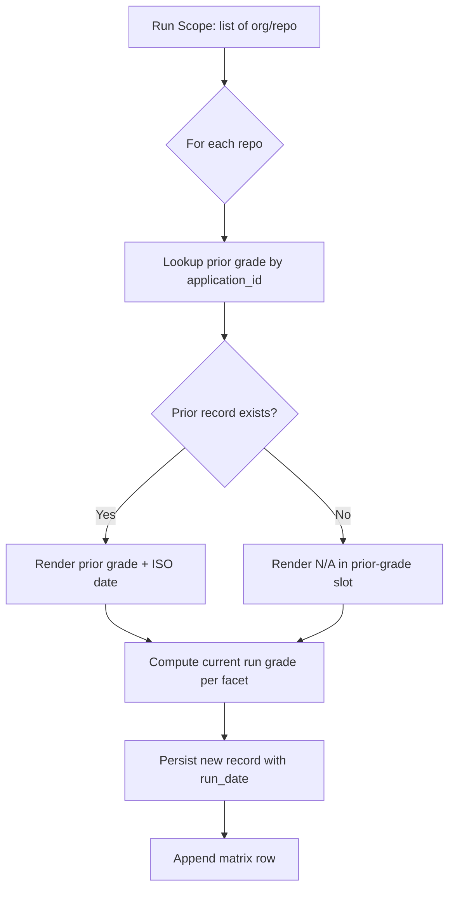

# Grade History — Technology Estate Report Template

## 1. Overview

The grade history is the **persistence layer** that records each run's per-facet grade outcomes for every repository in scope and is read at the start of every subsequent run to render the prior-grade slot of each matrix cell inline per [Rule R3](../template.md#r3--grade-history-fidelity). It is the single mechanism by which the Technology Estate Report achieves its **cumulative** character: net-new repositories appear as new rows in subsequent runs without disrupting the existing application grade history per [Rule R10](../template.md#r10--new-repo-compatibility), and previously-ingested repositories carry their full run-by-run grade history forward across every subsequent run for as long as the persistence layer retains their records.

Records are keyed by the composite tuple `(application_id, facet, run_date)` — see [§ 2 Storage Key](#2-storage-key). Prior-run records are **immutable** — see [§ 3 Immutability Contract](#3-immutability-contract). The retrieval procedure that surfaces a prior record into the current PDF is documented in [§ 4 Retrieval Procedure](#4-retrieval-procedure); the rendering rule that produces the verbatim cell format `B  ←  prev: C  |  2025-10-01` from a prior record is documented in [§ 5 Rendering](#5-rendering); the heterogeneous-scope flow that handles a mix of net-new and previously-ingested repositories in the same run is documented in [§ 6 Heterogeneous Scope Handling (Rule R10)](#6-heterogeneous-scope-handling-rule-r10) and is realized in the Mermaid flowchart at AAP § 0.4.3 Diagram 3.

The persistence layer is the **single canonical source of truth** for the prior-grade slot of every cell rendered in every PDF; the contract for one record is encoded machine-readably in [`../schemas/grade-history.schema.json`](../schemas/grade-history.schema.json) (JSON Schema Draft 2020-12, `$id`: `urn:blitzy:technology-estate-report:grade-history:v0.1.0`), and the worked record fixtures that demonstrate first-run, second-run, and net-new-onboarding scenarios live in [`../examples/grade-history-example.json`](../examples/grade-history-example.json). The verbatim text of [Rule R3](../template.md#r3--grade-history-fidelity), [Rule R7](../template.md#r7--application-identity-stability), and [Rule R10](../template.md#r10--new-repo-compatibility) is reproduced exactly once — in [`../template.md`](../template.md) § 5 Rules — and is referenced (not duplicated) from this document per the AAP § 0.10.2 "No Redundancy Rule." The canonical [§ 3.4 Grade Persistence](../template.md#34-grade-persistence) sub-section of [`../template.md`](../template.md) provides the higher-level statement of the persistence contract; this document operationalizes that contract via algorithm, examples, and cross-references.

## 2. Storage Key

The storage key is the composite tuple `(application_id, facet, run_date)`. Per [Rule R7](../template.md#r7--application-identity-stability) (verbatim text in [`../template.md`](../template.md) § 5; not duplicated here per the AAP § 0.10.2 "No Redundancy Rule"), the same repository MUST resolve to the same `application_id` across all runs, and the identity-key format MUST NOT change between runs. The three components of the key are documented below; each is encoded as a top-level required property in [`../schemas/grade-history.schema.json`](../schemas/grade-history.schema.json).

### 2.1 application_id — Repository Full Name (Rule R7)

The `application_id` is the repository full name in the canonical `org/repo` form per [Rule R7](../template.md#r7--application-identity-stability). The leading `org` segment is the repository owner (a GitHub organization, GitHub user, or GitLab group / namespace) and the trailing `repo` segment is the repository name; the two segments are joined by a single forward slash.

The schema constrains `application_id` to the regex `^[a-zA-Z0-9][a-zA-Z0-9._-]*\/[a-zA-Z0-9][a-zA-Z0-9._-]*$` (encoded in [`../schemas/grade-history.schema.json`](../schemas/grade-history.schema.json) at `properties.application_id.pattern`). Each segment MUST begin with an alphanumeric character and MAY contain alphanumeric characters, dots, underscores, or hyphens. This regex is the union of the GitHub.com and GitLab.com permitted-character rules for owners and repository names; it admits typical real-world identifiers such as `acme-inc/acme-api`, `internal-tools/log-aggregator`, `kubernetes/kubernetes`, and `gitlab-org/gitlab` while rejecting empty segments, segments beginning with a non-alphanumeric character, and identifiers containing path separators other than the single forward slash between the two segments.

The `application_id` is also the secondary grouping key for the rendered PDF: per [`../template.md`](../template.md) § 2 Task Context, the `org` segment is surfaced as a grouping label in the matrix table — repositories sharing the same `org` MAY be visually grouped under a shared org heading by the PDF renderer (see [`./pdf-output.md`](./pdf-output.md) § Matrix Table Columns).

### 2.2 facet — Canonical Facet Identifier

The `facet` field is one of the four canonical snake_case facet identifiers, encoded in [`../schemas/grade-history.schema.json`](../schemas/grade-history.schema.json) at `properties.facet.enum`:

```json
["tech_stack", "maturity", "security", "complexity"]
```

The enum order mirrors the canonical Application Matrix Table column order documented in [`./pdf-output.md`](./pdf-output.md) § Matrix Table Columns: `Tech Stack Summary | Maturity Summary | Security Summary | Complexity Summary`. Per [Rule R2](../template.md#r2--facet-completeness), all four facet columns MUST be present in every matrix row in every report run; therefore every recurring run produces exactly one persistence record per facet per repository in scope (a typical run with N repositories produces 4 × N new records). Per [Rule R5](../template.md#r5--complexity-placeholder-integrity), Complexity records carry the special grade value `TBD` until a Complexity rubric is supplied (see [§ 5 Rendering](#5-rendering) and [`./facets.md`](./facets.md) § Complexity Summary).

### 2.3 run_date — ISO 8601 Run Timestamp

The `run_date` field is an ISO 8601 datetime captured **once per run invocation** by the template entry point and propagated to every persistence record produced by that run. All records from the same run share the same `run_date` value — this is what makes cross-application comparability possible (the Executive Summary aggregations in [`./executive-summary.md`](./executive-summary.md) rely on `run_date` to identify "all records from the latest run" in one query) and what underpins the immutability contract in [§ 3](#3-immutability-contract) (an immutable `run_date` is the discriminator that orders sequential runs).

The schema declares `run_date` as `"type": "string", "format": "date-time"` in JSON Schema Draft 2020-12 terms — equivalent to RFC 3339 / ISO 8601 datetime values such as `2025-10-01T08:00:00Z`. The full datetime is persisted in the record; the rendered PDF cell extracts only the date portion `YYYY-MM-DD` (per [Rule R3](../template.md#r3--grade-history-fidelity) verbatim cell example `B  ←  prev: C  |  2025-10-01` — see [§ 5 Rendering](#5-rendering) and [`./pdf-output.md`](./pdf-output.md) § Cell Rendering Format).

### 2.4 Composite Key Uniqueness

The composite key `(application_id, facet, run_date)` is **unique** across the persistence layer: at most one record exists for any given triple. Uniqueness is enforced by the storage backend (a UNIQUE constraint on the composite column in a relational store, a unique index in a document store, a deduplication step in a flat-file store) and is NOT encoded in the JSON Schema — JSON Schema cannot express cross-record uniqueness on its own. The design contract documented here is the authoritative statement: any storage backend that persists grade-history records on behalf of this template MUST reject or otherwise prevent the persistence of a second record for the same `(application_id, facet, run_date)` triple.

The practical implication is that an idempotent re-run of the same run (same `run_date`) does not duplicate records — it would either be a no-op against the unique constraint or it would replace its own previous attempt's record. Re-runs with **different** `run_date` values produce additional records (one per facet per repository per re-run) and contribute to the grade-history continuity required by [Rule R7](../template.md#r7--application-identity-stability) verification ("grade history for a repo is continuous across three sequential runs with no duplicate or orphaned entries").

### 2.5 Identity-Key Stability and Renames

Per [Rule R7](../template.md#r7--application-identity-stability), the `application_id` format MUST NOT change between runs for the same repository. A repository's `org/repo` identifier is treated as immutable for the purposes of grade-history continuity: if a repository's GitHub or GitLab full name changes (for example, the organization is renamed from `acme` to `acme-inc`, or the repository is renamed from `api` to `acme-api`), the storage backend will not automatically associate the new identifier with the prior records keyed under the old identifier — the new identifier starts fresh with `N/A` prior grades on its first run under the new name.

When a repository's full name changes, the report author has two supported choices, neither of which is mandated by this template:

1. **Migrate prior records to the new key.** The author updates the `application_id` field in every prior record from the old key to the new key (a one-time storage-backend operation, performed outside the template's runtime). After migration, the next run's prior-grade lookup resolves the new `application_id` to the migrated records, and grade-history continuity is preserved across the rename.
2. **Accept the discontinuity.** The author leaves the prior records under the old key (where they remain immutable per [§ 3](#3-immutability-contract)) and lets the new key start fresh with `N/A` prior grades. The Executive Summary trend computation in [`./executive-summary.md`](./executive-summary.md) § Trend versus Prior Run will treat the renamed repository as a net-new repository for the first run under its new name.

The migration option is operationally outside the scope of this template (the template does not perform identifier migrations during a run); option 2 is the **default** and is consistent with [Rule R10](../template.md#r10--new-repo-compatibility) (a renamed repository under its new identifier is, from the template's point of view, a net-new repository).

## 3. Immutability Contract

Per [Rule R3](../template.md#r3--grade-history-fidelity) (verbatim text in [`../template.md`](../template.md) § 5; not duplicated here per the AAP § 0.10.2 "No Redundancy Rule"), prior-run records MUST NOT be mutated by subsequent runs. Subsequent runs **append** new records to the persistence layer but do not modify, rewrite, or in-place-update existing records. This append-only invariant is the structural realization of [Rule R3](../template.md#r3--grade-history-fidelity) and the underpinning of [Rule R7](../template.md#r7--application-identity-stability) verification ("grade history for a repo is continuous across three sequential runs with no duplicate or orphaned entries").

### 3.1 Rationale

Two design objectives drive the immutability contract:

- **Reproducibility.** A re-rendering of a past report (for example, regenerating the PDF for the run of `2025-10-01T08:00:00Z` after the fact) MUST produce the same prior-grade slots as the original rendering. If subsequent runs were permitted to mutate prior records, then re-rendering an old run after a newer run had executed would surface grades that did not exist when the old run was originally rendered — a violation of the cumulative-history reading of [Rule R3](../template.md#r3--grade-history-fidelity).
- **Audit trail.** The grade history is intentionally a continuous, unbroken record per the Domain Success Criterion "Grade history is continuous and unbroken across a minimum of three sequential runs on the same repository" ([`../template.md`](../template.md) § 6.2). An append-only store is the canonical pattern for an audit trail; the immutability contract makes the grade history a tamper-evident record of every grade that has ever been emitted by the template for every `(application_id, facet)` pair.

### 3.2 Operational Implication: Deletion vs. Update

The append-only invariant constrains how operational concerns such as data retention and the GDPR right-to-be-forgotten are addressed. The supported operations against the persistence layer are exactly:

- **APPEND** (write a new record for a new `(application_id, facet, run_date)` triple) — performed by every run for every facet of every repository in scope.
- **READ** (look up records matching `(application_id, facet)`, ordered by `run_date`) — performed by the retrieval procedure documented in [§ 4](#4-retrieval-procedure).
- **DELETE** (remove a complete record by composite key) — performed only as part of an explicit retention or compliance operation outside the template's runtime; never performed by the template itself.

The unsupported operation is **UPDATE**: an existing record's `grade`, `run_date`, `scan_metadata`, or `raw_data` field MUST NOT be modified after the record is written. The single legitimate way to remove a prior grade from the history is to DELETE the record entirely; the legitimate way to record a corrected grade is to APPEND a new record (typically under a new `run_date`).

The PDF-rendering implication of a DELETE is straightforward: if a prior record for `(application_id, facet)` is deleted, the next subsequent run's prior-grade lookup ([§ 4 Retrieval Procedure](#4-retrieval-procedure)) will surface either an earlier record (if any other prior record remains for the pair) or `N/A` (if no prior record exists for the pair after the deletion). The deletion is invisible to the rendered PDF — the cell simply renders as if the deleted run had never occurred. This is the correct behavior for a right-to-be-forgotten compliance operation: the deleted history is not surfaced, and no metadata about the deletion is rendered in subsequent reports.

## 4. Retrieval Procedure

The retrieval procedure surfaces the **prior record** for a given `(application_id, facet)` pair into the current run's PDF cell. It is invoked once per `(application_id, facet)` pair per run — a typical run with N repositories invokes the procedure 4 × N times — and is executed BEFORE the current run's grade record is persisted (per the sequence diagram in [`./architecture.md`](./architecture.md) § Single-Repository Run Sequence).

### 4.1 Step-by-Step Procedure

Given a current `application_id` (for example, `acme-inc/acme-api`), a current `facet` (for example, `security`), and the current run's `run_date`:

1. **Query** the persistence layer for all records matching `(application_id, facet)` — equivalent SQL: `SELECT * FROM grade_history WHERE application_id = ? AND facet = ?`.
2. **Sort** the result set by `run_date` descending (most-recent first).
3. **Skip** the most-recent record IF AND ONLY IF its `run_date` matches the current run's `run_date` (i.e., the current-run record was already persisted prior to this retrieval call). In the canonical sequence (retrieval BEFORE persistence) this skip step is a no-op safety check; it exists to make the procedure correct even if the call order is reversed by a downstream implementation.
4. **Take** the next-most-recent record after the optional skip. This is the **prior record** to render in the current PDF cell.
5. **If no prior record exists** for `(application_id, facet)` (i.e., this is the first run for the pair, or all prior records have been deleted per the operational implication in [§ 3.2](#32-operational-implication-deletion-vs-update)), render `N/A` in the prior-grade slot per [Rule R3](../template.md#r3--grade-history-fidelity) and per [§ 5.2 Rendering — First Run / No Prior Record](#52-first-run--no-prior-record-rule-r3--r10).
6. **If a prior record exists**, render the prior record's `grade` value and the date portion of its `run_date` in the canonical inline format `<current_grade>  ←  prev: <prior_grade>  |  <YYYY-MM-DD>` per [§ 5.1 Rendering — Has Prior Record](#51-has-prior-record-rule-r3) and the verbatim worked example in [§ 5](#5-rendering).

### 4.2 Interaction with the Run Sequence

The retrieval procedure is one of seven steps in the single-repository run sequence (see [`./architecture.md`](./architecture.md) § Single-Repository Run Sequence). Its position in the sequence is between the grading-engine emission of the current grade and the persistence of the current-run record:

1. The template entry point reads the repository artifacts via the Blitzy ingestion pipeline (read-only).
2. The four facet analyzers compute per-facet raw data.
3. The grading engine applies the user-supplied rubric and emits the current `grade`.
4. **The retrieval procedure (this section) reads the prior record from the grade-history layer.**
5. The PDF renderer composes the cell using current grade + prior record (or `N/A`).
6. **A new persistence record is appended** with the current run's `run_date` and current `grade`.
7. The matrix row is appended to the rendered Matrix Table.

This ordering ensures that the retrieval step's "skip the current run's own record" optional branch in [§ 4.1 step 3](#41-step-by-step-procedure) is reached only in non-canonical implementations; in the canonical ordering, the current-run record is not yet persisted at retrieval time and the skip check is automatically satisfied.

### 4.3 Performance and Indexing

The retrieval query in [§ 4.1 step 1](#41-step-by-step-procedure) accesses the persistence layer once per `(application_id, facet)` pair per run, so a run against N repositories executes 4 × N retrieval queries. Storage backends SHOULD index the persistence table on the composite `(application_id, facet)` column with secondary ordering on `run_date` descending, so that each retrieval is an O(log K) point-and-range lookup against an index of K total records.

Practical performance: even an unindexed scan over 100,000 records (the upper bound of a portfolio of ~20,000 repositories with ~5 sequential runs each) is sub-second on commodity hardware; indexing brings the retrieval into the microsecond range and ensures the persistence layer does not become a bottleneck as the portfolio grows.

## 5. Rendering

Per [Rule R3](../template.md#r3--grade-history-fidelity) (verbatim text in [`../template.md`](../template.md) § 5; not duplicated here per the AAP § 0.10.2 "No Redundancy Rule"), the rendered cell shows the current grade prominently, followed by the prior grade and ISO 8601 date inline in secondary text. The canonical text format is the verbatim user-supplied example below; the visual styling (font weight, color, font family) is at the discretion of the PDF renderer.

### 5.1 Has Prior Record (Rule R3)

> **Verbatim user-supplied cell-rendering example (preserved per AAP § 0.10.2 Verbatim Preservation Rule):**
>
> `B  ←  prev: C  |  2025-10-01`
>
> (current grade `B`, two spaces, LEFTWARDS ARROW U+2190 (`←`), two spaces, literal `prev:`, single space, prior grade `C`, two spaces, ASCII pipe `|`, two spaces, ISO 8601 date `2025-10-01`)

The byte-by-byte decomposition of the format string above is also documented in [`./pdf-output.md`](./pdf-output.md) § 5.1 Canonical Inline Format (Rule R3); the canonical machine-readable copy of the format string with interpolation placeholders lives in [`../config/facets.yaml`](../config/facets.yaml) at `rendering_defaults.cell_format`:

```text
{current_grade}  ←  prev: {prior_grade}  |  {prior_run_date}
```

The two-space gaps around the arrow `←` (Unicode U+2190; UTF-8 bytes `0xE2 0x86 0x90`) and around the pipe `|` (ASCII U+007C) are part of the canonical format and are preserved verbatim. The PDF renderer reads the format string from the configuration file rather than embedding it in code; this ensures the [Rule R3](../template.md#r3--grade-history-fidelity) cell format is emitted byte-for-byte consistently across every run.

The `prior_grade` value is the `grade` field of the prior record returned by the retrieval procedure ([§ 4](#4-retrieval-procedure)); for typical recurring runs this is one of `A`, `B`, `C`, `D`, or `F`. The `prior_run_date` value is the **date portion** `YYYY-MM-DD` of the prior record's `run_date` ISO 8601 datetime — the rendered cell omits the time-of-day and timezone portion of the persisted datetime; the full datetime remains in the persistence layer for retrieval and audit purposes.

### 5.2 First Run / No Prior Record (Rule R3 + R10)

When the retrieval procedure ([§ 4](#4-retrieval-procedure)) returns no prior record for `(application_id, facet)` — either because this is the first-ever run for the repository, or because the repository is a net-new addition to an otherwise recurring run scope per [Rule R10](../template.md#r10--new-repo-compatibility), or because the prior record was deleted per [§ 3.2 Operational Implication: Deletion vs. Update](#32-operational-implication-deletion-vs-update) — the cell renders the current grade followed by `  ←  prev: N/A`, omitting the date segment entirely (there is no prior run date to display).

Format (canonical machine-readable copy at [`../config/facets.yaml`](../config/facets.yaml) `rendering_defaults.cell_format_first_run`):

```text
{current_grade}  ←  prev: N/A
```

Worked example for a repository with current grade `B` and no prior history:

```text
B  ←  prev: N/A
```

The literal `N/A` (capital N, ASCII forward slash `/`, capital A) is preserved byte-for-byte per the AAP § 0.10.2 "Verbatim Preservation Rule" and matches the `na_value: "N/A"` constant in [`../config/facets.yaml`](../config/facets.yaml) `rendering_defaults.na_value`. The same first-run rendering rule applies uniformly across all four facets and across every repository whose first run for a given facet is the current run — the rendering is the structural realization of the [Rule R3](../template.md#r3--grade-history-fidelity) "When no prior run exists ... the cell renders 'N/A.'" verification clause.

### 5.3 Insufficient Data Current (Rule R2)

When the source data for a facet is unavailable for an application in the current run — for example, the CVE database lookup exhausts its retry budget, an `endoflife.date` API request times out, or a dependency manifest fails to parse — the cell renders the literal string:

```text
Insufficient Data
```

(capital I, lowercase n-s-u-f-f-i-c-i-e-n-t, single ASCII space U+0020, capital D, lowercase a-t-a). The `prev: ...` segment is suppressed for visual clarity; the prior record (if any) remains immutable in the persistence layer per [§ 3 Immutability Contract](#3-immutability-contract) and is available for future runs whose data sources succeed. The full failure-mode-to-cell-value mapping lives in [`./troubleshooting.md`](./troubleshooting.md) § Failure-Mode-to-Cell-Value Mapping; the canonical machine-readable copy of the literal string lives in [`../config/facets.yaml`](../config/facets.yaml) `rendering_defaults.insufficient_data_value`. The rendering specification consumed by the PDF renderer is documented in [`./pdf-output.md`](./pdf-output.md) § 5.3 Insufficient Data Cell (Rule R2).

The persistence layer's record for an `Insufficient Data` cell uses the schema enum value `InsufficientData` (a single-token camel-case identifier per [`../schemas/grade-history.schema.json`](../schemas/grade-history.schema.json) `properties.grade.enum`); the rendering layer maps `InsufficientData` to the human-readable two-word literal `Insufficient Data` at render time per [Rule R2](../template.md#r2--facet-completeness).

### 5.4 Complexity Locked Current (Rule R5)

Per [Rule R5](../template.md#r5--complexity-placeholder-integrity), the Complexity facet's cell renders the literal placeholder string:

```text
Grade: TBD — definition pending
```

(capital G, lowercase r-a-d-e, ASCII colon `:`, single space, capital T-B-D, single space, em-dash `—` Unicode U+2014 with UTF-8 bytes `0xE2 0x80 0x94`, single space, lowercase d-e-f-i-n-i-t-i-o-n, single space, lowercase p-e-n-d-i-n-g) — accompanied by the raw proxy metrics (LOC, file count, contributor count) on a second line per [`./pdf-output.md`](./pdf-output.md) § 5.4 Complexity Locked Cell (Rule R5). The em-dash glyph is the U+2014 EM DASH and NOT a hyphen-minus `-` (U+002D) and NOT an en-dash `–` (U+2013); the byte sequence is preserved exactly per the AAP § 0.10.2 "Verbatim Preservation Rule."

The Complexity column is locked to this placeholder until an explicit Complexity rubric is supplied by the user; the column MUST NOT be removed, collapsed, or backfilled with an inferred grade per [Rule R5](../template.md#r5--complexity-placeholder-integrity). The persistence-layer record for a Complexity-locked cell carries the schema enum value `TBD` per [`../schemas/grade-history.schema.json`](../schemas/grade-history.schema.json) `properties.grade.enum`. See [`./facets.md`](./facets.md) § Complexity Summary for the canonical detection rules for the LOC, file count, and contributor count metrics, and see [`./grading-engine.md`](./grading-engine.md) § Complexity Lock for the grading engine's enforcement of the lock until an explicit rubric is supplied.

### 5.5 Cell-State Inventory

The four cell states above are the **closed set** of cell states admitted by the rendering layer for the current grade combined with the prior record:

| Cell State | Authorizing Rule | Format | Verbatim Example |
|---|---|---|---|
| Has prior record | [Rule R3](../template.md#r3--grade-history-fidelity) | `<current>  ←  prev: <prior>  \|  <YYYY-MM-DD>` | `B  ←  prev: C  \|  2025-10-01` |
| First run / no prior | [Rule R3](../template.md#r3--grade-history-fidelity) + [Rule R10](../template.md#r10--new-repo-compatibility) | `<current>  ←  prev: N/A` | `B  ←  prev: N/A` |
| Insufficient Data current | [Rule R2](../template.md#r2--facet-completeness) | `Insufficient Data` | `Insufficient Data` |
| Complexity locked current | [Rule R5](../template.md#r5--complexity-placeholder-integrity) | `Grade: TBD — definition pending` (+ metrics line) | (multi-line; see [`./pdf-output.md`](./pdf-output.md) § 5.4) |

The pipe character `\|` in the table above is escaped (rendered in Markdown as a literal `|`) to keep the table syntactically valid; the actual rendered PDF cell value uses an unescaped ASCII pipe per the verbatim format string. The Security facet's cell adds a severity-tier breakdown line and a scan-attribution line to the inline grade format above per [Rule R4](../template.md#r4--cve-severity-breakdown) and [Rule R9](../template.md#r9--cve-attribution); see [`./pdf-output.md`](./pdf-output.md) § 5.5 Security Cell with Severity Tier Counts (Rule R4) for the full Security cell rendering spec.

## 6. Heterogeneous Scope Handling (Rule R10)

Per [Rule R10](../template.md#r10--new-repo-compatibility) (verbatim text in [`../template.md`](../template.md) § 5; not duplicated here per the AAP § 0.10.2 "No Redundancy Rule"), template execution MUST succeed when a mix of previously-ingested repositories and net-new repositories are in scope in the same run, and net-new repositories receive `N/A` for prior grade. The flowchart below — reproduced byte-for-byte from AAP § 0.4.3 Diagram 3 — is the canonical operational realization of [Rule R10](../template.md#r10--new-repo-compatibility):



The flow is straightforward: for each repo in the run scope, the engine looks up the prior grade by `application_id` (node `C`, which invokes the retrieval procedure documented in [§ 4](#4-retrieval-procedure) once per facet for the repository); the decision diamond `D` branches on whether a prior record exists; if it does (`Yes` branch leading to node `E`), the prior segment is rendered as `prev: <grade> | <ISO date>` per [§ 5.1 Has Prior Record](#51-has-prior-record-rule-r3); if it does not (`No` branch leading to node `F`), the prior segment is rendered as `prev: N/A` per [§ 5.2 First Run / No Prior Record](#52-first-run--no-prior-record-rule-r3--r10). Both branches converge at node `G` where the current run's grade is computed by the grading engine, then at node `H` where the new persistence record is appended (per [§ 3 Immutability Contract](#3-immutability-contract)), and finally at node `I` where the rendered matrix row is appended to the Matrix Table on page 2+ of the PDF.

The architectural significance of the flow is that the **same execution path** handles both first-run repositories and previously-ingested repositories — the only branching is the `D` decision diamond, which is a per-(application_id, facet) test against the persistence layer. There is no separate "first-run mode" or "recurring mode" toggle, no separate code path for net-new repositories, and no special opt-in or migration step required to onboard a new repository into a recurring run; the heterogeneous scope is the **default operating mode** of the template. See [`./architecture.md`](./architecture.md) § Multi-Repository Run Behavior for the broader context within the run-sequence architecture and [`./usage.md`](./usage.md) § Heterogeneous Scope (Rule R10) for the author-facing workflow guidance.

## 7. New Repository Onboarding

Onboarding a new repository into a recurring run is the operational case of [Rule R10](../template.md#r10--new-repo-compatibility): a repository that does not yet appear in the persistence layer is added to the run scope, the heterogeneous-scope flow ([§ 6](#6-heterogeneous-scope-handling-rule-r10)) handles the mix, and the template emits a PDF whose matrix row for the new repository carries `prev: N/A` in each facet cell per [§ 5.2 First Run / No Prior Record](#52-first-run--no-prior-record-rule-r3--r10).

### 7.1 Step-by-Step Procedure

To add a new repository to a recurring run:

1. **Add the repository's `org/repo` identifier to the run scope.** This is done by adding the identifier to the run-scope list (a YAML scope file, a CLI argument, or whatever invocation mechanism the report author uses — see [`./usage.md`](./usage.md) § Step 2: Specifying Repository Scope for the canonical workflow). The new identifier MUST conform to the `org/repo` regex documented in [§ 2.1 application_id](#21-application_id--repository-full-name-rule-r7) so that the persistence layer accepts records keyed under it.
2. **Invoke the template normally.** No additional flag, no opt-in, and no migration step is required — per [Rule R10](../template.md#r10--new-repo-compatibility), the heterogeneous-scope flow ([§ 6](#6-heterogeneous-scope-handling-rule-r10)) handles the mix. The same `--scope`, `--rubric`, and credential arguments that drive a recurring run handle a heterogeneous-scope run.
3. **The first run produces the new repository's first persistence records.** For each of the four facets, a record is appended with `run_date = <current run date>`, `grade = <emitted grade>`, and (for the security facet) `scan_metadata`. The rendered cells for the new repository show `prev: N/A` per [Rule R3](../template.md#r3--grade-history-fidelity) — this is the verification of [Rule R10](../template.md#r10--new-repo-compatibility) for the new repository's first run.
4. **Subsequent runs render the new repository's prior grades.** A future run with the new repository now present in the persistence store will, for each `(application_id, facet)` pair, render `prev: <grade from first run> | <first-run date YYYY-MM-DD>` per the canonical inline format in [§ 5.1 Has Prior Record](#51-has-prior-record-rule-r3). From the second run onward, the new repository is indistinguishable from any previously-ingested repository — the heterogeneous-scope flow makes no further distinction.

### 7.2 No Special Opt-In Required

Per the design intent of [Rule R10](../template.md#r10--new-repo-compatibility), no special opt-in flag, no migration step, no manual seeding of the persistence layer, and no separate "first-run" mode is required to onboard a new repository. The new repository is simply added to the run scope; the template's default execution path handles everything else.

The user prompt states the cumulative-reports principle in plain language: "Reports are cumulative — new repositories appear as new rows in subsequent runs without disrupting existing application grade history" (from [`../template.md`](../template.md) § 2 Task Context, which preserves the user prompt § 2 Task Context language). This sentence is the design rationale for the architecture documented in [§ 6 Heterogeneous Scope Handling](#6-heterogeneous-scope-handling-rule-r10): the same execution path handles both first-run and recurring repositories, and "without disrupting existing application grade history" is structurally enforced by the immutability contract in [§ 3](#3-immutability-contract) (no prior record is mutated when a new repository's records are appended).

### 7.3 Removing a Repository from Scope

The inverse of onboarding — removing a repository from the run scope — does not require any persistence-layer operation. The repository's prior records remain in the persistence layer (immutable per [§ 3](#3-immutability-contract)) and are simply not surfaced in the next run's PDF because the repository is not in the run scope. If the same repository is re-added to a future run scope, its prior records will be retrieved and surfaced in the prior-grade slot per the standard retrieval procedure ([§ 4](#4-retrieval-procedure)) — the omission from intervening runs does not break the grade-history continuity.

If the report author wants to **fully purge** a repository's history from the persistence layer (for example, because the repository was deleted, transferred outside the organization, or is the subject of a right-to-be-forgotten request), the operational procedure is the DELETE pathway documented in [§ 3.2 Operational Implication: Deletion vs. Update](#32-operational-implication-deletion-vs-update): every record matching `application_id = <org/repo>` is deleted from the persistence layer in a one-time storage-backend operation outside the template's runtime. After the purge, if the repository is re-added to a future run scope, its first run under the purged identifier will render `prev: N/A` (just like any other first-run repository) — the deletion is invisible to the rendered PDF.

## 8. Worked Example: Three Sequential Runs

This section walks through three sequential runs against the same persistence layer. The example demonstrates the Domain Success Criterion "Grade history is continuous and unbroken across a minimum of three sequential runs on the same repository" ([`../template.md`](../template.md) § 6.2) and the [Rule R10](../template.md#r10--new-repo-compatibility) heterogeneous-scope handling for a net-new repository joining a recurring run between Run 1 and Run 2. The records below are illustrative; canonical worked-example record fixtures live at [`../examples/grade-history-example.json`](../examples/grade-history-example.json).

### 8.1 Run 1 — Single Repository, First Run

- **`run_date`**: `2025-09-01T08:00:00Z`
- **Scope**: `acme-inc/acme-api` only.
- **Records appended** (4 records, one per facet):
  - `(acme-inc/acme-api, tech_stack, 2025-09-01T08:00:00Z, B)`
  - `(acme-inc/acme-api, maturity, 2025-09-01T08:00:00Z, A)`
  - `(acme-inc/acme-api, security, 2025-09-01T08:00:00Z, C)` with `scan_metadata.timestamp = 2025-09-01T08:00:00Z`, `scan_metadata.sources = ["NVD", "OSV"]`
  - `(acme-inc/acme-api, complexity, 2025-09-01T08:00:00Z, TBD)`
- **PDF cell renderings for Run 1**: per [§ 5.2 First Run / No Prior Record](#52-first-run--no-prior-record-rule-r3--r10), each facet cell renders the current grade followed by `  ←  prev: N/A` because no prior record exists. For example, the Maturity cell renders `A  ←  prev: N/A`; the Security cell renders `C  ←  prev: N/A` followed by the severity-tier breakdown line and the scan-attribution line per [`./pdf-output.md`](./pdf-output.md) § 5.5; the Complexity cell renders `Grade: TBD — definition pending` followed by the raw proxy metrics line per [§ 5.4 Complexity Locked Current](#54-complexity-locked-current-rule-r5).

### 8.2 Run 2 — Heterogeneous Scope (Rule R10)

- **`run_date`**: `2025-10-01T08:00:00Z`
- **Scope**: `acme-inc/acme-api` (recurring) AND `internal-tools/log-aggregator` (net-new).
- **Records appended** (8 records, 4 per repository):
  - 4 new records for `acme-inc/acme-api`: e.g., `(acme-inc/acme-api, tech_stack, 2025-10-01T08:00:00Z, B)`, `(acme-inc/acme-api, maturity, 2025-10-01T08:00:00Z, A)`, `(acme-inc/acme-api, security, 2025-10-01T08:00:00Z, B)` with updated `scan_metadata`, `(acme-inc/acme-api, complexity, 2025-10-01T08:00:00Z, TBD)`.
  - 4 new records for `internal-tools/log-aggregator`: e.g., `(internal-tools/log-aggregator, tech_stack, 2025-10-01T08:00:00Z, C)`, `(internal-tools/log-aggregator, maturity, 2025-10-01T08:00:00Z, B)`, `(internal-tools/log-aggregator, security, 2025-10-01T08:00:00Z, D)` with `scan_metadata`, `(internal-tools/log-aggregator, complexity, 2025-10-01T08:00:00Z, TBD)`.
- **PDF cell renderings for Run 2**:
  - The `acme-inc/acme-api` row renders the canonical inline format per [§ 5.1 Has Prior Record](#51-has-prior-record-rule-r3). For example, the Tech Stack cell renders `B  ←  prev: B  |  2025-09-01`; the Maturity cell renders `A  ←  prev: A  |  2025-09-01`; the Security cell renders `B  ←  prev: C  |  2025-09-01` (the verbatim user-supplied example shape with one-letter improvement) followed by the severity-tier and attribution lines; the Complexity cell renders `Grade: TBD — definition pending` (locked per [Rule R5](../template.md#r5--complexity-placeholder-integrity)).
  - The `internal-tools/log-aggregator` row renders the first-run format per [§ 5.2 First Run / No Prior Record](#52-first-run--no-prior-record-rule-r3--r10) because this is its first run despite Run 2 being a recurring run for the other repository. For example, the Tech Stack cell renders `C  ←  prev: N/A`; the Security cell renders `D  ←  prev: N/A` followed by the severity-tier and attribution lines.
- This run is the canonical demonstration of [Rule R10](../template.md#r10--new-repo-compatibility) verification ("a run containing one existing repo and one new repo produces correct grade history for the existing repo and N/A for the new repo"). The same execution path handled both repositories with no special configuration; the heterogeneous-scope flow ([§ 6](#6-heterogeneous-scope-handling-rule-r10)) is the **default operating mode**.

### 8.3 Run 3 — Both Repositories Recurring

- **`run_date`**: `2025-11-01T08:00:00Z`
- **Scope**: `acme-inc/acme-api` AND `internal-tools/log-aggregator` (both now have prior history from Run 2).
- **Records appended** (8 records, 4 per repository) for `run_date = 2025-11-01T08:00:00Z`.
- **PDF cell renderings for Run 3**: both repositories render the canonical inline format per [§ 5.1 Has Prior Record](#51-has-prior-record-rule-r3); each cell's prior segment surfaces the Run 2 grade and the Run 2 date (`2025-10-01`). For example, an `acme-inc/acme-api` Security cell rendering might be `B  ←  prev: B  |  2025-10-01` and an `internal-tools/log-aggregator` Tech Stack cell rendering might be `B  ←  prev: C  |  2025-10-01` (improvement from C to B). After Run 3 the persistence layer holds 8 records for `internal-tools/log-aggregator` (4 from Run 2 + 4 from Run 3 — Run 1 did not include this repository) and 12 records for `acme-inc/acme-api` (4 from each of Run 1, Run 2, and Run 3).
- This third run satisfies the Domain Success Criterion "Grade history is continuous and unbroken across a minimum of three sequential runs on the same repository" ([`../template.md`](../template.md) § 6.2): for `acme-inc/acme-api`, the persistence layer holds an unbroken chain of records from Run 1 through Run 3 with no duplicates and no orphans (per [Rule R7](../template.md#r7--application-identity-stability) verification), and each run's PDF rendering surfaced the immediately-preceding run's grade in the prior-grade slot per [Rule R3](../template.md#r3--grade-history-fidelity).

### 8.4 Persistence-Layer State After Three Runs

After all three runs, the persistence layer's state for the two repositories is:

| application_id | facet | run_date | grade |
|---|---|---|---|
| `acme-inc/acme-api` | `tech_stack` | `2025-09-01T08:00:00Z` | `B` |
| `acme-inc/acme-api` | `maturity` | `2025-09-01T08:00:00Z` | `A` |
| `acme-inc/acme-api` | `security` | `2025-09-01T08:00:00Z` | `C` |
| `acme-inc/acme-api` | `complexity` | `2025-09-01T08:00:00Z` | `TBD` |
| `acme-inc/acme-api` | `tech_stack` | `2025-10-01T08:00:00Z` | `B` |
| `acme-inc/acme-api` | `maturity` | `2025-10-01T08:00:00Z` | `A` |
| `acme-inc/acme-api` | `security` | `2025-10-01T08:00:00Z` | `B` |
| `acme-inc/acme-api` | `complexity` | `2025-10-01T08:00:00Z` | `TBD` |
| `acme-inc/acme-api` | `tech_stack` | `2025-11-01T08:00:00Z` | `B` |
| `acme-inc/acme-api` | `maturity` | `2025-11-01T08:00:00Z` | `A` |
| `acme-inc/acme-api` | `security` | `2025-11-01T08:00:00Z` | `B` |
| `acme-inc/acme-api` | `complexity` | `2025-11-01T08:00:00Z` | `TBD` |
| `internal-tools/log-aggregator` | `tech_stack` | `2025-10-01T08:00:00Z` | `C` |
| `internal-tools/log-aggregator` | `maturity` | `2025-10-01T08:00:00Z` | `B` |
| `internal-tools/log-aggregator` | `security` | `2025-10-01T08:00:00Z` | `D` |
| `internal-tools/log-aggregator` | `complexity` | `2025-10-01T08:00:00Z` | `TBD` |
| `internal-tools/log-aggregator` | `tech_stack` | `2025-11-01T08:00:00Z` | `B` |
| `internal-tools/log-aggregator` | `maturity` | `2025-11-01T08:00:00Z` | `B` |
| `internal-tools/log-aggregator` | `security` | `2025-11-01T08:00:00Z` | `C` |
| `internal-tools/log-aggregator` | `complexity` | `2025-11-01T08:00:00Z` | `TBD` |

20 total records: 12 for `acme-inc/acme-api` (4 facets × 3 runs) and 8 for `internal-tools/log-aggregator` (4 facets × 2 runs since it joined the scope at Run 2). All records are immutable per [§ 3](#3-immutability-contract); subsequent Run 4 (if any) would append 8 more records (assuming both repositories remain in scope) without modifying any of the 20 records above. The `scan_metadata` fields for the four `security` records have been omitted from the table for compactness; the canonical worked-example record fixtures with full `scan_metadata` are in [`../examples/grade-history-example.json`](../examples/grade-history-example.json).

## 9. Schema Reference

The canonical machine-readable contract for one persistence record is [`../schemas/grade-history.schema.json`](../schemas/grade-history.schema.json). The schema is JSON Schema Draft 2020-12 with `$id` `urn:blitzy:technology-estate-report:grade-history:v0.1.0`. The schema validates one record at a time; the uniqueness of the composite `(application_id, facet, run_date)` key across the persistence layer is enforced by the storage backend (see [§ 2.4 Composite Key Uniqueness](#24-composite-key-uniqueness)).

### 9.1 Example Record

A minimal valid Security-facet record demonstrating all required fields plus the conditionally-required `scan_metadata` per [Rule R9](../template.md#r9--cve-attribution):

```json
{
  "application_id": "acme-inc/acme-api",
  "facet": "security",
  "run_date": "2025-10-01T08:00:00Z",
  "grade": "B",
  "scan_metadata": {
    "timestamp": "2025-10-01T08:00:00Z",
    "sources": ["NVD", "OSV"]
  }
}
```

### 9.2 Per-Key Reference Table

| Key | Type | Required | Description |
|---|---|---|---|
| `application_id` | string | yes | Per [Rule R7](../template.md#r7--application-identity-stability) — `org/repo` regex pattern `^[a-zA-Z0-9][a-zA-Z0-9._-]*\/[a-zA-Z0-9][a-zA-Z0-9._-]*$` |
| `facet` | enum string | yes | One of `tech_stack`, `maturity`, `security`, `complexity` (canonical column order) |
| `run_date` | ISO 8601 datetime | yes | Per [Rule R3](../template.md#r3--grade-history-fidelity) — captured once per run invocation; format `date-time` per JSON Schema Draft 2020-12 |
| `grade` | enum string | yes | One of `A`, `B`, `C`, `D`, `F`, `TBD`, `N/A`, `InsufficientData` |
| `raw_data` | object | no | Free-form facet-specific raw data per [`./facets.md`](./facets.md); `additionalProperties: true` for forward-compatible per-facet expansion |
| `scan_metadata` | object | conditional | REQUIRED when `facet == "security"` per [Rule R9](../template.md#r9--cve-attribution); optional on `tech_stack`, `maturity`, and `complexity` records |
| `scan_metadata.timestamp` | ISO 8601 datetime | yes (when present) | Per [Rule R9](../template.md#r9--cve-attribution) — the moment the underlying CVE scan was executed (logically distinct from the parent record's `run_date`) |
| `scan_metadata.sources` | array of enum strings | yes (when present) | Each element is `NVD` or `OSV` per [Rule R9](../template.md#r9--cve-attribution); `minItems: 1`, `uniqueItems: true` |

### 9.3 Grade Enum Semantics

The `grade` enum admits eight values across three semantic categories:

- **Letter grades emitted by the grading engine.** `A`, `B`, `C`, `D`, `F` are the canonical A–F grades emitted by the grading engine when the user-supplied rubric (per [Rule R1](../template.md#r1--rubric-editability), encoded in [`../schemas/rubric.schema.json`](../schemas/rubric.schema.json)) matches the per-facet raw data. These are the values a rubric author's thresholds may legitimately produce; the rubric schema constrains author-supplied grade values to exactly this set.
- **Complexity placeholder.** `TBD` is reserved for the Complexity facet per [Rule R5](../template.md#r5--complexity-placeholder-integrity) — the Complexity column is locked to `Grade: TBD — definition pending` (rendered per [§ 5.4 Complexity Locked Current](#54-complexity-locked-current-rule-r5)) until an explicit Complexity rubric is supplied. The Complexity column MUST NOT be removed, collapsed, or backfilled with an inferred grade until that rubric arrives. `TBD` is emitted by the grading engine, not by a rubric author.
- **Persistence and rendering layer values.** `N/A` and `InsufficientData` are special non-letter values used by the persistence and PDF rendering layers. `N/A` documents the absence of a prior record for an `(application_id, facet)` pair (used in heterogeneous-scope runs per [Rule R10](../template.md#r10--new-repo-compatibility) to denote a net-new repository's first run, and rendered in the prior-grade slot of subsequent runs per [Rule R3](../template.md#r3--grade-history-fidelity) — see [§ 5.2 First Run / No Prior Record](#52-first-run--no-prior-record-rule-r3--r10)). `InsufficientData` represents a current-run cell whose source data was unavailable per [Rule R2](../template.md#r2--facet-completeness) — the persistence record uses the camel-cased identifier `InsufficientData` to remain a single-token enum value while the rendered PDF cell shows the human-readable two-word literal `Insufficient Data` per [§ 5.3 Insufficient Data Current](#53-insufficient-data-current-rule-r2). Neither `N/A` nor `InsufficientData` is ever supplied by a rubric author.

### 9.4 Conditional Schema for Security Records

The schema enforces the [Rule R9](../template.md#r9--cve-attribution) attribution requirement structurally via a top-level `allOf` `if`/`then` conditional: when the record's `facet` field equals `"security"`, the schema adds `scan_metadata` to the required-properties list. Non-security records (`tech_stack`, `maturity`, `complexity`) are unaffected — their `scan_metadata` field remains optional and MAY be used to document data-source attribution for those facets (e.g., the Maturity facet's `endoflife.date` lookup timestamp) but is not required by the schema.

The structural enforcement guarantees that no security-facet record is persisted without the scan timestamp and source database label required by [Rule R9](../template.md#r9--cve-attribution) — undated or unattributed CVE counts are a failing state per [Rule R9](../template.md#r9--cve-attribution) and the schema rejects such records at validation time.

## 10. Cross-References

This document makes the following outbound relative-path links, all of which resolve within the [`../`](../) package directory per the AAP § 0.10.2 "Standalone Package Rule" — no link reaches outside `templates/technology-estate-report/`:

- [`../template.md`](../template.md) — canonical verbatim text of [Rule R3](../template.md#r3--grade-history-fidelity), [Rule R7](../template.md#r7--application-identity-stability), [Rule R10](../template.md#r10--new-repo-compatibility), and the supporting [Rule R2](../template.md#r2--facet-completeness), [Rule R5](../template.md#r5--complexity-placeholder-integrity), [Rule R9](../template.md#r9--cve-attribution); canonical [§ 3.4 Grade Persistence](../template.md#34-grade-persistence) statement; § 6.2 Domain-Specific Success Criteria including "Grade history is continuous and unbroken across a minimum of three sequential runs on the same repository"
- [`../schemas/grade-history.schema.json`](../schemas/grade-history.schema.json) — JSON Schema Draft 2020-12 contract for one persistence record (`$id`: `urn:blitzy:technology-estate-report:grade-history:v0.1.0`)
- [`../examples/grade-history-example.json`](../examples/grade-history-example.json) — canonical worked-example record fixtures (first-run record, second-run record showing prior + ISO date, net-new repository joining a recurring run)
- [`../config/facets.yaml`](../config/facets.yaml) — `rendering_defaults` source of truth for the cell-rendering literals (`cell_format`, `cell_format_first_run`, `insufficient_data_value`, `na_value`, `tbd_placeholder_label`, `em_dash_glyph`)
- [`./architecture.md`](./architecture.md) — component data flow and Single-Repository Run Sequence; § Multi-Repository Run Behavior provides broader context for [§ 6 Heterogeneous Scope Handling](#6-heterogeneous-scope-handling-rule-r10)
- [`./facets.md`](./facets.md) — per-facet output cell content, detection algorithms, "Insufficient Data" conditions; § Complexity Summary documents the Complexity-locked metrics surfaced in [§ 5.4](#54-complexity-locked-current-rule-r5)
- [`./pdf-output.md`](./pdf-output.md) — canonical PDF cell-rendering specification; § 5.1 Canonical Inline Format (Rule R3) provides the byte-by-byte decomposition of `B  ←  prev: C  |  2025-10-01`; § 5.5 Security Cell with Severity Tier Counts adds the [Rule R4](../template.md#r4--cve-severity-breakdown) and [Rule R9](../template.md#r9--cve-attribution) lines to the inline grade format
- [`./executive-summary.md`](./executive-summary.md) — § 6 Trend versus Prior Run computation, which consumes the prior-grade values surfaced by [§ 4 Retrieval Procedure](#4-retrieval-procedure)
- [`./grading-engine.md`](./grading-engine.md) — § Complexity Lock contract for the [Rule R5](../template.md#r5--complexity-placeholder-integrity) `TBD` placeholder
- [`./troubleshooting.md`](./troubleshooting.md) — § Failure-Mode-to-Cell-Value Mapping for the comprehensive list of failure modes that surface as `Insufficient Data` per [Rule R2](../template.md#r2--facet-completeness)
- [`./usage.md`](./usage.md) — § Step 2: Specifying Repository Scope (the author-facing workflow for adding a repository to the run scope, including the heterogeneous-scope onboarding case)
