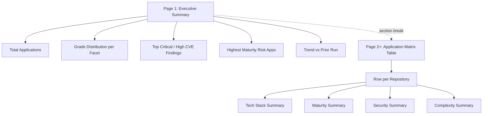

# PDF Output Contract — Technology Estate Report Template

## 1. Overview

The PDF Technology Estate Report is the **single deliverable artifact** of every invocation of this template; one PDF is produced per run, and no other output format (Markdown, HTML, JSON, CSV, spreadsheet) is emitted by this template (per [`../template.md`](../template.md) § 4 Boundaries & Preservation).

Per [Rule R8](../template.md#r8--pdf-section-order) of [`../template.md`](../template.md) § 5 Rules, the PDF contains exactly **two sections in fixed order**: page 1 contains the **Executive Summary**; page 2 onward contains the **Application Matrix Table**. The matrix table MUST NOT be the first content element. The full canonical contract for the PDF output lives in [`../template.md`](../template.md) § 3.6 Output and is operationalized in this document; per the AAP § 0.10.2 "No Redundancy Rule," the verbatim Rule text is in [`../template.md`](../template.md) only and is referenced (not duplicated) here.

The matrix table contains exactly one row per repository in the run scope and exactly four facet columns in this canonical order — **never reordered, never abbreviated, never collapsed**: `Tech Stack Summary | Maturity Summary | Security Summary | Complexity Summary`. Every facet cell renders a fixed-format value drawn from a closed set of permitted cell states ([§ 5.6 Cell State Inventory](#56-cell-state-inventory)). Per the AAP § 0.10.2 "CIO/CTO Audience Language Rule," all rendered labels and prose in the PDF use **business-outcome language**; technical terminology (CVSS scoring, SBOM tooling, NVD/OSV transport details) is reserved for the implementation-facing pages such as [`./facets.md`](./facets.md), [`./api-integrations.md`](./api-integrations.md), and [`./grading-engine.md`](./grading-engine.md).

## 2. Section Order (Rule R8)

Per [Rule R8](../template.md#r8--pdf-section-order) (verbatim text in [`../template.md`](../template.md) § 5), the Executive Summary MUST precede the Matrix Table; the Matrix Table MUST NOT be the first content element. The canonical PDF section layout is:



Page 1 (Executive Summary) MUST be the first content page of the PDF and MUST contain content from at least one of the five Executive Summary sub-sections enumerated in [§ 3 Executive Summary Content (Page 1)](#3-executive-summary-content-page-1). The portfolio-level aggregation rules that compute each sub-section's content live in [`./executive-summary.md`](./executive-summary.md); this document specifies only the rendering layout and section ordering.

The section break between the Executive Summary and the Matrix Table is rendered as an explicit page break — the Matrix Table begins on page 2 or later, never on page 1. The dotted edge `A -.section break.-> G` in the diagram above represents this section break in the page flow; it is not a data flow. The Matrix Table MAY span multiple pages depending on the application count in the run scope; column order, column widths, and column headers are preserved across page breaks per [§ 6 Page Layout](#6-page-layout).

## 3. Executive Summary Content (Page 1)

Per [`../template.md`](../template.md) § 3.5 Executive Summary, page 1 of the PDF contains exactly five sub-sections in this canonical order:

1. **Total Applications In Scope**
2. **Grade Distribution per Facet**
3. **Top Critical / High CVE Findings**
4. **Highest Maturity Risk Applications**
5. **Trend vs Prior Run**

The per-section computation rules (counting semantics, ranking formulas, top-N limits, trend-versus-prior-run computation) are documented in [`./executive-summary.md`](./executive-summary.md); this document specifies only the rendering layout and the section's position within the PDF.

The Executive Summary content MAY overflow to a second page (or further) if it does not fit on a single page. In that case, the Matrix Table begins on the page immediately after the last Executive Summary page (e.g., page 3 if the Executive Summary occupies pages 1 and 2). The constraint per [Rule R8](../template.md#r8--pdf-section-order) is that the Matrix Table is **NOT** the first content element of the PDF — regardless of how many pages the Executive Summary occupies, page 1 always belongs to the Executive Summary.

## 4. Matrix Table Columns

The matrix table has exactly four facet columns in the canonical order documented below — **never reordered, never abbreviated, never collapsed**. Per [Rule R2](../template.md#r2--facet-completeness), all four facet columns MUST be present in every matrix row in every report run; omitting a column is prohibited. Per [Rule R5](../template.md#r5--complexity-placeholder-integrity), the Complexity column MUST NOT be removed, collapsed, or backfilled with an inferred grade until an explicit Complexity rubric is supplied — it is rendered with the placeholder label and raw proxy metrics until then ([§ 5.4](#54-complexity-locked-cell-rule-r5)).

The leftmost column (preceding the four facet columns) is the application identifier column with header `Application`; the displayed value is the `application_id` in `org/repo` form per [Rule R7](../template.md#r7--application-identity-stability). The organization name (the `org` segment) is additionally surfaced as a secondary grouping label per [`../template.md`](../template.md) § 2 Task Context and `../schemas/report-output.schema.json#/$defs/matrixRow/properties/org` — repositories sharing the same `org` MAY be grouped visually under a shared org heading by the PDF renderer.

The canonical column header table:

| Column | Header Label | Source |
|---|---|---|
| 1 (leftmost) | `Application` | application_id (`org/repo` per [Rule R7](../template.md#r7--application-identity-stability)) |
| 2 | `Tech Stack Summary` | Tech Stack facet output per [`./facets.md`](./facets.md) § Tech Stack |
| 3 | `Maturity Summary` | Maturity facet output per [`./facets.md`](./facets.md) § Maturity |
| 4 | `Security Summary` | Security facet output per [`./facets.md`](./facets.md) § Security |
| 5 (rightmost) | `Complexity Summary` | Complexity facet output per [`./facets.md`](./facets.md) § Complexity |

The column header labels are rendered exactly as shown (capital first letter on each word, ASCII space between words, no abbreviations). The four facet identifiers used in the schema (`tech_stack`, `maturity`, `security`, `complexity` — snake_case) map one-to-one to the four facet column header labels above per `../schemas/report-output.schema.json#/$defs/facetIdentifier`.

## 5. Cell Rendering Format

This section is the canonical specification for the content of every matrix cell in the rendered PDF. Five cell states are admitted: a cell with prior history ([§ 5.1](#51-canonical-inline-format-rule-r3)), a first-run cell with no prior history ([§ 5.2](#52-first-run-cell-format-rule-r3--r10)), a failed-data-source cell ([§ 5.3](#53-insufficient-data-cell-rule-r2)), a Complexity-locked cell ([§ 5.4](#54-complexity-locked-cell-rule-r5)), and a Security cell that adds the severity-tier breakdown and scan attribution to the canonical inline format ([§ 5.5](#55-security-cell-with-severity-tier-counts-rule-r4)). All five states are inventoried in [§ 5.6](#56-cell-state-inventory).

### 5.1 Canonical Inline Format (Rule R3)

> **Verbatim user-supplied cell-rendering example (preserved per AAP § 0.10.2 Verbatim Preservation Rule):**
>
> `B  ←  prev: C  |  2025-10-01`

Decompose the format string byte-by-byte:

- `B` — current grade letter (one of `A`, `B`, `C`, `D`, `F`)
- `  ` — two spaces (ASCII U+0020 ×2)
- `←` — LEFTWARDS ARROW (Unicode U+2190; UTF-8 bytes `0xE2 0x86 0x90`)
- `  ` — two spaces
- `prev:` — literal lowercase text `prev` followed by an ASCII colon, no internal spaces
- ` ` — single space
- `C` — prior grade letter (one of `A`, `B`, `C`, `D`, `F`); see also [§ 5.2](#52-first-run-cell-format-rule-r3--r10) for the `N/A` first-run case
- `  ` — two spaces
- `|` — ASCII pipe (U+007C)
- `  ` — two spaces
- `2025-10-01` — ISO 8601 date of the prior run (date-only `YYYY-MM-DD` is the canonical display form)

The underlying `prior_run_date` value in `../schemas/report-output.schema.json#/$defs/priorRunDate` is a full ISO 8601 datetime (e.g., `2025-10-01T00:00:00Z`); the rendered cell displays only the date portion `YYYY-MM-DD` per the verbatim user-supplied example. The mapping from full datetime to `YYYY-MM-DD` is performed by the PDF renderer at render time.

The canonical machine-readable copy of this format string lives in [`../config/facets.yaml`](../config/facets.yaml) at `rendering_defaults.cell_format`. Documented as a format-string with interpolation placeholders, the canonical form is:

```text
{current_grade}  ←  prev: {prior_grade}  |  {prior_run_date}
```

The PDF renderer reads this format string from the configuration file rather than embedding it in code; this ensures the [Rule R3](../template.md#r3--grade-history-fidelity) cell format is emitted byte-for-byte consistently across every run. The two-space gaps around the arrow `←` and around the pipe `|` are part of the canonical format and are preserved verbatim.

### 5.2 First-Run Cell Format (Rule R3 + R10)

When no prior run record exists for `(application_id, facet)` — either because this is the first-ever run for the repository, or because the repository is a net-new addition to an otherwise recurring run scope per [Rule R10](../template.md#r10--new-repo-compatibility) — the cell renders the current grade followed by `  ←  prev: N/A`, omitting the date segment entirely (there is no prior run date to display).

Format:

```text
{current_grade}  ←  prev: N/A
```

Worked example for a repository with current grade `B` and no prior history:

```text
B  ←  prev: N/A
```

The canonical machine-readable copy of this format string lives in [`../config/facets.yaml`](../config/facets.yaml) at `rendering_defaults.cell_format_first_run`. The literal `N/A` (capital N, slash, capital A) is preserved byte-for-byte per AAP § 0.10.2 Verbatim Preservation Rule and matches the `na_value: "N/A"` constant in the same configuration file. The retrieval logic that determines whether a prior record exists for `(application_id, facet)` is documented in [`./grade-history.md`](./grade-history.md) § Retrieval; the heterogeneous-scope handling per [Rule R10](../template.md#r10--new-repo-compatibility) (mixing previously-ingested and net-new repositories in the same run) is documented in [`./grade-history.md`](./grade-history.md) § Heterogeneous Scope.

### 5.3 Insufficient Data Cell (Rule R2)

When source data for a facet is unavailable for an application in the current run — for example, the CVE database lookup exhausts its retry budget, an `endoflife.date` API request times out, or a dependency manifest fails to parse — the cell renders the literal string:

```text
Insufficient Data
```

Capital I, lowercase n-s-u-f-f-i-c-i-e-n-t, single ASCII space (U+0020), capital D, lowercase a-t-a. The full literal occupies the entire cell text; per the canonical rendering convention, the `prev: ...` segment is suppressed for visual clarity (the cell does not become `Insufficient Data  ←  prev: C  |  2025-10-01` even when a prior record exists for the same `(application_id, facet)` pair — the prior record remains immutable in the persistence layer per [`./grade-history.md`](./grade-history.md) § Immutability Contract, but the current-run cell shows only the `Insufficient Data` literal).

The canonical machine-readable copy of this literal lives in [`../config/facets.yaml`](../config/facets.yaml) at `rendering_defaults.insufficient_data_value`. The schema enum identifier for this cell state is `InsufficientData` (a single-token camel-case identifier in `../schemas/report-output.schema.json#/$defs/cellGrade`); the rendering layer maps `InsufficientData` to the human-readable two-word literal `Insufficient Data` at render time per [Rule R2](../template.md#r2--facet-completeness).

The comprehensive list of failure modes that surface as `Insufficient Data` is maintained in [`./troubleshooting.md`](./troubleshooting.md) § 2 Failure-Mode-to-Cell-Value Mapping. Per [Gate 2](../template.md#612-gate-2--zero-warning-build) (zero-warning build), every failure that would otherwise produce a warning, an error, or a silent omission MUST instead surface as an explicit `Insufficient Data` cell — there are no suppressed errors, no missing cells, no empty strings.

### 5.4 Complexity Locked Cell (Rule R5)

Per [Rule R5](../template.md#r5--complexity-placeholder-integrity), the Complexity column is **locked** to a placeholder state until an explicit Complexity rubric is supplied by the user (i.e., the user-supplied rubric document conforming to `../schemas/rubric.schema.json` has `complexity: []` or omits the `complexity` key). When locked, the Complexity cell renders **two lines** of content within the same cell:

1. The verbatim placeholder label: `Grade: TBD — definition pending`
2. The raw proxy metrics on a second line: the line-of-code count, the source-file count, and the contributor count from git history

The placeholder label uses the **em-dash** character `—` (Unicode U+2014; UTF-8 bytes `0xE2 0x80 0x94`), **NOT** a hyphen-minus `-` (U+002D) and **NOT** an en-dash `–` (U+2013). The verbatim string `Grade: TBD — definition pending` is preserved byte-for-byte per AAP § 0.10.2 Verbatim Preservation Rule and is enforced structurally by the `const` constraint on `../schemas/report-output.schema.json#/$defs/complexityCell/properties/placeholder_label`.

The second-line metrics format renders the three raw proxy metrics with capital-first labels and ASCII pipe separators with single spaces around each pipe:

```text
LOC: <total_loc> | Files: <file_count> | Contributors: <contributor_count>
```

Worked example for an application with 12,450 lines of code, 187 source files, and 8 distinct contributors:

```text
Grade: TBD — definition pending
LOC: 12,450 | Files: 187 | Contributors: 8
```

The canonical machine-readable copy of the placeholder label lives in two locations within [`../config/facets.yaml`](../config/facets.yaml) — at `facets.complexity.placeholder_label` and at `rendering_defaults.tbd_placeholder_label` — both holding the byte-identical literal `Grade: TBD — definition pending`. The em-dash glyph is also captured as a standalone constant at `rendering_defaults.em_dash_glyph` (the literal `—`). Per [Rule R5](../template.md#r5--complexity-placeholder-integrity), this column MUST NOT be removed, collapsed, or backfilled with an inferred grade until the user supplies a Complexity rubric; the lock is enforced by the grading engine per [`./grading-engine.md`](./grading-engine.md) § Complexity Lock.

The raw proxy metric values (`loc`, `file_count`, `contributor_count`) are sourced from the Complexity facet analyzer and persisted in `../schemas/report-output.schema.json#/$defs/complexityCell/properties/raw_metrics`; the canonical detection rules for each metric (LOC counting, file counting, contributor counting from git history) are documented in [`./facets.md`](./facets.md) § Complexity Summary.

### 5.5 Security Cell with Severity Tier Counts (Rule R4)

The Security cell renders **three lines** of content: the canonical inline grade format from [§ 5.1](#51-canonical-inline-format-rule-r3) (or the first-run variant from [§ 5.2](#52-first-run-cell-format-rule-r3--r10), or the `Insufficient Data` literal from [§ 5.3](#53-insufficient-data-cell-rule-r2) if applicable), followed by the four-tier severity breakdown plus total per [Rule R4](../template.md#r4--cve-severity-breakdown), followed by the scan attribution per [Rule R9](../template.md#r9--cve-attribution).

Worked example for a Security facet result with current grade `B`, prior grade `C` from `2025-10-01`, 1 Critical / 3 High / 7 Medium / 12 Low CVEs, scanned at `2025-10-01T08:00:00Z` against both NVD and OSV:

```text
B  ←  prev: C  |  2025-10-01
Critical: 1 | High: 3 | Medium: 7 | Low: 12 | Total: 23
Scan: 2025-10-01T08:00:00Z | Source: NVD, OSV
```

**Line 2 — Severity tier breakdown:** the four canonical tiers are rendered in the order Critical → High → Medium → Low followed by Total, separated by ASCII pipe characters with single spaces around each pipe. The tier labels use capital first letter (`Critical`, `High`, `Medium`, `Low`, `Total`); the lowercase enum identifiers used in the schema (`critical`, `high`, `medium`, `low`) map to these capitalized rendered labels at render time. Per [Rule R4](../template.md#r4--cve-severity-breakdown), a single aggregate number without the per-tier breakdown is a failing state; the schema enforces this structurally via `../schemas/report-output.schema.json#/$defs/securityCell/properties/severity_counts` which requires all five keys (`critical`, `high`, `medium`, `low`, `total`).

**Line 3 — Scan attribution:** per [Rule R9](../template.md#r9--cve-attribution), every Security cell MUST include the scan timestamp (ISO 8601 datetime) and the source database label (one of `NVD`, `OSV`, or `NVD, OSV` for both). The `Source:` value is rendered from the `scan_metadata.sources` array in `../schemas/report-output.schema.json#/$defs/scanMetadata`; the array is rendered as a comma-space-separated list in the canonical order `NVD, OSV` when both are cited. Undated or unattributed CVE counts are a failing state per [Rule R9](../template.md#r9--cve-attribution); see [`./api-integrations.md`](./api-integrations.md) § R9 Attribution Rule for the canonical attribution contract.

**Footnote alternative:** Alternatively, the per-cell scan attribution MAY be aggregated into a page-level footnote that applies to all Security cells in the run — for example, a footer line on each Matrix Table page reading `All CVE counts: scanned 2025-10-01T08:00:00Z; sources: NVD, OSV`. This footnote layout is permitted per [Rule R9](../template.md#r9--cve-attribution) provided every Security cell remains traceable to its scan metadata. The footnote variant is documented in [`./api-integrations.md`](./api-integrations.md) § R9 Attribution Rule.

### 5.6 Cell State Inventory

The five admitted cell states, the rule that authorizes each, the canonical format string, and a worked example:

| Cell State | Rule | Format | Example |
|---|---|---|---|
| Has prior record | [R3](../template.md#r3--grade-history-fidelity) | `<grade>  ←  prev: <prior>  \|  <YYYY-MM-DD>` | `B  ←  prev: C  \|  2025-10-01` |
| First run (no prior) | [R3](../template.md#r3--grade-history-fidelity) + [R10](../template.md#r10--new-repo-compatibility) | `<grade>  ←  prev: N/A` | `B  ←  prev: N/A` |
| Insufficient Data | [R2](../template.md#r2--facet-completeness) | `Insufficient Data` | `Insufficient Data` |
| Complexity locked | [R5](../template.md#r5--complexity-placeholder-integrity) | `Grade: TBD — definition pending` (+ metrics line) | (multi-line, see [§ 5.4](#54-complexity-locked-cell-rule-r5)) |
| Security (any state) | [R4](../template.md#r4--cve-severity-breakdown) + [R9](../template.md#r9--cve-attribution) | inline grade + severity tier line + attribution line | (multi-line, see [§ 5.5](#55-security-cell-with-severity-tier-counts-rule-r4)) |

The closed set of admitted cell states is exactly the five rows above; per [Rule R2](../template.md#r2--facet-completeness), every facet cell in every matrix row of every report run MUST belong to exactly one of these five states. No matrix cell is ever empty, absent, or in a state outside this inventory — this is the structural contract that satisfies the [Rule R2](../template.md#r2--facet-completeness) verification "no matrix cell is empty or absent in any generated PDF."

In the table above, the pipe character `\|` is escaped (rendered in Markdown as a literal `|`) to keep the table syntactically valid. The actual rendered PDF cell value uses an unescaped ASCII pipe `|` — see [§ 5.1](#51-canonical-inline-format-rule-r3) for the byte-by-byte decomposition.

## 6. Page Layout

### 6.1 Page Size and Orientation

The default PDF page size is **ISO A4 portrait** (210 × 297 mm). The default is a convention of the PDF renderer documented in this section; authors MAY override the page size and orientation (for example, to US Letter, A3, or landscape) at the rendering layer when the matrix table requires wider columns. The [Rule R8](../template.md#r8--pdf-section-order) section-order constraint is independent of page size and orientation: regardless of the chosen page geometry, the Executive Summary occupies page 1 and the Matrix Table begins on page 2 or later.

### 6.2 Page 1 — Executive Summary

Page 1 contains the Executive Summary heading, the five sub-sections in the canonical order enumerated in [§ 3 Executive Summary Content (Page 1)](#3-executive-summary-content-page-1), and a bottom-of-page footer with the run date in ISO 8601 form. If the Executive Summary content exceeds one page, it overflows to page 2 (and further if needed); the Matrix Table begins on the page immediately after the last Executive Summary page. The portfolio-level aggregations that drive each sub-section's content (counting semantics, ranking, top-N limits, trend computation) are documented in [`./executive-summary.md`](./executive-summary.md).

### 6.3 Page 2+ — Matrix Table

The Matrix Table begins on the page immediately following the last Executive Summary page (page 2 in the typical case where the Executive Summary fits on one page). The matrix table has 5 columns (1 application identifier column + 4 facet columns) per [§ 4 Matrix Table Columns](#4-matrix-table-columns). Default column widths are proportional, with the leftmost `Application` column receiving approximately 20% of the available row width and each of the four facet columns receiving approximately 20% as well. The proportions are a convention of the PDF renderer; authors MAY adjust column widths at the rendering layer if a specific run's content benefits from non-default widths, provided all five columns remain visible and the column header labels remain unabbreviated.

### 6.4 Repeating Header

The matrix-table column headers (the five labels enumerated in [§ 4 Matrix Table Columns](#4-matrix-table-columns)) MUST repeat at the top of every page that contains matrix rows. This is the canonical typographic convention for multi-page tables and is implemented automatically by the PDF renderer; authors do not need to configure repeating headers manually. The header repetition ensures that a reader who lands on any page of the Matrix Table can immediately identify which column carries which facet value.

### 6.5 Row Pagination

Rows are **not split across pages**. When a row would otherwise be split (because the cumulative content of multi-line cells — particularly the Security cell with three lines per [§ 5.5](#55-security-cell-with-severity-tier-counts-rule-r4) and the Complexity cell with two lines per [§ 5.4](#54-complexity-locked-cell-rule-r5) — exceeds the available space on the current page), the entire row is moved to the next page. This rule guarantees that the multi-line Security and Complexity cells remain visually intact and that no facet cell appears on a different page from its row's other facet cells.

### 6.6 Final Page Footer

The final page of the rendered PDF contains a footer with the following content:

- The run date in ISO 8601 datetime form (e.g., `2025-10-01T00:00:00Z`)
- The generator label `Generated by Blitzy Technology Estate Report Template v0.1.0` (the version string matches the latest version recorded in [`../CHANGELOG.md`](../CHANGELOG.md))
- Any page-level footnotes (for example, the optional aggregate scan attribution per [§ 5.5](#55-security-cell-with-severity-tier-counts-rule-r4) footnote alternative)

The footer is rendered consistently in business-outcome language per the AAP § 0.10.2 "CIO/CTO Audience Language Rule" — no implementation jargon, no technical terminology beyond the version string and ISO 8601 datetime.

## 7. R8 Verification Procedure

Per [Rule R8](../template.md#r8--pdf-section-order) verification (verbatim text in [`../template.md`](../template.md) § 5):

> PDF page 1 contains executive summary content; matrix table begins on a subsequent page or section

The step-by-step verification procedure for [Rule R8](../template.md#r8--pdf-section-order):

1. **Generate a PDF** from a test run via the single-command execution path documented in [`./validation.md`](./validation.md) § Single-Command Execution Path (Gate 10), or via the live smoke-test runbook in [`./validation.md`](./validation.md) § Gate 1.
2. **Open the generated PDF** in any PDF viewer that supports per-page inspection (for example, the macOS Preview app, Adobe Acrobat Reader, or any browser PDF viewer).
3. **Inspect page 1.** Assert that the heading on page 1 reads `Executive Summary` (or contains that phrase as the primary heading), and assert that page 1 contains rendered content from at least one of the five Executive Summary sub-sections enumerated in [§ 3 Executive Summary Content (Page 1)](#3-executive-summary-content-page-1) (Total Applications In Scope, Grade Distribution per Facet, Top Critical / High CVE Findings, Highest Maturity Risk Applications, Trend vs Prior Run).
4. **Assert that page 1 does NOT contain the Matrix Table heading.** Specifically, the strings `Application Matrix Table`, `Tech Stack Summary`, `Maturity Summary`, `Security Summary`, and `Complexity Summary` MUST NOT appear as the primary heading on page 1. (Inline references to those phrases inside the Executive Summary prose — for example, in the "Grade Distribution per Facet" sub-section that names each facet — are permitted; the constraint applies only to the Matrix Table section heading itself.)
5. **Inspect subsequent pages (page 2 onwards).** Assert that the Matrix Table heading (`Application Matrix Table` or equivalent) appears on page 2 or later, and assert that the matrix-table column headers (`Application | Tech Stack Summary | Maturity Summary | Security Summary | Complexity Summary`) appear on the page that begins the Matrix Table.
6. **Confirm the section break.** Assert that the page-break boundary between the last Executive Summary page and the first Matrix Table page is an explicit page break (no row of the Matrix Table appears on the same page as any Executive Summary content).

This procedure is one of the four sign-off items in [Gate 8](../template.md#613-gate-8--integration-sign-off-checklist-independent-of-unit-test-pass-rate) (Live smoke test); see [`./validation.md`](./validation.md) § Gate 8 for the full integration sign-off checklist. The procedure is also one of the assertions in the [Gate 10](../template.md#615-gate-10--test-execution-binding) single-command execution path.

## 8. Output Schema Reference

The intermediate report data structure that drives the PDF rendering is defined in the JSON Schema document [`../schemas/report-output.schema.json`](../schemas/report-output.schema.json) (Draft 2020-12). The schema has three top-level required properties:

- `report_metadata` — run metadata (run_date, template_version, optional rubric_id)
- `executive_summary` — page 1 content per [§ 3](#3-executive-summary-content-page-1)
- `matrix` — array of matrix rows per [§ 4](#4-matrix-table-columns) and [§ 5](#5-cell-rendering-format)

A worked example JSON fragment showing one matrix row with all four facet cells populated. The `tech_stack` and `maturity` cells use the `genericCell` shape; the `security` cell uses the `securityCell` shape with severity counts and scan metadata; the `complexity` cell uses the `complexityCell` shape with the verbatim placeholder label and raw proxy metrics:

```json
{
  "report_metadata": {
    "run_date": "2025-10-01T00:00:00Z",
    "template_version": "0.1.0"
  },
  "executive_summary": {
    "total_applications": 1,
    "grade_distribution": {
      "tech_stack":  { "A": 0, "B": 1, "C": 0, "D": 0, "F": 0, "TBD": 0, "InsufficientData": 0 },
      "maturity":    { "A": 1, "B": 0, "C": 0, "D": 0, "F": 0, "TBD": 0, "InsufficientData": 0 },
      "security":    { "A": 0, "B": 0, "C": 1, "D": 0, "F": 0, "TBD": 0, "InsufficientData": 0 },
      "complexity":  { "A": 0, "B": 0, "C": 0, "D": 0, "F": 0, "TBD": 1, "InsufficientData": 0 }
    },
    "top_critical_high_cve_findings": [],
    "highest_maturity_risk_applications": [],
    "trend_versus_prior_run": {
      "net_improvements": 1,
      "net_regressions": 0,
      "unchanged": 3,
      "no_prior_run": 0
    }
  },
  "matrix": [
    {
      "application_id": "acme-inc/acme-api",
      "org": "acme-inc",
      "tech_stack": {
        "current_grade": "B",
        "prior_grade": "C",
        "prior_run_date": "2025-07-01T00:00:00Z"
      },
      "maturity": {
        "current_grade": "A",
        "prior_grade": "A",
        "prior_run_date": "2025-07-01T00:00:00Z"
      },
      "security": {
        "current_grade": "C",
        "prior_grade": "C",
        "prior_run_date": "2025-07-01T00:00:00Z",
        "severity_counts": {
          "critical": 1,
          "high": 3,
          "medium": 7,
          "low": 12,
          "total": 23
        },
        "scan_metadata": {
          "timestamp": "2025-10-01T08:00:00Z",
          "sources": ["NVD", "OSV"]
        }
      },
      "complexity": {
        "current_grade": "TBD",
        "prior_grade": "TBD",
        "prior_run_date": "2025-07-01T00:00:00Z",
        "placeholder_label": "Grade: TBD — definition pending",
        "raw_metrics": {
          "loc": 12450,
          "file_count": 187,
          "contributor_count": 8
        }
      }
    }
  ]
}
```

Note the per-facet shape contract per `../schemas/report-output.schema.json`:

- The `tech_stack` and `maturity` cells use the `genericCell` shape with three required properties: `current_grade`, `prior_grade`, `prior_run_date`. Free-form facet-specific raw data MAY be carried in an optional `raw_data` object (omitted in this example for compactness; see `../schemas/report-output.schema.json#/$defs/genericCell` for the full contract).
- The `security` cell uses the `securityCell` shape with five required properties: the three canonical `current_grade` / `prior_grade` / `prior_run_date` plus `severity_counts` (with all five required keys `critical`, `high`, `medium`, `low`, `total` per [Rule R4](../template.md#r4--cve-severity-breakdown)) and `scan_metadata` (with required `timestamp` and `sources` per [Rule R9](../template.md#r9--cve-attribution)).
- The `complexity` cell uses the `complexityCell` shape with five required properties: the three canonical `current_grade` / `prior_grade` / `prior_run_date` plus `placeholder_label` (constrained to the byte-for-byte verbatim literal `Grade: TBD — definition pending` per [Rule R5](../template.md#r5--complexity-placeholder-integrity)) and `raw_metrics` (with all three required keys `loc`, `file_count`, `contributor_count`).

The `prior_run_date` field is a full ISO 8601 datetime per `../schemas/report-output.schema.json#/$defs/priorRunDate`; the rendered PDF cell extracts only the date portion `YYYY-MM-DD` per [§ 5.1](#51-canonical-inline-format-rule-r3). The value is `null` (and the corresponding `prior_grade` is `"N/A"`) when no prior run record exists for the `(application_id, facet)` pair per [§ 5.2 First-Run Cell Format](#52-first-run-cell-format-rule-r3--r10) and [`./grade-history.md`](./grade-history.md) § Rendering.

For a complete worked-example mockup of a rendered PDF — including a populated Executive Summary and a Matrix Table with multiple repository rows demonstrating each cell state from [§ 5.6 Cell State Inventory](#56-cell-state-inventory) — see [`../examples/sample-pdf-mockup.md`](../examples/sample-pdf-mockup.md).

## 9. Cross-References

This document makes the following outbound relative-path links, all of which resolve within the [`../`](../) package directory per the AAP § 0.10.2 "Standalone Package Rule" (no link reaches outside `templates/technology-estate-report/`):

- [`../template.md`](../template.md) — canonical text of [Rules R2](../template.md#r2--facet-completeness), [R3](../template.md#r3--grade-history-fidelity), [R4](../template.md#r4--cve-severity-breakdown), [R5](../template.md#r5--complexity-placeholder-integrity), [R7](../template.md#r7--application-identity-stability), [R8](../template.md#r8--pdf-section-order), [R9](../template.md#r9--cve-attribution), [R10](../template.md#r10--new-repo-compatibility); § 3.5 Executive Summary; § 3.6 Output; § 6 Validation Framework
- [`../schemas/report-output.schema.json`](../schemas/report-output.schema.json) — JSON Schema for the intermediate report data structure
- [`../config/facets.yaml`](../config/facets.yaml) — canonical machine-readable copies of the cell-rendering literals (`rendering_defaults.cell_format`, `rendering_defaults.cell_format_first_run`, `rendering_defaults.insufficient_data_value`, `rendering_defaults.na_value`, `rendering_defaults.tbd_placeholder_label`)
- [`../examples/sample-pdf-mockup.md`](../examples/sample-pdf-mockup.md) — Markdown mockup of the rendered PDF (Executive Summary + Matrix Table with worked example rows)
- [`../CHANGELOG.md`](../CHANGELOG.md) — versioned change history; the generator-label version string in [§ 6.6 Final Page Footer](#66-final-page-footer) is sourced from this file
- [`./facets.md`](./facets.md) — per-facet output cell content, detection algorithms, "Insufficient Data" conditions
- [`./grading-engine.md`](./grading-engine.md) — grade emission, including the [Rule R5](../template.md#r5--complexity-placeholder-integrity) Complexity Lock contract
- [`./grade-history.md`](./grade-history.md) — prior-grade lookup, [Rule R3](../template.md#r3--grade-history-fidelity) inline cell-rendering format, [Rule R10](../template.md#r10--new-repo-compatibility) heterogeneous scope
- [`./executive-summary.md`](./executive-summary.md) — page 1 content rules and portfolio-level aggregation
- [`./api-integrations.md`](./api-integrations.md) — [Rule R9](../template.md#r9--cve-attribution) attribution rule and CVE source database (NVD, OSV) labels
- [`./troubleshooting.md`](./troubleshooting.md) — § 2 Failure-Mode-to-Cell-Value Mapping (the comprehensive list of failure modes that surface as `Insufficient Data` per [Rule R2](../template.md#r2--facet-completeness))
- [`./validation.md`](./validation.md) — [Gate 1](../template.md#611-gate-1--end-to-end-boundary-verification) Live Smoke Test, [Gate 8](../template.md#613-gate-8--integration-sign-off-checklist-independent-of-unit-test-pass-rate) integration sign-off checklist, [Gate 10](../template.md#615-gate-10--test-execution-binding) single-command execution path
